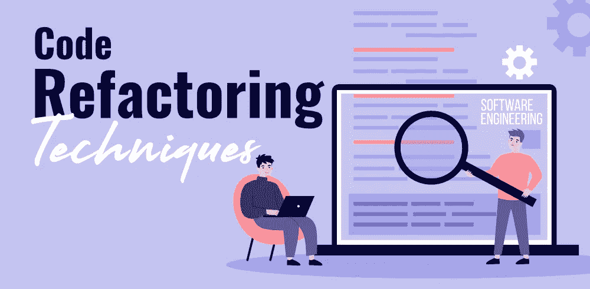

# 提高代码质量的三大简单重构方法

> 原文：<https://blog.devgenius.io/top-3-simple-refactoring-methods-that-improves-your-code-quality-a24e9cd588d4?source=collection_archive---------11----------------------->

这个博客是关于重构，它的需求和使用顺序。每一个开始钻研编码的人都应该回顾一下自己的代码，应用重构技术，避免代码污染。尽管如此，所有的例子都是在 Python 上给出的，这也涉及到其他编程语言。


[自由股票](https://unsplash.com/@freestocks?utm_source=medium&utm_medium=referral)在 [Unsplash](https://unsplash.com?utm_source=medium&utm_medium=referral) 上的照片



所以，让我们从今天的第一个重构方法开始概述

## 可变分裂

**——重构的理由**

如果您将变量“保存”在函数中，为了各种不相关的目的重用它们，那么当您需要对包含这些变量的代码进行一些更改时，您肯定会遇到问题。您必须检查变量的所有实例，以确保代码中没有错误。

**-问题和解决方案**

您有一个局部变量，用于存储方法 egt 中的各种中间值(除了循环变量)。

> 温度= 2 *(高度+宽度)
> 
> 打印(临时)
> 
> 温度=高度*宽度
> 
> 打印(临时)

要解决这个问题，让代码可读和可理解，让不同的变量代表不同的值。每个变量只能对应一个特定的事物。

> 周长= 2 *(高度+宽度)
> 
> 打印(周长)
> 
> 面积=高度*宽度
> 
> 打印(区域)

**-优势**

*   每个程序元素应该只负责一件事。这极大地简化了未来代码的维护，因为您可以安全地替换这个元素，而不用担心副作用。
*   代码可读性提高。如果变量是在很久以前创建的，甚至是仓促创建的，它可能会得到一个不能解释存储值本质的基本名称，例如 j、b2、value 等。您可以选择命名变量来反映存储值的本质。例如，客户名称、城市失业率、客户问候等。
*   这种重构有助于进一步将重复的代码段隔离到不同的方法中。

**-应用重构的步骤**

1.  找到代码中变量第一次被值填充的地方。此时，将其重命名，新名称应该与所赋的值相匹配。
2.  在使用该变量值的地方，用旧名称替换新名称。
3.  对于变量被赋予新值的情况，重复该操作。

## 用方法对象替换方法

**-重构的原因**

方法太长了，你不能把它分开，因为局部变量的组合很难相互隔离。

解决问题的第一步是将整个方法隔离到一个单独的类中，并将其局部变量转换为字段。

首先，它将允许您将问题隔离在该类中，其次，它将为将一个大方法拆分成更小的方法扫清道路，而且，这些方法不符合原始类的含义。

**-问题和解决方案**

你有一个很长的方法，其中局部变量是如此的相关，以至于不可能使用“方法提取”egt。

```
**class** **Order**:
    # ..
    **def** **price**(self):
        primaryBasePrice = 0
        secondaryBasePrice = 0
        tertiaryBasePrice = 0
        # Perform long computation.
```

要解决这个问题，请将该方法转换为一个单独的类，以便局部变量成为该类的字段。之后，您可以轻松地将该方法分成几个部分。

```
**class** **Order**:
    # ..
    **def** **price**(self):
        **return** PriceCalculator(self).compute() **class** **PriceCalculator**:
    **def** **__init__**(self, order):
        self._primaryBasePrice = 0
        self._secondaryBasePrice = 0
        self._tertiaryBasePrice = 0
        # Copy relevant information from the
        # order object. **def** **compute**(self):
        # Perform long computation.
```

**-优势**

*   将一个长方法隔离在它自己的类中，可以让你停止方法不受控制的增长。此外，它使得在类内将它分成子方法成为可能，而不会使原始类与服务方法混杂在一起。

**-缺点**

*   创建了另一个类，增加了程序的整体复杂性。

**-应用重构的步骤**

1.  创建一个新类。根据您正在重构的方法的目的给它起一个名字。
2.  在新类中，创建一个私有字段来存储对以前包含该方法的类的实例的引用。然后，如果需要，可以使用该引用从原始对象中检索所需的数据。
3.  为每个局部方法变量创建一个单独的私有字段。
4.  创建一个接受所有局部方法变量的值作为参数的构造函数，并初始化相应的私有字段。
5.  声明 main 方法并复制原始方法的代码，用私有字段替换局部变量。
6.  通过创建一个方法对象并调用其 main 方法，替换源类中原始方法的主体。

## 用对象替换数据值

**-重构的原因**

这个重构本质上是提取类别的一个特例。让它完全不同的是重构背后的原因。

在提取类别中，我们有一个要对各种事情负责的类别，我们希望将其责任分开。

通过用关联度对象替换信息价格，我们有了一个原始字段(数字、字符串等。)这并不容易，因为程序在增长，而且目前有相关的信息和行为。一方面，这些领域本身并没有什么可怕的。然而，这个字段和行为家族同时存在于许多类别中，产生了重复的代码。

因此，对于所有这一切，我们倾向于产生一个替代类别，并将每个部门以及相关的信息和行为转移到该部门。

**-问题和解决方案**

一个类(或一组类)包含一个信息字段。该字段有自己的行为和相关的数据 egt。

要解决这个问题，请创建一个替换类，将先前的字段及其行为放在该类中，并将该类的 obj 存储在原始类中。

**-优势**

*   改善班级内部的联系。数据和该数据的行为在同一个类中。

**-应用重构的步骤**

在开始重构之前，查看类中是否有对该字段的直接引用。如果是这样，应用字段的自封装，将它隐藏在初始类中。

1.  创建一个新的类，并将你的字段和它的 getter 复制到其中。或者，创建一个接受该字段的简单值的构造函数。这个类中没有 setter，因为传递给原始类的每个新字段值都会创建一个新的 value 对象。
2.  在初始类中，将字段类型更改为新类。
3.  在初始类的 getter 中，引用关联对象的 getter。
4.  在 setter 中创建新的值对象。如果先前在构造函数中设置了字段的任何初始值，则可能需要在构造函数中创建一个新对象。