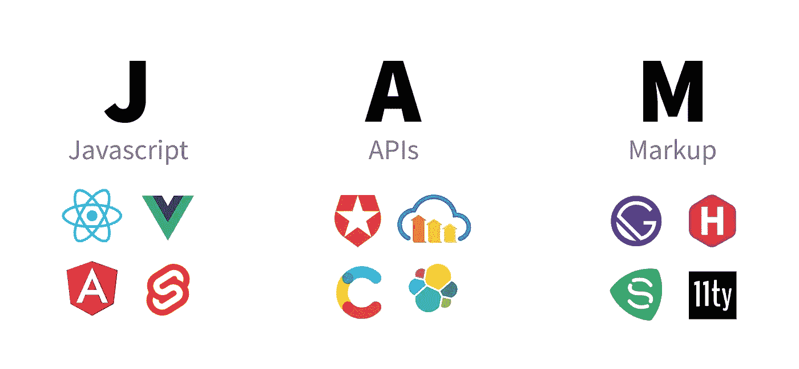

# 采用 JAMstack 的四大理由

> 原文：<https://blog.devgenius.io/top-4-reasons-to-adopt-jamstack-794ce8bbc9a5?source=collection_archive---------36----------------------->

JAM 代表 JavaScript、API 和标记。主要是用 JavaScript 构建生成器的原理，使用 API 访问远程或本地数据，并编写标记来设计美学风格。JAMstack 不是传统的堆栈，每个字母都可能是一种特定的技术——而是风格设计的转变。现在，您的网站是在发布之前生成的，这是一个静态的网站，而不是一个必须随时为每个浏览者虚拟设计的网站。它代表了一种当代的 web 开发设计，为开发人员提供了一个机会来考虑静态网站的好处，静态网站具有更高的性能和更高的安全性优势，而在没有数据库的情况下仍然保留了面向信息的 CMS 的动态属性。

以下是你进入 JAMstack 的四大理由。

**易于维护**

一旦你的网站准备好了，维护就像添加、更新或删除降价文件一样简单。首先，通过一些小的配置，你将能够使用一个机械地发布更新的工作流。我们可以最大限度地利用 JavaScript 的优势，因此是轻量级框架，同时我们不会没有维护的压力。基础设置允许开发人员专注于编写他们的代码。

**速度和安全**

由于页面是在部署时而不是用户请求时预先构建的标记，所以您的网站非常快，这将提高您网站的速度，因为页面已经可用。这种方法比 WordPress 和其他依赖于创建动态内容的服务器请求的服务更快。

减少服务器、数据库和客户机之间的来回切换会更好。每次传输都代表着安全威胁。由于网站本质上是预先呈现的，这限制了潜在的安全风险。

**SEO 友好型**

JAMstack 的观点是，通过 CDN 静态地服务网站对 SEO 来说是最好的。与动态资产相比，一旦涉及到 SEO，静态资产会因性能而脱颖而出。更快的加载时间意味着更高的搜索引擎优化，因为搜索引擎一旦划分了一个网站，就会命令加载时间。即便如此，对于一个健康的 SEO 策略来说，仅仅寄希望于静态内容的特性(加载速度)是不够的。此外，预渲染还有一个好处，就是你的所有内容都可以毫无延迟地提供给机器人和爬虫。这可以让你在谷歌搜索结果中上升一个或十个位置，让你获得额外的曝光率。

**更便宜、更容易扩展**

因为我们倾向于消除服务器端的元素，所以我们不需要很多服务器来托管应用程序，我们也不希望有几个后端工程师来处理服务器端的实际工作。因此大大降低了您的总成本。因为静态文件的托管相当便宜，有些甚至是免费的。由于您的文件通常通过 CDN 在任何地方提供，因此扩展可能就是在其他地方提供这些文件。CDN 供应商可以按比例计算其接收的流量。

结论

使用 JAMstack，您将能够构建和部署灵活、可伸缩和高度模块化的 web 应用程序。JAMstack 具有安全性高、成本低、web 应用速度快等优点。

围绕 JAMstack 已经形成了一个开发者友好工具的生态系统。Heroku、Netlify 是一些最流行的工具，正在构建一个以 git 为中心的工作流和应用交付网络，以使 JAMstack 成为开发人员工作流的一个自然组成部分。鉴于 contentful 这样的无头 CMS 占据主导地位，JAMstack 有机会重写现代网络的大片内容。