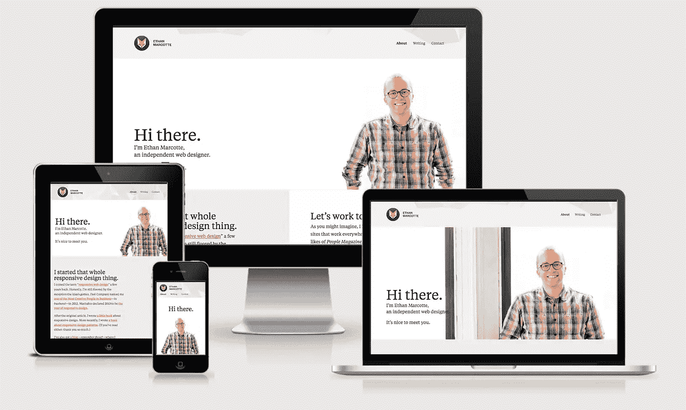
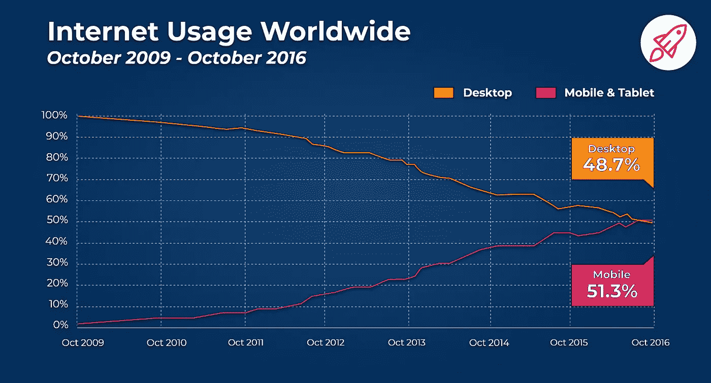
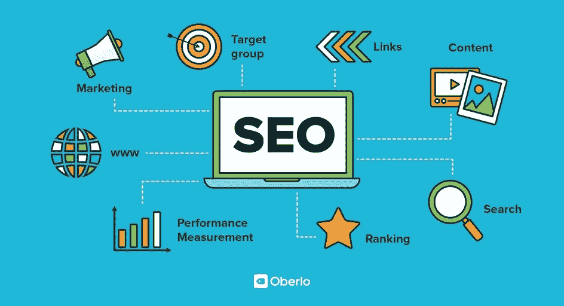
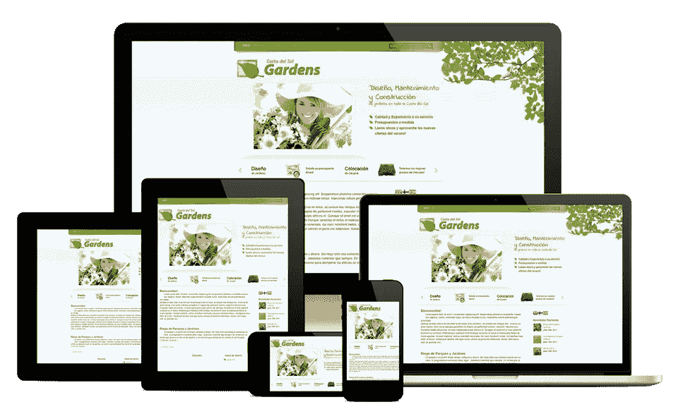
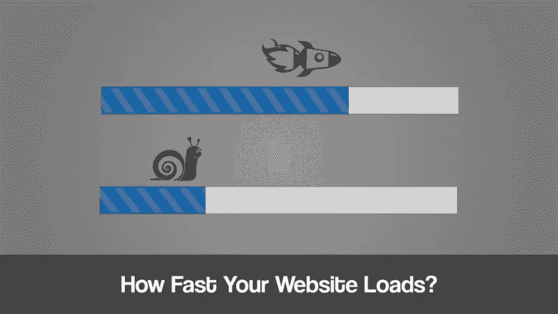

# 良好响应设计的五大优势

> 原文：<https://blog.devgenius.io/top-5-advantages-of-a-good-responsive-design-9e06a4490499?source=collection_archive---------7----------------------->

## 在本文中，让我们看看一个好的响应式设计的好处


**照片由** [**塔拉斯什普卡**](https://unsplash.com/@bugsster?utm_source=unsplash&utm_medium=referral&utm_content=creditCopyText) **上** [**Unsplash**](https://unsplash.com/s/photos/responsive-web-design?utm_source=unsplash&utm_medium=referral&utm_content=creditCopyText)

# 介绍

## 什么是响应式设计？

好吧，简单明了地说， ***将*** 网页 ***完美地*** 或 ***精确地*** 呈现/显示在不同*纵横比的屏幕上的设计称为响应式设计。现在，显示屏的长宽比意味着宽度和高度之间的相关性。废话少说，让我们来看一个响应式设计的例子。 [***伊森·马科特的网站***](https://responsivedesign.is/examples/ethan-marcotte/) 就是一个响应式设计的好例子，如下图所示。*

**

*[***伊森·马科特的***](https://responsivedesign.is/examples/ethan-marcotte/) ***网站横跨四个不同的平台****

## *2009 年 10 月至 2016 年 10 月移动用户与桌面用户的使用对比*

*现在，有时你可能会想“ ***我应该总是让我的网站有响应性吗*** ”或者“ ***如果我的网站主要在台式机或笔记本电脑上使用会怎么样*** ”。好吧，我来告诉你这个，根据 broadbandsearch 的[](https://www.broadbandsearch.net/blog/mobile-desktop-internet-usage-statistics#:~:text=53%20percent%20of%20web%20traffic,56.7%20percent%20from%20desktop%20users.)**统计报告指出，从 2009 年 10 月到 2016 年 ***桌面的互联网使用率为 48.7%，移动为 51.3%*** 。***

****

****全球互联网使用情况统计由**[**Broadbandsearch.net**](https://www.broadbandsearch.net/blog/mobile-desktop-internet-usage-statistics#:~:text=53%20percent%20of%20web%20traffic,56.7%20percent%20from%20desktop%20users.)**

**从上面的互联网使用图表中可以看出，到 2020 年，移动设备上的互联网使用将会增加。所以请记住，你的网站可以在桌面和移动设备上访问。**

## **如何让一个网站有反应？**

**答案非常简单明了。有许多方法可以做到这一点，但最简单的方法是使用[](https://getbootstrap.com/)*:最流行的 HTML、CSS 和 Javascript 库，用于构建响应迅速、移动优先的前端 web 应用程序。要安装它，您只需输入以下命令:***

```
***npm install bootstrap@next***
```

***请阅读下面给出的官方安装文档以了解更多信息。***

***[](https://getbootstrap.com/docs/5.0/getting-started/download/) [## [计] 下载

### 下载 Bootstrap 以获得编译的 CSS 和 JavaScript，源代码，或者将其包含在您最喜欢的包中…

getbootstrap.com](https://getbootstrap.com/docs/5.0/getting-started/download/) 

或者你也可以参考下面给出的谷歌文档来建立响应网站。

[](https://developers.google.com/search/mobile-sites/mobile-seo/responsive-design) [## 响应式网页设计|谷歌搜索中心|谷歌开发者

### 响应式 web 设计是一种设置，服务器总是向所有设备发送相同的 HTML 代码，CSS 用于…

developers.google.com](https://developers.google.com/search/mobile-sites/mobile-seo/responsive-design) 

# 良好响应设计的优势

现在让我们回到文章的重要部分，讨论一个好的响应式设计的优点。

## 1)成本更低


由 [Alexander Mils](https://unsplash.com/@alexandermils?utm_source=unsplash&utm_medium=referral&utm_content=creditCopyText) 在 [Unsplash](https://unsplash.com/s/photos/less-money?utm_source=unsplash&utm_medium=referral&utm_content=creditCopyText) 上拍摄

不同平台(设备)有不同的网站会自动增加开发成本。那么，为什么没有一个单一的响应网站，其中的开发成本将非常低。同样，你也不会浪费你的精确时间和资源。以下是值得记下的金玉良言。

> 通过一个响应网站，你可以用最少的成本制作一个适合所有设备的网络资产，而不管它们的长宽比。

## 2)改进的搜索引擎优化



**SEO by**[**Nicole Martins ferre IRA**](https://www.oberlo.com/blog/seo-tools)

我们先来了解一下 SEO 的含义。它代表 ***搜索引擎优化—*** 一个通过在搜索结果顶部显示来增加你的网站在搜索引擎上的可见性的过程，如 ***谷歌、必应、微软 Edge 等*** 。请记住这一点，你的网站在搜索结果中的可见度越高，你获得的流量或浏览量就越多。现在要阅读更多关于 SEO 及其工作原理，请参考[***【searchengineland.com】***](https://searchengineland.com/guide/what-is-seo)***。***

> 响应式设计是谷歌推荐的设计模式— [谷歌](https://developers.google.com/search/mobile-sites/mobile-seo#select-config)

提高你的 ***SEO*** 的关键是让你的网站反应灵敏。现在，如果你想赢得谷歌的心，那就以响应性为目标。这是因为两个主要原因。

1.  所有响应的网站都有一个单一的 URL，与设备无关。所以这就让谷歌对网站进行高效的排名或索引。
2.  同样，只需分享一个网址，网站就变得容易多了，而不是为不同的设备提供 10 个不同的网址。

> 在网站中，内容扮演着重要的角色，经常定期更新的好内容会提高我们在搜索引擎中的排名或索引位置。

## 3)更多流量


**照片由** [**加布里埃尔·邵力安**](https://www.forbes.com/sites/gabrielshaoolian/) **上** [**福布斯**](https://www.forbes.com/sites/gabrielshaoolian/2018/04/25/exactly-how-to-double-your-website-traffic-and-rank-higher-on-google-in-5-simple-steps/?sh=5e09a93c48eb)

这是一个显而易见的事实，如果你的网站适合所有的设备，它为用户创造了一个机会，根据他们的方便在不同的设备上使用它。据[***byte 9***](https://www.thebyte9.com/)预测，本月平板电脑销量有望达到 1 亿台。猜猜现在平板电脑能产生多少流量。记住这一点，你的网站越灵活，它能产生的流量就越多。

> 无论用户的屏幕是大是小，响应式设计都会满足他们的需求。

## 4)灵活



**照片由**[**【saraads.com】**](https://www.saraads.com/responsive-website.html)

流畅设计是指网站内容在整个屏幕上自由移动，而不考虑其分辨率(显示的像素数)。想象一下，当你有一个容器，你把它装满水。当你不停地倒水时，它完全呈现出容器的形状。这就是反应灵敏的网站如何适应屏幕。我强烈建议您参考下面给出的不同布局，如 ***固定、流动和弹性*** 。

 [## 网站服务

### Sara Ads 在印度哥印拜陀以最好的价格提供 100%有效和负担得起的网站。如果你…

www.saraads.com](https://www.saraads.com/responsive-website.html) 

> 响应式设计是这样一种设计，你只需设计一次，就可以在许多屏幕上使用。

## 5)更快的页面



照片由[胖子](https://www.fatbit.com/fab/make-website-load-faster-try-easy-steps/)拍摄

手机或平板电脑用户的耐心更少，这意味着注意力持续时间更短。如果一个网页需要超过 3 秒或最多 5 秒的时间来加载，那么谁愿意等到它加载完毕。显示[](https://www.bluecorona.com/blog/how-fast-should-website-be/#:~:text=The%20average%20load%20time%20of,just%20by%20increasing%20site%20speed.)**手机用户放弃在网页上点击它如果超过 3 秒就无法加载。例如，保证你的响应站点使用当前的执行方法，响应图像显示将有助于提高你的站点页面堆叠速度。要了解你网站的加载速度，我强烈推荐你使用下面给出的[***gt metrix***](https://gtmetrix.com/)。**

**[](https://gtmetrix.com/) [## GTmetrix |网站速度和性能优化

### 🤔在其他地方的测试中得到不同的性能结果？了解为什么您的 GTmetrix 结果可能与 PageS 不同…

gtmetrix.com](https://gtmetrix.com/)** 

# **结论**

**这是文章的结尾，标题为“ ***一个好的响应式设计的 5 大优势*** ”。我希望你明白一个好的响应式设计的优势。因此，精明地挑选，并打破这些事件的重点，你似乎仍然不能看到自己是一个响应网站。作为一个专业的企业或个人，建立响应性网站是与众不同的。这是你在第一现场为多才多艺的客户所做的初步介绍。我希望你们能从这篇文章中学到一些东西。敬请关注更多更新。在那之前，下次见。注意安全！*****