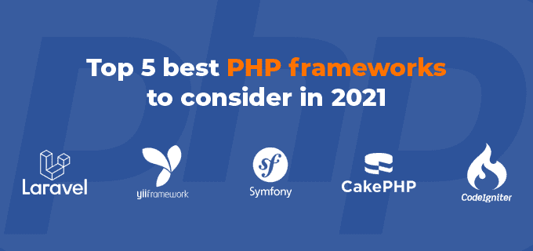
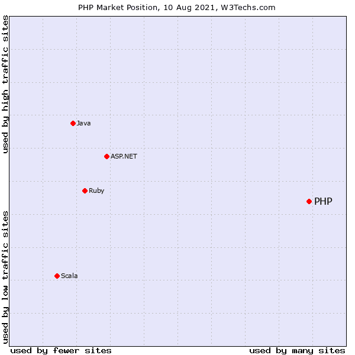

# 2021 年要考虑的 5 大最佳 PHP 框架

> 原文：<https://blog.devgenius.io/top-5-best-php-frameworks-to-consider-in-2021-96ae1226218b?source=collection_archive---------4----------------------->

PHP 是互联网上使用最广泛的编程语言，为脸书和维基百科等网站提供支持。它简单易学，能够快速开发 web 应用程序。

> **目录:**
> 
> **1。** [**概述**](#421a)
> 
> **1.1** [**PHP 的使用情况和市场份额**](#3d2b)
> 
> **2。** [**为什么要用 PHP 框架？**](#82bb)
> 
> **2.1** [**你应该在一个 PHP 框架中寻找什么？**](#86e3)
> 
> **3。** [**最佳 PHP 框架前 5 名**](#3f9a)
> 
> **4。** [**最终想法**](#7f0c)

# 1.PHP 框架概述

许多开发人员每天都在使用 PHP 和基于 PHP 开发的第三方应用程序框架。PHP 开发框架可以提高生产力，并在一个可靠的、经过良好测试的基础上开发强大的应用程序。

此外，框架可以弥补 PHP 语言的一些缺点，使它们成为最苛刻的应用程序的安全赌注。

软件开发变得越来越复杂，为了在相当长的时间内产生可靠的应用程序，需要使用模块、设计模式和工具。这是一个框架可以发挥重要作用的领域。

在本文中，我们将研究顶级 PHP 开发框架及其固有的优点和缺点。到本文结束时，您将对哪些 PHP 开发框架最适合您独特的 web 开发需求有一个牢固的掌握。

## 1.1 PHP 的使用和市场份额

# 2.为什么要使用 PHP 框架？

使用 PHP 框架比从头开始编写代码有很多优点。

## 1.加速发育

因为 PHP 框架包括库和工具，所以开发时间减少了。

例如，CakePHP 框架包括 Bake 命令行工具，它允许您轻松地生成应用程序所需的任何框架代码。

许多著名的 PHP 框架都包括 PHPUnit 库，以方便测试。

## 2.减少要编写的代码量

通过利用框架提供的函数，您可以避免创建太多的原始代码。

## 3.常见问题库

开发人员在开发 web 应用程序时会遇到许多日常活动。表单验证、数据清理和 CRUD 操作都是例子(创建、读取、更新和删除)。与其为这些任务编写自己的函数，不如直接使用框架。

## 4.坚持合理的编码实践

PHP 框架通常遵循代码标准。例如，他们根据功能将代码整齐地组织成若干类别。

它们迫使你以一种更符合逻辑、更有序、更易维护的方式组织你的代码。

此外，框架有自己的实体命名标准，您应该遵守。

## 5.比自行编写的应用程序更安全

存在许多 PHP 安全漏洞，包括跨站脚本、SQL 注入和跨站请求伪造。除非您采取必要的安全预防措施，否则您的 PHP web 应用程序将容易受到攻击。

虽然利用 PHP 框架并不能消除编写安全代码的需要，但它确实降低了黑客攻击的可能性。有效的框架结合了数据净化和对上述典型危险的防御。

## 6.改善团队合作

如果没有澄清以下事项，多个开发人员项目可能会出错:

*   证明文件
*   关于设计的决策
*   规范性标准

利用框架为你的项目建立清晰的指导方针。即使额外的开发人员不熟悉框架，他们也应该能够快速学会并协作。

## 7.更容易跟上

PHP 框架支持代码重组，并促进干式(不要重复自己)开发。因此，生成的代码库不太复杂，需要的维护也较少。

此外，您不必担心维护基本框架，因为工程师会为您处理这些。

# 2.1 你应该在 PHP 框架中寻找什么？

首先，如果你不熟悉 PHP 框架，学习曲线应该是可以管理的。你不想花宝贵的时间去掌握一个太难把握的框架。PHP 是幸运的，因为它是最容易学习的编程语言之一。

接下来，您需要一个简单易用且高效的框架。

一个 PHP 框架应该满足你的项目的技术需求。大多数框架需要最低版本的 PHP 和特定的 PHP 扩展才能运行。确定您的框架支持您选择的数据库，并且它与您打算部署的 web 服务器兼容。

选择一个能提供适当平衡功能的框架。一个功能丰富的框架对于某些类型的项目可能是有利的。另一方面，如果你不想要太多的特性，选择一个精简简单的框架。

几个理想的特征包括如下:

*   测试
*   缓存存储
*   模板引擎:一种通过 PHP 类将 PHP 嵌入 HTML 的技术。
*   安全性

如果你需要构建一个可伸缩的应用程序，使用一个支持它的框架。

最后，为了充分利用 PHP 框架，拥有足够的文档和帮助是至关重要的。此外，一个拥有庞大而活跃的社区的框架更有可能经受住时间的考验，并且能够在出现危机时为您提供帮助。

# 3.前 5 名最佳 PHP 框架

## 3.1 [拉韦勒](https://laravel.com/)

[最流行的 PHP 框架是 Laravel](https://www.etatvasoft.com/blog/why-laravel-is-best-php-framework-for-web-development/) 。Taylor Otwell 最初在 2011 年发布了它，现在它已经成熟为一个拥有数百名贡献者和数百万安装的框架。

它使用 MVC 模式构建，包含自己的模板语言 Blade，简化了创建 HTML 布局的过程。说到数据库访问，Laravel 使用了雄辩的 ORM，它很容易学习和使用。

雄辩的 ORM 是一个对象关系映射器，使您能够在 PHP 中构建模型和关系。这些模型和关系随后被转换并作为 SQL 执行。这使得您的代码简洁明了，同时也允许您在必要时轻松地迁移到另一个数据库系统。

Laravel 的与众不同之处在于它拥有大量加速和简化开发的特性、包和应用程序。

例如，队列使您能够异步执行某些密集的流程，而不会使您的应用程序承受压力，也不会为您的使用者延迟加载时间。其他功能，如缓存、实时在线体验的广播事件和用户认证都包括在内。

根据 Jetbrains 进行的一项民意调查，50%的 PHP 开发人员使用 Laravel。它可以用来开发任何形式的项目，包括 SaaS，电子商务和自定义应用程序。小企业选择它是因为它的易用性，而大企业依赖它的强大功能。

## 3.2 [Yii](https://www.yiiframework.com/)

Yii，这个框架的中文名字，翻译过来就是“简单和进化的”此外，它代表“是的，它是！”

*   快速规格发布:2008 年 12 月
*   版本 2.0.35 是最新版本。

**技术规格:**

*   PHP >= 5.4.0 推荐；PHP 7+也推荐。
*   已安装的作曲家
*   SQLite、MySQL、PostgreSQL、MSSQL 或 Oracle 数据库支持

Yii 通过 Slack 或 IRC 提供实时支持。此外，还提供论坛和社交媒体渠道。社区通过徽章和进入名人堂来表彰其最敬业的成员。

## 3.3 [交响曲](https://symfony.com/)

Symfony 是一个成熟的框架，它改变了 PHP 开发。除了作为一个框架，它还包括一个可重用组件的集合，可以在任何 PHP 项目中使用。包括 Laravel 在内的许多开源技术都利用了这些组件。SensioLabs 维护和支持 Symfony，Symfony 有数百名贡献者和一个蓬勃发展的开发人员社区。

它建立在 MVC 框架之上，利用教条式的 ORM 来提供对象-关系映射。当构造视图时，它利用 Twig 模板引擎来帮助呈现 HTML。

Symfony 由于其广泛的功能、庞大的社区和健壮性，应该被列入顶级 PHP 开发框架之列。

它非常适合要求可预测性、维护和优化的更复杂的在线项目。Symfony 支持几种企业数据库驱动程序，这也使它成为企业项目的绝佳选择。

## 3.4 [CakePHP](https://cakephp.org/)

*   CakePHP 有一个快速简单的 ORM。
*   加密、密码哈希、表单数据保护和 CSRF 保护都是安全特性。
*   CakePHP 的组件和助手通过消除繁琐的工作简化了开发。
*   在 Github 上，你可以找到一系列全面的 CakePHP 资源和插件。
*   CakePHP 可以通过菜谱(docs)、在线培训或 CakeFest 会议来学习。

你可以通过他们的论坛、堆栈溢出、IRC 和 Slack 频道与友好的 CakePHP 开发者联系。还可以通过 CakePHP 创始人拉里·马斯特斯经营的“蛋糕 DC”获得专业支持。

## 3.5 [点火器](https://codeigniter.com/)

CodeIgniter 是一个基于 PHP 的 MVC 框架，使开发人员能够快速创建新项目。其中一个优点是它不是一个约束性的框架，可以作为加速开发的工具包。

大多数 PHP 框架需要您采用 MVC 模式，尽管 CodeIgniter 推荐使用 MVC 模式，但它并不要求这样做。它具有缓存、多数据库支持、路由和当前在线应用程序中常见的其他功能。这些特性打包得很好，可以以多种方式使用。

# 4.最后的想法

如果你想尽量减少开发 PHP web 应用程序所需的时间，采用框架是一个明智的选择。

为了最大限度地利用 PHP 框架并减少挫折，您应该掌握 PHP 的工作知识并理解框架的核心概念:MVC 设计、面向对象的语法、数据库和对象关系映射以及命令行。

您选择哪种框架将取决于您正在开发的应用程序的类型。有一个 PHP 框架适合每一种口味，从超简单到“除了厨房水槽以外的一切”希望这篇文章能帮助你确定最适合你需求的 PHP 框架。