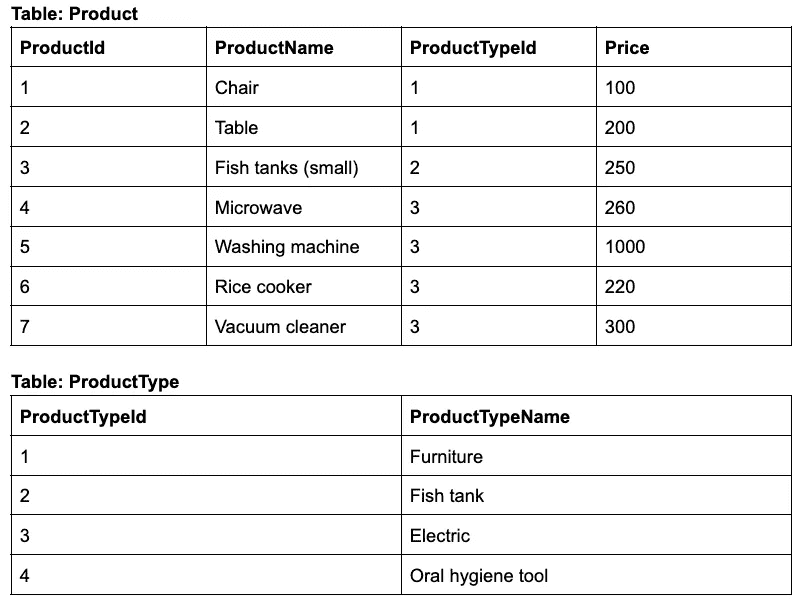
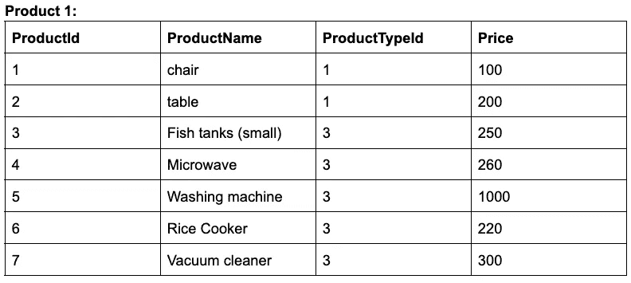
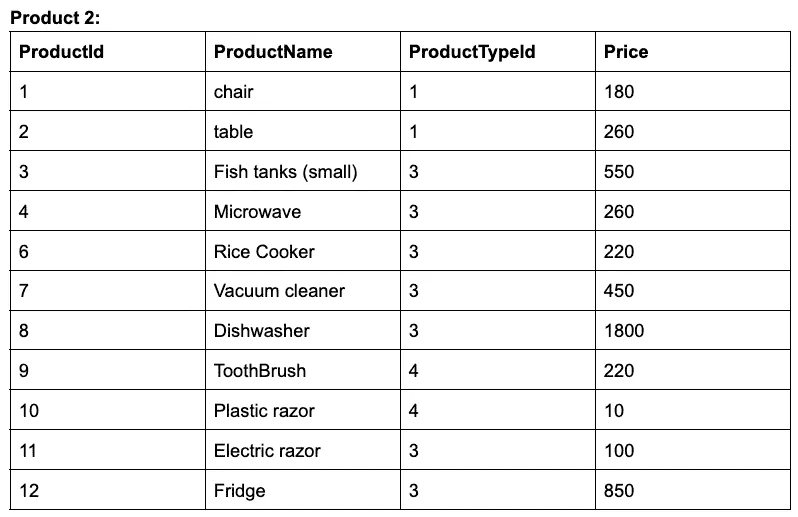

# Apache Beam 中五大数据处理示例

> 原文：<https://blog.devgenius.io/top-5-big-data-processing-examples-in-apache-beam-ff31100bd702?source=collection_archive---------7----------------------->

## 软件工程之旅

## 从 SQL 示例到 Apache Beam Java 代码

# 概观

作为软件工程师，SQL 是一种非常流行的语言，用于为应用程序从我们的后端数据库中查询数据。在这篇文章中，我想通过分享现在比较流行的数据处理，来分享一下如何用 SQL 后台学习大数据处理。我认为许多具有 SQL 背景的人可以很容易地了解使用 Apache Beam 进行大数据处理，如果需要，您可以在阅读本文之前看看这些关于 Apache 的主题，以获得基本知识:

*   [大数据工程之旅:Apache Beam 概述](https://medium.com/@techisbeautiful/the-journey-to-big-data-engineering-apache-beam-overview-part-1-685e8bfefb15)
*   [3 必须知道在 Apache Beam 中连接数据集的方法](/3-must-know-approaches-to-join-datasets-in-apache-beam-934228de2d4e)
*   [我如何在 Apache Beam 中测试我的大数据管道](/how-i-test-my-big-data-pipeline-in-apache-beam-28d2f7e6d311)

# 场景和样本数据集

我们设想我们需要一个数据库，它包含一个小型企业的关键领域。该数据库包含两个表，可以帮助我们管理商店中的产品。我们将把它们分解成结构化的表格:

**产品表**:汇集所有产品信息的表，例如产品 Id、产品名称、产品类型 Id、价格

**产品类型表**:该表将存储产品需要的类别，如产品类型标识、产品类型名称

为了展示使用数据集进行测试的例子，也为了使它更具可读性，我们展示了来自两个表的数据，它们是一种相互关系表。见下文:每个表将存储信息:

抽样资料

# 通过 SQL 示例学习大数据

现在我们将使用一些 SQL 主题，通过实现编码将它们转换成 Apache Beam

让我们从 sql 概念的角度来看，有一些流行的 SQL 主题，我们一直在与他们合作，或者我们曾经不时地与他们合作:

## #1 Group By With Sum(或任何聚合函数)

GROUP BY 语句用于将相同的数据排列到具有相同值的行组中。GROUP BY 语句通常用于聚合函数，例如 COUNT()、MAX()、SUM()、AVG()等。

现在我们将在 SQL 和 Apache Beam 中应用 GROUP BY 查询。让我们看看，我们得到的 product 表有许多记录，其中一些记录的 ProductTypeId 列具有相同的值，但也有一些记录具有不同的值。我们将决定使用 ProductTypeId 列来根据该列对行进行分组。现在，我们再次希望获得每种产品类型的产品价格总额，我们可以使用聚合函数 SUM()对每种产品进行求和。例如:

SQL:

阿帕奇波束:

## #2 选择和位置

SELECT 语句用于从表中选择某些列，它将返回一个结果表，称为结果集。

除了 SELECT 语句，我们还使用 WHERE 子句来过滤记录。它用于只提取那些满足指定条件的记录。

在本例中，我们将使用 SELECT 语句从 product 表中检索数据，然后使用 WHERE 子句在 ProductName 列的任何位置查找以“rice”开头的任何产品。请参见下面的示例:

SQL:

阿帕奇波束:

示例 1:

示例 2:

## #3 加入

有许多方法可以连接 Apache Beam。你可以阅读我写的这篇文章 [3 必须知道在 Apache Beam 中连接数据集的方法](/3-must-know-approaches-to-join-datasets-in-apache-beam-934228de2d4e)

## #4 联合并消除重复

在 SQL 中，我们使用 union 操作符，以防多个表具有相同的列，并且我们想要组合对不同表的列执行的两个或多个 select 命令的结果。

Apache Beam 提供了 Flatten 类，该类与 SQL 中的 Union 操作符相同，因此 Flatten 可以将多个 PCollection 对象合并成一个逻辑 PCollection。

实际上，我们有两个包含许多记录的产品表:

第一个产品表的示例数据

第二个产品表的示例数据

现在，假设我们想将它们合并成一个数据，那么一个方便的解决方案是填充两个产品集合，基于它创建一个 PCollectionList，然后进行扁平化。除此之外，正如您从上面的数据中看到的，我们从两个表中获得了许多重复的记录，因此为了防止重复，我们需要删除，并且在两个表都有重复记录的情况下，只取表 product 2 中表示的记录。这是我们解决问题的例子:

SQL:

阿帕奇波束

## #5 将数据分成 2 路输出:

为了将产品分割成 2 个输出，我们将设想这样一个场景，我们将根据条件分割它们，这取决于那些产品的价格，如果产品价格大于 100 美元，可能它们将被推入输出 1，但是相反，那些价格小于或等于 100 美元的产品将被推入输出 2。

Apache Beam 提供了一个 Partition 类，帮助我们将一个集合中的元素分成多个输出集合。分区函数包含确定如何将输入集合的元素分成每个结果分区输出集合的逻辑。

这是一个将产品集合分成价格组的示例:

*注意:SQL 没有 split 函数，但如果您在大数据工程中工作，将数据分成两个或多个不同的输出数据集，您可能会多次看到这种操作。*

# 摘要

本文特别分享了开发中最常用的 SQL 命令，它们也在 Apache Beam 中实现。除此之外，本文还为每个 SQL 命令提供了一个简要的理论，并提供了一些例子来帮助您通过编码更容易地将 SQL 命令转换成 Apache Beam。

*如果你喜欢这篇文章，你也会喜欢我的阿帕奇光束文章:*

*   [*大数据工程之旅:Apache Beam 概述*](https://medium.com/@techisbeautiful/the-journey-to-big-data-engineering-apache-beam-overview-part-1-685e8bfefb15)
*   [*3 必须知道 Apache Beam 中连接数据集的方法*](/3-must-know-approaches-to-join-datasets-in-apache-beam-934228de2d4e)
*   [*我如何在 Apache Beam 中测试我的大数据管道*](/how-i-test-my-big-data-pipeline-in-apache-beam-28d2f7e6d311)

*喜欢这篇文章？给我拿一个*[*Ko-fi*](https://ko-fi.com/techisbeautiful)*。*

*爱我的文字？加入我的* [*邮箱列表*](https://medium.com/subscribe/@techisbeautiful) *。*

*爱读书？加入* [*中等*](https://medium.com/@techisbeautiful/membership) *(如果你用这个链接，也是支持我的，因为我有来自中等的小提成)。*