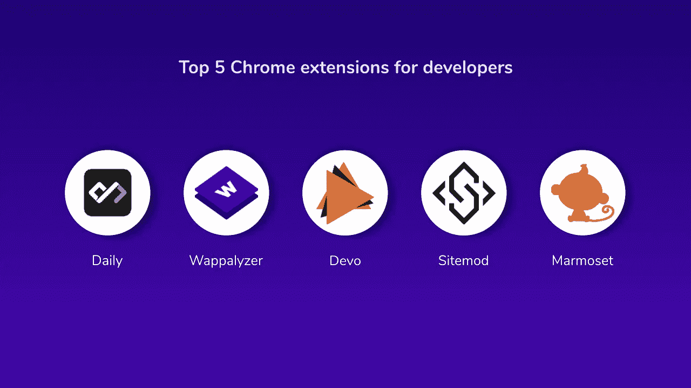

# 面向开发者的 5 大 Chrome 扩展

> 原文：<https://blog.devgenius.io/top-5-chrome-extensions-for-developers-10db4b65cf12?source=collection_archive---------15----------------------->

[扩展](https://junaidsshaikh.com/top-5-chrome-extensions-for-developers/)是为您的浏览器添加新功能并个性化您的浏览体验的小程序。对于开发人员来说，扩展增强了开发环境。

面向开发者的 Chrome 扩展

**对开发者非常有用的 5 个 Chrome 扩展:**

1.  每日(最新技术和新闻更新)
2.  Wappalyzer(获取网站所用技术的相关信息)
3.  Sitemod.io(实时修改、保存和共享任何网站)
4.  Devo (GitHub 趋势、黑客新闻和产品搜索，在每个新标签上)
5.  Marmoset (Marmoset 是一个有趣的小工具，用于创建代码的 3D 截图)

# 每日:

*不费吹灰之力发现 Dev 新闻*

[每日](https://daily.dev/)在每个新标签中提供最有用的节目新闻。它是网络浏览器的延伸，引导你的专业成长。Daily 是一个开源扩展。日常是最好不费力发现开发文章的。它帮助你增长知识，节省时间。

**功能:**

*   您可以自定义个人订阅源，也可以调整外观和感觉来提高您的工作效率。
*   每日帮助您无缝管理您的内容。

# Wappalyzer:

*识别网站上的技术*

[Wappalyzer](https://www.wappalyzer.com/download) 是一家技术图形数据提供商，提供内容管理系统、客户关系管理、电子商务平台、广告网络、营销工具、web 框架、服务器软件和分析等技术。

**功能:**

*   Wappalyzer 是一个跨平台的工具，它揭示了网站上使用的技术。

# Sitemod.io:

*实时修改任意网站*

[Sitemod.io](https://sitemod.io/) 允许任何人实时修改、保存&共享任何网站，而无需访问该网站的源代码。这个扩展利用 Chrome 开发者工具来编辑网页中的任何 HTML、CSS 或 JS 代码，或者添加你自己的代码。保存并获得修改版本的唯一 URL，这样您就可以共享您的 mod。

**功能:**

*   面向机构和自由职业者—简化工作流程
*   销售和营销—提高转化率
*   网站所有者—增强网站

# Devo:

*GitHub 趋势、黑客新闻和产品搜索，出现在每个新标签上*

[Devo](https://chrome.google.com/webstore/detail/devo/elkhalpmbmbaeoemecpcfdcoekmpgmdm?hl=en) 是一个新的标签扩展，在每个新标签上展示 GitHub 趋势、黑客新闻、产品搜索和许多不同平台的首页，无需登录。你可以改变卡片的位置，以不同的顺序显示你想要的任何平台。

Devo 使用最先进的网络技术将内容带到您的新标签中。它不使用您的任何个人信息:它只是获取这些平台的公开可用信息，并且它包含直接指向平台本身的链接。

Devo 为每个平台都使用了专门构建的爬虫，并以原始平台的方式对数据进行样式化。数据会被缓存 5 分钟，这样您就不必在每个新选项卡上等待数据更新，而且您还可以看到最新的数据。显示的数据属于各自的平台，Devo 只是一个组织者，让你快速到达这些平台。

**特色:**

*   免费和开源

# 狨猴:

*创建华丽的代码快照*

Marmoset 是一个 chrome 扩展，可以让你在几秒钟内创建吸引人的代码快照。有了 Marmoset，你可以应用一个主题和效果，并将快照保存在你的本地磁盘上。

**功能:**

*   免费和开源