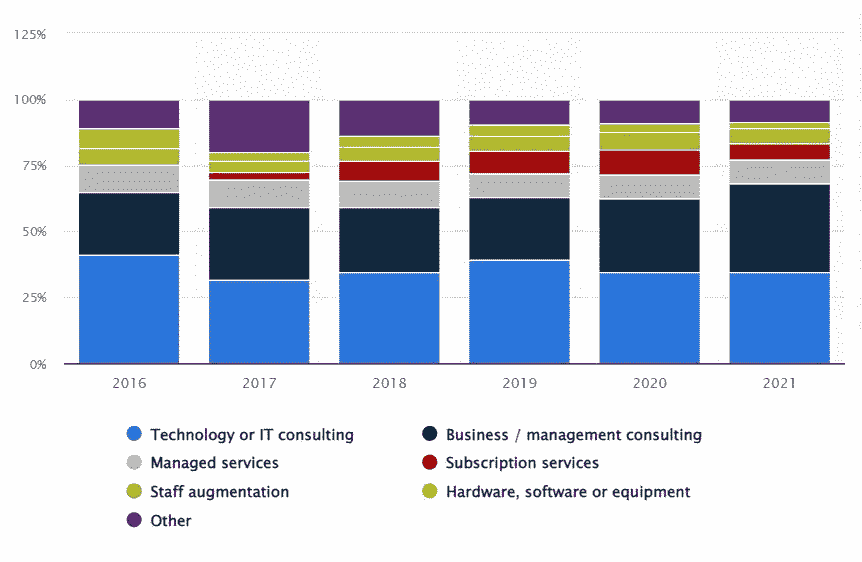

# 关于 IT 员工扩充的五大改变游戏规则的问题

> 原文：<https://blog.devgenius.io/top-5-game-changing-questions-about-it-staff-augmentation-499fc919dc1d?source=collection_archive---------20----------------------->

人员扩充是软件外包的主要类型之一

你听说过[大辞职](https://hbr.org/2021/09/who-is-driving-the-great-resignation)吗？自 2021 年以来，全球出现了一波员工辞职潮，尤其是在全球 IT 行业、[软件开发公司](https://coderiders.am)和医疗保健行业。许多研究将全球劳工混乱与新冠肺炎疫情联系起来。不管是什么原因，伤害已经造成了。

根据[美国劳工统计局](https://www.bls.gov/news.release/jolts.nr0.htm)的数据，仅在美国，2021 年 7 月就有超过 400 万美国人辞职。这个数字仍然异常高，破纪录地有 1090 万个空缺职位。因此，[Statista 2022 年 8 月关于“2016 年至 2021 年全球专业服务机构出售的工作类型”的研究](https://www.statista.com/statistics/934784/professional-services-worldwide-type-of-work-sold/)是合法的，值得关注。

尽管全球人才短缺一直是一个问题，特别是在技术、IT 和软件开发行业，但面向自动化和数字化的 IT 员工扩充和软件外包现在比以往任何时候都更加重要。除了打造顶尖的工具，利用机器人、人工智能、机器学习、软件开发，或者自动化砍掉手工劳动，还有什么可以填补人力资源的缺口？

根据同一份报告，从 2016 年到 2021 年，[技术或 IT 咨询](https://coderiders.am/services/software-development-outsourcing-and-it-consulting)占全球专业服务机构销售额的最大份额。大约 35%的销售额来自技术或 IT 咨询。

调查还在继续，将员工扩充列为全球销售的顶级工作类型之一。我们谈了很多软件外包和离岸软件开发。现在是讨论最流行的软件外包类型之一的时候了:IT 人员扩充，也称为软件扩充。

在本文中，您将找到以下最常见问题的答案:

1.什么是员工扩充？我为什么需要它？

2.有哪些不同类型的 IT 员工扩充？

3.IT 员工扩充如何帮助我的企业？或者说，员工激励是我的企业的正确选择吗？

4.人员扩充的好处是什么？

5.员工扩充流程是如何运作的？

自从我们成立以来， [CodeRiders 软件外包公司](https://coderiders.am)一直提供 IT 人员扩充服务，作为离岸软件开发的选择之一。我们已经为全球多家公司成功完成了众多 IT 员工扩充项目。现在，是时候与我们的读者分享关于这个话题的见解了。让我们开始吧。

**什么是员工扩充？**

IT 员工扩充是软件开发外包或离岸软件开发的一种类型，其中公司或组织雇用临时的专门技术工人(软件工程师、软件开发人员、图形设计师、UI/UX 设计师、PMs、QAs 等)。)从事临时软件开发项目。

换句话说，软件增强是雇用额外的技术员工加入现有的内部技术团队，充当团队成员，并解决特定的技术基础设施问题的过程。

例如:

一家房地产公司需要通过向数字世界提供服务来转变为 proptech 公司。该公司已经建立了一个技术部门，但需要更多的员工加入。

一家旅行社需要旅游软件解决方案，也许是一个预订和跟踪旅行的定制应用程序。该公司需要更多的技术人才来完成这项任务。

一所私立学校需要一个电子学习网络和移动应用程序来更有效地联系家长、学生和教师。

一家软件开发公司致力于发布新产品，并且只在构建和实现新产品的给定时间框架内需要更多的软件工程师和开发人员。

情况各不相同，我们可以举不胜举；然而，这个想法是短期雇佣一个新的专业人员。在全球科技人才短缺的情况下，找到长期的内部软件工程师很有挑战性，找到临时员工就更难了。内部员工需要稳定性，而软件外包公司可以提供临时的专职软件工程师、开发人员、设计师或其他 IT 相关专家。此外，大多数软件开发公司在他们的[软件外包服务](https://coderiders.am/services)中包括员工扩充。

**为什么您需要扩充 IT 员工？**

从软件外包公司找到并雇佣临时技术员工要容易得多。

由于软件外包具有成本效益，您可以节省大量资金。IT 人员的增加意味着在技术中心(流行的软件外包目的地)寻找软件开发公司。点击了解软件外包的[好处。](https://www.coderiders.am/blog/5-key-reasons-startups-hire-software-developers-in-armenia)

你足够灵活，可以在必要的时候终止合作。

一旦项目完成，你对你的临时雇员没有义务。

**有哪些不同类型的 IT 员工扩充？**

在软件外包领域，我们有 3 种主要的 IT 员工扩充方式:

**基础 IT 人员配备服务**:这是一种软件增强，当公司的内部技术团队从事一个常规项目，并且需要更多的员工来完成简单的任务。当然，找到高质量的软件工程师和开发人员很关键，但要求不是顶尖的，候选人一定不是该领域的顶尖专业人士。

基于技能的 IT 人员配备服务:这是当公司的技术团队缺乏特定的技术技能或需求时的一种软件扩充。例如，一家公司只有后端内部开发人员，但需要建立一个完整的网站。公司的 PHP/Laravel 开发人员搭建网站后端，但也需要 Vue.js 和 React.js 前端开发人员完成网站前端开发。于是，他们通过从一家软件外包公司雇佣 Vue.js 和 React.js 开发人员，通过 IT 人员扩充模式将前端开发需求外包出去。

**经验丰富的 IT 人员配备服务**:在经验丰富的 IT 人员配备服务中，公司需要高级软件工程师和开发人员来完成更具挑战性的技术任务，并领导他们的内部团队。

**IT 人员扩充如何帮助我的业务？或者软件增强是我公司的最佳选择？**

如果您对以下大多数问题的回答都是“否”，那么 IT 员工扩充对您的业务是有益的，您应该尝试一下。

在雇佣我的长期内部软件工程师后，我会一直有任务给他们吗？

我是否有足够的资金支付新的内部员工，即使他们目前没有任何任务？

我的项目是一个长期的软件开发和实现吗？

我想花时间和金钱招聘新的软件开发人员和工程师吗？

我是否有时间和精力帮助新员工适应新的工作环境和同事？

我是否有足够的资源将新员工视为绝对的团队成员，例如提供医疗保险、奖金、带薪休假和其他类似的员工福利？

我有足够的办公空间和设备给新员工吗？

员工扩充的好处是什么？

**钱留在你的口袋里**

我们之前提到过，IT 人员扩充是在不面临重大财务投资的情况下扩大团队的最佳方式之一。

通过软件扩充，扩大规模是可能的，因为它大大削减了软件开发费用。例子包括没有每月固定工资、招聘支出、内部员工待遇、税收、空间和内部员工设备。

**获得全球 IT 人才库**

远程工作没有边界。你可以在全球范围内雇佣人才。IT 人员扩充使您能够在不承担风险的情况下扩大您的技术团队。与软件外包公司合作可确保安全可靠的远程合作机会。

**减轻当前内部团队的压力**

当一个公司没有足够的资源来雇佣新员工时，它别无选择，只能将现有员工的责任相加。因此，员工的满意度随着压力水平的提高而下降。软件人员的增加使得团队扩展成为可能，即使是在资金有限的情况下。

**集思广益和听取第三方意见的机会**

与软件外包公司及其软件开发人员、工程师和来自世界各地的其他 IT 专家合作意味着探索新的可能性。你将有机会通过与来自不同国家和地区的公司合作来采用“国际化”的经营方式。新的想法诞生了，为你们国家的创新打下了坚实的基础。

**没有地域限制(弹性工作时间)**

雇佣员工在非工作时间工作，工资翻倍。在资金有限的情况下，您可以搜索在适当时区运营的软件供应商，避免为非工作时间支付额外费用。

**让您的业务变得更加敏捷的机会**

根据您的业务需求的发展来扩展一个扩充的团队要容易得多。

**人员扩充流程是如何运作的？**

IT 人员扩充是软件外包参与模式之一。尽管有许多相似之处，每个软件外包模型都有特定的特征，这些特征使它们独一无二，并将其定义为独立的模型。这些过程是软件外包契约模型中的主要验证之一。软件增强过程也不同于其他参与模型。下面是一个典型的全周期 IT 人员扩充模型的工作原理。

**软件增强阶段 1:**

**确定并定义您建议的条件和任务要求**

在软件开发外包中，阐明你的目标、需求和合作期望是至关重要的。无论你选择哪种[软件开发参与模式](https://coderiders.am/software-development-process)，公司最初的目标应该是明确的。

与固定价格的软件开发参与模型不同，人员扩充以及时间和材料软件外包模型都更加灵活。通常，后两种模型采用[敏捷软件开发方法](https://coderiders.am/blog/your-all-in-one-guide-to-agile-software-development)，这种方法正是以其灵活性和改变计划的能力而闻名。然而，IT 人员的增加也可能基于固定的比率和预算，这需要非常清楚的技术文档。

无论如何，作为开始，你应该能够向你潜在的软件供应商解释你的目标和需求。澄清你的技术需求对于双方(软件供应商和客户)来说也是至关重要的，因为这使得从团队中选择相应的专业人员变得容易得多。在 CodeRiders，我们创建了一个简单快捷地编写 SOW 文档的实用指南。我们也给它一个样品。你可以在这里下载指南及其样本[。](https://www.coderiders.am/white-papers/how-to-write-a-solid-scope-of-work)

**软件增强阶段 2:**

**搜索、审查和筛选可能的 IT 员工补充服务提供商**

缩小最佳目的地范围，找到价格实惠、质量高的软件外包公司，并据此搜索软件供应商。列出每个国家或你感兴趣的特定技术中心的合格候选人名单，然后[联系他们](https://coderiders.am/contact-us)。我们为您选择合适的软件供应商提供了非常有用和实用的指南。我们还列出了 12 个软件外包问题(带答案),以表彰一家可靠且技术娴熟的软件供应商。点击查看[。](https://coderiders.am/blog/top-12-software-outsourcing-questions-and-answers)

**软件增强阶段 3:**

**审核并确定新的团队成员，并开始入职流程**

在了解了你的技术需求后，你的软件供应商会推荐他们的最佳候选人。为了确保这个软件工程师是一个合适的人选，您可以快速分配一个简短的测试任务，浏览个人简历，或者回顾以前的项目。在客户最终确定其选择并“正式”雇佣一名新的专职远程团队成员后，入职流程开始。入职过程描绘了你的公司、队友和项目本身的介绍和表现过程。

**软件增强阶段 4:**

**不要忽视持续的支持**

为了确保建立良好的关系，你应该随时准备回答不清楚的问题或根据要求给出详细说明。

如果你已经走到这一步，恭喜你；现在你知道了在你的公司和你潜在的软件外包公司之间建立一个成功的 IT 员工扩充伙伴关系的所有基本技巧和策略。到目前为止，您还应该知道软件增强是如何工作的，以及您将如何从雇用提供 it 员工增强服务的软件外包公司中受益。为了让客户了解 IT 员工扩充如何帮助扩大您的业务，我们建议[联系 CodeRiders 软件外包公司的业务开发团队](https://coderiders.am/contact-us)。

 [## 软件开发公司-联系我们| CodeRiders

### 让我们谈谈您在定制软件开发、网页开发和设计、软件外包方面的业务需求…

www.coderiders.am](https://www.coderiders.am/contact-us)