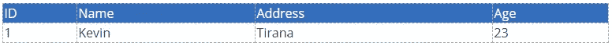
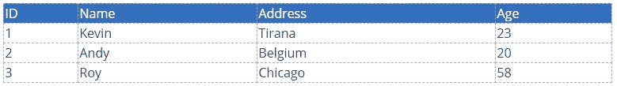
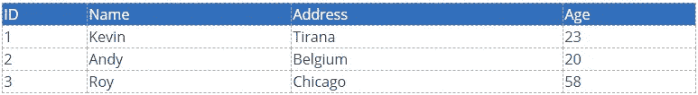
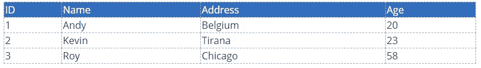
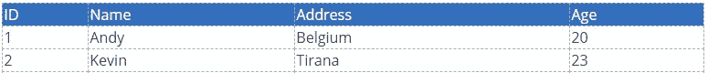
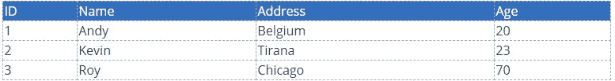
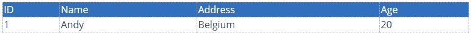

# 最常用的 5 个 SQL 查询

> 原文：<https://blog.devgenius.io/top-5-most-used-sql-queries-1ca6c66ea857?source=collection_archive---------12----------------------->

SQL Server 是一种关系数据库管理系统，简称 RDBMS，由微软开发和销售。该接口有助于使用查询与系统的数据库进行通信。SQL 查询是 SQL 与数据库通信的机制，以产生我们想要的输出。**数据库**是结构化信息或数据的有组织的集合，通常以电子方式存储在计算机系统中。

由[托拜厄斯·费希尔](https://unsplash.com/@tofi?utm_source=medium&utm_medium=referral)在 [Unsplash](https://unsplash.com?utm_source=medium&utm_medium=referral) 上拍摄的照片

# 插入查询

Insert 命令用于将记录插入表中。SQL 'INSERT INTO '声明用于在数据库表中包含新的数据库行。

**语法:**

*INSERT INTO TABLE _ NAME(column 1，column2，column3，…column)]值(value1，value2，value3，…valueN)；*

这里，column1，column2，…column 是表格中要插入数据的列的名称。

如果为表的所有列添加值，则不必在 SQL 查询中指定列名。尽管如此，请注意，值的顺序与表列的顺序相同。它将下面的 SQL 插入语法:

**语法:**

*INSERT INTO TABLE _ NAME(column 1，Column2，……，ColumnN)值(值 1，值 2，值 3，…值 n)；*

**示例:**

按照 INSERT INTO 语法的语法，我们指定表的名称“INSERT INTO”关键字，按照列的顺序，在其中插入需要插入的值。post“VALUES”关键字按照前面指定的列顺序输入列值。

**将** **插入**学生(id，**姓名**，年龄)**数值** ('1 '，'凯文'，'地拉那'，23)；

启动该查询后，我们的表将如下所示:

我们可以启动更多这样的查询来填充表中的记录:

**将** **插入**学生(id，**姓名**，地址，年龄)**值** ('2 '，'安迪'，'比利时' 20 ')；

**将** **插入**学生(id，**姓名**，地址，年龄)**值** ('3 '，'罗伊'，'芝加哥' ' 58 ')；

# 选择查询

Select query 帮助我们从表中获取记录。结果表称为结果集。

**语法:**SELECT 语句的基本语法如下:

*从表名中选择列 1，列 2，列 n；*

这里，column1，column 2…是要获取其值的表的字段。如果您想要获取字段中所有可用的字段，那么您可以使用以下命令

**语法:**

*SELECT * FROM table _ name；*

**举例:**

**从**学生中选择***；**

该查询的结果将是表中所有行的显示。

我们也可以使用 ORDER BY，以我们选择的句子中相似的顺序来组织呈现的结果。举个例子，

**按**年龄从学生**订单** **中选择*****；**

# 删除记录查询

要从表中删除记录，只需使用下面的查询，它简单易懂。

**语法:** *从学生那里删除【条件】；*

**例如:**

**删除**中的 **学生**其中** **姓名**=‘罗伊’；**

该查询将从表“student”中删除整行或多行，其中“name”列的值为“Rohit”。

在我们的示例中，该查询的结果将如下表所示:

# 更新查询

使用更新查询可以更改表中现有记录的数据。

**语法:**使用 WHERE 子句更新查询的基本语法如下:

*更新表名集列 1 =值 1，列 2 =值 2…，columnN = valuen where[condition]；*

假设我们想要在名为“Rohit”的表中修改学生的年龄。将使用以下查询:

**例如:**

**更新**学生**设定**年龄= 70 **哪里** **姓名**=‘罗伊’；

您可能已经发现，虽然值是字符，但我们用单引号来定义这个术语。那是一种义务。

**现在如果我们开火:**

**从**学生中选择***；**

我们将得到下表作为输出:

请注意使用 WHERE 子句更新或删除查询。假设在我们的“班级”名单中有不止一个叫“罗伊”的学生。在这种情况下，所有名为“Roy”的学生的年龄都修改为 70 岁。因此，在修改或删除过程中，主键应该始终包含在 WHERE 子句中。

# 仅查看选定的记录

当我们不希望所有的记录都填满我们的显示屏时，SQL 提供了这样一种选择，即当数据库中有许多行时，只显示选定的行。计数有利于记录记录号。

**语法:** *从 table_name 中选择 COUNT(1)；*

**举例:**

**从**学生中选择 COUNT(1)**；**

**这个查询的输出将是:**

