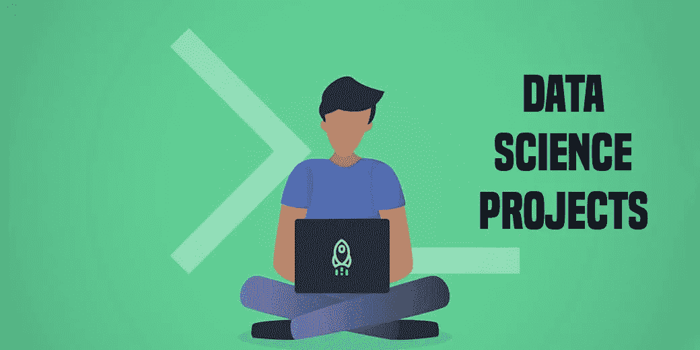
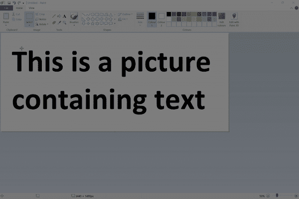
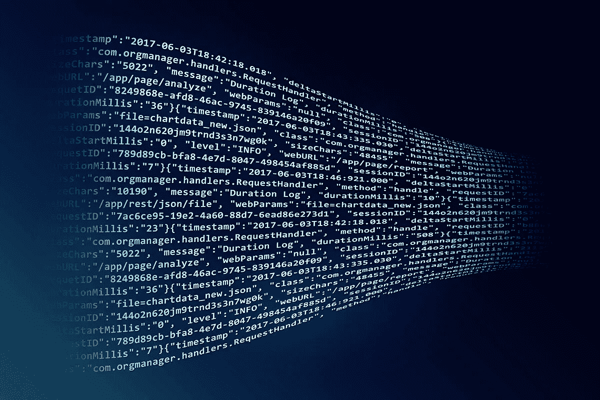
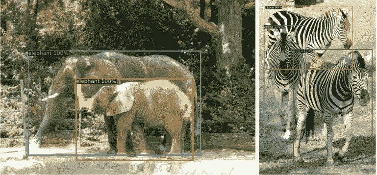
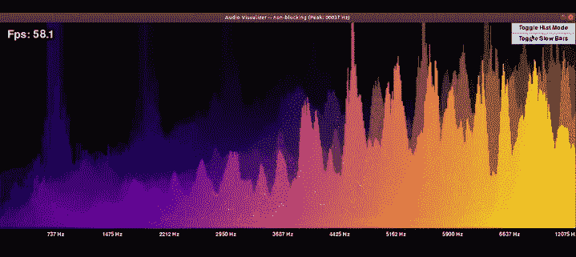

# 给面试官留下深刻印象的五大开源项目

> 原文：<https://blog.devgenius.io/top-5-open-source-projects-to-impress-your-interviewer-e4713ae46df5?source=collection_archive---------10----------------------->

以下是我列出的最佳开源项目实践列表。

## 概述:

*   在你的数据科学简历上做些工作，并添加这些项目来使它变得更明亮。
*   从使用 TensorFlow 的实时人员移除**到**脸书人工智能的计算机视觉框架，我们将涵盖广泛的开源数据科学项目。

# 1.Text shot——一款出色的文本抓取 Python 工具

> 你有没有遇到过这样的问题，你想要一个图片或截图的文本，我知道有一些工具可以解决这个问题，但是我不想在我的机器上安装任何额外的软件！
> 
> 现在，我们可以简单地使用 TextShot 从图像中获取文本，这是一个很好的工具，可以快速收集我们数据科学项目所需的任何文本数据。下面是 TextShot 工作原理的演示:

> TextShot 要求你在机器上安装谷歌的宇宙魔方。

# 2.OpenAI 的 GPT-3——大型 NLP 版本！

> OpenAI 又做到了！在去年发布 GPT-2 并激起媒体对它的狂热之后，他们开源了他们最新的自然语言处理(NLP)框架——GPT-3！
> 
> 简单地说，GPT-3 是同类中最大的 NLP 模型。它有 1750 亿个参数(是的，你没看错)，而且大小非常大，几乎有 350GB。GPT-3 几乎是历史上最昂贵的模型之一(大约花费了 1200 万美元来训练)。

> 众所周知，语言模型需要大量数据来训练人类可以在几秒钟内完成的任务。站出来——GPT 三号。在关于 GPT-3 如何在引擎盖下工作的官方论文中，OpenAI 展示了扩大语言模型如何大大提高任务不可知和少数镜头的性能。
> 
> 现在，这可能是许多数据科学伦理人士关注的部分——GPT-3 可以轻松地生成新闻文章的样本，人类将很难识别这些样本为假新闻。在当今相互关联的世界，这可能是灾难性的。为 OpenAI 说句公道话，他们已经在论文中解决了这个问题。

# 3.使用张量流的实时人物去除

> 在过去一年左右的时间里，实时物体检测已经真正加快了步伐。我喜欢我们可以使用实时对象检测设计的不同应用程序，例如在比赛中跟踪足球或球员。
> 
> 现在这里有一个非常酷的好莱坞级计算机视觉项目——使用深度学习实时将人从复杂的背景中移除！这个项目的开发者已经使用 TensorFlow 建立了他们的模型。

> 这是在网络浏览器中实时完成的！这就是 TensorFlow.js 的美妙之处，我上面链接的 GitHub 库包含了在你自己的机器上实现项目的代码。

# 4.脸书艾氏检测变压器(DETR)

> 脸书·艾的《DETR》无疑是 5 月份发布的最有趣的开源项目。它在一周内积累了近 3000 颗星星的事实就很能说明问题。
> 
> DETR，检测变压器的缩写，可能是计算机视觉领域的变革者。该框架是解决目标检测问题的一种创新和有效的方法。DETR 速度极快，效率极高，是数据科学专业人士的梦想！

正如我们的常驻数据科学家 Prateek Joshi 所说:*“DETR 模型非常简单，你不需要安装任何库就可以使用它。借助于基于变换器的编码器-解码器架构，DETR 将对象检测问题视为直接集预测问题。”*

> 你也可以看看脸书人工智能团队发布的 [Colab 笔记本](https://colab.research.google.com/github/facebookresearch/detr/blob/colab/notebooks/detr_demo.ipynb)，看看 DETR 模型的运行情况。

# 5.使用 PyAudio 进行实时音频分析

这个开源数据科学项目是我个人的最爱。这个 Python 库由前两次 DataHack 峰会上受人尊敬的演讲者史云光·斯廷布鲁格(Robert Steenbrugge)创建并发布，使我们能够执行实时音频分析。

正如史云光在他的 GitHub 知识库中所说的，这是:*“一个用原生 Python 做实时音频分析的简单包，使用 PyAudio 和 Numpy 从现场音频流中提取并可视化 FFT 特征。”*

> FFT 在这里代表快速傅立叶变换。它是您数据科学技能组合中的一个出色工具，因为它可以解决您可以处理的广泛问题。我鼓励你在这里查看更多关于 FFT 的内容。
> 
> 我们肯定会尝试 PyAudio 和史云光在分析 Vidhya 的工作。我们的许多数据科学成员都是重度音乐听众，他们迫不及待地投入到这个开源项目中。

# 呼吁采取行动

> 在这个时代，编程是一项与原始时代生火和狩猎一样重要的技能。这并不是说一个没有这种技能的人将注定失败，这只是意味着拥有这种技能的人将会占据主导地位并取得成功。这就像喝了一种特殊的药水，赋予你神奇的力量或者被闪电击中，被赋予超高速。鉴于编码给我们的世界带来的影响，以及它使之成为可能的技术，编码应该被视为一种超级力量。

# 行动计划

> 1.如果你是一个完全的初学者，首先选择一种编程语言。
> 
> 2.参加像#100DaysofCode 这样的挑战，它可以给你作为一个完全的初学者开始编码的动力，并继续编码。或者你可以找个朋友和你一起编码。
> 
> 3.从上面的列表中选择一两个，找到适合自己的，坚持到最后。
> 
> 4.卡住的时候不要看对答案，什么都学不到。相反，确保你做对了基础，然后再尝试挑战。
> 
> 5.加入 Reddit、Discord 等社区，提出问题。
> 
> 6.安装一个 IDE 来解决一些问题，或者使用 Jupyter 笔记本。

今天开始编码永远不会太晚。如果你已经是一名程序员，或者是这个领域的专家，那么恭喜你，我希望你在你的旅程中蒸蒸日上！

我希望你发现这个列表是有用的，并且我已经激励你开始编码。

感谢阅读，并保持安全！