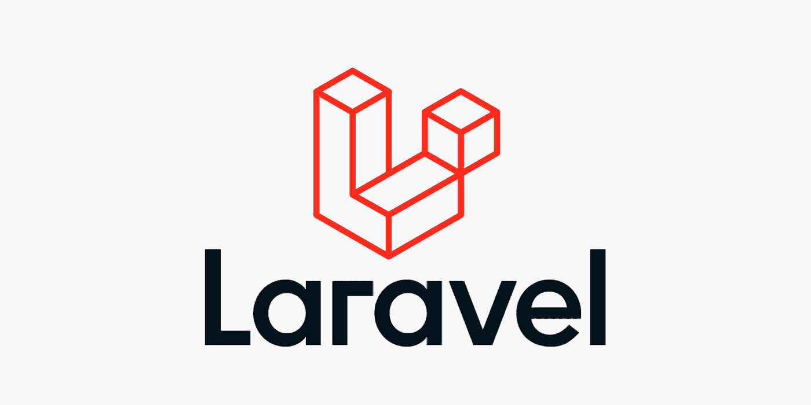
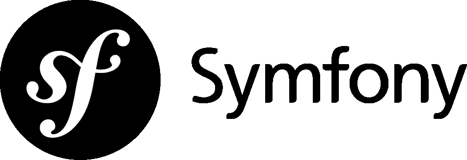
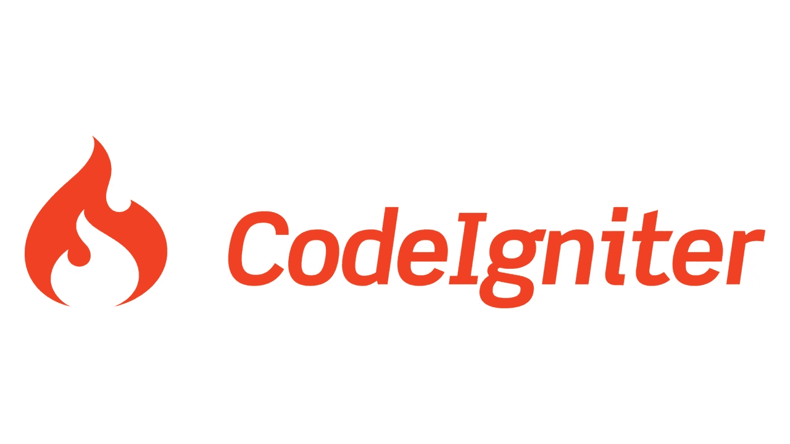
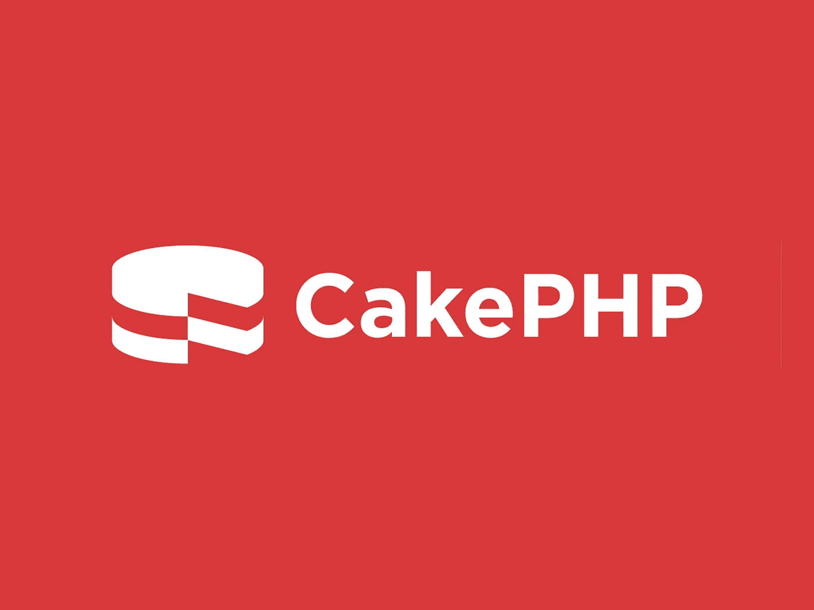
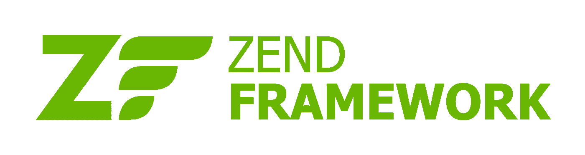

# 截至 2021 年的前 5 大 PHP 框架

> 原文：<https://blog.devgenius.io/top-5-php-frameworks-as-of-2021-a7f61cb3934e?source=collection_archive---------3----------------------->

有很多 PHP 开发框架，但是你需要选择哪一个呢？为什么？好吧，让我们在这个博客中探索所有这些吧！

[安德鲁·尼尔](https://unsplash.com/@andrewtneel?utm_source=medium&utm_medium=referral)在 [Unsplash](https://unsplash.com?utm_source=medium&utm_medium=referral) 上拍照

***注:*** *这里写的东西都是自以为是。我已经给了你几乎所有选择框架的信息。这完全取决于你的需求，你的项目的复杂性，等等。所以，请在选择框架之前做出明智的决定。*😀

***嗯，如果你正在考虑学习 PHP，请查看我的文章—*** [***你是否应该在 2021 年学习 PHP***](/is-it-worth-learning-php-in-2021-or-in-2022-1a2ee0e30040)***。***

# 前 5 名名单📃

*   [*拉勒韦尔*](https://laravel.com/)
*   [Symfony](https://symfony.com/)
*   [*CodeIgniter*](https://codeigniter.com/)
*   [*CakePHP*](https://cakephp.org/)
*   [*Zend 框架/层板项目*](https://framework.zend.com/)

# 拉勒韦尔

[Laravel 图标](https://laravel.com/)

哦，关于 [Laravel](https://laravel.com/) 毫无疑问。它是世界上使用最多、最流行的 PHP 框架。它是由泰勒·奥特威尔于 2011 年 6 月创建的。这种创作的主要目的是因为 CodeIgniter 缺乏身份验证。Laravel 以其超级简单的语法、快速的开发时间、易于理解的框架等而闻名。

## Laravel 的特点

*   非常全面。它几乎包括了构建复杂 web 应用程序的所有方面。
*   易于理解，开发时间相对较少。
*   Laravel 拥有并提供安全特性，如加密、哈希、认证和授权、密码重置等。
*   Laravel 有很大的社区和论坛，帮助各个层次的程序员。

# Symfony

[Symfony 图标](https://symfony.com/)

Symfony 是 Laravel 的竞争对手 PHP 框架。显然，它正在努力赶上拉勒维尔。它于 2005 年 10 月 18 日启动。它到来的主要目的是构建健壮的应用程序，将完全控制权交给开发人员，并高效地维护应用程序。

## Symfony 的特点

*   使用 Symfony 的主要优点是它提供了对几乎所有数据库的支持。这真的很神奇，是处理大数据的绝佳选择。
*   我认为它是最值得开发人员钦佩的框架，因为它有着奇妙而优雅的文档。
*   Symfony 有自己的内置测试功能，这对开发者来说是一个巨大的优势。
*   Symfony 有很多软件包，集成它们很容易。

# 代码点火器

[CodeIgniter 图标](https://codeigniter.com/)

***传说来了！*** 😎

曾几何时，它是世界上最流行、最顶尖的框架。随着 PHP 的出现， [CodeIgniter](https://codeigniter.com/) 的发布空前火爆。这就像扔在编程世界的原子弹，每个人都很快开始采用它。但是，它逐渐退出了舞台，现在正在努力保持它的知名度。就我个人而言，我真的很喜欢在里面工作，太棒了！

## CodeIgniter 的特点

*   它非常轻便，很容易上手。
*   CodeIgniter 最出名的是它的速度和灵活性。
*   CodeIgniter 在著名的 MVC 架构上工作。
*   拥有大量的社区和论坛来寻求帮助。
*   与其他框架相比，它提供了相当不错的安全特性。

# CakePHP🍰

[CakePHP 图标](https://cakephp.org/)

听说过 CRUD 操作吗？CakePHP 最广为人知的是 CRUD 框架，它比其他任何框架都更容易执行 CRUD 操作。CakePHP 于 2005 年 4 月推出。它简单易学，适合初学者。哦，别忘了，我们可以构建复杂的应用程序！作为 CodeIgniter，CakePHP 是轻量级的，很容易上手。

## CakePHP 的特点

*   CRUD 框架。
*   部署项目需要最少的配置。
*   CakePHP 的开发过程快速而干净。
*   它包含最需要的安全功能，如密码哈希，加密，SQL 注入，CSRF 和 XSS 保护。

# Zend 框架/层板项目

[Zend 框架图标](https://framework.zend.com/)

[Zend 框架](https://framework.zend.com/)是一个相当成熟的框架。它现在正在向 Laminas 项目过渡。它以其面向对象的体系结构而闻名。Zend 于 2006 年 3 月推出，现在已经获得了大量用户，尤其是企业用户。它以即插即用的组件特性而闻名。目前，海带进展顺利！

## Zend/纹层的特征

*   他们正在努力改进海带，所以希望有新的功能。
*   流行面向对象的即插即用组件方法。
*   深受企业用户欢迎。
*   由于它的 PHP Framework Interop Group(PHP-FIG)标准，Laminas 项目可以很容易地移植到其他框架。

# 荣誉奖

下面是一些非常流行的 PHP 开发框架，你可能会感兴趣:

*   [Yii](https://www.yiiframework.com/)
*   [*费尔康*](https://phalcon.io/en-us)
*   [*FuelPHP*](https://fuelphp.com/)
*   [*苗条*](https://www.slimframework.com/)
*   [*PHPixie*](https://phpixie.com/)

# 结论

因此，总而言之，我认为我们不能直截了当地为任何人提出一个框架。这实际上取决于您的需求、部署时间、开发预算、您的团队、客户谈判等。因此，要选择一个框架，你必须完全了解它在数据库、ORM、MVC 架构、面向对象范例和命令行等方面的能力。

我希望这篇博客能帮助你获得一些关于顶级 PHP 开发框架的想法。如果这个博客对你有所帮助，给了你一些见解，请给我一个👏和分享🔗这个博客。谢谢您们。😁

***你也可以通过我联系到我的***[***LinkedIn***](https://www.linkedin.com/in/hanoak/)***和***[***Twitter***](https://twitter.com/_hanoak)***的手柄，让我们互相交流，互相帮助。***

*快乐编码，*再见！