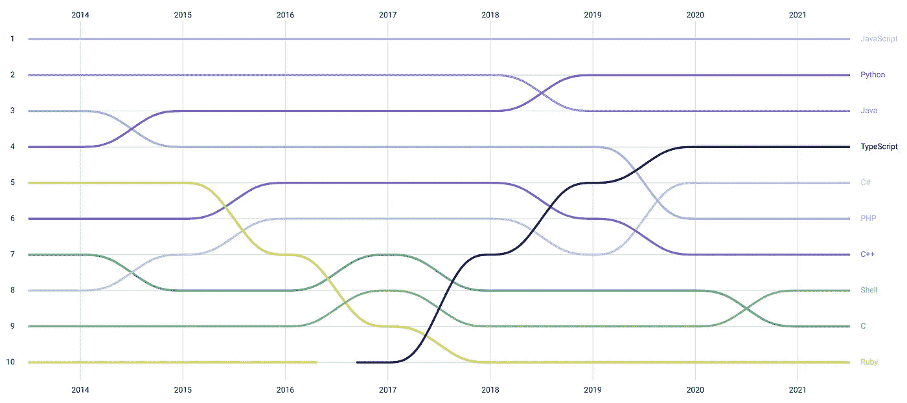
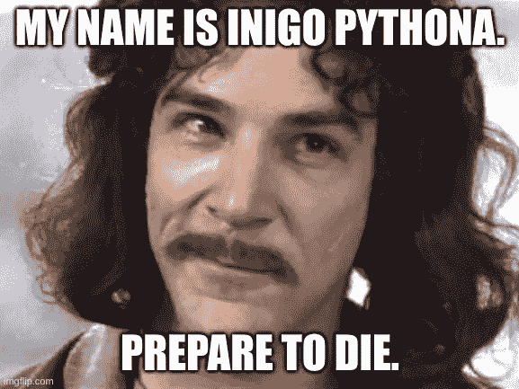

# 2022 年最值得学习的 5 种编程语言

> 原文：<https://blog.devgenius.io/top-5-programming-languages-to-learn-in-2022-2deb866e7bb3?source=collection_archive---------6----------------------->

随着新的一年到来，新的一批开发人员和大公司的新的后代出现了，趋势改变了，新的语言诞生了，一些旧的语言消亡了。

# TL；速度三角形定位法(dead reckoning)

1.  以打字打的文件
2.  计算机编程语言
3.  Java 语言(一种计算机语言，尤用于创建网站)
4.  去
5.  科特林

# 1.以打字打的文件

TypeScript 是更好的 JavaScript。它不是这个头衔的唯一竞争者，但它是由微软创立，由谷歌提出的。

历年顶级语言，GitHub Octoverse

GitHub Octoverse 显示，TypeScript 在过去几年中获得了如此大的人气，以至于自 2017 年进入十大最受欢迎的语言环(将 Objective-C 踢出)以来，仅用了 3 年时间就征服了第四名。

继续努力，如果它最终取代浏览器世界的 JavaScript，我不会感到惊讶。它已经征服了 Node.js 的最初开发者 Ryan Dahl 的心，制作了 Node.ts(又名 Deno)。此外，JavaScript 正在适应越来越多的类型脚本标准，以至于很难区分用它们编写的代码。考虑到所有这些，不难想象浏览器在未来的某个时候会开始支持 TypeScript。即使他们不这样做，你也可以把你的 TS 代码转换成 JS。

# 2.计算机编程语言

这个老畜生比我大两个月(准确的说是两个月零九天)。他在 20 多岁时做得非常好，现在正与伟大的 JavaScript 之王展开肉搏，争夺 Octoverse 的第一名。

Python 发展的主要原因是它的简单和多用途。Python 现在是任何名称中有“数据”的标准语言，它是一种后端开发语言，也是一种脚本语言。Ubuntu 预装了 Python，因此可以将它作为 BASH 的一个可读性更好的替代品。简单易学，所以成为学习编程的标准语言(通过干掉 BASIC 和 Pascal)。而且它是一个更好的 Excel，所以让我们希望它尽快杀死 Excel。

所以，Python 是一门适合所有人的语言。系统管理员、数据科学家或印度的基督教传教士。

# 3.Java 语言(一种计算机语言，尤用于创建网站)

我开始使用 Java 时，它的最新版本是 7，“海豚”。这是一个更差的 C++，有一个 C++所没有的新颖的包管理器，但是非常痛苦。它是编译语言，但是它编译成了无用的东西，只有 Java 的运行时才能执行。不幸的是，有一些原因使它没有消亡:

*   它得到了大量狂热者的支持，他们认为这是有史以来最好的语言，也可能是最好的语言，一种统治所有人的语言。
*   他们不再给 Java 版本起蹩脚的名字，它开始变得更好，特别是随着 lambdas 和 streams 的引入，我相信这是受 Scala 的存在的启发。
*   安卓发生了。我希望科特林在这方面能有所帮助。
*   我之前提到的那些狂热分子围绕这种语言创造了一个巨大的生态系统。
*   春天来了。然后是 Spring Boot。
*   微软做了一个 Java 的副本，叫它 C#。

考虑到所有这些，Java 正在失去其作为 Python 的主要数据语言的角色，我们可以在 Octoverse 图中看到 Python 取代了 Java。尽管有 Kotlin，但它仍然是 Android 的主要语言，并且它仍然非常强烈地用于 web 开发，因为它的竞争对手(Node.js 和 Python)大多是解释型语言，速度较慢。唯一的例外是围棋，它仍然没有那么受欢迎。但是会的！

# 4.去

Go 是谷歌在 2007 年开发的，用于他们的大规模后端，具有内置的并发性。设计 Go 的主要动机是他们不喜欢 C++。C++语言当时已经变得过于繁琐，不太适合开发后端服务。

在这方面，围棋是下一个 C，但方向不同。它保持了 C 语言的简单性和极简性，同时又具有 web 服务所必需的特性。它被输入、编译，并且有一个内置的包管理器。但是，它有一个垃圾收集器来使它更方便，有内存安全，并且缺少指针算法，这都是有充分理由的。

众所周知，一个人可以在一天之内学会围棋，如果不这样做就太可惜了。

# 5.科特林

我对 Kotlin 没有足够的经验来写它，就像我对列表中的前 3 项所做的那样。但是，到目前为止，科特林的表现非常出色。随着 Android 向 Kotlin 发展，它将有更多的机会更加繁荣，并最终取代 Java。

# 结论

TypeScript 将会更加流行。NPM 已经完全支持它，并且提供了许多 JavaScript 包，还附带了一些 TypeScript 元数据。Python 至少还会流行十年。而且 Java 至少还会在前 10 名呆 5 年，虽然我不喜欢。Go 将保持目前的流行，但它将成为系统应用程序的首选语言。Kotlin 有望在未来几年降低 Java 的受欢迎程度。希望 5 年后当我写同样的文章时，Java 已经不在了，那是因为 Kotlin。

值得一提的是 **Rust** ，它很可能不会被广泛使用，但仍然值得学习。我仍然不确定**飞镖**，但我们会在来年看到这一点。