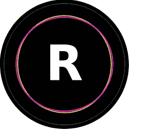

# 下一个 React 项目的前 5 个 ReactJS 组件库

> 原文：<https://blog.devgenius.io/top-5-reactjs-component-libraries-for-your-next-react-project-db101e400ac0?source=collection_archive---------2----------------------->

反应堆

在中型或大型项目中使用组件库变得很平常，特别是如果您有一个非常复杂的 UI，并且在过去几年中 ReactJS 组件库的数量已经增长了很多，今天我们将讨论我个人以前使用过的最好的 5 个 ReactJS 组件库，重要的是要注意下面列出的所有库没有任何特定的顺序。

# 1.材料用户界面:

Material UI 是一个 React 组件的集合，用于更快、更容易的 web 开发，它还可以帮助开发人员构建自己的设计系统。Material UI 使用了 google Material 设计模式和指南，所以，如果你是 material 设计爱好者之一，你不会后悔看一看它。

材质-UI 反应

# 2.反应引导:

如果你是一名 web 开发人员(尤其是前端开发人员)，你可能已经知道或者至少听说过 [Bootstrap](https://getbootstrap.com/) ，而 [React-Bootstrap](https://react-bootstrap.github.io/) 就是它的 React 实现。React-Bootstrap 是我最喜欢的组件库，当谈到用 React 开发 UI 时，它易于使用并且非常灵活，我肯定会推荐它。

反应引导

# 3.Sematic-UI 反应:

像 React- Bootstrap 一样， [Semantic-UI React](https://react.semantic-ui.com/) ，是 [Semantic-UI](https://semantic-ui.com/) CSS 库的 ReactJS 实现，它也非常灵活和易于使用，并为您提供许多有趣的功能，使开发人员更容易开发他们自己的设计系统。

语义 UI 反应

# 4.React 的蚂蚁设计:

[React](https://ant.design/docs/react/introduce)的 Ant Design，是一个遵循 Ant Design 规范的 ReactJS 组件库，它是一组开箱即用的高质量 React 组件，它有许多有趣的功能，如对几十种语言的国际化支持、每个细节中强大的主题定制等等。

蚂蚁设计反应

# 5.Rebass:

最后但同样重要的是， [Rebase](https://rebassjs.org/) ，一个用样式化系统构建的 React 原始 UI 组件，在用 ReactJS 开发 UI 时是一个很有价值的选择，它有许多设计良好的 UI 组件，可以帮助您不费吹灰之力就创建出令人敬畏的 UI。

Rebase 反应

最终，我希望这篇短文能赢得您的赞赏，并感谢您的关注。