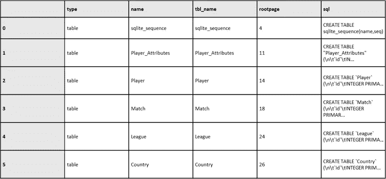
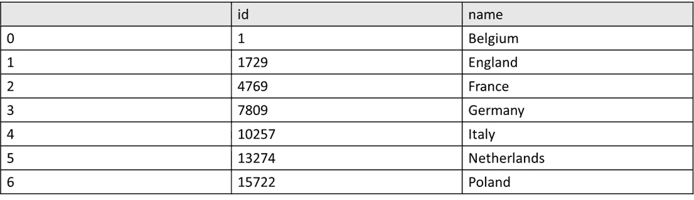
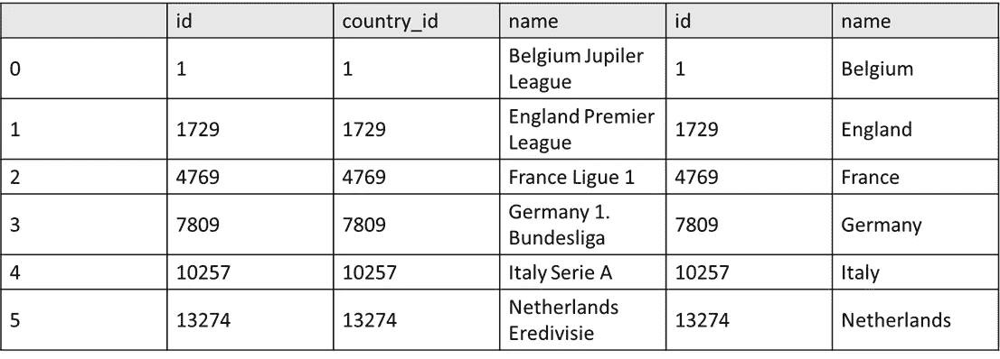
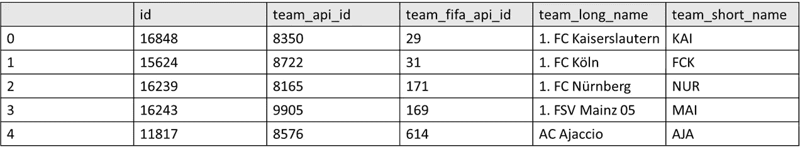
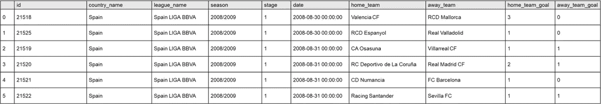
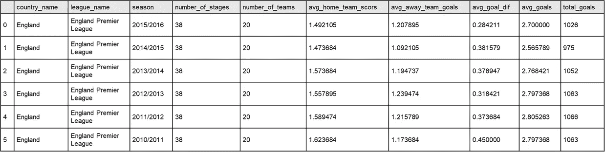
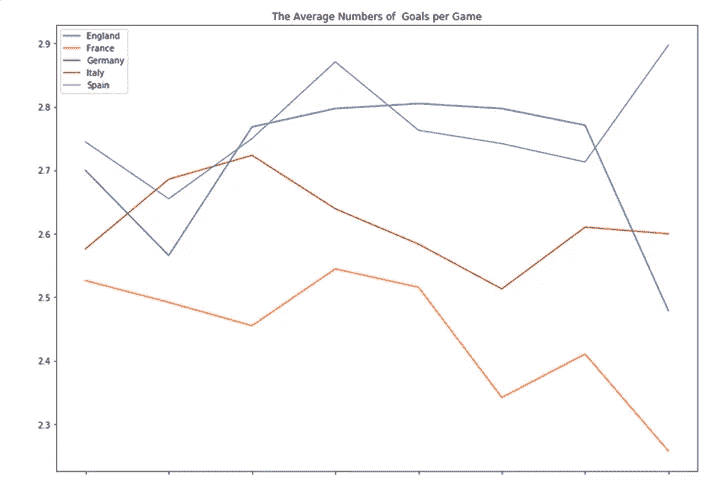

# 数据工程师的 5 大 SQL 命令

> 原文：<https://blog.devgenius.io/top-5-sql-commands-for-data-engineers-5258afd936dd?source=collection_archive---------16----------------------->

## 你需要在 2022 年掌握


《穿越红海》创世纪人工对抗 NFT [系列](https://artspaces.kunstmatrix.com/en/exhibition/10702025/genesis-artificial-adversarial-network-gaan)菲利普·布阿齐兹

作为数据工程师，SQL(结构化查询语言)是管理和操作存储在关系数据库管理系统(RDBMS)中的数据的重要工具。

SQL 是一种概念性语言，用于处理存储在数据库中的数据。在我们的例子中，SQLite 是具体的实现。在这个用户案例中，我们将使用 SQLLite 来编写查询。数据表设计是使用数据库时的一个关键步骤。在许多情况下，数据库被分成许多存储在不同位置的表。

在这篇博文中，我们将介绍对数据工程师最有用的五个 SQL 命令:

**1。选择**

该命令用于从数据库中检索数据。它允许您指定要检索的列和行，并应用各种过滤器和条件来优化结果。

```
#Imports

import pandas as pd 
import sqlite3
import matplotlib.pyplot as plt

#Insert path here

path = "../input/"  
database = path + 'database.sqlite'
```

查询很简单，我们需要创建一个到数据库的连接，并按如下方式检查表:

```
db = sqlite3.connect(database)

tables = pd.read_sql("""SELECT *
                        FROM sqlite_master
                        WHERE type='table';""", db)
tables
```



足球联赛表(图片由作者提供)

我们现在可以检查我们的数据集，您可以在这里找到关于这个[开源](https://opendatacommons.org/licenses/odbl/1-0/)数据集[的更多细节](https://www.kaggle.com/datasets/hugomathien/soccer):

```
countries = pd.read_sql("""SELECT *
                        FROM Country;""", db)
countries
```



足球联盟国家(图片由作者提供)

**2。加入**

在 SQL 中，联接是一种基于两个或多个表之间的相关列来组合它们中的行的方法。SQL 中有几种可用的连接类型，包括:

a.内部连接:这种连接只返回两个表中匹配的行。例如,“customers”表和“orders”表之间的“customer_id”列的内部联接将只返回两个表中都存在“customer_id”的行。

b.外部联接:这种类型的联接返回两个表中的所有行，包括在另一个表中不匹配的任何行。有三种类型的外部联接:左联接、右联接和完全外部联接。

c.交叉连接:这种类型的连接返回两个表中行的所有可能的组合。它也称为笛卡尔连接。

以下是 SQL 中内部联接的一个示例:

```
SELECT c.*, o.*
FROM customers c
INNER JOIN orders o
ON c.customer_id = o.customer_id
```

此示例将返回“customers”和“orders”表中“customer_id”列匹配的所有行。结果表将包括“客户”和“订单”表中的所有列。

现在让我们尝试一个更复杂的“足球”数据集:

在我们的用户案例中，最常见的是:

*   (内部)联接-仅保留两个表中符合条件(on 之后)的记录，以及两个表中的记录
*   左连接-保留第一个(左)表中的所有值，以及右表中的匹配行。右表中的列，如果在左表中没有匹配的值，就会有空值。
*   指定用于连接表的公共值(在这种情况下是国家的 ID)。
*   在我们的例子中，它是 country . id。league . country _ id 不是唯一的，每个国家可以有多个联赛。

```
leagues = pd.read_sql("""SELECT *
                        FROM League
                        JOIN Country ON Country.id = League.country_id;""", db)
leagues
```



足球联赛新表格(图片由作者提供)

**3。排序依据**

SQL 中的 ORDER BY 子句用于按升序或降序对 SELECT 语句的结果进行排序。默认情况下，ORDER BY 子句按升序对结果进行排序。要按降序对结果进行排序，可以使用 DESC 关键字。

以下是在 SQL 中使用 ORDER BY 子句的示例:

```
SELECT *
FROM customers
ORDER BY last_name ASC, first_name ASC
```

此示例将返回“customers”表中按“last_name”列升序排序，然后按“first_name”列升序排序的所有行。

您还可以在 SELECT 语句中指定一个特定位置，用作排序键。例如:

```
SELECT last_name, first_name
FROM customers
ORDER BY 1 ASC, 2 ASC
```

此示例将从“customers”表中返回“last_name”和“first_name”列，先按“last_name”列升序排序，然后再按“first_name”列升序排序。

还可以将 ORDER BY 子句与 LIMIT 子句结合使用，以返回按特定顺序排序的一定数量的行。

```
SELECT *
FROM customers
ORDER BY last_name DESC
LIMIT 10
```

此示例将返回“customers”表中按“last_name”列降序排序的前 10 行。

让我们在下面的代码中尝试使用我们的足球联盟数据集:

```
teams = pd.read_sql("""SELECT *
                        FROM Team
                        ORDER BY team_long_name
                        LIMIT 5;""", db)
teams
```



足球联赛按功能排序(图片由作者提供)

**4。作为**

在 SQL 中，AS 关键字用于为列或表达式提供一个临时名称。这通常用于使结果表更易于阅读，或者为复杂的表达式起一个更有意义的名字。

以下是在 SQL 中使用 AS 关键字的示例:

```
SELECT c.first_name || ' ' || c.last_name AS full_name, o.order_date
FROM customers c
JOIN orders o
ON c.customer_id = o.customer_id
```

在此示例中，AS 关键字用于为表达式“c.first_name || ' ' || c.last_name”提供临时名称“full_name”。结果表将包括“全名”和“订单日期”列。

还可以使用 AS 关键字在 SELECT 语句中重命名列:

```
SELECT c.customer_id AS id, c.first_name, c.last_name
FROM customers c
```

在此示例中，AS 关键字用于将“customer_id”列重命名为“id”。

值得注意的是，AS 关键字在大多数 SQL 方言中是可选的。只需指定临时名称或新列名称，而不使用 AS 关键字，就可以获得相同的结果。但是，使用 AS 关键字可以使您的 SQL 语句更易读、更容易理解。让我们尝试重命名足球数据集中的一些列:

这里我们需要把关于两个不同值的信息(home_team_api_id，away_team_api_id)连接到同一个表中。

```
dt_matches = pd.read_sql("""SELECT Match.id, 
                                        Country.name AS country_name, 
                                        League.name AS league_name, 
                                        season, 
                                        stage, 
                                        date,
                                        HT.team_long_name AS  home_team,
                                        AT.team_long_name AS away_team,
                                        home_team_goal, 
                                        away_team_goal                                        
                                FROM Match
                                JOIN Country on Country.id = Match.country_id
                                JOIN League on League.id = Match.league_id
                                LEFT JOIN Team AS HT on HT.team_api_id = Match.home_team_api_id
                                LEFT JOIN Team AS AT on AT.team_api_id = Match.away_team_api_id
                                WHERE country_name = 'Spain'
                                ORDER by date
                                LIMIT 5;""", db)
dt_matches
```



足球联赛的功能(图片由作者提供)

**5。分组依据**

在 SQL 中，GROUP BY 子句用于按一列或多列对 SELECT 语句的结果进行分组。GROUP BY 子句通常与 COUNT、AVG、SUM 和 MAX 等聚合函数结合使用，对分组数据执行计算。

以下是在 SQL 中使用 GROUP BY 子句的示例:

```
SELECT COUNT(*), customer_id
FROM orders
GROUP BY customer_id
```

此示例将返回每个 customer_id 的所有订单的计数。结果表将包括两列:“COUNT(*)”和“customer_id”。

您也可以对多列使用 GROUP BY 子句:

```
SELECT COUNT(*), customer_id, order_date
FROM orders
GROUP BY customer_id, order_date
```

在此示例中，结果将按“customer_id”和“order_date”列进行分组。

还可以将 HAVING 子句与 GROUP BY 子句结合使用，根据指定的条件筛选分组结果。

```
SELECT COUNT(*), customer_id
FROM orders
GROUP BY customer_id
HAVING COUNT(*) > 5
```

此示例将返回每个 customer_id 的所有订单的计数，但仅针对下了 5 个以上订单的客户。

需要注意的是，GROUP BY 子句必须用在 SELECT 和 WHERE 子句之后，ORDER BY 子句之前。

让我们将这些知识应用到我们的足球分析数据集:

```
leages_by_season = pd.read_sql("""SELECT Country.name AS country_name, 
                                        League.name AS league_name, 
                                        season,
                                        count(distinct stage) AS number_of_stages,
                                        count(distinct HT.team_long_name) AS number_of_teams,
                                        avg(home_team_goal) AS avg_home_team_scors, 
                                        avg(away_team_goal) AS avg_away_team_goals, 
                                        avg(home_team_goal-away_team_goal) AS avg_goal_dif, 
                                        avg(home_team_goal+away_team_goal) AS avg_goals, 
                                        sum(home_team_goal+away_team_goal) AS total_goals                                       
                                FROM Match
                                JOIN Country on Country.id = Match.country_id
                                JOIN League on League.id = Match.league_id
                                LEFT JOIN Team AS HT on HT.team_api_id = Match.home_team_api_id
                                LEFT JOIN Team AS AT on AT.team_api_id = Match.away_team_api_id
                                WHERE country_name in ('Spain', 'Germany', 'France', 'Italy', 'England')
                                GROUP BY Country.name, League.name, season
                                HAVING count(distinct stage) > 10
                                ORDER BY Country.name, League.name, season DESC
                                ;""", db)
leages_by_season
```



足球联赛分组和功能(图片由作者提供)

为了更好地理解这个新数据集，我们来做一些分析:

```
df = pd.DataFrame(index=np.sort(leages_by_season['season'].unique()), columns=leages_by_season['country_name'].unique())

df.loc[:,'Spain']   = list(leages_by_season.loc[leages_by_season['country_name']=='Spain','avg_goals'])
df.loc[:,'France']   = list(leages_by_season.loc[leages_by_season['country_name']=='France','avg_goals'])
df.loc[:,'Italy']   = list(leages_by_season.loc[leages_by_season['country_name']=='Italy','avg_goals'])
df.loc[:,'England']   = list(leages_by_season.loc[leages_by_season['country_name']=='England','avg_goals'])

df.plot(figsize=(14,10),title='The Average Numbers of  Goals per Game')
```



足球联盟分析(图片由作者提供)

**总结**

以下是每个 SQL 子句最常见顺序的简要总结:

1.  SELECT:SELECT 子句用于指定要从数据库中检索的列。
2.  FROM:FROM 子句用于指定要从中检索数据的一个或多个表。
3.  JOIN:JOIN 子句用于根据两个或多个表之间的相关列来组合它们的行。SQL 中有几种类型的连接，包括内部连接、外部连接和交叉连接。
4.  WHERE:WHERE 子句用于对 SELECT 语句的结果应用过滤器。它允许您指定要将某一行包含在结果中所必须满足的条件。
5.  GROUP BY:GROUP BY 子句用于按一列或多列对 SELECT 语句的结果进行分组。它通常与 COUNT、AVG、SUM 和 MAX 等聚合函数结合使用。
6.  HAVING:HAVING 子句用于根据指定的条件过滤 SELECT 语句的分组结果。它与 GROUP BY 子句一起使用。
7.  ORDER BY:ORDER BY 子句用于按升序或降序对 SELECT 语句的结果进行排序。
8.  LIMIT:LIMIT 子句用于限制 SELECT 语句返回的行数。它通常与 ORDER BY 子句结合使用，以返回按特定顺序排序的一定数量的行。

最后，我们需要定义 SQL 中经常使用的子查询:

**SQL 子查询**

SQL 中，子查询是嵌套在另一个 SELECT、INSERT、UPDATE、DELETE 或 SET 语句中的 SELECT 语句。子查询通常用于从多个表中检索数据，或者对返回的数据执行计算。

以下是 SQL 中子查询的一个示例:

```
SELECT *
FROM customers
WHERE customer_id IN (SELECT customer_id
                     FROM orders
                     WHERE order_date > '2022-01-01')
```

在此示例中，子查询“SELECT customer_id FROM orders WHERE order_date > ' 2022–01–01 '”用于从 order _ date 在 2022 年之后的“orders”表中检索所有 customer _ id 值。然后，外部查询使用 IN 运算符，根据子查询结果中是否存在 customer_id 来筛选“customers”表中的行。

**结论**

SQL(结构化查询语言)是处理数据库的强大而必要的工具。它允许您创建、修改和查询数据库中的数据，以及控制对该数据的访问。从小型个人数据库到大型企业系统，SQL 被广泛应用。无论您是初学者还是有经验的数据库专家，学习和掌握 SQL 都是一项重要的技能。通过练习和坚持，您可以精通 SQL，并使用它来有效地管理和分析数据。

如有任何问题，欢迎在下方留言，继续探索:-)


Philippe Bouaziz (Pele)的“ArtemisMoonSuite”NFT[系列](https://opensea.io/collection/opensuite-project)(图片由作者提供)

如果你想支持请购买我的 [nft 的](https://opensea.io/collection/opensuite-project)或[产品](https://www.redbubble.com/people/PeleB/shop?asc=u)，关注并分享:-)