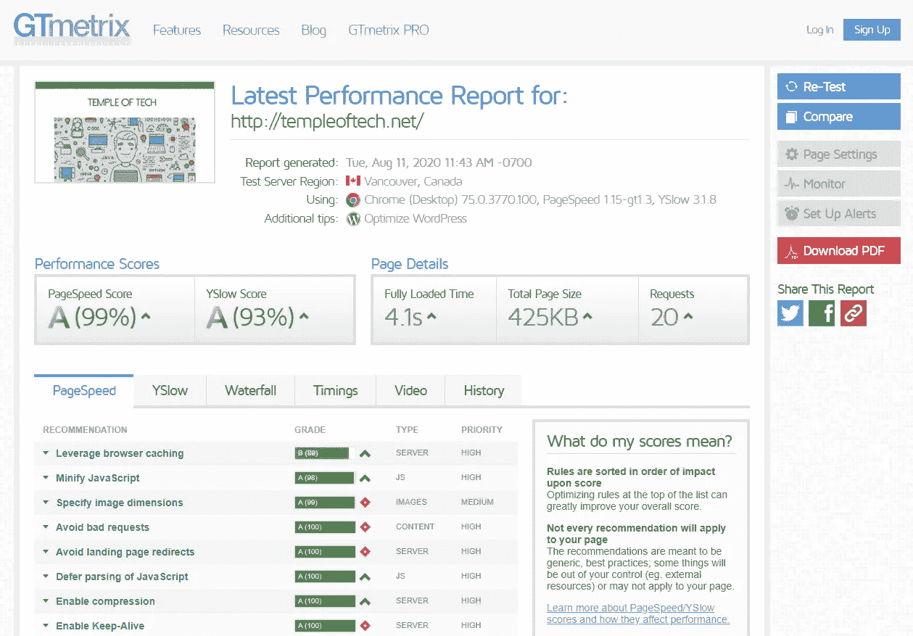
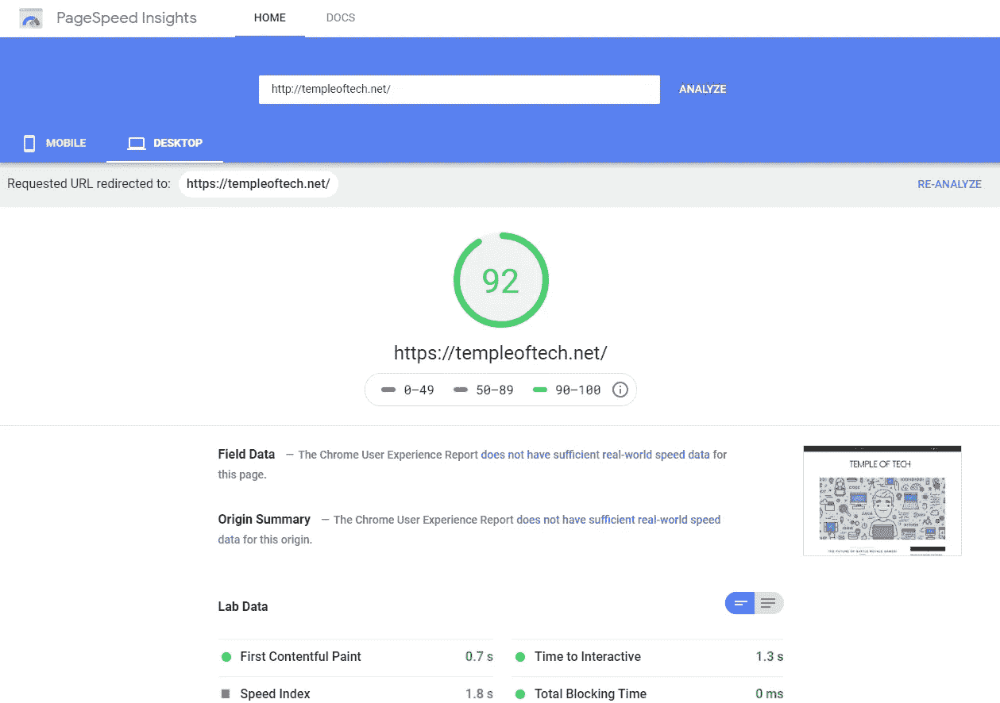

# 建设高性能网站的 5 大技巧

> 原文：<https://blog.devgenius.io/top-5-tips-on-building-high-performance-websites-45cf3d731aec?source=collection_archive---------9----------------------->

建立一个网站是一项艰巨的工作，它不仅仅是在网上托管一些文件就可以了。通常一个网站包括后端数据库、API、网络服务器和服务、后端服务，当然还有前端网页。在本文中，我将向您展示构建高性能、可伸缩网站的最佳实践。

研究表明，如果一个网站的加载时间超过 3 秒，用户往往会马上离开。这些信息应该作为年轻开发者尽快制作网站的动力。网站的表现对用户的参与和保持有着巨大的作用。网站性能是指网页在浏览器中下载、渲染和显示的速度。

潘卡杰·帕特尔在 [Unsplash](https://unsplash.com?utm_source=medium&utm_medium=referral) 上的照片

页面加载时间是指浏览器下载并显示网站全部内容所需的时间。除了平均页面加载时间，平均域名查找时间、平均重定向时间、平均服务器连接时间、平均服务器响应时间和平均页面下载时间也是衡量网站性能时需要考虑的因素。

# 未优化的网页

有些网站的页面没有得到适当的优化，这是其页面速度低的主要问题。这些设计不良的网页使得网站加载缓慢，并且反应迟缓。这种技术也称为前端优化。好消息是，通过简化 HTML、CSS 和 Web 控件来优化网页是很容易的。

**前端优化的十大关键行动:**

1.  清理 HTML 文档
2.  优化 CSS 性能
3.  减少外部 HTTP 请求
4.  缩小 CSS、JS 和 HTML
5.  启用预取
6.  通过 CDN 和缓存提高速度
7.  压缩您的文件
8.  优化您的图像
9.  使用简约的框架
10.  HTTPS 的安全网站

# 未优化的 SQL

拥有未优化的 SQL 查询是数据密集型 web 应用程序打开缓慢的最常见原因之一。没有编写最佳 SQL 查询经验的 Web 开发人员很容易给数据库服务器增加额外的压力。

Tobias Fischer 在 [Unsplash](https://unsplash.com?utm_source=medium&utm_medium=referral) 上拍摄的照片

很容易发现您的 SQL 查询是否有问题。你可以运行市场上的 SQL 优化工具。这些工具中的大多数都有关于如何修复 SQL 查询的建议。

**优化 SQL 的十大技巧:**

1.  避免在选择查询中使用“*”
2.  避免随意使用代码的复制粘贴
3.  避免在 Where 子句中使用函数
4.  避免在两种类型的列之间使用联接
5.  避免使用表中的 COUNT(*)来获取行计数
6.  联接表时避免使用 DISTINCT
7.  避免使用临时表
8.  避免使用触发器
9.  避免查询执行过程中的死锁
10.  避免在读取过程中使用锁

# 糟糕的数据库设计

糟糕的数据库设计会严重影响网站的性能。该数据库存储与网站相关的数据，可能包括图像、文件、大文本和原始数据。出于性能原因，必须正确设计数据库。

在 [Unsplash](https://unsplash.com?utm_source=medium&utm_medium=referral) 上拍摄的 [ThisisEngineering RAEng](https://unsplash.com/@thisisengineering?utm_source=medium&utm_medium=referral)

糟糕的数据库设计会影响 SQL 查询的性能。这可能是最难修复的组件。所有存储过程、SQL 查询、后端作业和数据层代码都是基于数据库表编写的。糟糕的表设计也意味着缓慢的 SQL 查询。

要修复一个糟糕的数据库设计，您可以雇佣一个专家 DBA，他可以分析您的数据库并帮助您优化表和查询。

# 错误的框架

有几种 web 框架可用于构建网站。一些最流行的 Web 开发框架或语言是 PHP、JavaScript、Angular、React 和 ASP.NET。虽然这些框架看起来很相似，但设计这些框架是有一定原因的。有些框架适合构建数据密集型应用程序，有些适合移动设备，有些更适合多种设备。

[斯科特·格雷厄姆](https://unsplash.com/@sctgrhm?utm_source=medium&utm_medium=referral)在 [Unsplash](https://unsplash.com?utm_source=medium&utm_medium=referral) 上拍照

每个框架都是为特定的目的而设计的。当设计你的网站时，你必须研究这些框架，确保选择最适合你需求的框架。

软件架构师和企业主犯的最大错误之一是，选择基于“你所知道的”的 Web 框架。这是 web 项目的基础。选择一个错误的框架意味着灾难。

# 硬件资源不足

如果网站流量很大，硬件资源可能是网站运行缓慢的原因。硬件资源包括处理器速度、硬盘速度、存储大小、内存、网络速度，甚至防火墙。

在 [Unsplash](https://unsplash.com?utm_source=medium&utm_medium=referral) 上[科学高清](https://unsplash.com/@scienceinhd?utm_source=medium&utm_medium=referral)拍摄的照片

大多数托管服务提供商都有工具来分析硬件资源的使用情况及其性能。当在一个共享的计划中，这可能会更频繁地发生，但是如果你在你的个人计划中，那么这对你来说不是问题。

# 如何测试你的网站性能？

网上有很多工具可以帮助你，它们真的很有帮助。一些最好的是免费的，他们提供了一些帮助提示，以了解什么是错的。我个人使用过许多帮助我完善网站的软件，我建议你也这样做。

[GTmetrix](http://gtmetrix.com) 真的很有见地，你可以得到一些关于页面速度的细节。我还使用了[谷歌的 PageSpeed Insights](http://developers.google.com/speed/pagespeed/insights) ，利用这两个工具，我能够找出我的网站的弱点，现在看看你自己下面的分数。

