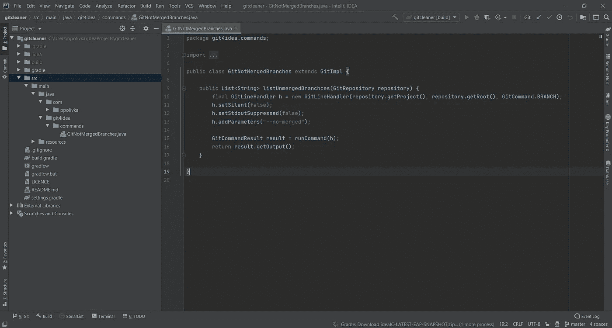
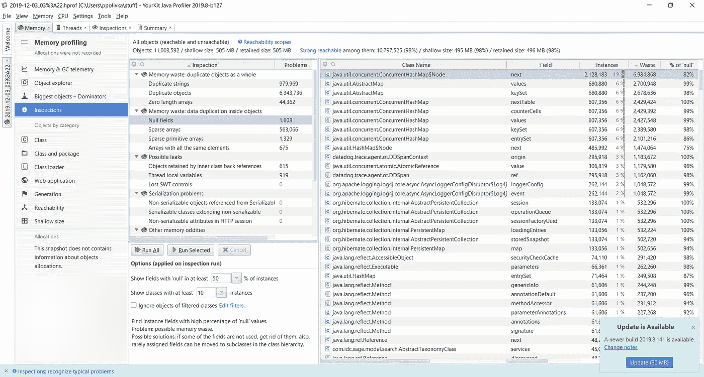
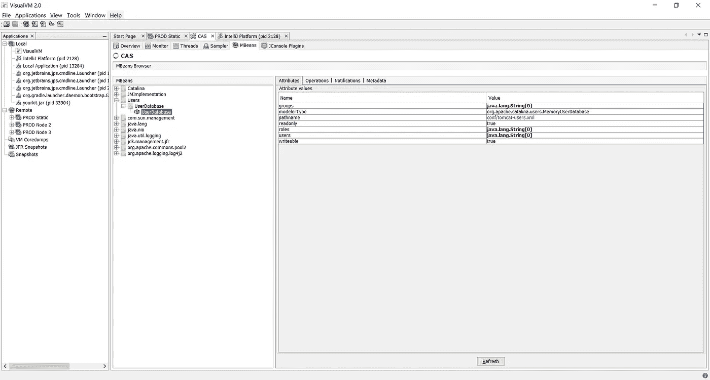
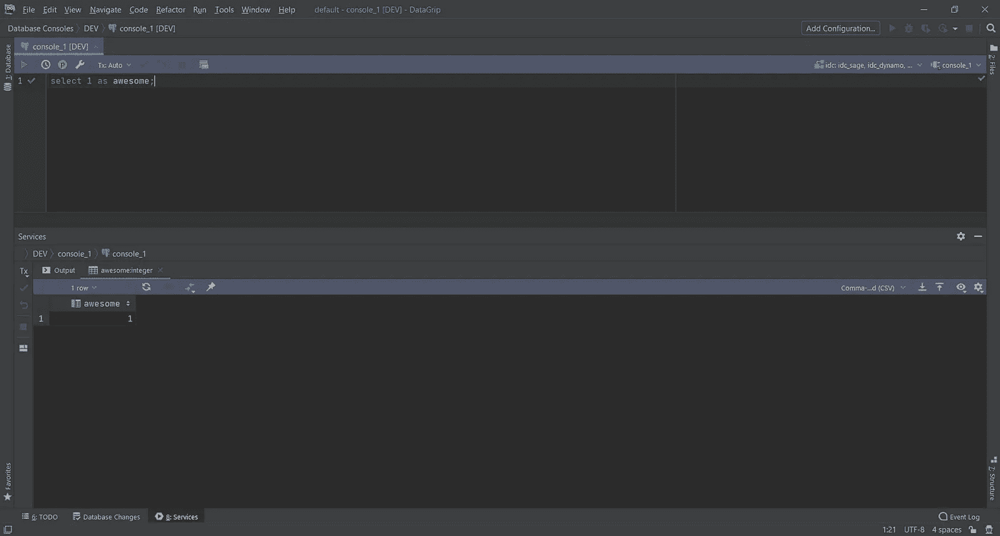
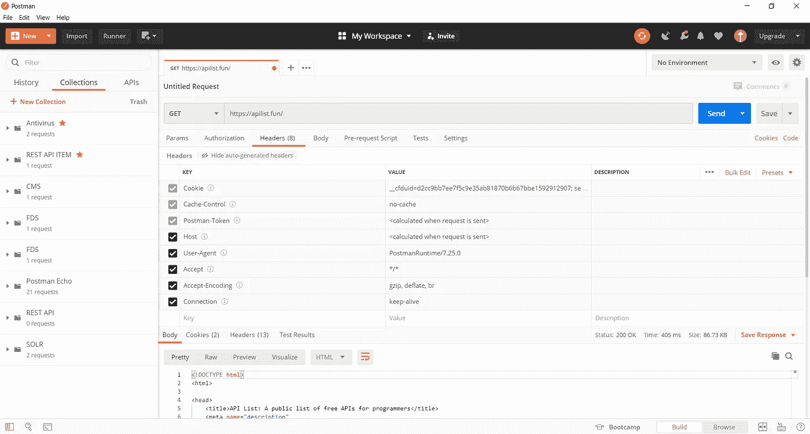

# 2020 年 Java 开发人员的五大工具

> 原文：<https://blog.devgenius.io/top-5-tools-for-java-developer-in-2020-9d45a80cdda2?source=collection_archive---------4----------------------->

我用 Java 开发了很多年。这些年来，我使用的工具改变了很多。

# 智能理念

Intellij IDEA 是我用过的最好的 IDE。我使用过 Eclipse，但一直不满意。我总是对 Eclipse 中非常慢的全文搜索感到沮丧。IDEA 替我解决了。

最佳创意功能

*   快速全文搜索
*   最先进的反编译器和调试器
*   令人惊叹的 Git 集成
*   与 Spring、JUnit 的现成集成
*   伟大的重构工具

[https://www.jetbrains.com/idea/](https://www.jetbrains.com/idea/)

# 你的工具包

YourKit 是您用过的最好的 Java 分析器。它将集成到 IntelliJ 中，以在本地启动应用程序来描述它。当你需要分析远程应用程序时，它有一个很好的 java 代理，并为大多数 web 服务器提供了一个简单的指南。它可以帮助您了解您可能遇到的所有性能问题。

https://www.yourkit.com/java/profiler/

# VisualVM

Visual VM 是一个免费的工具，用作命令行 JDK 工具的可视化用户界面。它还具有轻量级的分析能力，但它的功能是 JMX 监控。

您可以看到 JVM 公开的所有指标，可以浏览 MBeans，等等..

【https://visualvm.github.io/ 

# DataGrip

DataGrip 与 IntelliJ 来自同一个 IDE 家族。这是一个管理数据库、编写复杂查询等的工具。如果你曾经使用过 PG Admin(不管是新的还是旧的),你就会知道它的痛苦。Oracle SQL admin 也很烂。DataGrip 非常棒，支持您需要的大多数数据库引擎，并且工作起来非常棒。具有与 IDEA 相同的优良特性。

[https://www.jetbrains.com/datagrip/](https://www.jetbrains.com/datagrip/)

# 邮递员

有大量的 API 客户端。甚至 IDEA 也包含了一个非常棒的想法。我最喜欢邮递员。它能够拦截来自 Chrome 的请求，然后对 postman 请求使用相同的会话等，这是非常棒的。用户界面既漂亮又干净。我尝试了很多，但我总是返回到邮递员。

[https://www.postman.com/](https://www.postman.com/)