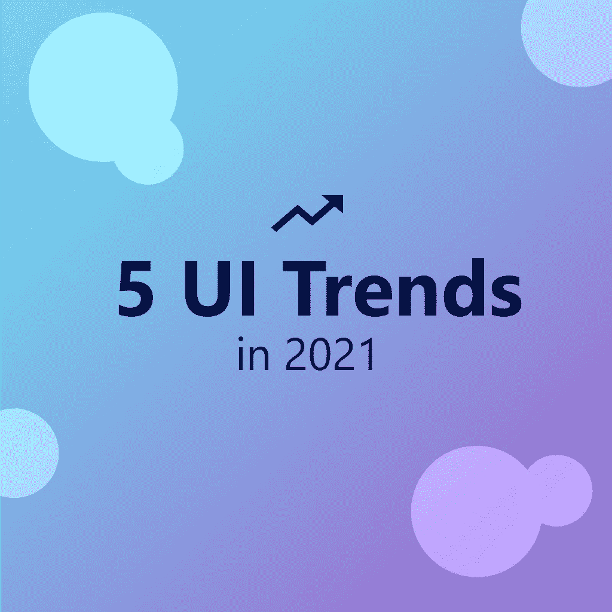
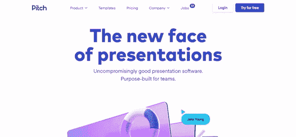
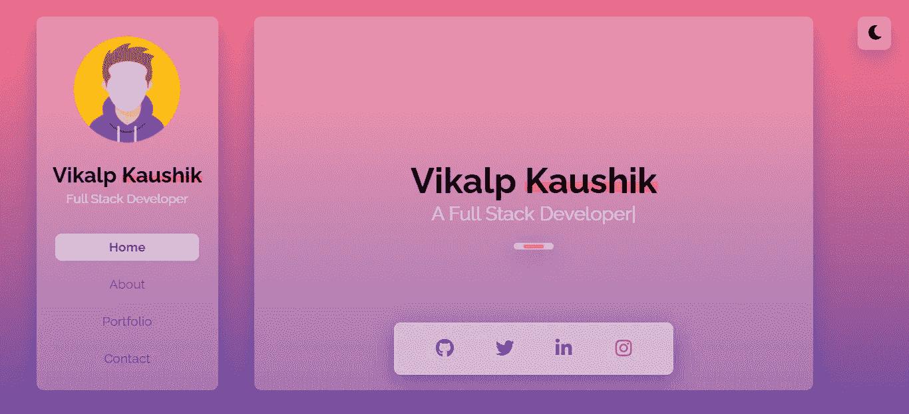
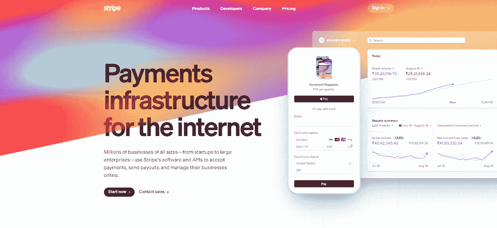
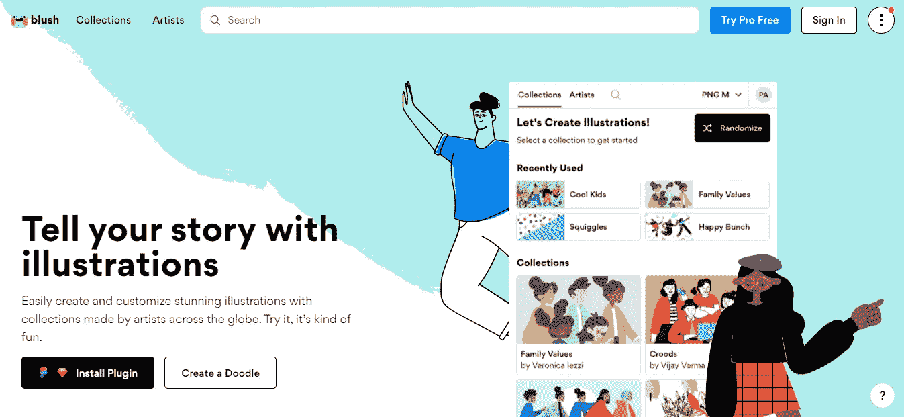

# 2021 年 5 大 UI 设计趋势

> 原文：<https://blog.devgenius.io/top-5-ui-design-trends-in-2021-9e4310d5703c?source=collection_archive---------3----------------------->

## 我们将讨论 UI 设计中动画的未来

UI 中的动画是一种强大的工具，它为交互过程注入了生命力。它帮助用户快速获得反馈，提供快速和简单的微交互机会，标出布局的关键元素，并增加现场和动态过程的参与感。如果使用得当，它能够为用户体验增添更多积极的氛围。对于移动应用程序来说尤其如此，这些应用程序必须根据有限的屏幕空间来组织，同时提供信息丰富的功能性界面。

让我们看看一些 UI 设计趋势，以及作为一名设计师，我们可以在哪些地方使用 UI 动画。

# 1.带运动的 3D 设计

2021 年最热门的设计趋势之一将是 3D 设计。通过网站和应用程序，客户正朝着为他们的用户提供沉浸式体验的方向发展。3D 设计有深度、阴影、光照、纹理，带给用户更接近真实世界的体验。

[pitch.com](http://pitch.com)

# 2.玻璃态

Glassmorphism 是用户界面的最新趋势，并且正在迅速流行。顾名思义，它有一个透明的，玻璃状的外观。用户有可能透过图层看到。这些层有助于在结构中引入层次。当多个半透明层出现在彩色背景上时，该样式效果最佳。然而，透明度并不完整。只有填充需要透明，而不是整个形状。这会产生预期的效果。背景也需要慎重选择。彩色背景在玻璃变体下效果最好。

[玻璃态组合](https://uxplanet.org/now-you-can-build-your-portfolio-in-glassmorphism-ui-ux-design-848599c74094)

# 3.复合梯度运动

在极简主义时代，坚持浮华明亮的渐变是一种设计罪恶。设计师已经过渡到在设计中使用智能渐变。低调渐变的趋势来自网络和平面设计。在过去的十年里，用户的感受已经发生了变化。

【stripe.com 

# 4.插图动画

现在插图已经变得很容易获得，以增加运动，使他们生动。从世界各地艺术家的多种风格和主题中选择一个系列。尝试各种变化，直到你创造出讲述你的故事的艺术。下载您创作的 PNG 或 SVG 文件，并在您的 web 应用程序、演示文稿或任何您想要实现的项目中使用它。

[blush.com](http://blush.com)

# 5.AR 的复杂 UI 动画

AR/VR 将在未来几年变得更容易获得，动画在这里发挥着巨大的作用。因此，掌握动画是一个人现在可以做的促进其职业生涯的完美事情。

# 结论

作为一名设计师，你需要意识到这些设计趋势。不断学习、改进和扩展你的设计工具包是在设计界建立声誉的唯一途径。