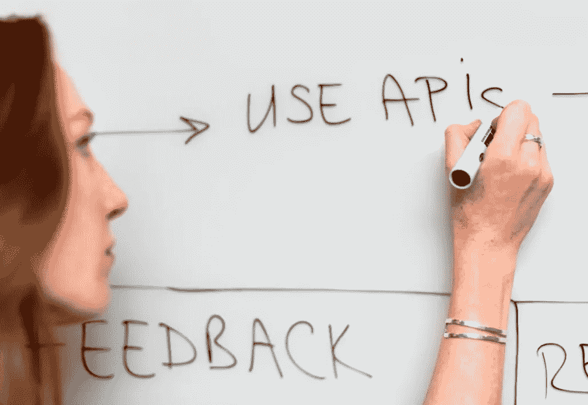
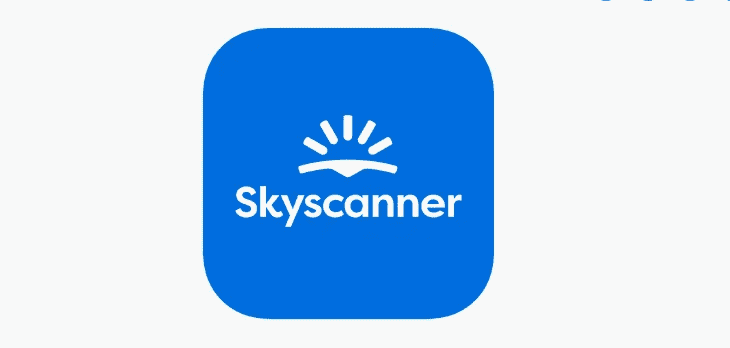
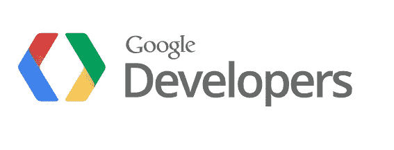

# 软件开发人员的 5 大 API

> 原文：<https://blog.devgenius.io/top-5-useful-and-free-apis-618cdf6499bf?source=collection_archive---------7----------------------->

## 软件工程

照片由 [ThisIsEngineering](https://www.pexels.com/@thisisengineering/) 拍摄

如果你是一名开发人员，那么你应该知道所有的服务都使用 API，无论你是从事个人项目、自由职业还是工作。

这里有一个由五个非常有用的免费 API 组成的列表。

## [Skyscanner 航班搜索](https://skyscanner.github.io/slate/#api-documentation)

Skyscanner.net

如果你正在寻找便宜的航班，你可能会选择 Skyscanner——它提供了一个免费的 API！

我最近创建了一个有趣的项目，它使用 Skyscanner API 来获取旅行细节和信息，非常有用和创新。

—

## [安息国](https://restcountries.com/)

绝对是最简单但非常有用的 API 之一。这是一个简单的 API，用于获取国家、首都、人口等列表。

—

## [网址缩写](https://rapidapi.com/BigLobster/api/url-shortener-service)

照片由 [Pixabay](https://www.pexels.com/@pixabay/) 拍摄

用于缩短 URL 的简单 API。因为，谁喜欢长网址。

—

## [Covid 跟踪项目 API](https://covidtracking.com/data/api)

如果您正在为工作寻找 Covid 数据，您希望通过提供更多信息来帮助社区，或者您只想建立一个利用信息数据的简单 web 应用程序项目— Covid API 绝对是值得一查的。

这一个用于美国的历史和当前 Covid 数据，但是有大量的国际数据 API 可用。

—

## [谷歌应用编程接口](https://developers.google.com/apis-explorer)

谷歌开发者

这不是一个单一的 API 本身，但没有一个 API 列表可以没有谷歌。

谷歌提供了大量免费的 API，这些 API 的质量是显而易见的。一些可能是最有用的是搜索、地图、翻译和分析 API。

希望你能得到一些想法，无论是在你的个人项目中还是在工作中，上面的 API 都能帮助你

感谢阅读！🎉

—

## 更多来自 B.E .的故事

 [## 有经验的程序员必读的 3 本书

### 这个列表主要为已经在这个领域的程序员服务。另外，如果你刚刚开始…

be-ja.medium.com](https://be-ja.medium.com/3-must-read-books-for-experienced-programmers-819a300ace92)  [## 6 个谷歌 Chrome 生产力扩展

### 我喜欢简单的解决方案，由于这个列表不会很广泛，但还是有一个谷歌浏览器的列表…

be-ja.medium.com](https://be-ja.medium.com/6-google-chrome-extensions-for-productivity-d7dc907b4ac0)  [## 你的企业需要一个聊天机器人，现在！

### 什么是聊天机器人，你为什么需要它？

be-ja.medium.com](https://be-ja.medium.com/why-your-company-needs-a-chatbot-1bd9e4bb7c53)  [## 所有高成就者都会做的 4 件事

### 在快节奏的商业和整个软件行业工作了十年之后，这就是…

be-ja.medium.com](https://be-ja.medium.com/4-things-all-overachievers-do-3a3ce0eb69ad)  [## 如何应对过度工程和过度思考

### 软件——名词 1。告诉计算机如何工作的一组指令。

be-ja.medium.com](https://be-ja.medium.com/a-how-to-on-overengineering-and-overthinking-88a53a7fe435)