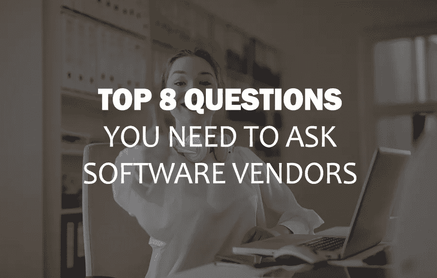
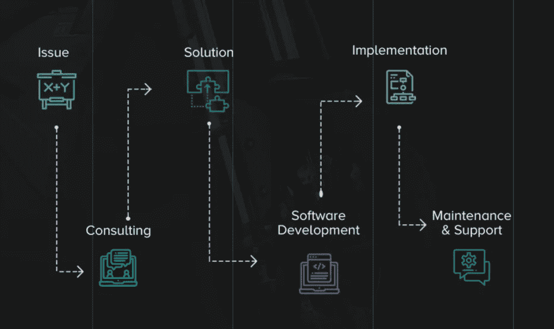

# 你需要问软件供应商的 8 个决定性问题

> 原文：<https://blog.devgenius.io/top-8-decisive-questions-you-need-to-ask-software-vendors-dd382a4c712d?source=collection_archive---------2----------------------->

雇佣合适的软件开发团队是你成功的基础。软件外包过程就像一个金字塔，底部保持着整个平衡。

浏览顶级软件外包公司的名单是不够的。确定特定的供应商是否适合您的项目是必须的。通过富有成效的讨论，这一进程是可能的。

软件外包失败的很大一部分来自于双方的误解和沟通不畅。根据我们的经验，许多受挫的企业在绝望地寻找合适的软件供应商来最终解决和完成他们以前合作伙伴的错误时，会去找 [CodeRiders](https://www.coderiders.am/) 。

忽视和低估在大量软件外包公司中雇佣合适的离岸开发人员的重要性是一个很大的“不”。在本文中，我们将讨论向您的软件供应商候选人提出的 8 个问题，以开始有效的外包合作伙伴关系。

如果您还需要如何找到合适的软件供应商候选人的帮助，我建议您阅读我们以前的文章:

*●* [哪里以及如何找到高质量的软件供应商](https://www.coderiders.am/blog/where-and-how-to-find-high-quality-software-vendor)

*●* [与软件供应商合作前要知道的 5 件重要事情](https://www.coderiders.am/blog/5-crucial-things-to-know-before-working-with-software-vendors)

否则，让我们深入探讨在雇佣软件供应商候选人之前应该问他们的首要问题。

向软件供应商#1 提出的首要问题:

**您能提供尽可能准确的时间和成本估算吗？**

在向您的软件供应商候选人询问时间和预算之前，制作一份[业务和技术需求文档](https://www.coderiders.am/blog/tips-for-writing-a-candid-technical-documentation)。这是至关重要的，因为要给出正确的估计，你未来的商业伙伴应该完全了解你到底需要什么。

如果您手头没有技术文档或工作范围，您最好为“时间和材料”项目模型做好准备。这意味着你的软件合作伙伴将只根据开发人员在你的项目上花费多少时间来收费。他们将定义一个基于小时的价格或每月付款。在这种情况下，几乎不可能为您提供固定的时间和预算估计，因为没有完整和最终版本的要求。

当然，你可以随时要求粗略的估计或猜测，但不要把这些信息看得太严格。做好准备，它可以在你添加新需求或要求其他东西的任何时候改变。

*一个小提示:你也可以在之后做一份评估表，写下每个候选人的优点和缺点，以及他们提供的解决方案，以便为你选择合适的软件外包公司。*

我们 CodeRiders 通过了解问题、咨询和提供解决方案来开始我们的[软件开发合作伙伴关系](https://www.coderiders.am/software-development-process)，就像下面的图片一样。

向软件供应商#2 提出的首要问题:

**你有案例来证明你的专业性和经验吗？**

在筛选出市场上顶尖的软件外包公司后，你自然会在联系他们之前研究他们的网上声誉。但是，在网上查并不代表你对他们了如指掌。仍然会有一些其他信息是公开不可用的，但对你有用，比如他们以前项目的完整描述。

你可以通过客户的评论来检查关于以前项目的描述，或者通过电话和实时屏幕共享让供应商向你展示项目。你甚至可以问他们以前客户的联系人，是否没有 NDA，是否有可供他们分享的信息。

如果软件供应商与其合作伙伴签署了保密协议(NDA ),则供应商同意对合作伙伴的姓名和其他详细信息保密。如果你的软件供应商候选人因为 NDA 的签名而拒绝展示一些以前的作品，不要认为这是一个危险信号。相反，请注意，客户保持其专业性，不会为了他们的利益发送不可共享的信息。

向软件供应商 3 提出的首要问题:

**您专门为哪些行业提供软件解决方案？**

这个问题是上一个问题的延续。此外，弄清楚你的软件外包公司的经验水平，重要的是检查他们是否愿意为你的行业提供软件解决方案。

例如，如果您从事医疗保健和医院管理行业，您可以向软件供应商候选人提出以下问题:

*●* 你熟悉健康技术和远程医疗行业吗？

*●* 可以分享一下你之前在 HealthTech 行业的作品，直播 app，或者网站吗？

检查候选人在你的行业中的经验对你是有用的，但是，请注意，如果供应商候选人还没有在医疗保健行业工作过，这不是从你的考虑名单中排除这家软件外包公司的理由。相反，与他们进行一次坦诚的对话，看看他们是否能开发和实施你的解决方案。不要优先考虑供应商的行业经验，尤其是如果您的项目不需要任何其他领域都无法满足的行业特定功能。

向软件供应商#4 提出的首要问题:

谁将参与我的项目？

在雇佣软件开发团队之前，公司通常知道他们需要什么样的专业人员。毕竟，一个可靠的软件外包公司不仅仅由程序员组成。

如果你想雇佣一个离岸软件开发团队，根据项目规范，考虑以下专业人员:

*●* **前端开发人员和 UI/UX 设计师**:他们负责用户体验和你项目的整个视觉部分。这意味着他们确保你的应用程序或网站使用方便，易于协调。响应式设计师确保移动应用程序或软件在所有浏览器和平台上看起来都一样。

*●* **后端开发人员:**他们负责整个程序的逻辑，并确保它正确、成功地运行。后端开发人员确保前端系统请求的数据通过编程方式交付。查看我们的[后端开发人员访谈](https://www.coderiders.am/blog/albert-ispiryan-of-coderiders-clarifies-the-importance-of-php-in-web-applications)，了解更多关于后端软件解决方案和前沿技术的信息。

*●* **数据库开发人员:**他们负责创建和实现计算机数据库。数据库开发人员更多地关注于确定最佳的数据库管理系统，测试数据库程序的效率和性能，或者扩展它们的功能范围。查看我们的 [SQL 开发人员访谈](https://www.coderiders.am/blog/babken-d-of-coderiders-shares-his-story-as-sql-developer)以了解更多关于数据库系统的信息。

*●* **CTO** : CTO 是整个软件开发团队的领导者。在软件外包团队中有一个 CTO 并不是强制性的，而更像是一个特定的公司对实际软件外包过程的个人方法。。一些公司也喜欢雇佣首席技术官，因此他/她会确保提交的代码没有错误，开发人员处于控制之下，而其他人则认为高质量的软件外包公司无论如何都具备这些特质。

*●* **项目经理**:项目经理在所有需求确定后进入软件开发流程。项目经理在软件开发人员之间分配任务，控制整个软件开发过程，并组织开发团队和客户之间的顺利沟通。

*●* **质量保证专家**:QA 是在代码上线前测试代码的人。他们确保代码没有错误，并按计划正确运行。

*●* **技术作者**:为软件项目准备技术文档的人。他们将复杂的技术产品分解成简单易懂的指南，以帮助最终用户了解如何使用产品和服务。

如果您不确定您的项目需要多少人，以及他们应该处理哪些专业，您可以随时咨询您的软件供应商候选人。通常，技术人员会加入电话会议或会议，并根据您的技术需求就团队组成向您提供建议。在 CodeRiders，我们为您的项目和需求提供免费咨询，因此您可以随时[向我们发送报价请求](https://www.coderiders.am/contact-us)，我们将在一个工作日内给您回复电话安排。

向软件供应商#5 提出的首要问题:

**你如何想象我们的远程商务沟通？**

对于软件供应商和客户之间的优秀和有效的沟通过程，有几个被证明的模型。查看[行业标准参与模式](https://www.coderiders.am/software-development-process)了解更多详情。

在 CodeRiders，我们既与那些头脑中有着清晰的参与模式的公司合作，也与那些需要一些帮助来了解有效的客户端-软件供应商沟通的最佳解决方案的公司合作。如果你属于第二类，与你的软件供应商讨论你的合作模式并选择最佳的定制解决方案是一个好主意。

点击下面的链接阅读 CodeRiders 博客上的整篇文章。

 [## 你需要问软件供应商的 8 个决定性问题

### 雇佣合适的软件开发团队是你成功的基础。软件外包过程就像…

www.coderiders.am](https://www.coderiders.am/blog/top-8-decisive-questions-you-need-to-ask-software-vendors)