# 编写 SQL 时的 9 大最佳实践

> 原文：<https://blog.devgenius.io/top-9-best-practices-to-writing-sql-383333cfa928?source=collection_archive---------6----------------------->

## 软件工程之旅

## 如何更好地写 SQL

[岛民 11](https://www.istockphoto.com/vi/portfolio/islander11?mediatype=photography) 在[的照片](https://www.istockphoto.com/)

# 概观

你是一名程序员，你可能使用过 SQL 查询。运行 SQL 查询以从数据库中获得所需结果的方法有很多。

然而，并不是每个人都知道如何正确地、最佳地、容易阅读地、以高处理速度来书写。本文将向您展示如何正确构建 SQL 查询，帮助您改进 SQL 脚本，并找到在实现过程中遇到的问题的解决方案。让我们开始吧。

# 抽样资料

下面使用的样本数据来自编程，参考[编程网站](https://www.programiz.com/sql/online-compiler/)

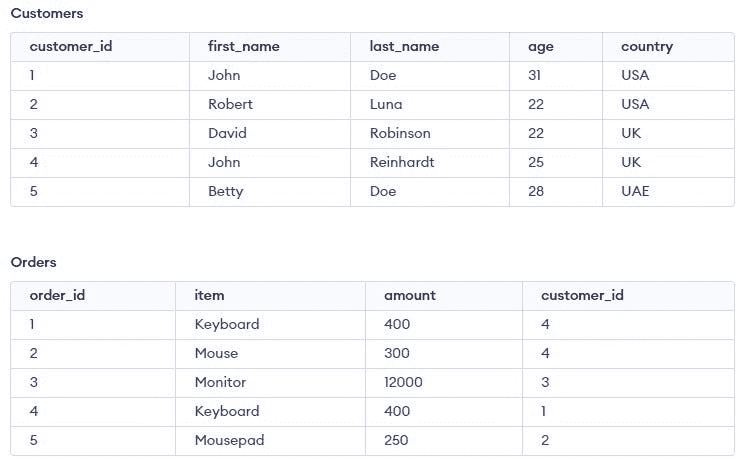

# #1:多个表的别名

查询多个表时。如果多个表中有同名的列，则必须用表名或别名显式引用它们。

使用别名可以避免混淆，并防止数据库在搜索它们所属的表时解析列名。提高可读性、可维护性，并确保获取正确的列。

**避免:**

**表和列的别名:**

**输出:**

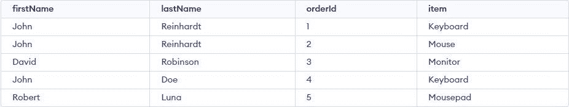

# #2:避免使用“选择”星号

如果一个表包含许多列或数百万条记录，选择 Asterisk 将降低查询速度，并导致数据显示失控。

您应该只查询必要数量的列。这保证了您只使用必要的列查询数据库，而不会获得任何不必要的列。您还可以定义所需的列顺序，确保尽可能满足性能和要求。

# #3:使用“在哪里”

## “凡”同“有”

SQL 的 WHERE 和 HAVING 子句服务于不同的目的。

WHERE 子句用于在进行任何分组之前指定筛选记录的条件，并且不能使用聚合函数(SUM、MIN、MAX、COUNT)

**示例:**

HAVING 子句用于指定从 group by 中筛选值的条件，可以使用聚合函数(SUM、MIN、MAX COUNT)

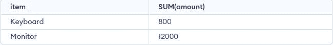

为了避免一开始就必须计算这样的值，请使用 WHERE 子句过滤掉无关的数据。然后，您应该包含一个 HAVING 子句，以便仅在删除不相关的数据、聚合这些行并对它们进行分组之后过滤掉聚合。

**输出**

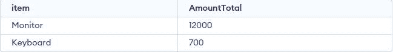

## 其中使用通配符

当发现字符串值为绝对值时，使用 WHERE with **等于运算符(=)**

**输出:**

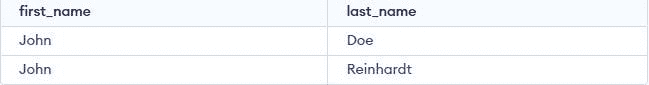

否则，使用通配符查找值在该范围内的字符串。

但是，使用通配符进行搜索的代价可能会很高。喜欢用通配符结束字符串。全表扫描可能是由于在字符串前加上通配符而导致的。

**避免:**

**建议:**

## 带功能的地方

如果在 WHERE 子句中的列上使用函数，查询将会运行得更慢，因为该函数会阻止查询可搜索(即，它会阻止数据库使用索引来加速查询)。列上的函数强制数据库对表的每一行执行函数，而不是利用索引跳转到相关的行。

不要创造性地尝试连接字符串来过滤多个列，因为连接运算符||也是一个函数。

相反，更喜欢许多条件:

**输出:**

# #4:使用排序依据

*   如果要对大量的值进行排序，请在调用窗口函数之前限制数据，并尽可能避免排序，尤其是在子查询中

**例子**

**输出:**

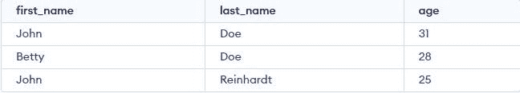

*   当字符串列包含数字时，不要使用 ORDER BY。相反，先将字符串列转换为 INT。

我在这里添加了两条记录，金额列是 varchar。

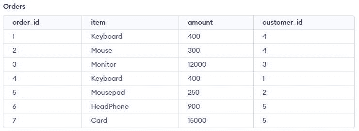

如果按包含数字的字符串列排序，不要期望排序顺序像实数类型一样。

**输出:**

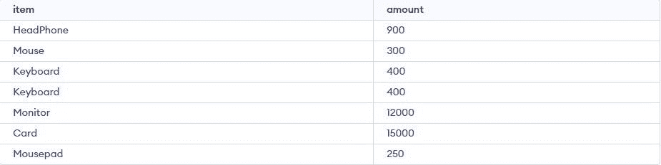

意外的排序顺序。因此，要解决这个问题，请使用整型强制转换。

**输出:**

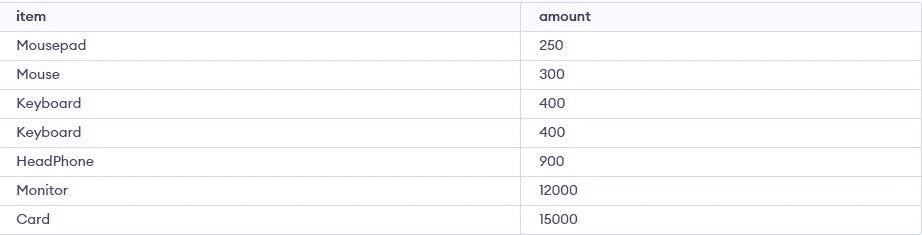

# #5:使用 JOIN 和 ON 关键字

选择多表时，我们有几个选项。

首先，强烈建议使用显式连接，即使用 JOIN 和 ON 关键字。

或者，SQL 查询也可以通过仅在 FROM 子句中提供表名并在 WHERE 子句中定义连接条件来隐式连接数据。

例如，以下两个查询将给出相同的输出:

**输出:**

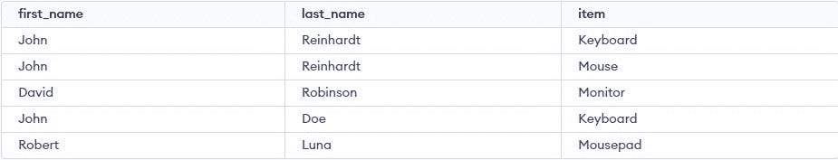

但是，只有第一个查询遵循连接最佳实践。第二个查询有各种问题，它包含隐式连接:

*   可读性较差。要确定哪些表被联接，您必须仔细观察。您还必须找到连接条件，它缺少关键字 on 标准。
*   使用隐式联接时，不能指定联接类型(例如，来自客户、订单)。如果您需要使用标准内部连接以外的函数，这可能会是一个问题。
*   因为这不是子句的典型用法，所以在 WHERE 子句中定义连接条件可能会非常混乱。
*   其中用于过滤数据；当连接条件和过滤条件组合在一个子句中时，查询很难理解。

# #6:文本格式

另一个需要记住的重要规则是，虽然代码运行并不需要这样做，但是 SELECT、FROM、WHERE、GROUP BY 等每个子句都应该在一个新行中。为 SELECT 子句中的每个列名另起一行以提高可读性也是一个好习惯。

此外，如果我们使用子查询，制表是一种很好的方式，可以直观地区分括号内部和查询的其余部分。

# #7:使用 EXISTS，NOT EXISTS 代替 IN 和 NOT IN

要确定特定表中是否存在某个值，可以使用 exists，NOT EXISTS 或 in，NOT IN

IN 运算符用于在指定的值与一组值中的任何值匹配或由子查询返回时检索结果

EXISTS 是一个布尔运算符，它检查子查询的结果并返回 TRUE 或 FALSE。它与子查询结合使用，以确定该子查询是否返回一行。

当检测到第一个真事件时，EXISTS 操作符自动终止以进行进一步处理。这个函数提高了查询的效率。

**输出相同:**

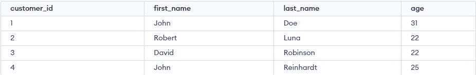

但是，在使用子查询比较数据集时，EXISTS 逻辑运算符过去比 IN 要快。例如，在评估 WHERE [NOT] EXISTS(子查询)时，数据库引擎可能一找到一行就停止搜索，而 WHERE [NOT] IN(子查询)总是会在进一步处理之前收集子查询的所有结果。

此外，如果将来任何一列被更改为允许空值，则版本中的(NOT)将需要做更多的工作(即使数据中没有空值)，并且如果存在空值，则(NOT) IN 的语义不太可能是您想要的。

# #8:评论你的剧本

通过添加解释代码各个部分的注释来帮助人们(包括三个月后的你自己)。这里要记住的最重要的事情是“为什么”

# #9:使用索引

索引加速了包含 WHERE 或 ORDER 子句的选择查询

如果您发现自己不断地通过一组相似的列进行筛选。

应该索引的列通常由筛选的列决定(即，哪些列通常出现在 WHERE 子句中)。

然而，索引在这些情况下并不合适

*   不建议在记录很少的小表中使用。
*   在更新、插入操作频繁发生的表中，不应使用索引。
*   不建议用于包含大量空值的列。
*   索引不应用于频繁修改的列。

# **总结**

SQL 是一种非常灵活的语言，允许您在数据库上执行各种功能。为了使您的应用程序更加有效和高效，以及避免长期的数据库问题，请使用现代 SQL 查询优化最佳实践来编写您的查询。这些技术帮助您加速 SQL 性能调优，消除无关的例程，并使您的所有工作更加简洁和透明。