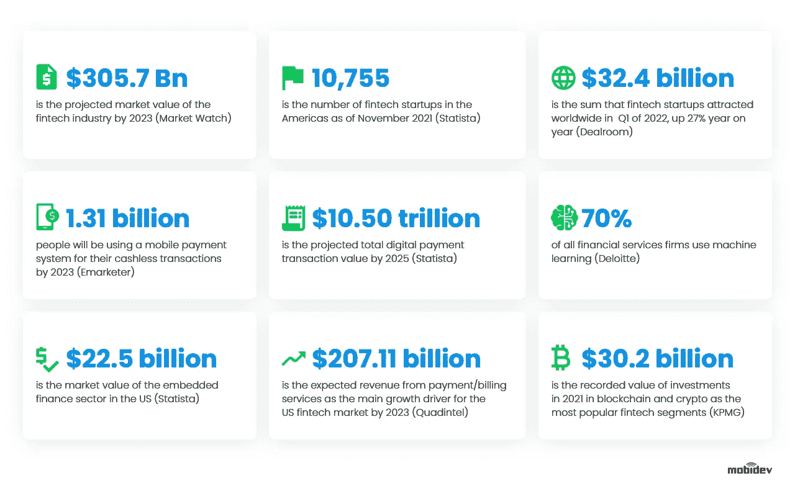
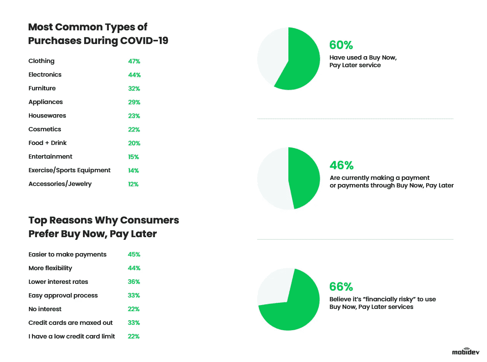
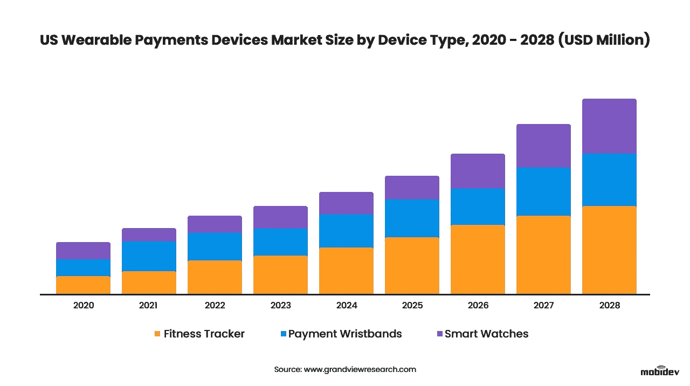
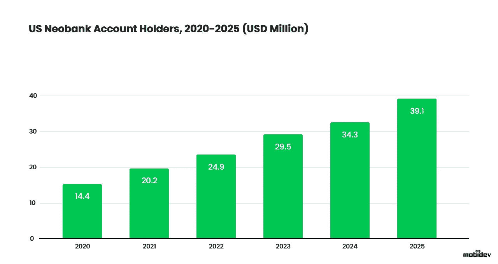

# 2022 年顶级金融科技趋势:科技改变金融的力量

> 原文：<https://blog.devgenius.io/top-fintech-trends-of-2022-the-power-of-technology-to-transform-finance-23f6673ab7f4?source=collection_archive---------12----------------------->

作为最具颠覆性的行业之一，金融科技在过去十年中显著改变了我们与金融公司的互动方式，并且没有止步于此。每年我们都会带来新的创新，以满足客户不断增长的期望。这就是为什么对于企业主和高管来说，了解我们现在所处的位置以及我们在金融技术方面的发展方向非常重要，以便保持相关性和竞争力。让我们来谈谈推动市场的顶级金融科技趋势。

# 2022 年全球金融科技市场三大趋势

在深入具体的金融科技领域之前，我们先来看看改变金融科技行业游戏规则的金融科技市场总体趋势，并查看一些市场统计数据。

# 1.WEB 3.0 和区块链提供了安全性和去中心化

随着对互联网未来的崇高承诺和雄心勃勃的愿景，Web 3.0 技术和区块链在全球范围内爆发。消费者越来越青睐数字商品的所有权，不可替代代币(NFT)和加密货币使这成为可能。区块链正是一种可以通过维护非凡的安全性和提供必要的金融基础设施来支持这一虚拟空间经济的技术。虽然加密货币是一种支付手段，但 NFT 是特定数字资产所有权的可靠证明。

基于区块链、人工智能和机器学习以及物联网的实施，Web 3.0 提供了高度的去中心化和个性化，为金融服务用户提供了全新的客户体验。例如，区块链允许没有银行等金融中介的点对点交易。然而，这并没有阻止银行的增长趋势。美国银行公司 J.P. Morgan 去年宣布在其新的 [Confirm 解决方案](https://www.jpmorgan.com/news/jpmorgan-uses-blockchain-technology-to-help-improve-money-transfers)中使用区块链技术，该解决方案旨在降低全球银行机构之间的支付成本。

因此，区块链仍是金融科技市场发展不可或缺的一部分。根据[市场和市场](https://www.marketsandmarkets.com/Market-Reports/fintech-blockchain-market-38566589.html)的数据，金融科技区块链市场规模预计将从 2017 年的 2.3 亿美元增长到 2023 年的 62.282 亿美元。

# 2.人工智能让金融运营更智能

金融科技解决方案涉及大量数据，没有比人工智能更好的技术来处理所有这些数据。具体来说就是机器学习。人工智能有助于金融科技的许多领域，如风险管理、欺诈预防、通过优化降低运营成本、个性化银行体验以及为团队成员和客户自动化工作流程。

人工智能最适合用于识别数据中的模式，然后人工智能解决方案可以根据发现提出建议，帮助用户减少或优化支出。人工智能允许金融公司通过收集和处理有关客户现金账户、信用账户和投资的信息来跟踪客户的财务健康状况，以便为客户提供相关和更个性化的服务。这可以通过量身定制的预算计划和支出分析来实现。

加拿大皇家银行利用人工智能的力量来改善用户体验，并更快地向客户提供新的应用程序。加拿大皇家银行的私有人工智能云可以分析数百万个数据点，加快财务预测分析，使公司能够更有效地构建和部署人工智能应用。这不是唯一的例子。根据 Mordor Intelligence 的数据，金融科技市场的人工智能预计将从 2020 年的 79.1 亿美元增长到 2026 年的 266.7 亿美元。

# 3.嵌入式金融扩展了服务范围

另一个顶级金融科技趋势是嵌入式金融，它允许金融技术集成到非金融产品中。例如，在网站上结账时，用户可以选择分期付款购买一件商品。这种方法的另一个应用是选择在结账时为汽车或电子设备等物品增加保险。因此，这可以提高转化率，产生更有价值的数据，并增加产品的竞争力。

支持即时在线购买的嵌入式支付或允许你在购买机票时购买保险而无需联系保险代理人的嵌入式保险等解决方案并不新鲜，而是金融科技的一个发展领域。例如，我们稍后将讨论的 BNPL(现在购买，以后支付)上升趋势也是嵌入式金融的一个例子。根据 [Future Market Insights](https://www.futuremarketinsights.com/reports/embedded-finance-market) ，嵌入式金融市场在 2021 年的价值为 430 亿美元，在未来 10 年内有望达到 2484 亿美元。

# 2022 年金融科技贷款趋势

贷款、融资和分期付款是金融科技行业的重要组成部分。在过去的几年里，数字借贷系统变得越来越流行。这里也有很多人工智能和自动化辅助的机会。

替代贷款技术扰乱市场的主要原因之一是因为它比传统贷款服务更有效。替代贷款人更灵活，所以他们迎合客户的不同需求。例如，虽然银行通常提供三到五年的贷款，但替代贷款是短期的，而且利率通常很低。

金融科技贷款趋势在很大程度上依赖于相关领域的进步。例如，通过开放银行的发展，替代贷款人可以在分析数据的同时访问现有账户，通过机器学习，他们可以确定消费习惯并对风险进行分类。例如，将光学字符识别(OCR)解决方案与机器学习结合使用，有助于消除贷方审查法律文件时必须进行的所有手动工作。OCR 解决方案允许您从文档中自动提取必要的信息，以供进一步处理。

## 1.点对点(P2P)贷款

最受欢迎的替代贷款形式包括信用合作社、小额贷款机构、市场贷款和 P2P(点对点)贷款。

P2P 借贷是一种特殊类型的替代借贷技术，涉及三方:借款人、投资者和第三方在线平台。第三方平台为互动提供了基础。这使得投资者可以在没有银行干预的情况下借钱给借款人。P2P 贷款平台降低了成本，因为他们自己不拥有贷款，并提供更具成本效益的解决方案。

P2P 贷款服务于消费者和企业市场。越来越多的中小企业和初创企业正在推动对这种贷款的需求。例如，总部位于英国的 P2P 贷款提供商 Capitalise 为企业主和贷款人牵线搭桥，后者可以为企业提供各种用途的资金，如购买新房、扩大员工规模等。市场贷款机构将借款人与个人和机构投资者联系起来，提供更多的融资选择。

## 2.现在购买以后付款(BNPL)

作为短期融资的一种替代形式，先买后付(BNPL)是一种在未来为产品或服务付款的方式。大多数情况下，这种方式没有利息，因此成为一种流行的融资方式。有了销售点分期付款贷款，顾客在购买时先付一定的金额，然后再付其余的。

专家预测 BNPL 行业将出现繁荣，全球巨头已经在追随这一金融科技趋势。

例如，亚马逊正在与 Affirm 合作，通过将 50 美元或以上的购买分成较小的月付款来实施 BNPL。

*现在购买，以后付费用户习惯*

*研究通过* [研究通过*C+R*研究通过](https://www.crresearch.com/blog/buy_now_pay_later_statistics)

# 2022 年金融科技支付趋势

现代支付解决方案使消费者更容易发送和接收资金。可能的支付方式的扩展减少了买方和公司之间的障碍。这就是为什么在谈论金融科技的最大趋势时，我们不能跳过一个支付领域。让我们深入研究一下。

## 1.疫情之后，非接触式支付正在兴起

在 NFC 技术出现后，非接触式支付已经流行了多年。能够在支付终端上点击移动设备不仅简单，而且有助于减少新冠肺炎疫情期间的联系。

二维码支付并不新鲜，但易于采用，也在不断增加。据 Juniper Research 称，到 2025 年，二维码支付市场将价值 3 万亿美元。这个行业的领导者之一是支付宝。消费者只需要扫描一个二维码，就可以将设备上的应用程序引导到一个页面，在那里他们可以安全地汇款。

NFC 和主机卡仿真(HCE)的渗透率不断提高，推动了可穿戴支付市场的增长。HCE 允许可穿戴设备在不需要访问认证功能的情况下，模仿支持 NFC 的设备上的卡。现在，智能手表并不是唯一具有这种功能的可穿戴设备。智能 NFC 戒指也在兴风作浪。事实证明，像这样的创新硬件对许多消费者很有吸引力。

## 2.支付请求技术降低交易成本

这是另一种趋势性的金融科技解决方案，允许一方向另一方请求资金。此人可以批准付款，也可以拒绝付款。如果请求被批准，钱会被实时转账给收款人。这种技术的一个例子是 Zelle，它已经与亨廷顿等几家银行合作。

请求支付(RTP)技术由消费者、商家和企业使用，它们可以请求其他企业支付账单。该技术是安全的，因为支付请求被发送到支付者的代理账单地址，而不需要披露支付者的敏感支付细节，并且支付者可以完全控制是否批准或拒绝支付。越来越多的收单银行和消费银行正在实施 RTP，让企业实时了解收入支付情况，同时降低交易成本。

要求支付的趋势起源于英国。英国于 2020 年推出。现在这项技术正在全球范围内获得发展势头。这在欧洲被称为请求 2 支付(R2P)，在美国被称为付款请求，在印度被称为 UPI 收款。

# 2022 年金融科技银行趋势

近年来，金融科技领域出现了一些令人兴奋的新趋势，影响了银行业。数字化需求的增加和技术的不断采用推动了传统银行和金融科技公司合作，共同开发市场，提高服务质量。

## 1.开放银行业务拓展银行生态系统

金融科技的银行趋势在很大程度上与开放式银行的发展有关。随着 2015 年 PSD2 在欧洲的采用，这一趋势在欧盟和其他地区继续快速发展，开辟了金融科技创业公司和传统银行的联合发展分支。

开放银行业务就是在一个受控的环境中分享金融信息。帐户所有者可以批准与其他金融提供商安全共享其金融信息的方式。这使得第三方提供商可以通过开放的 API 访问客户的财务信息。许多提供预算、成本跟踪、财务规划、贷款和其他服务的金融科技初创公司都利用了开放银行业务的机会。根据 Business Wire 的数据，利用开放银行 API 将推动今年的市场，预计 2022 年将达到 191.4 亿美元，高于 2021 年的 151.3 亿美元。

## 2.新银行以更低的成本提供移动优先服务

新银行存在于金融科技领域，是为了让银行服务更实惠。与大型银行相比，它们通常提供的服务种类较少，但它们专注于这些服务，以提高服务质量。新银行的运营也更加透明。

在新冠肺炎疫情期间，新银行由于其有价值的特点而获得了成功。即时转账、快速注册以及 IBAN 和 ACH 账户提供完全的网上银行访问，在远程工作对许多行业来说是必要的时候是有益的。如今，世界正从疫情复苏，人们对这一趋势的兴趣并未消退。许多用户已经意识到 neobanks 的优势，并准备继续与他们合作。根据 Statista 的数据，在美国新银行持有至少一个账户的个人数量预计将在 2025 年达到 3910 万，高于 2021 年的 2000 万。

## 3.银行即服务带来了新的增长点

这是金融科技行业的另一个重要趋势。银行即服务(BaaS)允许银行向希望提供金融服务并在传统银行基础设施上构建产品的公司开放其支付生态系统。因此，非银行可以提供金融服务，而不需要银行牌照，这对于那些希望获得额外利润而无需投资额外成本建设基础设施的小企业来说非常方便。

BaaS 也利用 API，但与开放银行不同，它向第三方提供的不是现成的数据，而是银行的功能，在此基础上可以开发新产品。公司付费访问 BaaS 平台，之后金融机构向该公司开放其 API，提供创建新金融产品所需的系统和信息。

随着对 BaaS 兴趣的增加，主要市场参与者的名单也在增加。银行，BBVA，ClearBank，绿点。，MatchMove Pay Pte。Starling Bank 处于这一金融科技领域的前沿，但新的 BaaS 平台一直在涌现，越来越多的用户希望将金融服务融入他们的体验。因此，我们肯定需要密切关注这一金融科技趋势，看看它如何影响未来几年的市场。

# 2022 年金融科技投资趋势

金融科技领域有许多正在改变投资方式的新兴趋势。让我们来看看其中最有趣的。

## 1.随着元宇宙的出现，加密资产也出现了

尽管加密货币在市场上有起有落，但投资者继续将这种资产纳入他们的投资组合。因此，交易平台和密码交易所在投资市场上仍然越来越受欢迎也就不足为奇了。随着全球公司广泛采用加密技术，这些资产的价值也在不断增长。例如，2022 年 6 月，PayPal 宣布支持 PayPal 与其他钱包和交易所之间的加密货币原生转移，这使其成为世界上最大的加密友好支付服务之一。

然而，加密货币并不是全部。还有不可替代代币(NFT)的加密投资机会。由于猖獗的艺术品盗窃和滥用，这些储存在区块链的独特数码物品在过去一年中变得颇具争议。然而，NFTs 仍然可以作为一个独特的数字许可证。只要该许可证允许所有者访问某些功能和项目，无论是在电子游戏等数字空间还是在现实世界中，令牌对用户的使用都将超越情感价值。

事实上，NFT 和加密货币等数字资产最近与元宇宙密切相关。随着现实世界与数字世界越来越融合，投资者对拥有在数字空间中有价值的数字物品越来越感兴趣。收购元宇宙土地、购买元宇宙股票、投资元宇宙 ETF 和购买 NFT 是投资元宇宙最受欢迎的方式，这是投资平台试图采用的趋势。例如，比特币基地加密交易所最近宣布开发一个独特的用户名 NFT，将允许用户携带一个独特的 ID 跨越不同的世界在元宇宙。该平台还在研究允许用户为元宇宙应用购买头像的技术。

## 2.新手投资者的 ROBO 顾问和 PFMS

由于人工智能的进步，自动金融建议现在是许多投资者的可行解决方案。机器人顾问和个人理财经理(PFM)使用人工智能建议为投资者展示最佳的花钱方式。这类应用非常有利可图，是市场上的一股颠覆性力量。

基于人工智能数据分析算法的机器人顾问能够处理大量数据，比人类顾问更快地适应不断变化的环境，并为投资者提供最合适的投资选项，以实现他们的目标。由于替代投资工具大大降低了投资者的准入门槛，几乎任何人都可以用小额资本赚钱，机器人顾问在无法获得传统咨询的新手投资者中尤其受欢迎。

# 2023 年及以后金融科技行业的未来

随着金融科技行业的持续增长，更多的企业将参与托管和利用开放银行、机器人顾问、BNPL、P2P 贷款等解决方案。如果我们试图在所有金融科技趋势中找到共同点，那么我们可以确定推动行业发展的 3 个因素，这些因素是希望在这一领域取得成功的公司必须考虑的。

1.  **法规合规性。**企业可能面临的一个意想不到的障碍是，世界各国政府将如何跟上快速发展的金融业趋势。对公司来说，了解监管变化很重要。适应这些变化对于长期成功至关重要。
2.  **界限模糊**。随着客户期望的提高，最成功的公司都在寻求无限制地提供更全面的服务。例如，有利可图的国际支付、在一个应用程序中交易密码、股票、商品的能力等等。
3.  **增加金融服务的可及性。**金融科技公司努力让他们为客户提供的服务尽可能简单和可及。这包括，例如，简化和加快购买股票的过程，快速计算贷款利息，只需点击几下鼠标就可以发放保险，等等。

能在这三个领域取得进展的公司，最有可能在不久的将来成为市场主体。

由 [MobiDev](https://mobidev.biz/services/machine-learning-consulting) 的 BA 组长[马克西姆·别里艾](https://mobidev.biz/our-team/maksim-bieliai)撰写。

*全文原载于*[*https://mobidev . biz*](https://mobidev.biz/blog/fintech-trends-technology-transforms-finance-industry)*，基于 mobi dev 技术研究。*