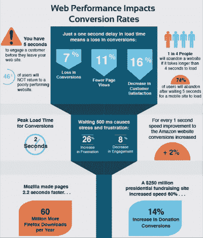

# 加强业务的五大移动战略

> 原文：<https://blog.devgenius.io/top-five-mobile-strategies-to-strengthen-your-business-e1e391fbc7bd?source=collection_archive---------11----------------------->

## 如何为您的企业创建强大的移动战略

台式机版本的计算已经成为一个老派的故事，笔记本电脑仅限于一种设备来满足正式的需求。在过去的几年里，人们的偏好和期望发生了巨大的变化，并随着时间的推移产生了新的定义。

当我们谈论电子商务时，事情是与智能手机兼容的。根据一份报告，到 2017 年底，68%的数字媒体时间将通过智能手机应用程序使用。

说到 2016 年年中，花在数字媒体上的时间有 65%只来自于手机。

**这条曲线的结果？** 看准了人的倾向，商家一起奔向不断增长的市场。然而，虽然一些人对摘要印象深刻，但一些人未能找到剩余的本质，他们的想法变戏法般地找到了正确的大道。

这里有一个策略列表，你可以遵循它来获得最好的结果，帮助下两个拥有商业头脑的人:

**1。制作一个响应式网站** 与其单独制作一个移动网站，不如选择一个能在所有设备上即时工作的响应式设计。这是因为它最大限度地减少了维护网站特定版本的工作量。如果用户从不同的设备访问你的网站，他或她会感到困惑。

然而，如果你的公司有资源，你可以开发一个移动应用程序，并在两个主要平台上实现相同的功能；安卓和 iOS。与移动网站相比，这给了你更好的好处。

**2。根据一项研究，如果你的网站加载时间超过 3 秒，你会失去 57%的访客。如果你知道 80%的游客不会再回来，你会感到震惊。**

网站速度对销售的影响

因此，如果你希望你的企业在一个不断增长的市场中生存并取得成功，你需要关注你的网站在所有设备上的性能。确保您的应用程序/网站在移动设备上无缝运行，同时在桌面上工作。

**3。语音帮助是一个不错的选择** 今天给‘地球上的人类’最好的礼物就是他们交流和表达自己的方式。同样的事情也会发生在你的访客身上。在最近的一次采访中，视频聊天公司 Agora.com 的创始人兼首席执行官赵陈梁表示，应用程序中的交流可以在一定程度上增加用户的兴趣和参与度。

您可以在您的应用程序或网站上轻松启用视频通话或语音通话的点击通话选项。为此，你可以在网上找到许多点击呼叫软件开发工具包。这些孩子需要一些代码行和一些步骤来提供你所需要的。

**4。可扩展的**
智能手机市场预计将在未来四到五年内增长 10%以上。同样的事情也发生在应用商店上，在未来几年里，应用商店可能会面临双倍的下载量。

为了与这个不断增长的市场竞争并创造空间，您需要确保您的规划、实施和输出是可扩展的。您可以对所有数据和性能规格进行实时分析。

**5。你不能忍受这个漏洞**
他们使用手机是为了一种无忧无虑的体验，你这边的一个小漏洞就会让他们飞起来。你很清楚，像你这样的人都在想尽办法吸引尽可能多的观众。在混乱中，你需要确保给他们最好的。

您可以优化您的移动设计，使其即使在连接性较低的情况下也能正常工作。确保与客户的适当互动，认真对待他们的反馈和赞美，并采取必要的行动。

**结论**
这些是强化你的业务的五大移动战略。要总结信息，你需要一个优秀的开发人员团队。如果不是这样，也许你应该考虑找一个技术合作伙伴或者最好的移动应用开发公司来避免这些微小的危险。