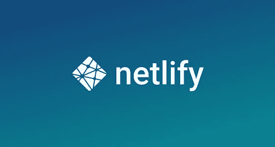
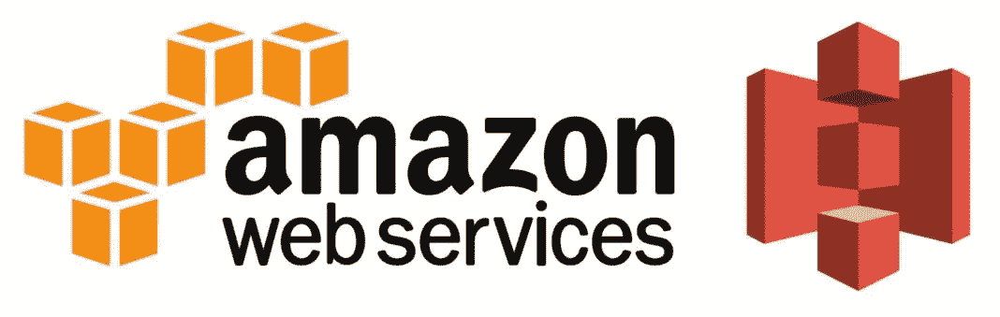

# 免费托管网站的最佳地点！

> 原文：<https://blog.devgenius.io/top-places-to-host-your-website-for-free-a0b289f643a2?source=collection_archive---------36----------------------->

在这里免费托管您的网站。

伊戈尔·米斯克在 [Unsplash](/s/photos/website?utm_source=unsplash&utm_medium=referral&utm_content=creditCopyText) 上的照片

# **1。GITHUB 页面**

您和您的项目的网站，直接由您的
GitHub 库托管。只需编辑推送，您的更改就会生效。

# 2.网络生活

使用 Netlify 部署现代静态网站，获得 CDN 持续部署，一键 HTPS，以及您需要的所有服务，免费开始。

# 3.谷歌 Cloud⁣

利用 Google 的云计算服务迎接您的业务挑战，包括数据管理、混合云和多云和 AI & ML。

# 4.AWS S3⁣

亚马逊简单存储服务(亚马逊 S3)是一种对象存储服务，提供行业领先的可扩展性、数据可用性、安全性和性能。

# 5.韦尔塞尔

Vercel 是部署网站最简单的方法。通过零配置、自动 SSL 和全球 CDN 托管您的 web 项目。静态，遇见动态。生成超快的页面，并使用丰富的 JavaScript 增强它们，让您的应用充满活力。

由 [Kelly Sikkema](https://unsplash.com/@kellysikkema?utm_source=unsplash&utm_medium=referral&utm_content=creditCopyText) 在 [Unsplash](/?utm_source=unsplash&utm_medium=referral&utm_content=creditCopyText) 上拍摄的照片