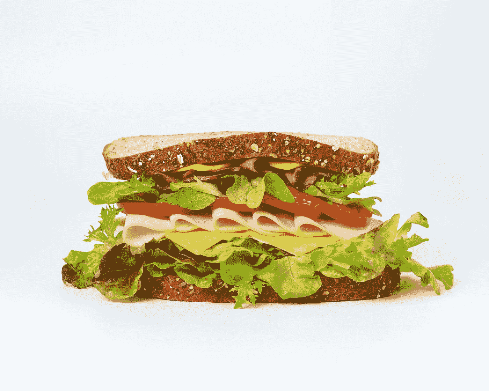

# 顶级反应库—日期选择器和外部点击

> 原文：<https://blog.devgenius.io/top-react-libraries-date-pickers-and-clicks-outside-67e649abf914?source=collection_archive---------4----------------------->



照片由[梅姆](https://unsplash.com/@picoftasty?utm_source=medium&utm_medium=referral)在 [Unsplash](https://unsplash.com?utm_source=medium&utm_medium=referral) 上拍摄

为了让开发 React 应用更容易，我们可以添加一些库，让我们的生活更轻松。

在本文中，我们将看看一些流行的 React 应用程序库。

# 反应日期选择器

我们可以用 React 日期选择器包向 React 应用程序添加一个日期选择器。

要安装它，我们运行:

```
npm i react-datepicker
```

然后我们可以通过写来使用它:

```
import React from "react";
import DatePicker from "react-datepicker";import "react-datepicker/dist/react-datepicker.css";export default function App() {
  const [date, setDate] = React.useState(new Date()); const handleChange = date => {
    setDate(date);
  }; return (
    <div className="App">
      <DatePicker selected={date} onChange={handleChange} />
    </div>
  );
}
```

我们只是使用`useState`来创建我们的状态。

然后我们传入`date`状态作为`selected`道具的值。

`onChange`有一个改变处理器来更新选择的值作为`date`状态的新值。

它是可重用和可配置的。

我们可以添加一个计时器选择器。

此外，它还支持本地化。

我们可以用`showTimeSelect`道具添加一个时间选择器:

```
import React from "react";
import DatePicker from "react-datepicker";import "react-datepicker/dist/react-datepicker.css";export default function App() {
  const [date, setDate] = React.useState(new Date()); const handleChange = date => {
    setDate(date);
  }; return (
    <div className="App">
      <DatePicker showTimeSelect selected={date} onChange={handleChange} />
    </div>
  );
}
```

它支持大多数现代浏览器，包括最新的 Internet Explorer 版本。

# 反应-点击外部

我们可以使用 react-onclickoutside 包来检测组件外部的点击。

要安装它，我们可以运行:

```
npm i react-onclickoutside
```

然后我们可以通过写来使用它:

```
import React, { useState } from "react";
import onClickOutside from "react-onclickoutside";
import "./styles.css";const Menu = () => {
  const [isOpen, setIsOpen] = useState(false);
  const toggle = () => setIsOpen(!isOpen);Menu.handleClickOutside = () => setIsOpen(false);
  return (
    <li className={isOpen ? "m-menu -active" : "m-menu "} onClick={toggle}>
      <div> Open Menu </div>
      <ul className="m-menu__list">
        <li className="m-menu__item">
          <div className="m-menu__link">Log Out</div>
        </li>
      </ul>
    </li>
  );
};const clickOutsideConfig = {
  handleClickOutside: () => Menu.handleClickOutside
};const OutsideMenu = onClickOutside(Menu, clickOutsideConfig);export default function App() {
  return (
    <div className="App">
      <OutsideMenu />
    </div>
  );
}
```

在`style.css`中，我们写道:

```
.App {
  font-family: sans-serif;
}.-padding-4 {
  padding: 4px;
}.m-menu {
  list-style-type: none;
  position: relative;
  z-index: 101;
}
.m-menu.-active .m-menu__icon path {
  fill: #0b3895;
}
.m-menu.-active .m-menu__list {
  transform: scale(1);
}
.m-menu__list {
  position: relative;
  text-align: left;
  width: 100px;
  top: 50%;
  z-index: 101;
  padding: 0;
  border-radius: 8px;
  background-color: #fff;
  transform: scale(0);
  transform-origin: 0 1;
  border: 1px solid gray;
}
.m-menu__item {
  display: block;
  width: 100%;
  padding: 12px;
}
.m-menu__item:hover {
  color: #0b3895;
}
.m-menu__link {
  width: 100%;
  padding: 4px;
  display: inline-block;
  white-space: pre;
}
.m-menu__link:hover {
  color: #0b3895;
  text-decoration: none;
}
```

应用样式。

我们使用`onClickOutside`高阶组件让我们听到组件外的滴答声。

我们用作 click outside 监听器的`handleClickOutside`函数被添加为组件的一个属性

然后，我们在高阶组件中使用它，让我们听到外面的点击事件。

然后我们可以使用`App`中的菜单。

在`styles.css`中，我们添加了样式，以便菜单显示在按钮下方。

我们还把它做成`position: relative`，这样我们就可以在其他项目上看到菜单。

它还有其他选择。

我们可以防止默认行为或停止单击外部事件的传播。

我们可以启用或禁用监听外部点击。


由[pizzo lo 摄影](https://unsplash.com/@pixzolo?utm_source=medium&utm_medium=referral)在 [Unsplash](https://unsplash.com?utm_source=medium&utm_medium=referral) 上拍摄的照片

# 结论

我们可以使用 React 日期选择器将日期选择器添加到 React 应用程序中。

react-onclickoutside 包让我们可以监听组件外部的点击。