# 每个开发人员都应该拥有的顶级推荐工具

> 原文：<https://blog.devgenius.io/top-recommended-tools-every-developer-should-have-in-their-locker-4107eac9c1ea?source=collection_archive---------0----------------------->

丹·克里斯蒂安·pădureț在 [Unsplash](https://unsplash.com?utm_source=medium&utm_medium=referral) 上拍摄的照片

在本文中，我们将讨论每个开发人员都应该考虑添加到他们的武器库中的工具。

现代软件或 web 开发人员在工作中可以不受限制地使用一些顶级工具，而不管具体的功能和领域。

作为开发人员，您可以找到多种工具来帮助您解决编码问题。但是在为你自己或者你的团队选择一个开发工具之前，你需要了解它的利弊。以下是[选择开发工具包时需要考虑的 6 件事](https://alemsbaja.hashnode.dev/6-things-to-consider-when-choosing-development-tool-kits)

开发人员工具的综合列表可以占满几页，但是我们只选择了最相关的选项。以下是强烈推荐的开发者工具，按类型和功能分。

> *IDE(集成开发环境)*

IDE 是一个软件程序，它将多个开发工具组合成一个系统，该系统整合了项目中的所有单个任务。使用 IDE，您可以在自己喜欢的环境中编写、构建和部署代码。一些值得注意的 ide 包括:

> [*Visual Studio*](https://visualstudio.microsoft.com/)

Visual Studio 是一个属于微软的 IDE。开发人员可以使用这个 IDE 来构建应用程序、web 应用程序和移动应用程序。由于它是微软的产品，您可以无缝地使用 Windows API、表单和演示基础。

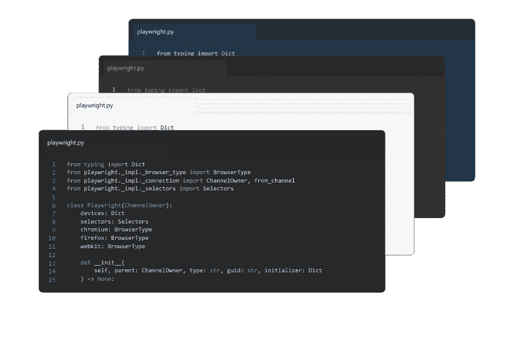

**优点:**

*   它使用智能感知来减少编码错误。
*   Visual Studio 支持多种编程语言。
*   这个 IDE 支持跨平台开发。
*   它有一个巨大的储存库。
*   它提供终端支持。
*   Visual Studio IDE 与 Git 配合得很好。

**缺点:**

*   由于大量的错误警告，调试可能是一件令人头痛的事情。
*   对于新手来说，数据层次结构可能是不和谐的。

> [*IntelliJ IDEA*](https://www.jetbrains.com/idea/)

IntelliJ IDEA 专注于最大限度地提高生产率，并为编码增添乐趣。这个 IDE 是 JetBrains 的旗舰产品，在智能代码完成、特定于框架的帮助和不引人注目的智能方面表现出色。

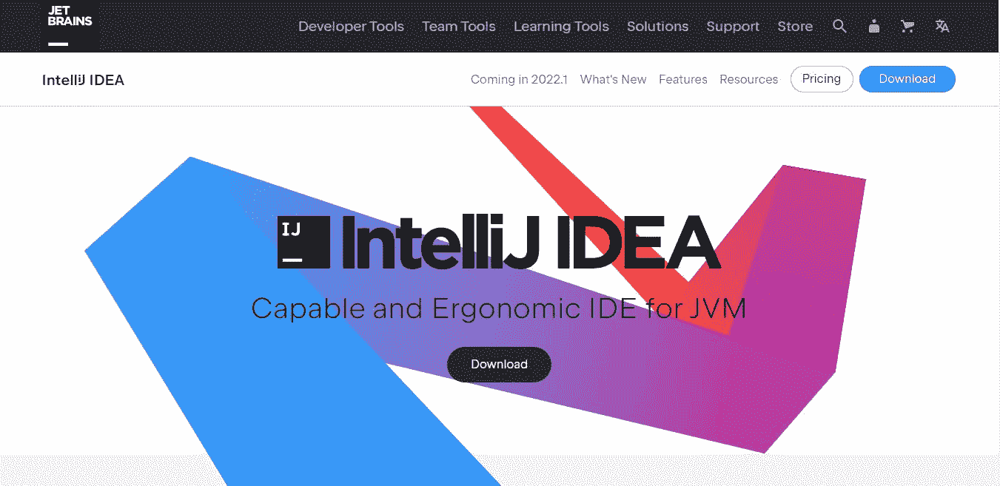

**优势:**

*   它支持多种语言。
*   用户界面简单易用。
*   搜索栏使查找项目变得更加容易。

**缺点**

*   依赖性管理是不可靠的。
*   低端机器的性能很差。
*   成本太高了。
*   它会耗尽你的机器资源。

> [*NetBeans*](https://netbeans.apache.org/)

NetBeans 提供了一个由强大的工具平台和应用程序框架支持的开发环境。这个 IDE 属于 APACHE。

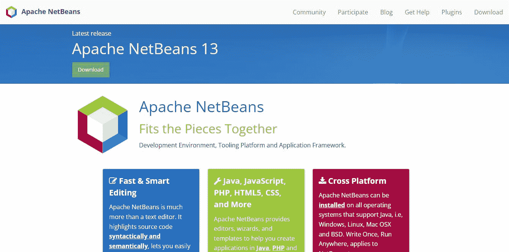

**优点:**

*   该系统是开源的。
*   它支持协作。
*   IDE 使调试和测试变得无缝。
*   它可以在多个平台上运行。

**缺点:**

*   新手将很难设置它。
*   它在低端设备上运行缓慢。
*   NetBeans 使用大量内存。
*   启动需要很长时间。

> [*月蚀*](https://www.eclipse.org/downloads/)

Eclipse IDE 以其对 Java 的支持而闻名，尽管它对其他编程语言的支持也很出色。Eclipse 还包含一个基本工作区和一个健壮的系统，用于定制环境。

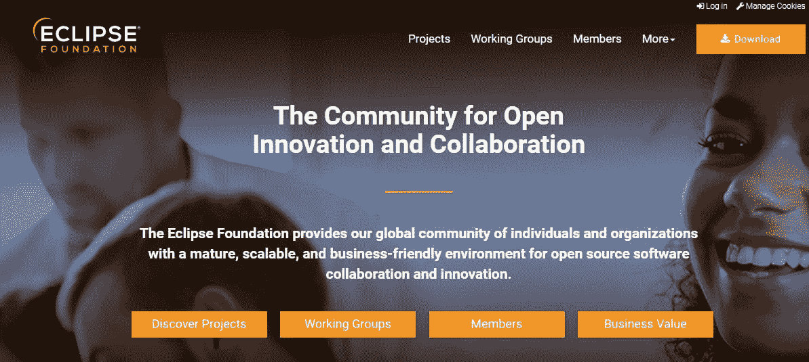

**优点:**

*   代码格式化特性令人印象深刻。
*   它免费且易于使用。
*   您可以自定义界面。

**缺点:**

*   在小设备上表现很糟糕。
*   添加插件会显著降低 IDE 的速度。
*   软件开发框架
*   以下是 2022 年你应该知道的软件开发框架。

> *代码和文本编辑器工具*

随着大多数开发人员工具变得多功能，您将很难找到一个独立的代码编辑器。但是由于它们的简单，人们仍然使用它们，尤其是初学者。

IDE 可以是代码编辑器，但是代码编辑器只提供调整和排列代码的格式化功能。以下是目前最好的代码编辑器:

> [*Visual Studio 代码*](https://code.visualstudio.com/)

Visual Studio Code(不同于 Visual Studio)是微软的代码编辑器。这个编辑器可以在 macOS、Linux 和 Windows 上工作。使用 Visual Studio 代码，您可以编写、编译、调试和重构代码。与任何语言的任何 Visual Studio 代码集成如 [Flutter](https://alemsbaja.hashnode.dev/recommended-visual-studio-code-extensions-for-flutter-developers) 、 [Javascript](https://alemsbaja.hashnode.dev/recommended-visual-studio-code-extensions-for-javascript-developers) 、 [Laravel](https://alemsbaja.hashnode.dev/recommended-visual-studio-code-extensions-for-laravel-developers) 等。你可以在构建的时候探索更多的开发选项。

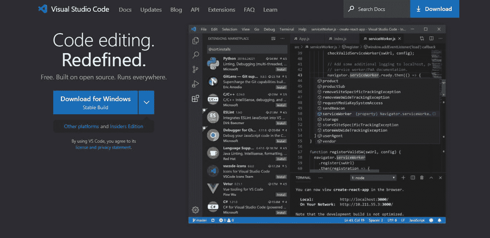

**优点:**

*   它支持多种编程语言。
*   它允许您轻松定制自己的偏好。
*   VS 代码非常适合 web 开发。

**缺点:**

*   初学者将很难设置这个代码编辑器。
*   在 VS 代码中使用扩展和插件是一个挑战。
*   随着时间的推移，额外的扩展会使速度变慢
*   无论项目中使用何种编程语言，都会加载所有扩展

[原子](https://atom.io/)

Atom 是一个开源编辑器，可以在所有主流设备平台上工作。因为 Atom 是 GitHub 的一个应用程序，所以它带有一个嵌入式 Git 控件。

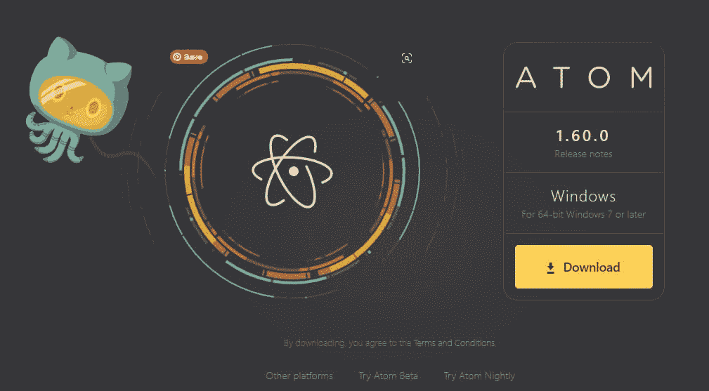

**优点:**

*   Atom 的界面很容易配置。
*   你可以免费得到编辑器。
*   编辑器提供了自动完成功能。
*   您可以使用超过 8 个预装的主题。

**缺点:**

*   Atom 很难处理大文件。
*   Atom 缺乏稳定性。

> [*括号*](https://brackets.io/)

括号是一个现代的文本编辑器，允许开发者在浏览器中修改他们的代码。Adobe 拥有的产品是由 GitHub 开发者维护的开源软件。像大多数现代代码编辑器一样，括号具有跨平台兼容性。

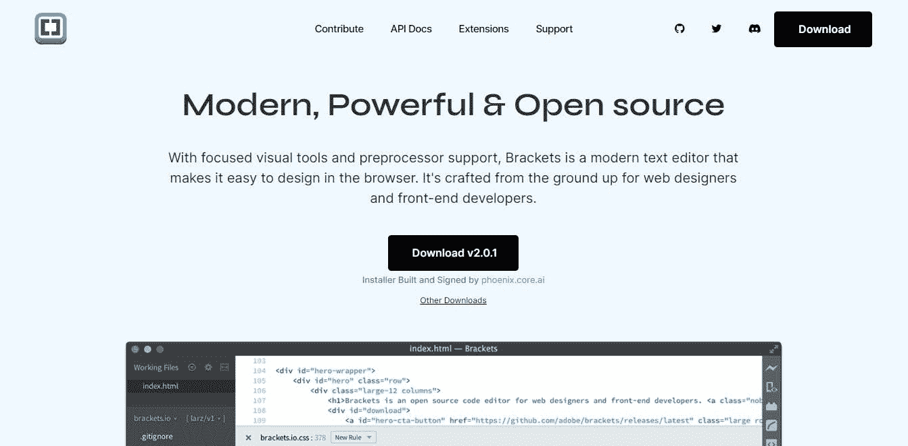

**优点:**

*   该界面易于学习和使用。
*   括号也使用智能感知。
*   即使没有多少编码经验，也可以定制界面。

**缺点:**

*   启动需要一些时间。
*   实时预览功能经常出现故障。

> [*崇高正文 3*](https://www.sublimetext.com/3)

Sublime Text 是一个支持许多编程和标记语言的源代码编辑器。最新版本包括符号索引，允许用户构建特定的功能。开发人员也可以使用 Sublime Merge Git 客户端更快地提交他们的项目。

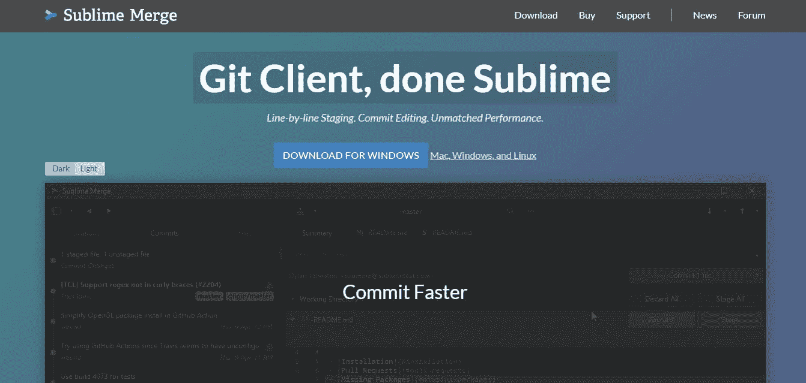

**优势:**

*   它有多个可定制的插件。
*   它易于设置和使用。
*   你只需点击几下就可以安装软件包和插件。

**缺点:**

*   专业版还是需要付费的。
*   Git 集成经常出错。

> *API 测试工具*

当将 API 集成到您的应用程序的基础设施中时，您需要测试工具来创建用于评估其结构完整性的自动化测试。大多数 API 测试工具都允许参数化:它们可以运行同一个测试的多次迭代。

**下面是 2022 年开发者的一些 API 测试工具。**

> [*ACCELQ*](https://www.accelq.com/)

ACCELQ 是一个自动化平台，可以无缝地执行 web 和移动测试。该工具还为 in-sprint、无代码测试自动化提供了 API 和 UI 端到端验证。ACCELQ 利用人工智能的力量与云工具集成，进行高端测试。

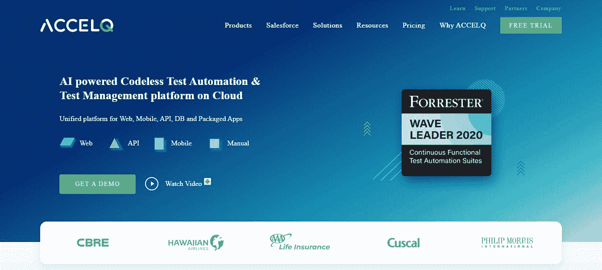

**优点:**

*   这个平台支持无代码自动化。
*   它有大量的文档。
*   该工具直观且易于学习。
*   它使移动、网络和桌面测试变得容易。

**缺点:**

*   您可能需要一个调试器来分析脚本失败。
*   DOM 模式很难使用。

> [*邮递员*](https://www.postman.com/)

Postman 是一个构建、转换和使用 API 的平台。使用 Postman，您可以访问大型 API 存储库，您可以将它组织到工作区中，以便于协作。

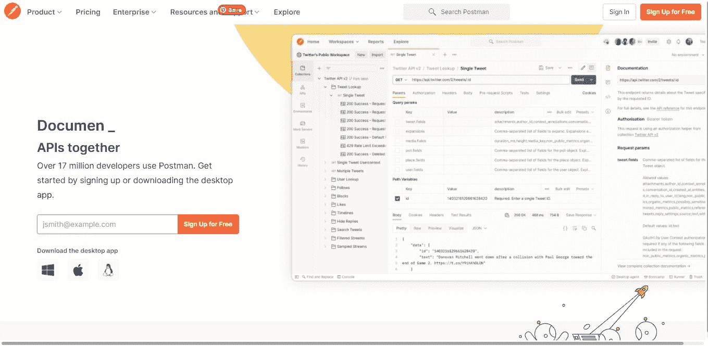

**优点:**

*   该工具是用户友好的。
*   您可以从本机应用程序或 web 扩展访问文件。
*   可以使用 Postman 保存进度，将 API 转换成代码，更改开发环境。

**缺点:**

*   它提供了有限的测试区域。
*   自动化脚本的可重用性低。
*   它不支持自由集成。
*   该工具在处理大型数据集时速度较慢。

> *云开发工具*

云开发中使用的工具

> 微软 Azure

自 2010 年以来，微软 Azure 一直是顶级云服务，为应用开发提供数据中心和基础设施。该系统允许开发者使用无服务器容器构建和部署现代应用。

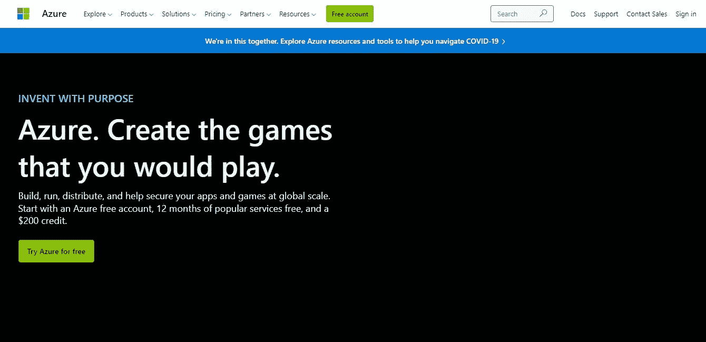

优势:

*   Azure 提供高可用性，每年只有 4 小时的停机时间。
*   云平台优先考虑安全性。
*   Azure 具有可扩展性和成本效益。

缺点:

*   它需要不断的维护才能正常工作。
*   你需要平台专业知识来维护 Azure。

> [AWS](https://aws.amazon.com/)

Amazon Web Services (AWS)是最受欢迎的云数据库存储和内容交付解决方案。该平台提供了一个市场，帮助开发人员立即启动他们的应用程序。您还可以访问构建者库来了解 AWS 是如何工作的。

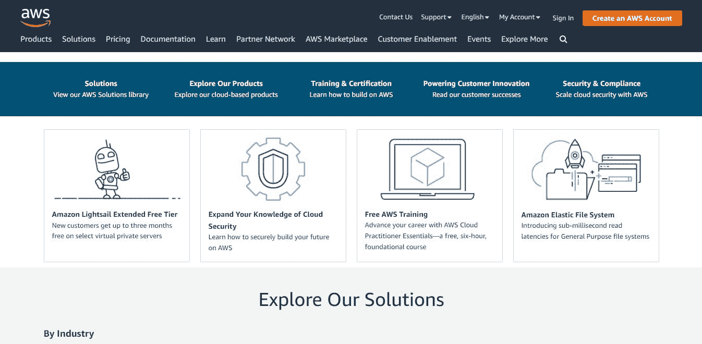

**优点:**

*   它很容易使用。
*   服务器接口提供了许多应用程序和服务。
*   服务器容量是无限的。
*   AWS 既安全又实惠。

**缺点:**

*   对于初学者来说，计费系统可能会变得过于复杂。
*   AWS 按地区限制资源。

> [谷歌云平台](https://cloud.google.com/)

谷歌的云计算工具精选套件被称为谷歌云平台——一种利用该公司使用的相同产品的工具。谷歌云处理数据存储、分析和机器学习。也可以使用 App Engine、Compute Engine 之类的工具开发出优秀的产品。

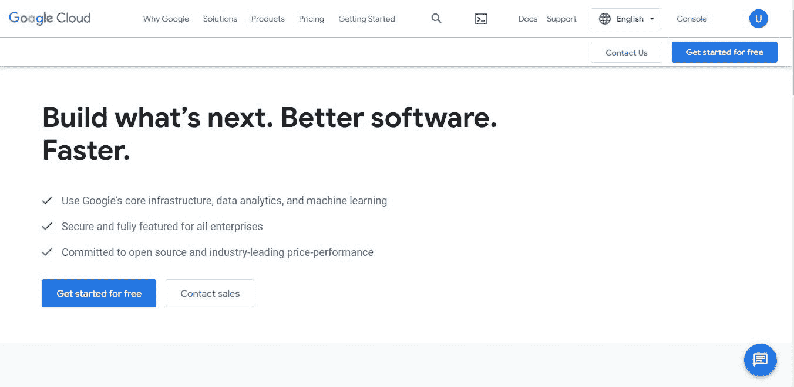

**优点:**

*   它出色地处理数据存储和分析。
*   它使协作变得容易。
*   谷歌云支持开源集成。

**缺点:**

*   它的服务比其他云工具少。
*   过渡到其他供应商是一个挑战。

> [地形](https://www.terraform.io/)

Terraform 是属于 HashiCorp 的开源平台，可以用来定义数据中心基础设施。Terraform 是一个 IaC(基础设施即代码)工具，它提供了跨越数百个 API 的一致工作流。

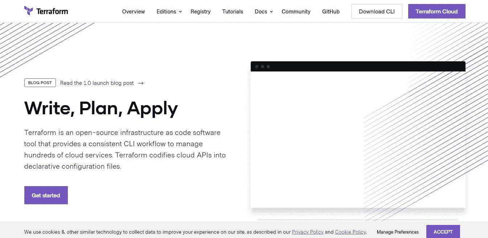

优势:

*   它允许您管理多个云平台上的基础架构。
*   Terraform 速度很快，因为它是在 Go 上构建的。
*   您可以使用 Terraform 来跟踪部署过程中的变化。

缺点:

*   它不提供错误处理。
*   当您出错时，您无法回滚更改。

> [Kubernetes](https://kubernetes.io/)

Kubernetes 是一个开源系统，使用容器来自动化软件开发的所有方面。谷歌在云本地计算基金会负责该项目之前创建了该平台。

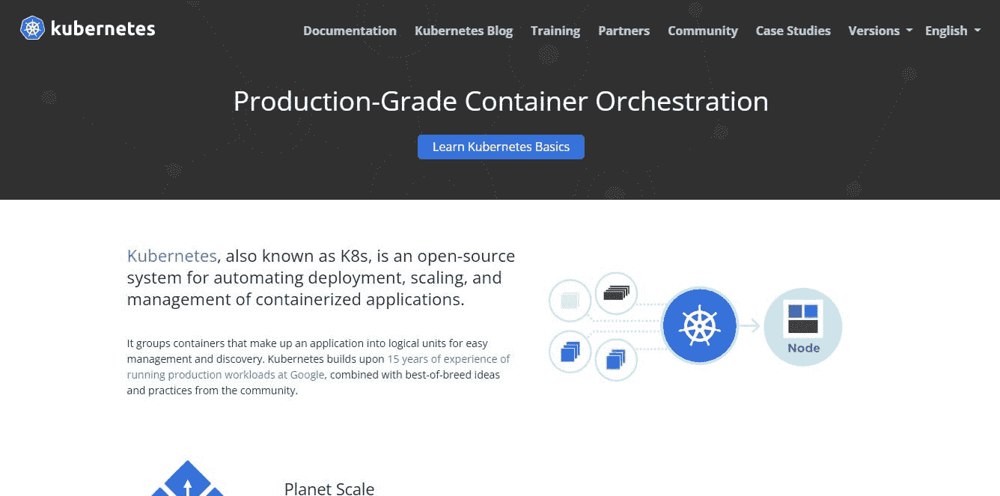

**优点:**

*   Kubernetes 是可扩展的，面向未来的。
*   它使应用程序运行顺畅。
*   性价比很高。

**缺点:**

*   Kubernetes 对初学者来说很复杂。
*   对于简单的项目来说，它太强大了。
*   改用 Kubernetes 需要时间。

> [码头工人](https://www.docker.com/)

如果你正在寻找容器化的应用，Docker 就是你的平台。Docker 产品将帮助您通过 Docker 引擎交付软件包中的软件。

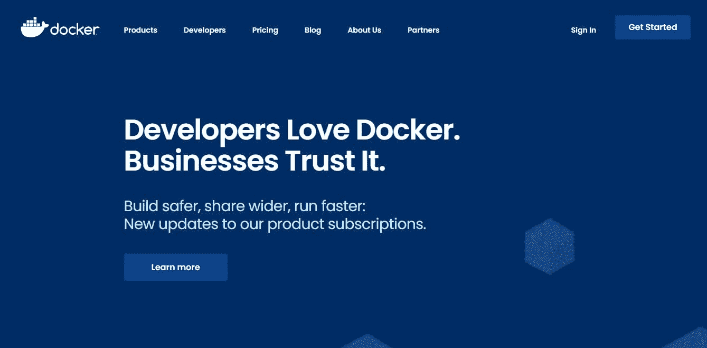

**优点:**

*   它与 Kubernetes 相结合。
*   它鼓励快速发展。
*   码头安全了。
*   使团队在项目上的协作更加容易
*   Docker 提供了跨平台的兼容性。

**缺点:**

*   您需要手动备份容器中的数据。

> 版本控制系统工具

**Git 客户端**

Git 是一个处理协作开发项目的平台。由于其复杂性，开发人员正在为新手开发易于学习的 Git 客户端，以便轻松进入平台。这里有一些顶级的 Git GUI 客户端。

[**Github 桌面**](https://desktop.github.com/)

这个软件程序是一个 Github 客户端，它简化了开发工作流程。基于能源的开源应用程序使开发人员能够克隆存储库，拉请求，并同步分支。Github 桌面在 macOS 和 Windows 上都有。

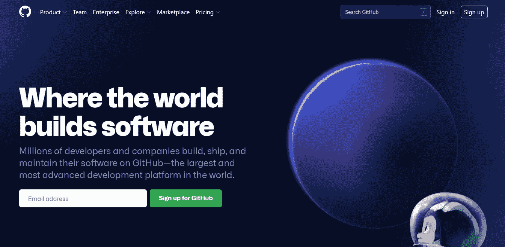

**优点:**

*   它有一个支持它的社区。
*   编辑器具有外壳集成。
*   该平台支持语法高亮显示。

**缺点:**

*   停机时间会严重影响您的工作流程。
*   你不能在 Linux 上使用 Github 桌面。

[**source tree**](https://www.sourcetreeapp.com/)

Sourcetree 是一个初学者友好的 Git GUI 客户端，帮助开发人员可视化 Git 存储库并与之交互。使用 Sourcetree 的子模块，您可以轻松地管理项目及其依赖项。

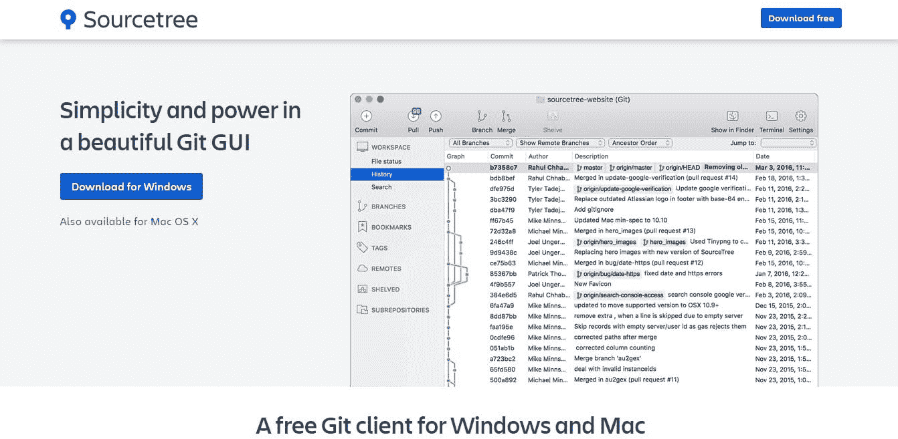

**优点:**

*   Sourcetree 很容易设置。
*   它有一个内置的 Git 终端。
*   它支持 Git LFS。

**缺点:**

*   您需要一个帐户来安装和使用它。
*   用 Sourcetree 解决合并冲突感觉像是一件苦差事。

> [基特克拉肯](https://www.gitkraken.com/)

GitKraken 包含一个直观的 Git GUI 和一个强大的 Git CLI，可以连接 Git、吉拉和 VS 代码。您还可以将免费的 GitKraken GUI 用于公共托管的存储库。

**优点:**

*   它可以在 Mac、Windows 和 Linux 上运行。
*   它易于使用和定制。
*   界面简洁流畅。
*   它有一个黑暗的主题。

**缺点:**

*   加载存储库需要很长时间。
*   如果您提供了您的登录信息，您只能使用免费版本。

> *网页设计和原型制作工具*

设计工具也应该是开发者的武器库；它们帮助你理解产品应该是什么样子，应该如何工作。查看一些设计和原型工具来学习。

[**Adobe XD**](https://www.adobe.com/products/xd.html)

Adobe 是设计和视觉艺术的代名词，它的 UX 设计工具 Adobe XD 保持了这一传统。您可以使用 Adobe XD 进行线框和原型制作。

**优势:**

*   界面易于使用和掌握。
*   该工具提供教程。
*   您可以访问多种画板样式。
*   它为更快的设计提供了重复的网格。

**缺点:**

*   审查应用程序只能在 macOS 上正常工作。
*   您不能创建自定形状。

[草图**草图**草图](https://www.sketch.com/)

Sketch 是一个图形和 UI 组件的编辑器，只能在 Mac 上使用。自发布以来，Sketch 一直是应用程序和网站原型制作的最佳网络应用之一。

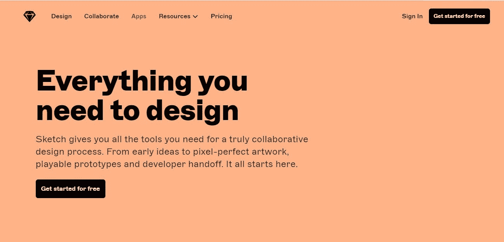

**优点:**

*   界面很好理解。
*   它有一个广泛的插件库。
*   新用户可以毫不费力地使用原型应用程序。

**缺点:**

*   它仅适用于 Mac 设备。
*   素描社区比较小。
*   软件经常崩溃。

[**图玛**](https://www.figma.com/)

Figma 是一个基于 web 的应用程序，用于创建 UI 设计和原型。开发人员依靠 Figma 的工具和很酷的特性，与其他团队成员合作设计他们的应用程序。您也可以将本机应用程序下载到您的设备上。

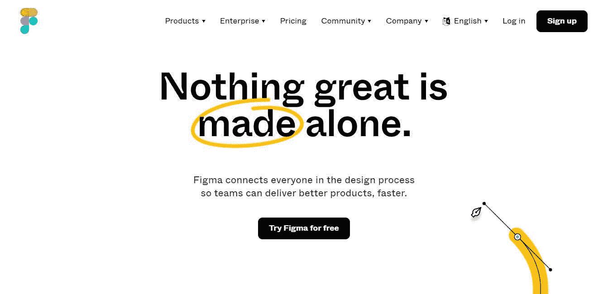

**优点:**

*   你可以在任何设备上使用 Figma。
*   Figma 通过互联网连接。
*   该工具实时保存您的工作。
*   您可以为您的项目访问许多令人兴奋的插件。

**缺点:**

*   对于一个新的设计师来说，学习这个界面可能很有挑战性。
*   没有互联网连接，您可能无法检索您的作品。

[Webflow](https://webflow.com/)

Webflow 是一个站点构建器，web 开发人员可以使用它在个人和商业站点上工作。在将组件添加到主产品之前，开发人员可以使用该平台来设计和可视化组件。

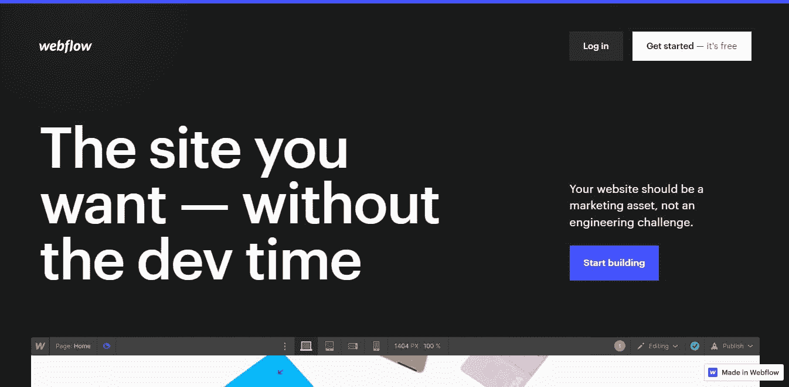

**优点:**

*   不知道怎么编码也可以建一个网站。
*   它有许多可定制的模板。
*   它支持动态内容。

**缺点:**

*   它不提供任何实时支持。
*   订阅很贵。
*   和其他建筑商相比很难学。

[**成帧器**](https://www.framer.com/sites/)

Framer 是一个无代码设计工具，它允许设计者创建漂亮、可用、交互式的设计，提供接近真实的用户体验。开发人员也可以使用这个工具来获取用于开发的资产。虽然 Framer 是一个无代码框架，但您仍然可以添加自定义代码片段来实现更强大的功能。

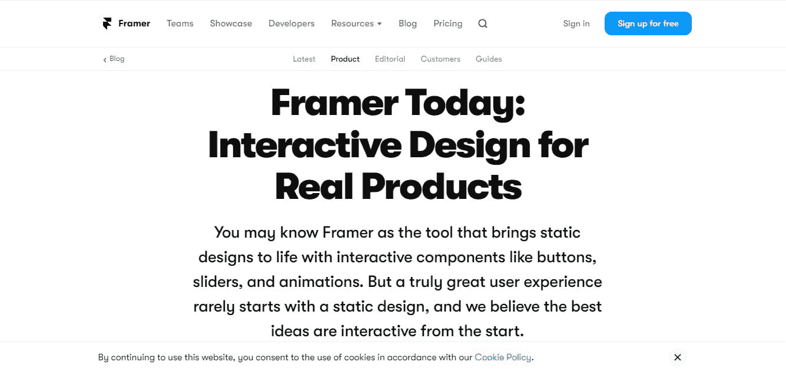

**优点:**

*   编写额外代码的能力为您提供了更多的定制能力。
*   Framer 允许您将原型转换为代码。

**缺点:**

*   你需要基本的编程知识来使用 Framer。
*   它是昂贵的。
*   它比其他设计工具要慢。

[**异想天开**](https://whimsical.com/)

异想天开是一个协作平台，可以帮助企业处理管理任务。当你使用异想天开时，你可以看到思维导图、流程图和低保真度线框。

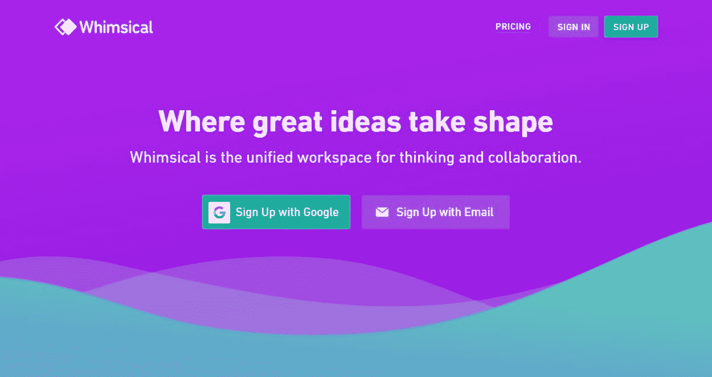

**优点:**

*   这个工具非常适合头脑风暴会议。
*   它有一个拖放编辑器。
*   它支持实时编辑。

**缺点:**

*   导入图像时，web 应用程序经常崩溃。
*   您仍然需要订阅才能使用它。

> *模拟工具*

下面是一些开发者应该知道的高级语言模拟器。

[**LabVIEW**](https://www.ni.com/en-za/shop/labview.html)

实验室虚拟仪器工程工作台(LabVIEW)是一个支持在各种操作系统上进行工业动画系统设计的平台。这个平台是基于 C 和 C++的。LabVIEW 是一个图形化编程环境，工程师使用它来开发自动化研究、验证和生产测试系统。

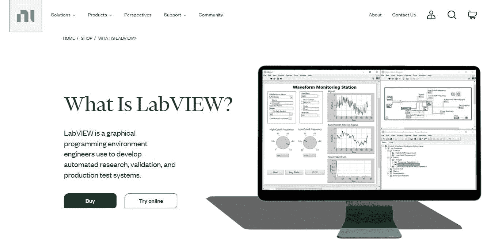

**优点:**

*   它支持通过 USB 命令连接仪器和摄像机。
*   该程序有一个编译器，使用 CPU 来提高整体性能。
*   它允许并行编程。
*   LabVIEW 社区是支持和积极的。

**缺点:**

*   LabVIEW 的表现不如其他现代仿真引擎。
*   更新系统的原生“G”代码是一项艰巨的任务。

[**简单**](https://simpy.readthedocs.io/en/latest/)

SimPy 是一个基于 Python 的模拟器，专注于流程和离散事件。您可以使用这个模拟器进行异步联网。SimPy 及其库的进一步实现出现在 C# (SimSharp)、Julia (SimJulia)和 R(smeller)中。

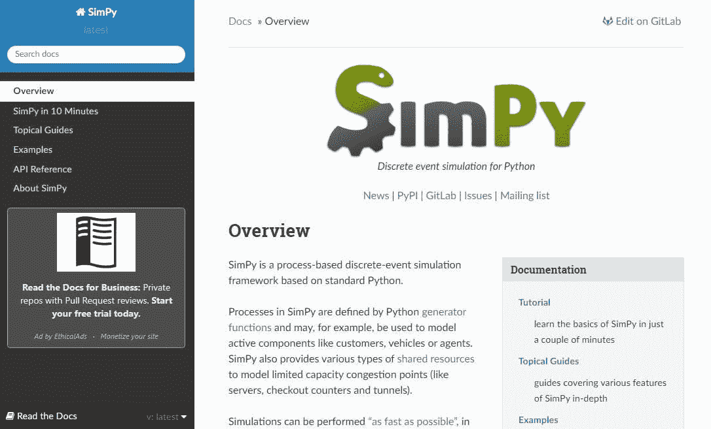

优势:

*   它很容易使用，因为它是基于 Python 的。
*   您可以同时启动多个模拟环境。

缺点:

*   SimPy 文档的质量低于标准。
*   对于非 Python 程序员来说可能很难。

[**嵌套模拟器**](https://www.nest-simulator.org/)

NEST 是一个模拟脉冲神经网络模型的软件程序。它依赖于神经元模型、网络模型和突触模型。NEST 还使用了一个受 PostScript 启发的模拟语言解释器(SLI)。

**优点:**

*   它为初学者提供了示例。
*   它提供了定义大型网络的有效命令。
*   NEST 是一个快速模拟引擎。
*   它有一个很大的社区。

**缺点:**

*   一次模拟需要几行代码。
*   运行 NEST 需要海量内存。

> *电子邮件测试工具*

[**邮件陷阱**](https://mailtrap.io/)

利用 Mailtrap 的电子邮件沙箱功能，开发人员可以从暂存和开发环境中捕获 SMTP 流量。[但是什么是 SMTP 服务器](https://blog.mailtrap.io/what-is-smtp-server/)？

SMTP(简单邮件传输协议)服务器是一个应用程序，可以发送或接收任何转发给服务器的个人或交易电子邮件。

除了测试电子邮件活动，您还可以使用 Mailtrap 来验证您的域名和电子邮件地址。

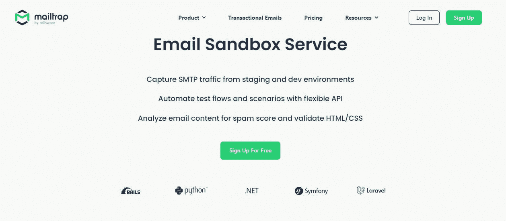

**优点:**

*   它能让你生成 [AMP 供电的电子邮件](https://esputnik.com/en/blog/amp-technology-emails-time-surprise-your-customers)。
*   您可以依靠 Mailtrap 来测试活动以及调试脚本和 HTML 模板。
*   您可以使用此邮件客户端从 CRMs 发送电子邮件。

**缺点:**

*   您可以发送或跟踪的电子邮件数量有限制。

[ngrok](https://ngrok.com/)

ngrok 是一个跨平台的应用程序，它将本地服务器端口暴露给 internet，以便检查通过您的隧道的所有 HTTP 流量。Ngrok 可以在 Mac OS、Windows、Linux 和 Docker 上运行。

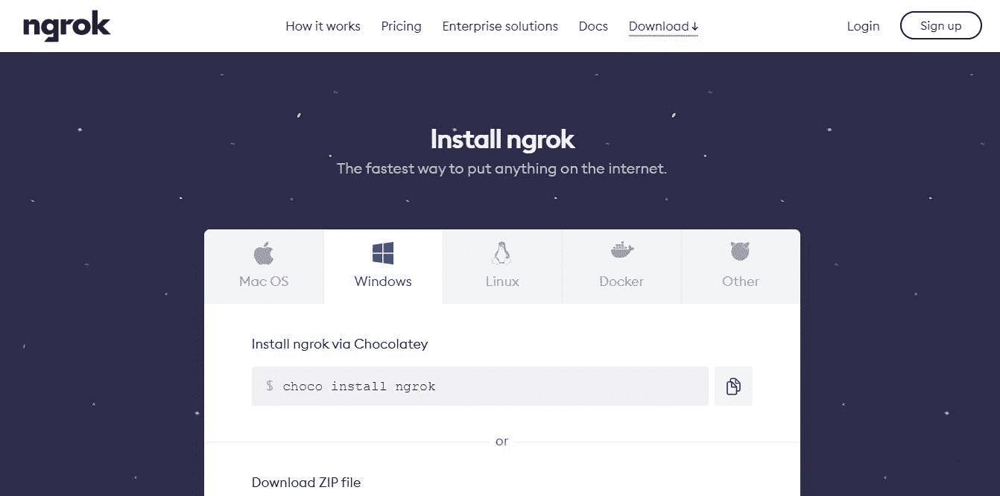

**优点:**

*   它支持 HTTP 和 HTTPS 隧道。
*   它易于设置和使用。
*   您可以使用自定义子域。

**缺点:**

*   只有拥有相应许可证的人才能使用 ngrok。
*   黑客可以滥用这个工具来访问您的网络。
*   荣誉提名

> *值得一提的是所有开发者不可或缺的工具！！！*

[**堆栈溢出**](https://stackoverflow.com/)

Stack Overflow 是一个公共(或私有)平台，包含大量编码问题和答案。开发者喜欢 Stack Overflow 不仅因为它回答了他们的问题，还因为它有一个游戏化的生态系统，就像 Reddit 一样。

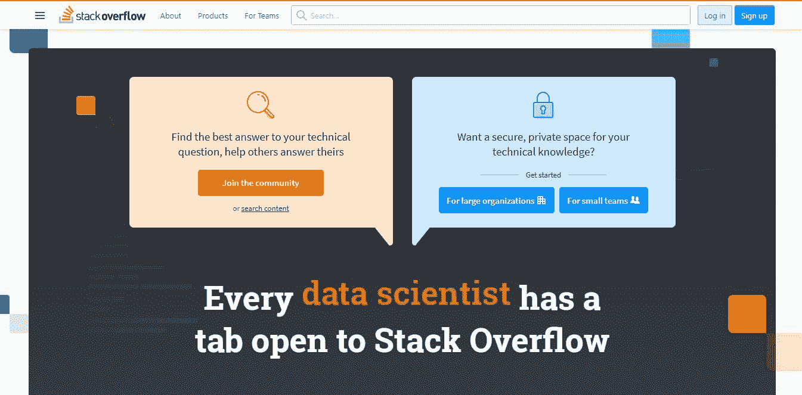

**优点:**

*   堆栈溢出可以为您的编码挑战提供解决方案。
*   你可以和一群专家就任何话题进行交流。
*   你可以通过回答别人的问题来帮助他们。

**缺点:**

*   新用户努力寻找编码挑战的答案。
*   版主往往过于苛刻。

> *总结*

为你的项目找到合适的开发工具对初学者来说总是一个挑战。在选择任何工具之前，一定要确认它的兼容性、可靠性、多功能性和成本效益。您可以始终只选择一个工具，或者将它与类似的工具结合起来，以获得健壮的编码、测试或设计体验。无论哪种方式，都要确保选择一个你和你的团队成员可以使用的平台。

感谢您阅读这篇文章。

请与您的网络分享，并随时使用评论区的问题，答案和贡献。

*原载于*[*https://alemsbaja . hashnode . dev*](https://alemsbaja.hashnode.dev/top-recommended-tools-every-developer-should-have-in-their-locker)*。*

请与您的网络分享，并随时使用评论区的问题，答案和贡献。