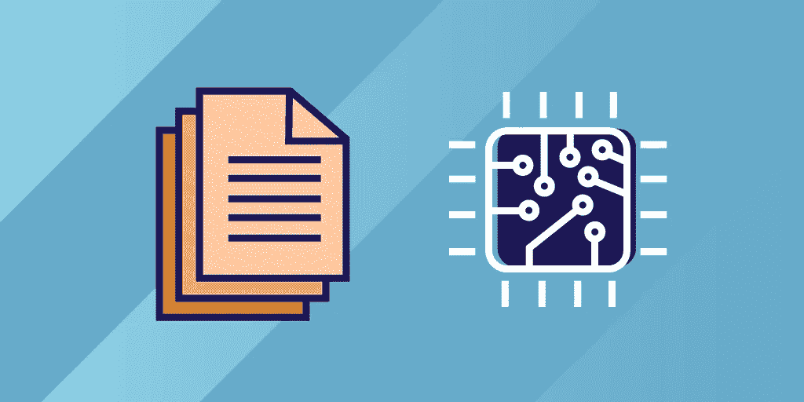

# 2022 年的顶级技术趋势:虚拟化

> 原文：<https://blog.devgenius.io/top-tech-trends-of-2022-virtualization-49c2b54a5c70?source=collection_archive---------0----------------------->

我们离新年只有几个月了，这意味着是时候开始展望将在 2022 年主导软件行业的技术趋势了。随着新年的临近，我们希望帮助您熟悉即将到来的趋势，以便您可以做好准备，并开始将您的技能提升到一个新的水平。今天，我们将讨论*虚拟化*。如果您希望进入云领域，了解这一趋势非常重要！我们将讨论什么是虚拟化，为什么它很重要，它是如何工作的，等等。

我们开始吧！

**我们将报道**:

*   什么是虚拟化？
*   虚拟机和虚拟机管理程序
*   虚拟化是如何工作的？
*   不同类型的虚拟化
*   总结和后续步骤

# 什么是虚拟化？

虚拟化是云计算的一个基本方面。虚拟化技术允许我们**在多个虚拟环境**或虚拟机(VM)中使用物理机的功能。虚拟化软件在计算机硬件上创建了一个抽象层。物理计算机的硬件元素，如内存、存储和处理器，可以划分到不同的虚拟机中。虚拟机就像普通计算机一样运行，每个虚拟机都有自己的操作系统。

云提供商利用虚拟化的强大功能为他们的客户提供最佳服务。您可以在需要时购买所需的计算资源，并且可以在工作负载增加或减少时对其进行扩展。市场上有许多来自微软、IBM、Red Hat、英特尔、AWS 和 VMware 等大型科技公司的不同虚拟化工具和软件。有开源产品，以及可用的公共、私有或混合云服务，因此我们可以选择最适合我们需求的工具。

# 虚拟化的优势

虚拟化的一些主要优势包括:

*   **安全性**:我们可以使用虚拟防火墙来保护数据，隔离我们的应用程序，使其免受各种威胁。虚拟化支持自动配置，从而提高物理或虚拟应用程序的安全性和可见性。
*   **可靠性**:我们可以依靠虚拟环境高效处理灾难恢复操作，并执行任何必要的备份或检索操作。
*   **节省成本**:虚拟化软件更便宜，运行所需的硬件也更少。
*   **测试**:通过虚拟化，我们的环境被分割成不同的虚拟机。我们可以复制这些虚拟机来执行任何必要的测试，而不会影响实际的生产环境。
*   **效率**:由于我们的物理服务器更少，我们不必花费太多时间来维护物理机器。我们可以在虚拟环境中执行我们需要的任何操作，这提高了工作效率。
*   **可扩展性**:借助虚拟化，我们可以轻松扩展虚拟云环境。我们可以根据需要自动扩展以适应增长，从而确保有适当的资源可用。
*   **灾难恢复和停机**:我们可以在发生灾难时复制虚拟机，从而增强弹性并减少停机时间。

# 虚拟机和虚拟机管理程序

虚拟机和虚拟机管理程序是虚拟化中的两个重要概念。它们都在虚拟化的工作方式中扮演着重要的角色。让我们讨论一下什么是虚拟机和虚拟机管理程序，然后我们将更深入地了解虚拟化的工作原理。

# 虚拟机

虚拟机是充当虚拟计算机系统的虚拟环境。它有自己的内存、网络接口、存储、操作系统和 CPU。它不是使用物理硬件来管理、运行和部署程序和应用程序，而是使用虚拟硬件。为了创建一个虚拟化环境，我们有一个物理*主机*机器，我们可以在主机上运行多个虚拟*客户机*。因为每个虚拟机都有自己的操作系统，所以即使它们运行在同一台主机上，来宾机也彼此独立运行。虚拟机非常易于移植，允许我们轻松扩展应用程序来分配繁重的工作负载。

# 虚拟机管理程序

虚拟机管理程序或虚拟机监视器(VMM)是一种**软件，我们可以用它来创建和运行虚拟机**。虚拟机管理程序使用物理资源，使我们能够虚拟地使用和共享系统资源，以支持多个来宾虚拟机。当我们使用虚拟机管理程序时，我们可以并行运行不同的操作系统，并且仍然共享相同的虚拟化硬件资源。它们允许我们将物理资源与虚拟环境分开。虚拟机管理程序主要有两种类型:**裸机**和**托管**。

裸机虚拟机管理程序直接安装在通常安装操作系统的物理服务器上。它们充当轻量级操作系统，主要用于虚拟服务器的情况。托管的虚拟机管理程序**运行在主机的操作系统**之上。就像其他程序一样，它们作为操作系统之上的软件层运行。

# 虚拟化是如何工作的？

正如我们在上一节中所讨论的，我们使用虚拟机管理程序来**为我们的虚拟环境**分离物理资源。我们可以根据需要使用裸机虚拟机管理程序或托管虚拟机管理程序。我们的虚拟机管理程序可以位于操作系统之上，也可以直接安装在硬件上。设置虚拟机管理程序后，我们可以使用它们在虚拟环境中划分资源。然后，我们可以在来宾虚拟机上访问和使用这些资源。

# 不同类型的虚拟化

有多种类型的虚拟化允许我们执行各种任务。让我们来看看一些不同的类型:

# 桌面虚拟化

借助桌面虚拟化，我们可以**将模拟桌面环境**同时部署到多台物理机器上。这意味着我们可以同时在所有虚拟桌面上执行更新和配置。桌面虚拟化有两种类型:本地桌面虚拟化和虚拟桌面基础架构(VDI)。

**本地桌面虚拟化**创建独立于用户设备的虚拟桌面环境和操作系统。这意味着我们可以从任何其他设备访问我们的桌面环境。**虚拟桌面基础架构(VDI)** 允许我们在一台服务器上托管多个桌面环境。这意味着我们可以从单个设备访问各种操作系统，而不必安装多个操作系统。

# 网络虚拟化

网络虚拟化简化了网络管理，因为它允许我们**将硬件元素**抽象成软件，并在不影响任何底层物理硬件的情况下操纵它们。我们可以使用网络虚拟化来创建虚拟网络、防火墙和负载平衡功能。

# 数据虚拟化

数据虚拟化工具允许我们将所有数据整合到一个数据源中。它还允许我们的应用程序在多个位置访问不同来源、不同格式的数据，无论是在云中还是在本地系统中。数据虚拟化使我们能够成功地实时管理、交付和集成数据。

# 操作系统虚拟化

操作系统虚拟化允许我们将应用程序从操作系统中分离出来。我们的系统硬件同时运行各种操作系统的多个实例，这允许我们在一台计算机上运行具有不同操作系统的应用程序。如果需要，这也是并行运行 Linux 和 Windows 环境的好方法。

# 应用虚拟化

应用程序虚拟化允许我们**在服务器**上设置远程应用程序，然后将它们发送到用户的设备。借助应用虚拟化，我们可以从安装应用的设备之外的设备访问应用。我们可以运行我们的应用软件，而无需将其直接安装在我们设备的操作系统上。

***其他类型的虚拟化还有*** *:*

*   服务器虚拟化
*   存储虚拟化
*   CPU 虚拟化
*   GPU 虚拟化
*   Linux 虚拟化
*   云虚拟化
*   数据中心虚拟化

# 总结和后续步骤

祝贺您迈出虚拟化的第一步！虚拟化是云计算世界中的一个基本概念，并且越来越受欢迎。虚拟化软件允许我们跨多个虚拟环境高效地使用和分配物理计算机硬件，因此我们可以在需要时获得所需的资源。我们只是触及了云计算这个基本概念的表面。关于操作系统和虚拟化，还有很多东西需要学习，包括:

*   流程 API
*   直接执行
*   地址转换

*快乐学习！*