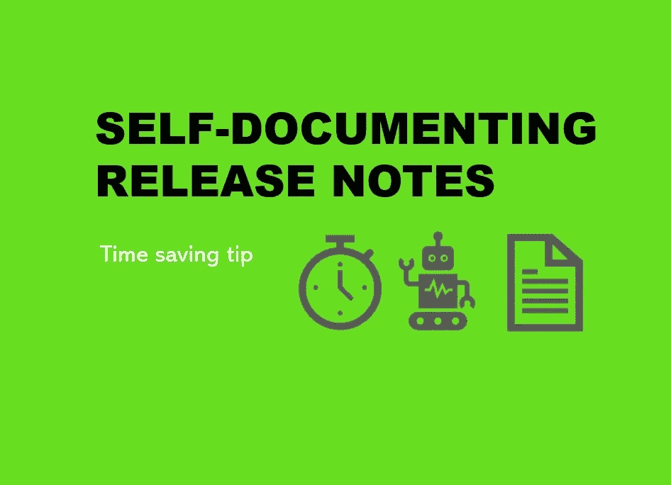

# 使用自我记录的软件发行说明的顶级省时技巧

> 原文：<https://blog.devgenius.io/top-time-saving-tips-using-self-documenting-software-release-notes-d5299f3e0cc2?source=collection_archive---------7----------------------->

## 如果你讨厌文档，但是喜欢用户，也许这是一种进步？

## 活文档

当你意识到测试人员已经签署了你最新的候选版本，可以开始了，那么恐惧就会降临到下一个必要但讨厌的任务上。**文档**。

当我厌倦了这些年来为我的团队填写和编写发布说明时，我们尝试了一些关于懒惰的实验(即智能任务自动化和不重复工作)。一些自动化任务的前期工作比常规的痛苦更好，如果结果是一致的和常规的信息，客户更喜欢它。

# 发行说明含糊不清的差距

由 [mahdis mousavi](https://unsplash.com/@dissii?utm_source=medium&utm_medium=referral) 在 [Unsplash](https://unsplash.com?utm_source=medium&utm_medium=referral) 上拍摄的照片

为什么发行说明会陷入开发和营销团队之间的这种模糊鸿沟？谁应该写它们？开发商？产品负责人？技术作者？这些论点纷至沓来:

*   **产品负责人** —因为他们了解特性和问题。
*   开发人员——因为他们编写软件，所以对它了如指掌。
*   **团队领导/scrum master**——因为软件人员太技术化，没人理解他们，但需要有人接近他们。
*   **测试人员**——因为他们更好地理解了特性如何整体工作，或者如何重现客户报告的错误。
*   **营销** —因为这是向顾客推销产品和传递信息的又一次机会。
*   **技术作者**——因为它需要有一些写作技巧的人来解码技术人员用简单的英语说话和解释。

# 发行说明的时间

尼克·希利尔在 [Unsplash](https://unsplash.com?utm_source=medium&utm_medium=referral) 拍摄的照片

创建和发布发行说明的时机也同样重要:

*   这样做(创建和更新),因为每个标签(功能或错误)都是固定的。
*   等到 sprint 结束时，它已经整齐地显示在 sprint 回顾或演示中了。
*   等到发布候选通过，并被锁定和加载以进行部署。
*   推迟吧，希望用户不要问刁钻的问题。
*   部署后一周再做，只记录用户抱怨/询问最多的内容。

# 细节层次

迈克尔·朗米尔在 [Unsplash](https://unsplash.com?utm_source=medium&utm_medium=referral) 上的照片

下一个问题是在发布说明中应该包含多少细节？：

*   **顶级**几句话解释了发布的目标和目的
    例如安全改进
*   **中级**详细解释大致的领域或变化
    ，例如登录页面安全性提高和密码加强
*   **低层次的**细节解释确切的区域和变化
    例如，通过将最小长度从 8 个字符增加到 12 个字符来加强密码
*   **详细说明**解释确切的区域和变更及原因
    例如，通过将最小长度从 8 个字符增加到 12 个字符来加强密码，以满足英国政府的安全指导说明 ABC123
*   **低级别，带有正当理由** **和可追溯性**解释确切的区域或变更、原因和参考标识符，以追踪到任何 bug 或变更单
    例如，通过将最小长度从 8 个字符增加到 12 个字符来加强 BUG#123401 密码，以满足英国政府的安全指导说明 ABC123

# 带有内置发行说明的自文档化软件示例

开发了什么:

*   更新每个构建注释的自动化构建管道
*   定制构建的工具，用于从配置管理系统中扫描版本中的变更列表，并在构建中生成票证(错误/变更)列表。
*   格式化并附加到 HTML 页面的票证和内部版本号列表。
*   可在 web 应用程序中通过帮助>关于页面访问 HTML 发行说明页面。
*   HTML 发行说明页面包括:票号，1 行车票摘要，超链接到售票系统，以显示完整的车票。
*   HTML 发行说明页面包括明确标记何时正式发布外部软件及其相关的版本号和日期。

它是如何使用的:

*   测试人员接收到一个新的构建进行检查，登录到 web 应用程序并访问 release note 页面。单击每个项目以访问其相关测试，并向票据添加测试注释。
*   外部用户可以轻松访问发行说明，但是他们无法访问详细票据的超链接。

# 学习

以下项目是作者经过一段时间的艰苦学习或发现的，需要仔细考虑:

> 一个自动生成发行说明的系统有很多好处，而且回报时间非常短。

*   构建中的一些变更通过特性标志(暗版本)隐藏起来，并且可能需要隐藏在针对某些用户的版本说明中，以避免混淆。
*   发行说明中包含的最终用户编写的原始票证标题不清楚，并且经常引用错误的内容。
*   在提及产品、模块、任务时，以及在描述症状、问题或解决方案时，标签标题需要通过命名保持一致。
*   软件开发人员不会为最终用户编写清晰的发行说明。
*   团队中需要有人负责一致性、清理和审查变更单标题。
*   任何需要手动干预的步骤都会在某个时候出现延误或出错。
*   随着团队变得越来越高效，部署速度也越来越快，发布说明变得越来越重要。
*   发行说明需要易于访问，并且采用合适的格式。
*   含糊不清或缺少信息的发行说明是不可信的，没有价值的，所以你最好不要制作它们。

# 技巧

*   对于每一个版本，发行说明的生成应该是完全自动化的。
*   发行说明需要及时，并在构建或发布时生成。
*   在发布说明中应该明确外部发布和内部构建的命名和日期。
*   在使用点(即在应用程序中)轻松访问发行说明对用户来说是有益的。
*   在安装任何软件更新之前方便地访问发行说明对 IT 人员来说是有益的。
*   发行说明应包括所有变更的详细信息，包括引用、日期、变更范围、变更类型(缺陷或特性请求或修改)。
*   某些机密更改可能需要根据读者的角色过滤掉，或者在生成详细信息时完全忽略。
*   发布说明需要以简单的方式解释哪里做了更改(让读者决定更改是否影响他们，以及他们是否需要深入了解)。
*   发行说明应该根据用户的角色超链接到更详细的信息。
*   任何指向门票的超链接都应该通过中间层/代理来处理门票系统的任何未来更改。
*   发行说明需要通过用户手册/在线指南/功能解释来补充。

# 进一步阅读

 [## 书评-生活文档-

### 西里尔·马特莱尔的《活的文献》书评。480 页的信息和例子…

外包.开发](https://outsource.dev/book-review-living-documentation/)  [## 活文档——概念的简史和演变

### 第一部分

medium.com](https://medium.com/geekculture/living-documentation-brief-history-and-evolution-of-the-concept-4492fafb5d7)  [## 自文档软件和门有什么共同点？

### 活文档—第 2 部分

medium.com](https://medium.com/geekculture/what-do-self-documenting-software-and-doors-have-in-common-6ad95063570a)