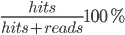

# PostgreSQL 最有用的 SQL 查询

> 原文：<https://blog.devgenius.io/top-useful-sql-queries-for-postgresql-35ff3355d265?source=collection_archive---------3----------------------->

有很多关于使用 PostgreSQL 及其优点的文章，但是并不总是清楚如何监控数据库的状态和影响其最佳工作的指标。在本文中，我们将详细研究 SQL 查询，这将帮助您跟踪这些指标，并对普通用户有用。


# 为什么需要监控 PostgreSQL 的状态？

数据库监控与监控应用程序一样重要。有必要对流程进行比系统级更详细的监控。为此，您可以跟踪以下指标:

1.  数据库缓存的效率如何？
2.  您的数据库中的表有多大？
3.  你的索引被使用了吗？
4.  等等。

# 监控数据库及其元素的大小

## 1.表空间的大小

```
SELECT spcname, pg_size_pretty(pg_tablespace_size(spcname)) 
FROM pg_tablespace
WHERE spcname<>'pg_global';
```

运行查询后，您将收到关于在数据库中创建的所有表空间的大小的信息。pg_tablespace_size 函数提供了有关表空间大小的信息(以字节为单位),因此我们也使用 pg_size_pretty 函数使其可读。pg_global 空间被排除在外，因为它用于共享系统目录。

## 2.数据库的大小

```
SELECT pg_database.datname,
       pg_size_pretty(pg_database_size(pg_database.datname)) AS size
FROM pg_database
ORDER BY pg_database_size(pg_database.datname) DESC;
```

运行查询后，您将收到在 PostgreSQL 实例中创建的每个数据库的大小信息。

## 3.数据库中模式的大小

```
SELECT A.schemaname,
       pg_size_pretty (SUM(pg_relation_size(C.oid))) as table, 
       pg_size_pretty (SUM(pg_total_relation_size(C.oid)-pg_relation_size(C.oid))) as index, 
       pg_size_pretty (SUM(pg_total_relation_size(C.oid))) as table_index,
       SUM(n_live_tup)
FROM pg_class C
LEFT JOIN pg_namespace N ON (N.oid = C .relnamespace)
INNER JOIN pg_stat_user_tables A ON C.relname = A.relname
WHERE nspname NOT IN ('pg_catalog', 'information_schema')
AND C .relkind <> 'i'
AND nspname !~ '^pg_toast'
GROUP BY A.schemaname;
```

运行查询后，您将收到有关数据库中每个模式的详细信息:所有表的总大小、所有索引的总大小、模式的总大小以及所有模式表中的总行数。

## 4.桌子的大小

```
SELECT schemaname,
       C.relname AS "relation",
       pg_size_pretty (pg_relation_size(C.oid)) as table,
       pg_size_pretty (pg_total_relation_size (C.oid)-pg_relation_size(C.oid)) as index,
       pg_size_pretty (pg_total_relation_size (C.oid)) as table_index,
       n_live_tup
FROM pg_class C
LEFT JOIN pg_namespace N ON (N.oid = C .relnamespace)
LEFT JOIN pg_stat_user_tables A ON C.relname = A.relname
WHERE nspname NOT IN ('pg_catalog', 'information_schema')
AND C.relkind <> 'i'
AND nspname !~ '^pg_toast'
ORDER BY pg_total_relation_size (C.oid) DESC
```

运行查询后，您将收到关于每个表的详细信息，指示其模式、无索引的大小、索引的大小、表和索引的总大小，以及表中的行数。

# `deadlocks`的控制

如果不止一个用户使用您的数据库，那么总是存在查询死锁的风险，并且会出现一个队列，其中有大量的查询将被挂起。通常，当使用相同的表处理多个查询时，会出现这种情况。它们会阻止对方完成查询，并阻止其他查询开始。你可以在[官方文档](https://www.postgresql.org/docs/current/explicit-locking.html)中读到更多相关内容。我们将考虑找到锁并移除它们的方法。

## 1.死锁的监控

```
SELECT COALESCE(blockingl.relation::regclass::text, blockingl.locktype) AS locked_item,
       now() - blockeda.query_start                                     AS waiting_duration,
       blockeda.pid                                                     AS blocked_pid,
       blockeda.query                                                   AS blocked_query,
       blockedl.mode                                                    AS blocked_mode,
       blockinga.pid                                                    AS blocking_pid,
       blockinga.query                                                  AS blocking_query,
       blockingl.mode                                                   AS blocking_mode
FROM pg_locks blockedl
JOIN pg_stat_activity blockeda ON blockedl.pid = blockeda.pid
JOIN pg_locks blockingl ON (blockingl.transactionid = blockedl.transactionid OR
                            blockingl.relation = blockedl.relation AND
                            blockingl.locktype = blockedl.locktype) AND blockedl.pid <> blockingl.pid
JOIN pg_stat_activity blockinga ON blockingl.pid = blockinga.pid AND blockinga.datid = blockeda.datid
WHERE NOT blockedl.granted AND blockinga.datname = current_database();
```

该查询显示被阻止的查询的所有信息，以及谁阻止了它们的信息。

## 2.死锁的消除

```
SELECT pg_cancel_backend(PID_ID);
OR
SELECT pg_terminate_backend(PID_ID);
```

PID_ID 是阻止其他查询的查询的 ID。大多数情况下，取消一个阻塞查询就足以消除死锁并启动整个累积队列。pg_cancel_backend 和 pg_terminate_backend 的区别在于，pg_cancel_backend 取消查询，pg_terminate_backend 结束会话并关闭数据库连接。pg_cancel_backend 命令更加温和，在大多数情况下对您来说已经足够了。如果没有，使用 pg_terminate_backend。

# 数据库最佳性能的指标

## 1.缓存命中率

```
SELECT sum(heap_blks_read) as heap_read,
       sum(heap_blks_hit)  as heap_hit,
       sum(heap_blks_hit) / (sum(heap_blks_hit) + sum(heap_blks_read)) as ratio
FROM 
  pg_statio_user_tables;
```

缓存系数是对读取效率的一种衡量，通过缓存读取占磁盘和缓存读取总数的比例来衡量。除了使用数据存储时，理想的缓存比率是 99%或更高，这意味着至少 99%的读取是从缓存执行的，不超过 1%是从磁盘执行的。



## 2.索引的使用

```
SELECT relname,   
       100 * idx_scan / (seq_scan + idx_scan) percent_of_times_index_used,   
       n_live_tup rows_in_table 
FROM pg_stat_user_tables 
WHERE seq_scan + idx_scan > 0 
ORDER BY n_live_tup DESC;
```

向数据库中添加索引对查询性能有很大的影响。索引对于大型表尤其重要。该查询显示了表中的行数，以及与没有索引的读取相比，索引使用时间所占的百分比。添加索引的理想候选对象是大于 10，000 行且索引使用率为零或很低的表。

## 3.索引缓存命中率

```
SELECT sum(idx_blks_read) as idx_read,
       sum(idx_blks_hit)  as idx_hit,
       (sum(idx_blks_hit) - sum(idx_blks_read)) / sum(idx_blks_hit) as ratio
FROM pg_statio_user_indexes;
```

这个系数类似于通常的缓存系数，但是是根据索引使用数据计算的。

## 4.未使用的索引

```
SELECT schemaname, relname, indexrelname
FROM pg_stat_all_indexes
WHERE idx_scan = 0 and schemaname <> 'pg_toast' and schemaname <> 'pg_catalog'
```

该查询查找已创建但未在 SQL 查询中使用的索引。

## 5.数据库膨胀

```
SELECT
  current_database(), schemaname, tablename, /*reltuples::bigint, relpages::bigint, otta,*/
  ROUND((CASE WHEN otta=0 THEN 0.0 ELSE sml.relpages::float/otta END)::numeric,1) AS tbloat,
  CASE WHEN relpages < otta THEN 0 ELSE bs*(sml.relpages-otta)::BIGINT END AS wastedbytes,
  iname, /*ituples::bigint, ipages::bigint, iotta,*/
  ROUND((CASE WHEN iotta=0 OR ipages=0 THEN 0.0 ELSE ipages::float/iotta END)::numeric,1) AS ibloat,
  CASE WHEN ipages < iotta THEN 0 ELSE bs*(ipages-iotta) END AS wastedibytes
FROM (
  SELECT
    schemaname, tablename, cc.reltuples, cc.relpages, bs,
    CEIL((cc.reltuples*((datahdr+ma-
      (CASE WHEN datahdr%ma=0 THEN ma ELSE datahdr%ma END))+nullhdr2+4))/(bs-20::float)) AS otta,
    COALESCE(c2.relname,'?') AS iname, COALESCE(c2.reltuples,0) AS ituples, COALESCE(c2.relpages,0) AS ipages,
    COALESCE(CEIL((c2.reltuples*(datahdr-12))/(bs-20::float)),0) AS iotta /* very rough approximation, assumes all cols */
  FROM (
    SELECT
      ma,bs,schemaname,tablename,
      (datawidth+(hdr+ma-(case when hdr%ma=0 THEN ma ELSE hdr%ma END)))::numeric AS datahdr,
      (maxfracsum*(nullhdr+ma-(case when nullhdr%ma=0 THEN ma ELSE nullhdr%ma END))) AS nullhdr2
    FROM (
      SELECT
        schemaname, tablename, hdr, ma, bs,
        SUM((1-null_frac)*avg_width) AS datawidth,
        MAX(null_frac) AS maxfracsum,
        hdr+(
          SELECT 1+count(*)/8
          FROM pg_stats s2
          WHERE null_frac<>0 AND s2.schemaname = s.schemaname AND s2.tablename = s.tablename
        ) AS nullhdr
      FROM pg_stats s, (
        SELECT
          (SELECT current_setting('block_size')::numeric) AS bs,
          CASE WHEN substring(v,12,3) IN ('8.0','8.1','8.2') THEN 27 ELSE 23 END AS hdr,
          CASE WHEN v ~ 'mingw32' THEN 8 ELSE 4 END AS ma
        FROM (SELECT version() AS v) AS foo
      ) AS constants
      GROUP BY 1,2,3,4,5
    ) AS foo
  ) AS rs
  JOIN pg_class cc ON cc.relname = rs.tablename
  JOIN pg_namespace nn ON cc.relnamespace = nn.oid AND nn.nspname = rs.schemaname AND nn.nspname <> 'information_schema'
  LEFT JOIN pg_index i ON indrelid = cc.oid
  LEFT JOIN pg_class c2 ON c2.oid = i.indexrelid
) AS sml
ORDER BY wastedbytes DESC;
```

数据库膨胀是表或索引已经使用的磁盘空间，可供数据库重用，但尚未释放。当表或索引被更新时，就会发生膨胀。如果您有一个加载了大量删除操作的数据库，膨胀会在数据库中留下大量未使用的空间，如果不将其删除，会影响性能。如果您有任何严重的膨胀问题，表的 wastedbytes 和索引的 wasted bytes 指标将会显示出来。为了对付膨胀，有一个真空的命令。

## 6.检查真空启动

```
SELECT relname, 
       last_vacuum, 
       last_autovacuum 
FROM pg_stat_user_tables;
```

使用 VACUUM 命令可以减少膨胀，但是 PostgreSQL 也支持 AUTOVACUUM。你可以在这里阅读它的设置[。](https://www.postgresql.org/docs/13/runtime-config-autovacuum.html)

# 还有几个可能对你有用的问题

## 1.显示打开的连接数

```
SELECT COUNT(*) as connections,
       backend_type
FROM pg_stat_activity
where state = 'active' OR state = 'idle'
GROUP BY backend_type
ORDER BY connections DESC;
```

显示 PostgreSQL 实例中所有数据库的打开连接。如果在一个 PostgreSQL 中有多个数据库，则将 datname = 'Your Database '添加到 WHERE 条件中。

## 2.显示正在运行的查询

```
SELECT pid, age(clock_timestamp(), query_start), usename, query, state
FROM pg_stat_activity
WHERE state != 'idle' AND query NOT ILIKE '%pg_stat_activity%'
ORDER BY query_start desc;
```

显示正在运行的查询及其持续时间。

# 结论

当我的数据库中出现任何问题时，以上所有的问题都是我从网上收集的。如果还有其他对 PostgreSQL 用户有用的问题，我会很高兴你能在评论中分享。希望文章能帮到你，节省你的时间。