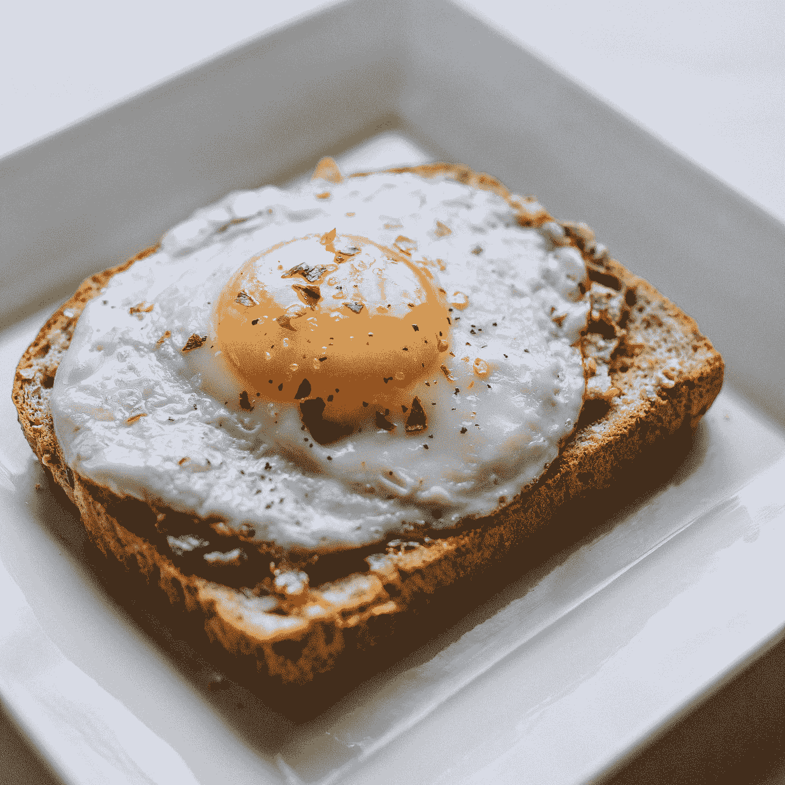

# 用于添加旋转木马、吐司和下拉菜单的顶级 Vue 包

> 原文：<https://blog.devgenius.io/top-vue-packages-for-adding-carousels-toasts-and-dropdowns-4107636f43ba?source=collection_archive---------47----------------------->


由 [Max Bender](https://unsplash.com/@maxwbender?utm_source=medium&utm_medium=referral) 在 [Unsplash](https://unsplash.com?utm_source=medium&utm_medium=referral) 上拍摄的照片

Vue.js 是一个易于使用的 web 应用框架，我们可以用它来开发交互式前端应用。

在这篇文章中，我们将看看如何最好地添加一个旋转木马，显示祝酒词，并添加下拉菜单。

# 旋转木马

我们可以使用 Vue Carousel 组件向我们的应用程序添加幻灯片。

要安装它，我们运行:

```
npm i vue-carousel
```

然后我们可以通过写来使用它:

`main.js`

```
import Vue from "vue";
import App from "./App.vue";
import VueCarousel from "vue-carousel";Vue.use(VueCarousel);
Vue.config.productionTip = false;new Vue({
  render: h => h(App)
}).$mount("#app");
```

`App.vue`

```
<template>
  <div>
    <carousel :per-page="1" :navigate-to="2" :mouse-drag="false">
      <slide v-for="n in 10" :key="n">Slide {{n}}</slide>
    </carousel>
  </div>
</template>

<script>
export default {
  data() {}
};
</script>
```

我们设置`navigate-to`来导航给定索引的幻灯片。

`per-page`是每页幻灯片的数量。

`mouse-drag`是`false`，所以我们不能通过拖动鼠标来导航。

在`carousel`组件中，我们添加了`slide`组件来添加幻灯片。

它有许多其他选项，也支持过渡。

选项包括设置分页样式、导航标签、自动播放等。

# Vue Toastification

Vue Toastification 让我们可以添加各种风格的吐司。

要使用它，我们首先通过编写以下内容来安装该软件包:

```
npm i vue-toastification
```

然后我们可以注册插件并导入 CSS:

```
import Vue from "vue";
import App from "./App.vue";
import Toast from "vue-toastification";
import "vue-toastification/dist/index.css";Vue.use(Toast);
Vue.config.productionTip = false;new Vue({
  render: h => h(App)
}).$mount("#app");
```

然后我们可以写下祝酒词:

```
<template>
  <div></div>
</template>

<script>
export default {
  mounted() {
    this.$toast("toast!");
  }
};
</script>
```

现在我们应该得到一个弹出窗口，显示我们传递给`this.$toast`的消息。

我们也可以写:

```
<template>
  <div></div>
</template>

<script>
export default {
  mounted() {
    this.$toast("My toast", {
      timeout: 2000
    });
  }
};
</script>
```

在显示 toast 之前添加延迟。

延迟以毫秒为单位。

它还可以与 Nuxt 和复合 API 一起工作。

# vue-选择

vue-select 允许我们添加一个比常规 select 元素更灵活的下拉菜单。

要使用它，我们通过运行以下命令来安装它:

```
npm i vue-select
```

然后我们可以通过注册插件和导入内置样式来使用它:

```
import Vue from "vue";
import App from "./App.vue";
import vSelect from "vue-select";
import "vue-select/dist/vue-select.css";Vue.component("v-select", vSelect);
Vue.config.productionTip = false;new Vue({
  render: h => h(App)
}).$mount("#app");
```

我们可以添加带有`v-select`组件的下拉列表:

```
<template>
  <div>
    <v-select v-model="country" :options="['Canada', 'United States']"></v-select>
    <p>{{country}}</p>
  </div>
</template>

<script>
export default {
  data() {
    return {
      country: ""
    };
  }
};
</script>
```

它通过`v-model`绑定到`country`，并通过`options`属性接受选项。

我们可以通过写入以下内容来添加不同于该值的标签:

```
<template>
  <div>
    <v-select v-model="country" label="name" :options="countries"></v-select>
    <p>{{country}}</p>
  </div>
</template>

<script>
export default {
  data() {
    return {
      country: "",
      countries: [{ name: "Canada", code: "ca" }, { name: "US", code: "us" }]
    };
  }
};
</script>
```

向用户显示`label`。

我们甚至可以添加分页:

```
<template>
  <div>
    <v-select
      v-model="country"
      label="country"
      :options="paginated"
      @search="query => search = query"
      :filterable="false"
    >
      <li slot="list-footer">
        <button @click="offset -= 10" :disabled="!hasPrevPage">Prev</button>
        <button @click="offset += 10" :disabled="!hasNextPage">Next</button>
      </li>
    </v-select>
    <p>{{country}}</p>
  </div>
</template><script>
export default {
  data: () => ({
    countries: [
      {
        country: "Afghanistan"
      },
      {
        country: "Albania"
      },
      {
        country: "Algeria"
      },
      {
        country: "American Samoa"
      },
      {
        country: "Andorra"
      },
      {
        country: "Angola"
      },
      {
        country: "Anguilla"
      },
      {
        country: "Antarctica"
      },
      {
        country: "Antigua and Barbuda"
      },
      {
        country: "Argentina"
      },
      {
        country: "Armenia"
      }
    ],
    search: "",
    offset: 0,
    limit: 10,
    country: ""
  }),
  computed: {
    filtered() {
      return this.countries.filter(country =>
        country.country.includes(this.search)
      );
    },
    paginated() {
      return this.filtered.slice(this.offset, this.limit + this.offset);
    },
    hasNextPage() {
      const nextOffset = this.offset + 10;
      return Boolean(
        this.filtered.slice(nextOffset, this.limit + nextOffset).length
      );
    },
    hasPrevPage() {
      const prevOffset = this.offset - 10;
      return Boolean(
        this.filtered.slice(prevOffset, this.limit + prevOffset).length
      );
    }
  }
};
</script>
```

我们有`search`事件处理程序来设置下拉列表的搜索值。

我们有一个带有分页按钮的页脚。

它们调用方法来获取我们希望为页面显示的数组片段。

如果没有下一页或上一页，我们分别显示下一页或上一页按钮。



本·科尔德在 [Unsplash](https://unsplash.com?utm_source=medium&utm_medium=referral) 上的照片

# 结论

Vue Carousel 是一个简单易用的 Vue 应用程序轮播。

Vue Toastification 让我们可以轻松添加吐司。

vue-select 是一个下拉组件，比 select 元素强大得多。