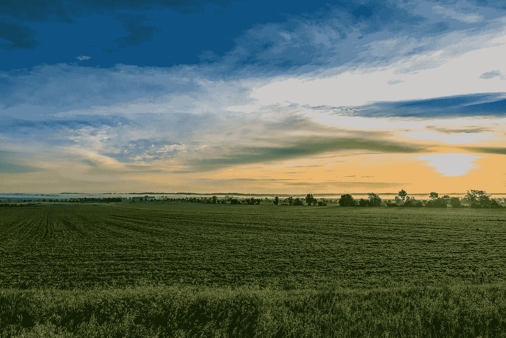
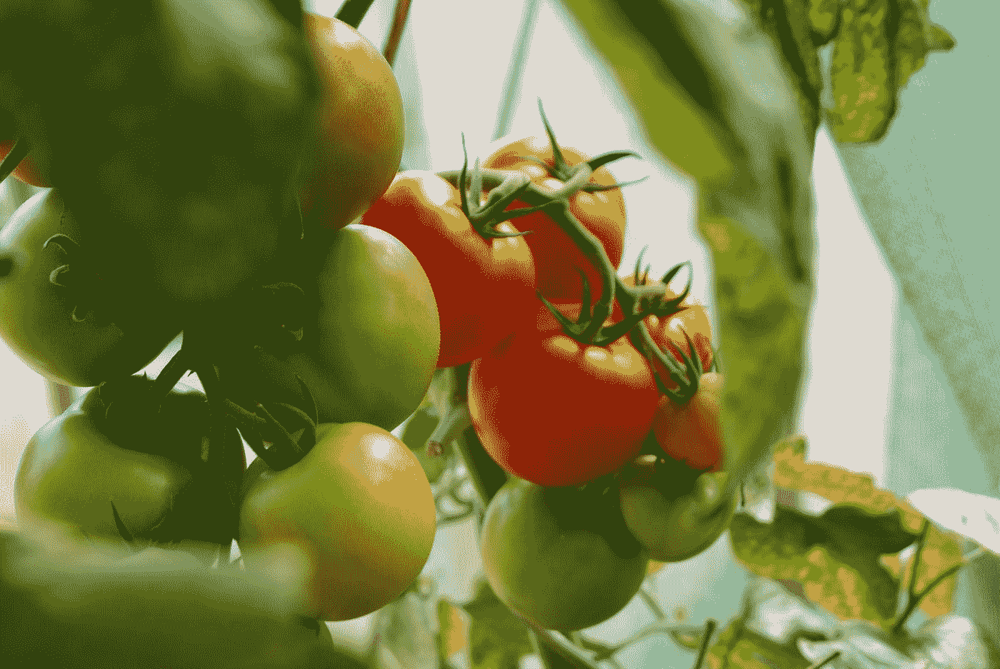

# 用于添加 Croppers、日历和 Lodash 的顶级 Vue 包

> 原文：<https://blog.devgenius.io/top-vue-packages-for-adding-croppers-calendars-and-lodash-914bd8940dc0?source=collection_archive---------48----------------------->



斯蒂芬·沃克在 [Unsplash](https://unsplash.com?utm_source=medium&utm_medium=referral) 上拍摄的照片

Vue.js 是一个易于使用的 web 应用框架，我们可以用它来开发交互式前端应用。

在本文中，我们将看看如何最好地添加一个裁剪器、日历、全年日期选择器和 Lodash。

# vue-cropperjs

我们可以使用 vue-cropperjs 包将图像裁剪器添加到我们的 vue 应用程序中。

要使用它，首先我们通过运行以下命令来安装它:

```
npm i vue-cropperjs
```

然后我们可以通过写来使用它:

```
<template>
  <div>
    <vue-cropper ref="cropper" src="https://placekitten.com/200/200" alt="Source Image"></vue-cropper>
  </div>
</template>

<script>
import VueCropper from "vue-cropperjs";
import "cropperjs/dist/cropper.css";export default {
  components: { VueCropper }
};
</script>
```

我们只需要导入并注册`VueCropper`组件。

然后我们用`src`道具设置图像。

它发出`ready`、`cropstart`、`cropmove`、`cropend`、`crop`和`zoom`事件。

所以我们可以做任何想做的事。

此外，我们可以通过从 ref 调用方法来以编程方式使用它。

例如，我们可以写:

```
this.$refs.cropper.zoom(1.5);
```

来放大。

# 威洛达什

vue-lodash 是 lodash 的一个包装器，我们可以在我们的 vue 应用程序中使用它。

要安装它，我们运行:

```
npm i vue-lodash lodash
```

Lodash 是必需的依赖项。

然后我们可以通过写来使用它:

`main.js`

```
import Vue from "vue";
import App from "./App.vue";
import VueLodash from "vue-lodash";
import lodash from "lodash";Vue.use(VueLodash, { name: "custom", lodash });
Vue.config.productionTip = false;new Vue({
  render: h => h(App)
}).$mount("#app");
```

我们注册了`VueLodash`插件。`name`是我们可以用来调用 Lodash 的属性名。

`lodash`就是库本身。

然后在我们的组件中，我们可以写:

```
<template>
  <div></div>
</template>

<script>
export default {
  mounted() {
    console.log(this.lodash.random(20));
    console.log(this._.random(20));
    console.log(this.custom.random(20));
  }
};
</script>
```

我们可以用传递给`Vue.use`的对象的`name`属性中定义的`lodash`、`_`或`custom`属性调用 Lodash。

# vue-材料-年份-日历

vue-material-year-calendar 是一个有用的软件包，可以让我们添加一个完整的日历。

它在屏幕上显示所有月份，而不是像大多数日期选择器那样显示一个月份。

要安装它，我们运行:

```
npm i vue-material-year-calendar
```

然后我们可以通过写来使用它:

```
<template>
  <YearCalendar
    v-model="year"
    :activeDates.sync="activeDates"
    [@toggleDate](http://twitter.com/toggleDate)="toggleDate"
    prefixClass="prefix"
    :activeClass="activeClass"
  ></YearCalendar>
</template>

<script>
import YearCalendar from "vue-material-year-calendar";export default {
  components: { YearCalendar },
  data() {
    return {
      year: 2020,
      activeDates: [
        { date: "2020-02-13" },
        { date: "2020-02-14", className: "red" },
        { date: "2020-02-15", className: "blue" },
        { date: "2020-02-16" }
      ],
      activeClass: "active"
    };
  },
  methods: {
    toggleDate(dateInfo) {
      console.log(dateInfo);
    }
  }
};
</script><style>
.red {
  color: red;
}.blue {
  color: blue;
}.active {
  background: yellow;
}
</style>
```

我们使用`YearCalendar`组件。

将`toggleDate`事件设置为`toggleDate`方法来记录日期。

让我们给包装类添加一个前缀。

`activeDates`已经将日子设定为高亮显示。我们以自己的班级为亮点。

`v-model`绑定到`year`设置初始年份。

# vue-完整日历

vue-full-calendar 是一个日历小部件，我们可以添加到 vue 应用程序中。

要安装它，我们运行:

```
npm i vue-full-calendar moment jquery
```

Moment 和 jQuery 是必需的依赖项

然后我们可以通过写来使用它:

`main.js`

```
import Vue from "vue";
import App from "./App.vue";
import FullCalendar from "vue-full-calendar";
import "fullcalendar/dist/fullcalendar.css";Vue.use(FullCalendar);
Vue.config.productionTip = false;new Vue({
  render: h => h(App)
}).$mount("#app");
```

我们注册插件并导入 CSS。

`App.vue`

```
<template>
  <full-calendar :events="events"></full-calendar>
</template>

<script>
import { FullCalendar } from "vue-full-calendar";
export default {
  components: {
    FullCalendar
  },
  data() {
    return {
      events: [
        {
          title: "eat",
          start: "2020-01-01"
        },
        {
          title: "drink",
          start: "2020-01-05",
          end: "2020-01-07"
        },
        {
          title: "sleep",
          start: "2020-01-09T12:30:00",
          allDay: false
        }
      ]
    };
  }
};
</script>
```

我们使用`full-calendar`组件。

我们传入一个数组`events`,每个条目都有标题、开始和结束日期。

此外，我们可以设置`allDay`属性来添加全天事件。



照片由 [Dani California](https://unsplash.com/@danicalifornia?utm_source=medium&utm_medium=referral) 在 [Unsplash](https://unsplash.com?utm_source=medium&utm_medium=referral) 拍摄

# 结论

vue-cropperjs 允许我们在 vue 应用程序中添加一张裁剪过的图像。

vue-full-calendar 包是一个日历小部件，我们可以用它来显示事件

vue-material-year-calendar 是一款独特的日期选择器，可以显示全年。

vue-lodash 是 lodash 的 vue 包装器。