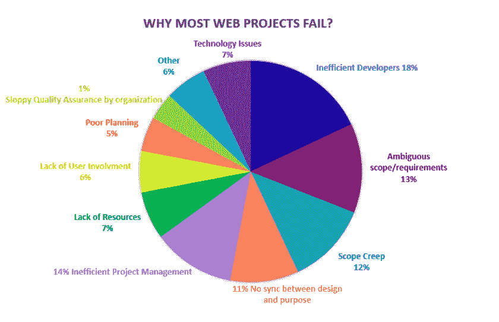

# Web 开发面临的最大挑战&如何应对？

> 原文：<https://blog.devgenius.io/top-web-development-challenges-how-to-tackle-them-ac4a6cb3db4f?source=collection_archive---------2----------------------->

挑战通常被认为是负面的，但是每一个挑战都有可能带来好的东西。

web 开发行业也是如此。当你开始为你的企业开发网站或网络应用程序时，你可能会面临许多挑战。尽管如此，这对于资源最少且 web 基础设施发展良好的小型企业来说尤其如此。

但是，这并不意味着你要这么轻易放弃。你总是可以通过变聪明来克服这些 web 开发的挑战。这就是我们将要讨论的如何以一种简单的方式处理 web 开发挑战。

但是在我们开始之前，你知道吗？当今世界上有超过 **1，905，757，400 个**网站。

**图片来源:Internetlivestats**

这个数字对一些人来说可能有点吓人。但是，如果你仔细想想，这个数量的网站真的意味着商业机会。

因此，让我们快速浏览一下您在业务中可能面临的挑战列表。让我们来谈谈如何解决这些问题。

# 十个最常见的 Web 开发挑战&需要克服的解决方案！

> **1。为你的团队确定一个好的网站开发策略**

语言学习网站 Babbel 的创始人汤姆·布什说:“成功的商业战略始于清楚地了解你客户的问题，以及你公司的产品和/或服务如何解决这些问题。”。

第一个挑战是为你的团队制定一个好的网站开发策略。web 项目失败的主要原因之一是缺乏清晰的 web 开发策略或糟糕的规划。

图片来源:[阿米亚](https://www.armia.com/blog/why-do-some-web-projects-fail/)

他们没有明确的角色分配，也不知道交付一个项目需要多长时间。没有这些知识，公司就无法准确预测项目的时间表或成本。他们最终会错过预算或截止日期，因为他们没有做出正确决策的信息。

此外，这会导致团队成员之间的冲突。团队成员可能在项目的不同部分工作，而没有意识到他们是在互相对抗而不是互相合作。

**解决方案:**

*   将所有人召集在一起，解释你们将如何作为一个团队进行协作，包括谁在何时做什么。这是应对 web 开发挑战的最关键的一步。
*   列出你的网站开发策略和计划，以及任何相关的任务或可交付成果。这样，你永远都知道下一步是什么，谁负责完成它。

> **2。将业务目标与功能和时间表结合起来**

将业务目标与功能和时间表结合起来是 web 开发中的下一个挑战。许多企业在这方面苦苦挣扎，因为他们没有认识到哪些功能必须支持他们的业务目标。

例如，一家公司可能希望在其网站上添加购物车功能。然而，如果公司没有任何产品出售，添加购物车将通过增加收入或获得新客户来改善业务目标。

然而，如果公司确实销售产品，并希望获得更多收入和新客户，那么添加购物车将有助于公司实现这些目标。

**解决方案:**

*   创建清晰且可衡量的业务目标，例如增加 X 倍的收入或获得 Y 倍的新客户。
*   列出有助于你实现每个目标的特征。确定哪些功能可以现在添加，哪些必须等到以后添加。

> **3。为您的产品选择合适的技术组合**

今天，web 开发不仅仅是简单地构建一个网站或应用程序。你必须考虑你的产品实现其商业目标所需的所有特性和功能。

为您的项目选择正确的技术组合是实现这些目标的第一步。这涉及到决定你是应该从头开始创建它，还是使用像 Angular 这样的现有框架。以下是您可以在项目中考虑的技术列表。

技术栈包括编程语言、数据库、web 服务器和用于构建产品的工具。如果您的团队不精通技术堆栈的某些领域，您可能需要雇用在这些领域有经验的开发人员。

**解决方案:**

*   你可以咨询一家 web 开发公司或者一家 [**IT 咨询公司**](https://www.pixelcrayons.com/technology-consulting-services) 来帮你确定你的技术栈。
*   您可以与已经有构建类似产品经验的开发人员交流，了解他们为这些产品使用了什么技术。

> **4。向所有相关人员清楚传达进度**

在很多公司，不同的团队负责产品的不同部分。当开发团队在构建网站或应用程序时，另一个团队可能正在设计它。然而，另一个团队可能负责在发射前对其进行测试。

在开始开发和将产品投入生产之间，必须完成许多任务。然而，没有明确的交流

*   *正在建设什么？*
*   *为什么要建？*
*   *还有，什么时候推出？这些任务可能会相互冲突。*

这也是许多 web 开发项目出错的地方。开发人员开始构建应该稍后添加的功能，或者测试人员开始测试尚不存在的功能。

因此，成为 web 开发中的一大挑战。

**解决方案:**

*   创建需要在开发和发布之间完成的任务积压。
*   跟踪每项任务的状态，如计划中、进行中或已完成。
*   筛选待办事项，以便只显示未完成的任务。只展示你现在可以完成的待办事项，这样就不会让人不知所措。
*   拥抱 DevOps 实践。

由于改善软件交付时间表的压力越来越大，预计到 2026 年，DevOps 解决方案部门的增长将超过 **22%。**

[图片来源](https://www.gminsights.com/pressrelease/devops-market)

> **5。跟踪用户请求和反馈**

当设计师和开发人员构建产品时，您组织中的其他人可能正在与客户交谈。这些对话可以包括用户询问特定的功能或抱怨现有的问题。

而且，管理这些请求和反馈可能很困难。此外，很难跟踪谁在什么时候说了什么，尤其是在与不同时区的多个团队合作时。

但是，跟踪需求和反馈是构建成功产品的关键部分。没有它，您的企业可能不知道客户想要什么或他们有什么问题。

**解决方案**:

*   使用 bug 或问题跟踪工具，它将帮助您分配、优先化和组织 bug 和特性请求。
*   使用客户反馈工具，如 Qualaroo，获取用户对您的网站或应用程序的意见和建议。
*   创建论坛，与 web 开发社区(如 Stack Overflow)中的客户进行交流。
*   使用服务台软件，如 Zoho Desk 或伽椰子，跟踪客户对你的产品的要求。

> **6。使用最合适的工具进行网络开发**

正如不同的技术堆栈可能帮助或阻碍你的产品一样，你用来制造这些产品的工具也应该仔细选择。

例如，一些项目管理和问题跟踪工具不能很好地与特定的编程语言和框架集成。如果开发人员开始使用不适合他们的工具，他们就不太可能继续使用它。

类似地，如果一个开发团队开始使用他们不熟悉的工具，他们花时间学习如何使用它可能会减慢他们的进度。这反过来会导致延迟，并影响你的产品的上市时间表。

**解决方案:**

*   在开始使用新工具之前，一定要研究和测试它们，尤其是当它们与计划或测试相关的时候。
*   跟踪您的开发团队已经熟悉并使用的工具，以便他们能够继续高效工作并按时完成任务。
*   不要一次给你的开发过程添加太多的新工具。
*   不要依赖一个工具来完成太多不同的任务，因为这会使支持变得更加困难。

> **7。理解你的代码:代码质量，可维护性&可伸缩性**

所有 web 开发项目的一个共同点是需要生成高质量的代码。百分之九十的软件项目失败是因为质量差的代码。

对于企业主来说，理解代码的“质量”意味着什么是具有挑战性的，但这是开发产品的一个基本部分。如果代码写得不正确，那么它会给开发过程增加额外的压力。这反过来会影响最终产品。

**解决方案:**

*   雇佣擅长编写可维护和可伸缩的高质量代码的开发人员。
*   让您的开发团队教您他们编写的代码，并要求他们解释为什么他们选择的语言或框架最适合手头的任务。
*   对安全性和性能等领域使用自动化测试，以确保您的代码是有效的。

> **8。确保性能良好(速度、稳定性等)。)**

人们经常发现性能差的产品达不到客户的期望。超过 80%的专家认为一个缓慢加载的网站是访客离开网站的首要原因。

图片来源:GoodFirms

但这不仅仅是速度和稳定性的问题。还应考虑其他因素，例如:

*   如果你的网站太慢或者有太多的 bug，客户会离开去看看竞争对手的产品。
*   如果用户不能有效地完成你网站上的特定任务(例如，你的结账流程有问题)，那么他们会对你的业务失去信心，不会再回来。
*   如果客户不能迅速联系你，这可能会破坏你的企业和他们之间的关系。

**解决方案:**

*   始终选择擅长性能测试的开发人员，以确保代码在特定条件下如预期那样运行，例如在更新和更改之后。
*   确保你清楚地定义了所有的性能指标(比如页面速度、加载时间等。)在您的开发团队开始项目工作之前。
*   除了在开发期间使用自动化测试工具来监控代码质量之外，还可以在开发之后使用诸如 GTMetrix 之类的工具来监控代码质量。

> **9。确保您网站的安全**

如果顾客不信任你的产品，他们就不太可能再回来。假设攻击者设法闯入您的网站，窃取密码或信用卡信息等私人信息。在这种情况下，你可能会与当局和任何受影响的客户有严重的麻烦。

然而，安全性不仅仅意味着防止未经授权的访问，还意味着防止意外数据丢失、停机和过度使用带宽等其他情况。

**解决方案:**

*   弄清楚你的开发人员计划多久更新一次你的产品(如果有必要，问问他们为什么),并确保你对这个频率感到满意。
*   聘请安全专家对您的网站进行渗透测试，在攻击者利用漏洞之前解决发现的任何漏洞。
*   确保开发人员拥有手动和自动进行安全测试的正确技能和知识。

> **10。优化网站的搜索引擎可见性**

尽管它的名字，SEO(搜索引擎优化)不仅仅是为搜索引擎优化网站；这是为了让人们更容易通过搜索引擎找到你的网站。

随着谷歌的更新，搜索引擎优化不是建立越来越多的链接，而是拥有一个客户想要分享的网站。这意味着专注于客户想要什么，而不仅仅是创建你认为会在搜索引擎中排名靠前的内容。

如果你的产品不出现在搜索引擎的结果中，客户就找不到它，所以搜索引擎的可见性对于经营电子商务是至关重要的。

***92%的关键词每月的搜索次数不到十次。*(Ahrefs)**

**解决方案:**

*   注重用户体验的网站有更好的搜索排名，所以确保你的开发者知道如何干净清晰地编码。
*   SEO 是不断变化的，但是许多开发者现在使用像 Yoast SEO 这样的插件来分析帖子和页面，寻找 SEO 友好的内容。

# 总结一下！

这些是商业巨头经常面临的十大网络开发挑战。因此，如果你想让你的网站成功，你也应该考虑他们。尽管如此，我们也分享了可视为对您的业务增长有益的解决方案。

毕竟，网站开发是每个成功网站的重要组成部分，也是在网上留下印记的解决方案。因此，如果你想从你的网络开发服务合作伙伴那里得到一个以结果为导向的结果，在印度寻找一个技术顾问是值得的。

当谈到在印度雇佣一家 [**网络开发公司**](https://www.pixelcrayons.com/web-development/) 从事响应式网页设计、WordPress 开发或其他服务时，你需要合适的合作伙伴，比如 **PixelCrayons** 。他们的开发人员有多年的经验来建立各种网站和应用程序，帮助你的企业取得成功。

# 常见问题

> Q1:网络发展的五个关键问题是什么？

A1:它们是:

**安全性**-安全性是 web 开发早期需要考虑的主要问题之一。安全性是设计和架构中必不可少的一部分，是整个网站的基础。

**性能**-对于网站来说，快速加载至关重要，即使是大图像或视频文件。这意味着仔细选择图像，压缩它们，并实现缓存。

**SEO** :有几种方法可以确保搜索引擎爬虫能找到你的网站，包括使用网络标准和遵循 SEO 最佳实践。

兼容性——人们用来访问网络的浏览器、平台和设备的组合意味着开发者在设计他们的网站时必须考虑许多不同的屏幕分辨率和功能。

**可访问性** -确保您的网站对所有人都是可访问的，包括残疾人或有特殊需求的人，这将有助于您获得提供优质用户体验的信誉。

> **Q2:为什么 web 开发最佳实践至关重要？**

A2: Web 开发最佳实践是构建一个跨多种浏览器、平台和设备有效工作的可靠网站的关键。遵循它们有助于你从一开始就以正确的方式构建网站，防止在未来的更新中出现困难或延迟，或者改变你的设计或布局。

Q3:遵循 web 开发最佳实践的主要好处是什么？

答 3: Web 开发最佳实践确保您的网站可以在所有浏览器和设备上运行，满足了许多网站的基本要求。它还减少了加载时间，使未来的更改或更新更容易实现。

*更多内容尽在*[*blog . dev genius . io*](http://blog.devgenius.io)*。*