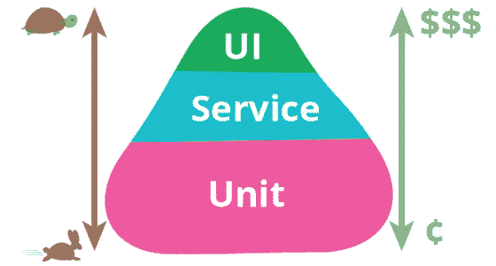
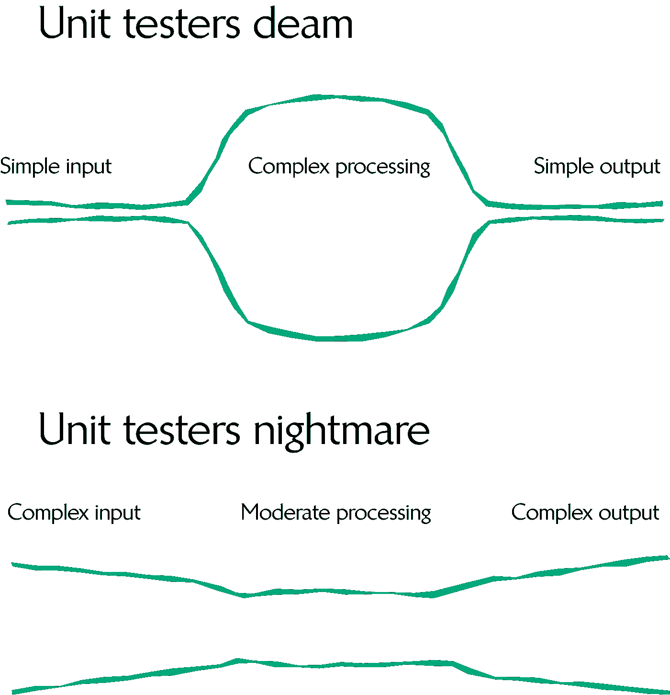
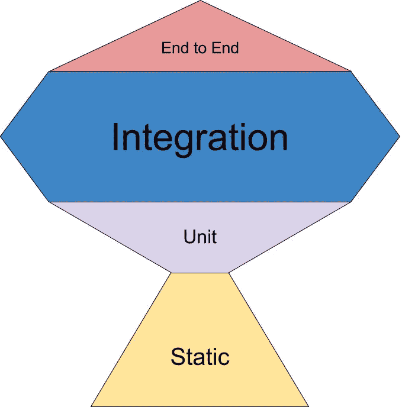

# 推倒金字塔

> 原文：<https://blog.devgenius.io/toppling-the-pyramids-27ace578a7e?source=collection_archive---------13----------------------->

# 为什么测试金字塔不适用于 UI 应用程序

当我第一次开始开发软件时，我接触了测试金字塔。对于门外汉来说，测试金字塔是一种如何平衡不同类型测试的哲学。这个想法是单元测试很便宜——编写和运行都很快——所以应该有很多，而端到端测试很贵——编写和运行都很慢——所以应该只有几个。

测试金字塔。将服务改为一体化

## 为什么单元测试不适合 UI 应用程序开发

你可以对测试金字塔提出的批评之一是，它没有考虑到测试的价值。如果 E2E 测试花费了×10 倍的时间来编写/运行，但是给了您×100 倍的信心，您的部署将会成功，这是一个很好的权衡。

单元测试对于具有简单输入、复杂处理和简单输出的代码最为有效。这是因为您可以为不同的输入/输出编写少量的测试用例，并在中间覆盖许多复杂的处理。如果您选择重写您的测试已经覆盖的处理部分。这是对大多数 API 工作方式的完美描述，但不是 UI 应用程序的工作方式。

今天，大多数 UI 开发都发生在更高的层次上。将组件和 API 调用连接在一起。有一种趋势是为 UI 组件拍摄快照——用一组参数实例化组件，并使用生成的 DOM 作为输出。这里的问题是输入很复杂，输出太冗长，大多数情况下无法查看。

上面的梦境场景代表了大多数 API，而噩梦版本更接近于大多数 UI 组件的工作方式。输入可以有很多道具。生成的 DOM 可能有几十行或几百行长。而且这还是在你不得不考虑框架、API 调用、应用状态等之前。，所有这些你都必须模仿才能到达你的单元。

换句话说，您必须做大量的手工工作来设置输入，并评估输出，以测试中间的最小复杂性。

但是有一个解决方案…

## 测试奖杯

Kent C. Dodds 提出的这种方法考虑到了 UI 应用程序开发。它叫做测试奖杯。

好吧，所以他必须努力让它看起来像个战利品。

## 静态

静态代码分析包括 ESLint、SonarQube 和 Flow/TypeScript 之类的东西。一旦设置好了，你就不需要再投入更多的时间，所以这非常便宜。

## **单位**

很少，涵盖通用代码。例如，我不经常对 React 组件进行单元测试，但是如果它是共享的或者普通的 JS 函数，我有时会对一个钩子进行单元测试。我用的量词是这样的:

> 将其分解到自己的 npm 包中是否有价值？

即使我现在没有时间进行重构，这也是一个很好的迹象，表明它会喜欢单元测试。

## 综合

许多，覆盖所有路径。这些给了你几乎和 E2E 一样多的信心，但成本却是后者的一小部分。我用这些覆盖快乐和不快乐的道路。

## E2E

很少，覆盖幸福的道路。给你最大的信心，你的用户将能够继续使用你的应用程序。

## 结论

作为 UI 开发人员，我们今天做的很多工作都围绕着集成。如果你使用的是像 [Material-UI](https://material-ui.com/) 、 [Vuetify](https://vuetifyjs.com/en/) 这样的组件库，或者一些内部的东西，那么你会花很多时间在所有这些组件和你的 API 之间进行集成。在这种情况下，单元测试总是很难实现。如果你发现自己不得不模仿很多，这通常是一个迹象，表明你正在试图对不是一个单元的东西进行单元测试。

我花了一段时间来转换，但我发现自己正在移动——几乎没有注意到——到测试奖杯的方法。它让我对自己的部署更有信心，编写测试的工作量也更少。

祝一切顺利，尼克