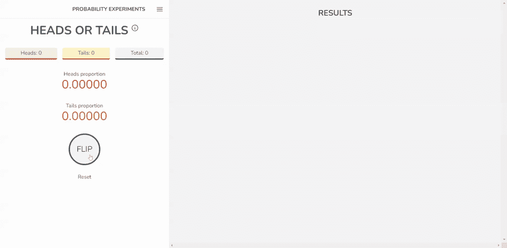
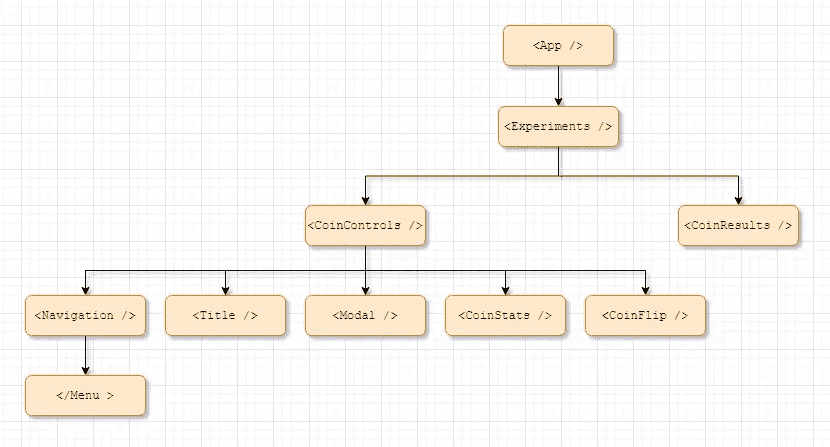
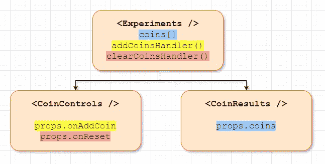
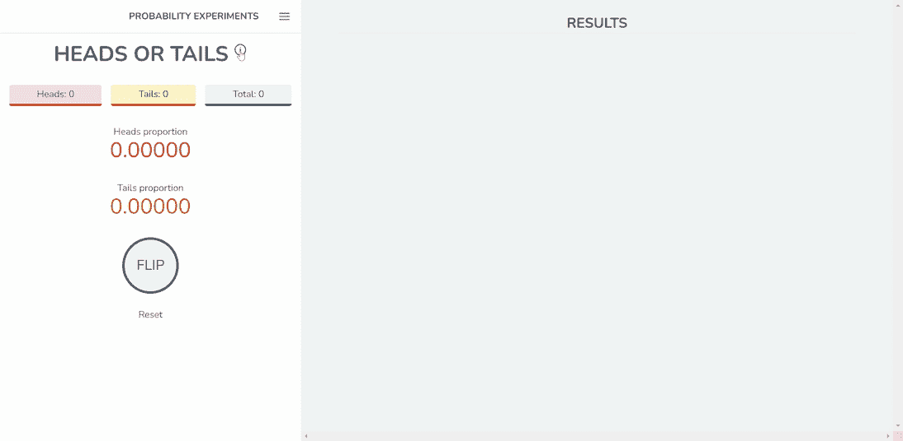
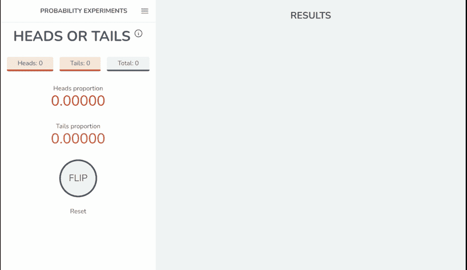
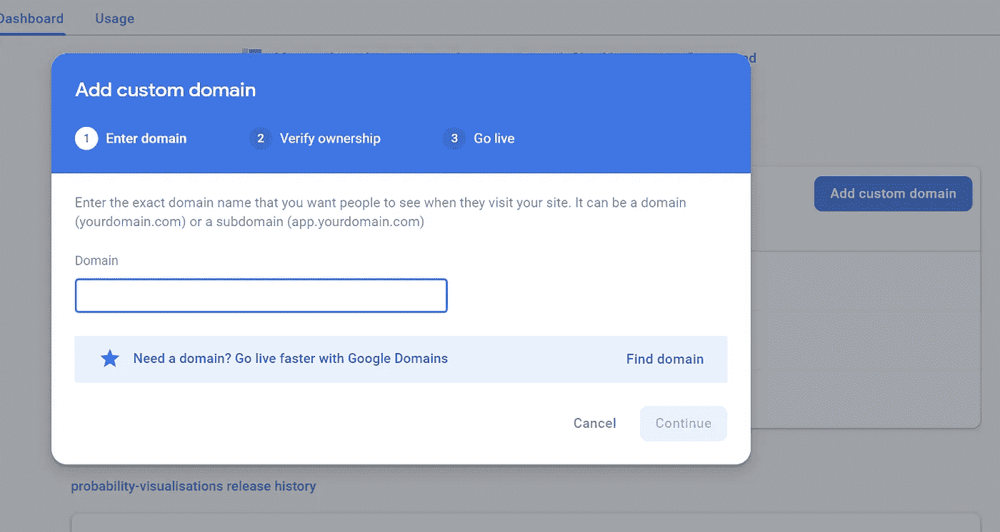

# 用反作用力抛硬币

> 原文：<https://blog.devgenius.io/tossing-a-coin-with-react-js-673be020e01c?source=collection_archive---------17----------------------->

## 用 React、TailwindCSS 和 Firebase 托管可视化概率实验


Dall-e 提示:一个扔硬币的机器人，数字艺术

我最近开始了一段旅程来提升我的网络开发技能。一个好的旧的 PHP/Bootstrap/JavaScript 设置托管在最新最好的共享托管产品上没有错，但我希望它的使用是一个积极的选择，而不是我的唯一选择。

[](/a-basic-react-tailwind-and-firebase-deployment-fc96fcf43b6) [## 基本的反应、顺风和火力基地部署

### 脱离多年标准共享主机的刺激

blog.devgenius.io](/a-basic-react-tailwind-and-firebase-deployment-fc96fcf43b6) 

在使用 React、Firebase 和 TailwindCSS 之后，我开发了[概率实验](https://probabilityexperiments.com/)，一个简单的抛硬币项目，作为应用我的理论知识和对以下概念的理解的一种方式:

*   使用 useState 钩子管理 React 中的状态，并通过组件树传递属性
*   基于状态处理程序有条件地呈现组件，例如打开和关闭模态元素。
*   在 React 上下文中使用本地 JavaScript map()方法
*   在顺风 css 中使用前缀的响应式设计，例如 sm:bg-color-red-100
*   通过谷歌域名购买域名并指向 Firebase 主机。

最终的结果非常简单。游客反复点击一个按钮，显示一个新的硬币，并更新基本统计数据。



在 React 应用程序中投掷硬币的演示

# 组件树

React 的核心是关于组件——由 HTML、CSS 和可能的 JavaScript 逻辑组成的可重用构建块。

我的站点的根是包含 React 应用程序所有子组件的`<App />`组件。



概率实验的成分树图

将来，我可能会添加更多抛硬币以外的场景，但是现在`<Experiments />`只包含两个子组件:`<CoinControls />` 和`<CoinResults />`。

`<CoinControls />`包含该网站的整体导航条，标题，统计以及按钮，以抛硬币的组件。它还包含隐藏的模态，直到用户单击信息图标。

## 使用 useState 钩子管理状态并通过组件树传递属性

在使用 React 时，有更高级的方法来管理状态，比如使用`useReducer`、`useContext`甚至通过 Redux 这样的整个库，但是我想探索用`useState`钩子在组件之间保存和传递状态的基本思想。

例如，当按下 flip 按钮时，`useState`与在各种组件之间传递的道具一起工作，触发硬币出现在结果部分，并更新统计数据。

`<Experiment />`组件包含一个`coins`数组，它跟踪头部和尾部，以及更新和重置数组的函数:

```
// INSIDE <Experiment />

const [coins, setCoins] = useState([]);

const addCoinHandler = (coin) => {
    setCoins((prevCoins) => {
      return [coin, ...prevCoins];
    });
  };

const clearCoinsHandler = () => {
    setCoins([]);
  };
```

处理函数通过`<CoinControls />`组件中的属性传递，同样硬币数组也传递给`<CoinResults />`

```
<CoinControls onAddCoin={addCoinHandler} onReset={clearCoinsHandler} />
```

```
<CoinResults coins={coins} /> 
```

处理函数通过`<CoinControls />`组件中的 props 来访问；`props.onAddCoin`和`props.onReset`成为指向一个函数的指针，该函数实际上是在父组件`<Experiment />`中定义的。



道具如何在父元素和子元素之间传递的示意图

在`<CoinControls />`内部，`flipCoin`和`reset`函数被定义，这些函数利用了从`<Experiment />`通过 props 传入的处理程序。这些新功能通过 props 进一步向下传递到组件树中:`<CoinFlip flip = {flipCoin} reset={reset}/>`。

```
// INSIDE <CoinControls /> 

const flipCoin = () => {
    const coin = Math.floor(Math.random() * 2);
    if (coin === 0) {
      setHeads(heads + 1);
    } else {
      setTails(tails + 1);
    }
    props.onAddCoin(coin);
};

const reset = () => {
    setHeads(0);
    setTails(0);
    setPHeads((0).toFixed(5));
    setPTails((0).toFixed(5));
    props.onReset();
};
```

因此，单击`<CoinFlip />`组件中的一个按钮，调用其父组件`<CoinControls />`中定义的`flipCoin`函数，该函数又将一个新的头或尾硬币传递到组件树的更高处，最终到达`<Experiment />`中的硬币数组。

## 基于状态处理程序的组件的有条件呈现

任何 web 应用程序的一个关键方面是根据上下文隐藏和显示元素，在过去，我的实现在这方面相当笨拙。

React 中组件的条件呈现非常简单。它的使用示例如下所示:当标题旁边的 info 按钮被按下时，一个包含掷硬币概率细节的模态被添加到组件树中，然后当用户单击“OK”按钮或灰色周围区域时被移除。



TailwindCSS 使得样式化模态组件变得非常容易，`className`被用来代替通常的`class`属性。内容是通过 props 动态设置的，如果我设法添加更多的概率场景，可以很容易地改变组件的用途。

```
// INSIDE <Modal />
const Modal = (props) => {

   const backdrop = "fixed top-0 left-0 w-full h-full bg-black bg-opacity-80 z-1";

   const modal = "p-6 fixed w-5/6 lg:w-2/4 left-1/2 top-1/2 transform -translate-x-1/2 -translate-y-1/2 bg-white rounded-lg shadow-lg z-100";

   const close = "py-2 px-8 text-center text-2xl border-4 cursor-pointer border-gray-600 bg-gray-100 rounded-lg w-24 h-12 flex justify-center items-center";

   return (
    <div>
      <div className={backdrop} onClick={props.info}></div>
      <div className={modal}>
        <h1 className="text-4xl border-b-2">{props.title}</h1>
        <p className="pt-4">
          {props.description}
        </p>
        <p className="pt-4 text-center text-2xl">{props.formula}</p>
        <p className="pt-4 text-center text-2xl">{props.formula2}</p>
        <div className="flex justify-center p-4">
            <div className={close} onClick={props.info}>OK</div>
        </div>
      </div>
    </div>
  );
};
```

点击信息图标、灰色背景或“确定”按钮，触发`<CoinControls />`组件中的`infoHandler`功能，并在`info`常量时切换状态。这个布尔值位于 JavaScript 逻辑操作符`&&`的左边，使模态组件在`info`处于 true 状态时出现。

```
// INSIDE <CoinControls /> 
const [info, setInfo] = useState(false);

  //Funtion to display modal
  const infoHandler = () => {
    setInfo(!info);
  };

// THEN SOMEWHAT LATER...

{info && (
        <Modal
          info={infoHandler}
          title={modalTitle}
          description={modalDescription}
          formula={modalFormula}
          formula2={modalFormula2}
        />
      )
}
```

## 在 React 上下文中使用原生 JavaScript map()方法

硬币数组只是一个 1 和 0 的列表，每次按下翻转按钮时都会添加到这个列表中。如上所述，列表通过 props 传递给`<CoinResults />`。

使用 array `map()`方法，硬币出现在结果窗格中，并根据项目是 1 还是 0 有条件地应用样式；使用三元运算符`condition ? IfTrue : IfFalse`，正面(0)显示为红色，反面(1)显示为红色

```
//INSIDE <CoinResults />

const CoinResults = (props) => {
    const h = "h-16 bg-red-100 border-2 border-red-600 rounded-full w-16 flex items-center justify-center text-4xl";
    const t = "h-16 bg-amber-100 border-2 border-amber-600 rounded-full w-16 flex items-center justify-center text-4xl";

//Elsewhere ...

    {props.coins.map((coins, index) => (
          <div key={index} className={coins===0?h:t} >
              <div className={coins===0?" flex select-none text-red-300":"flex text-amber-300"}>
                  {coins === 0 ? "H" : "T"}
              </div>
           </div>
       ))};
```

TailwindCSS 实用工具 classed 使分配一堆类变得容易。在某些地方，我把它们直接写到 JSX 表达式中，但是当它们变得相当长时，我把它们存储在它们自己的常量中，以便于整体阅读。

## 在尾部使用前缀的响应式设计

在我最近的项目中，我选择使用 Bootstrap 作为我的 CSS 框架，虽然这使样式变得非常容易，但负面影响是我的网站会立即被识别为 Bootstrap。

这个项目的一个关键目标是在类中使用前缀来辅助响应式设计。这被证明非常容易实现。

只需一个简单的前缀，我就能确保网站从面向大屏幕的水平布局切换到面向移动设备的垂直布局。这是通过一个简单的`md:`前缀实现的，该前缀说明了一种仅适用于中等及以上尺寸的款式。

```
<!-- INSIDE <Experiments /> -->

<div className="grid md:grid-cols-3">
        <CoinControls ... />
        <CoinResults  .../> 
</div>

<!-- INSIDE <CoinControls /> -->
<div className="md:col-span-1 ...">
   ...
</div> 

<!-- INSIDE <CoinResults /> (props ommitted) -->
<div className="md:col-span-2 ...">
   ...
</div>
```



添加前缀的方法同样适用于任何样式。

## 通过谷歌域名购买域名并指向 Firebase 主机

这个项目的最终目标是将一个定制域指向 Firebase 上的一个项目。这也被证明是非常直接的。在 Firebase 托管面板中，我只需按照提示“添加自定义域”即可。从那里，我能够购买一个域名，并将其指向我的项目，免费的 SSL 和所有。如果这是你想要实现的目标，那么只需看看谷歌的指南就行了。



“添加自定义域”向导

## 最后的想法

建立这个项目是一次很好的学习经历，我希望在将来能建立更多的概率实验。此外，反复抛硬币并看到结果回来比我想象的更有吸引力。我这样做了很多次，以至于我开始怀疑随机性是否真的是随机的，因为结果经常会偏离你所期望的 0.5。

完整的代码是[这里是](https://github.com/reveleigh/probability-experiments)。

我喜欢写我的项目、学习和发现。如果你喜欢这篇文章，考虑关注我，看看我的其他帖子。

[](https://medium.com/age-of-awareness/my-dog-ate-my-copilot-d9e3595018cd) [## 我女儿以后有逾期作业也不会有压力

### 除非狗吃了她的副驾驶

medium.com](https://medium.com/age-of-awareness/my-dog-ate-my-copilot-d9e3595018cd) [](https://medium.com/age-of-awareness/where-my-teacher-mind-went-when-given-early-access-to-dall-e-2-b09b62278821) [## 当我的老师提前接触到 Dall-E 2 时，他的思想去了哪里

### 从文本描述中生成真实的图像是一个反向的罗夏墨迹测试

medium.com](https://medium.com/age-of-awareness/where-my-teacher-mind-went-when-given-early-access-to-dall-e-2-b09b62278821) [](/raspberry-pi-powered-flying-geese-clock-ebde0c76ffe6) [## 树莓皮动力飞鹅时钟

### 用 Python 编程并通过 MQTT 控制的 led 灯让这种传统的被子图案栩栩如生

blog.devgenius.io](/raspberry-pi-powered-flying-geese-clock-ebde0c76ffe6)