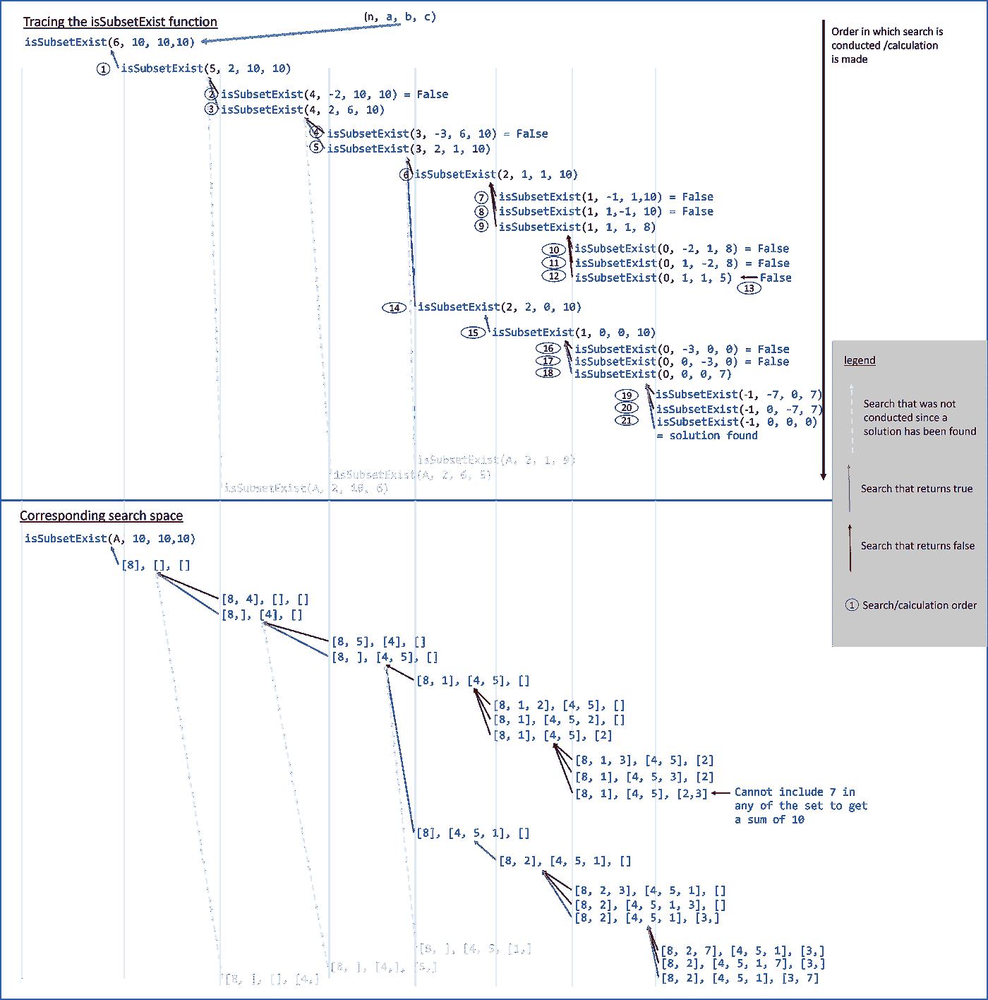
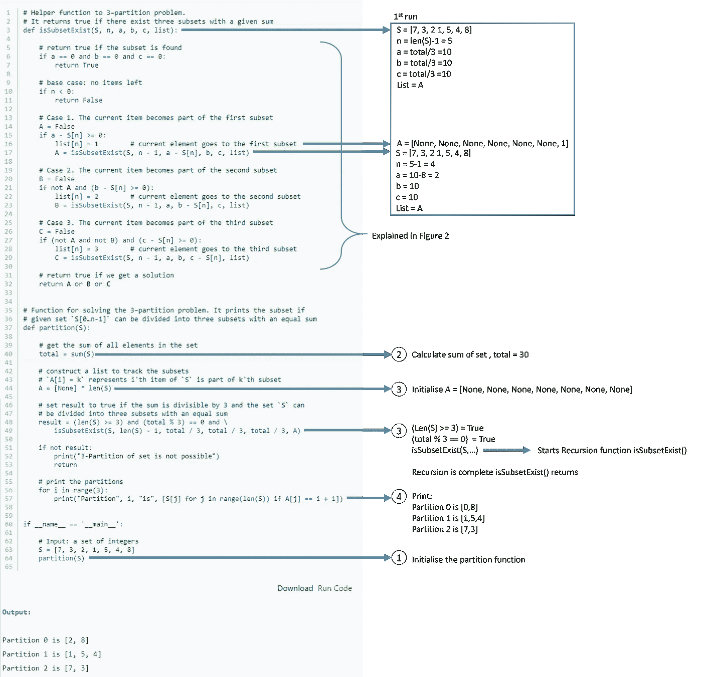
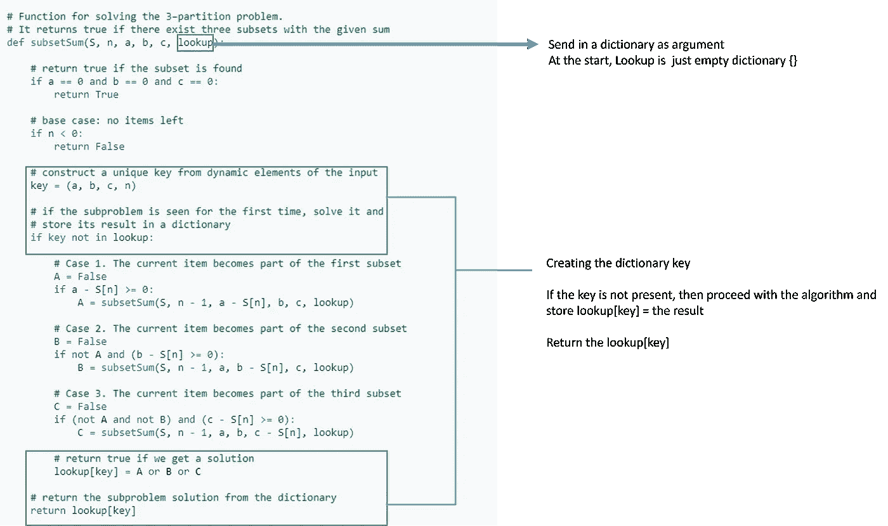

# 追踪递归和动态编程:三路划分问题

> 原文：<https://blog.devgenius.io/tracing-recursion-and-dynamic-programming-as-depth-first-search-3-way-partition-problem-f2d0733a5a0a?source=collection_archive---------1----------------------->

## 作为深度优先搜索跟踪递归

图 1:跟踪递归

当你申请数据科学家/算法工程师的工作时，递归和动态编程是面试中最常测试的。这个故事追溯了递归过程，使初学者可以理解，并解释了动态编程，这只是递归的一个补充。

这个故事参考了 https://www . techie delight . com/3-partition-problem-extended-print-all-partitions/中的内容，它提供了一个 3 路分区问题的递归和动态编程解决方案。

首先，让我们先描述一下 3 路分割问题。设 S 是 7 个整数的集合，集合的和是 30。

S = { 7，3，2，1，5，4，8 }
总和(S) = 30

目标是将 S 划分为三个独立的分区(s1、s2、s3)，每个分区的总和为 30/3 = 10。

s1 = { 7，3 }
s2 = { 5，4，1 }
s3 = { 8，2 }

我们首先看解决方案代码。跟着数字 1 到 5 打圈，以完成代码的解释。isSubsetExists 是一个调用自身的回收函数。下面的图 2 显示了 isSubsetExists 的第一次调用，上面的图 1 跟踪了 isSubsetExists 的后续调用。如果 a 等于 0，b 等于 0，c 等于 0，则找到一个解，返回 True，递归搜索完成。如果没有找到解决方案，且 n<0，则搜索已经到达其终点而没有找到解决方案，返回 false，并继续搜索另一个分支，如图 1 所示。

图 2:代码解释

图 1 跟踪了 isSubsetExist 函数的调用方式。图 1 的上半部分显示了调用 isSubsetExist 的顺序，从 1 到 21。当满足 isSubsetExist 函数中的 case 1 条件时，它将使用修改后的参数调用自身。当 isSubsetExist 返回 False 时(如红色箭头所示)，代码将从调用它的前一个 isSubsetExist 执行。如果找到了解决方案，它将返回 True，如绿色箭头所示。图 1 的下半部分显示了相应的搜索空间。从搜索空间可以看出，这个递归函数仅仅是一个深度优先搜索，从集合 s 的最后一个值开始。

简而言之，动态编程就是在递归函数中添加一个字典，这样它就可以在空格之前存储搜索结果(见图 3)。如果后续搜索返回到相同的搜索空间，例如，如果第二次调用 isSubsetExist(2，1，10，10)，字典可以直接返回 isSubsetExist(2，1，10，10)的结果，而无需再次向下搜索它的分支。虽然重复搜索 isSubsetExist(2，1，10，10)在这个划分问题中很难看到，但臭名昭著的背包问题(可能很快会在我的另一个故事中涉及)将在不同的分支中显示更多这种重复搜索。动态规划的时间复杂度是 O(n×sum ),其中 n 是输入的大小，sum 是来自输入的所有元素的和，而仅递归的解是指数的。

图 3:动态编程