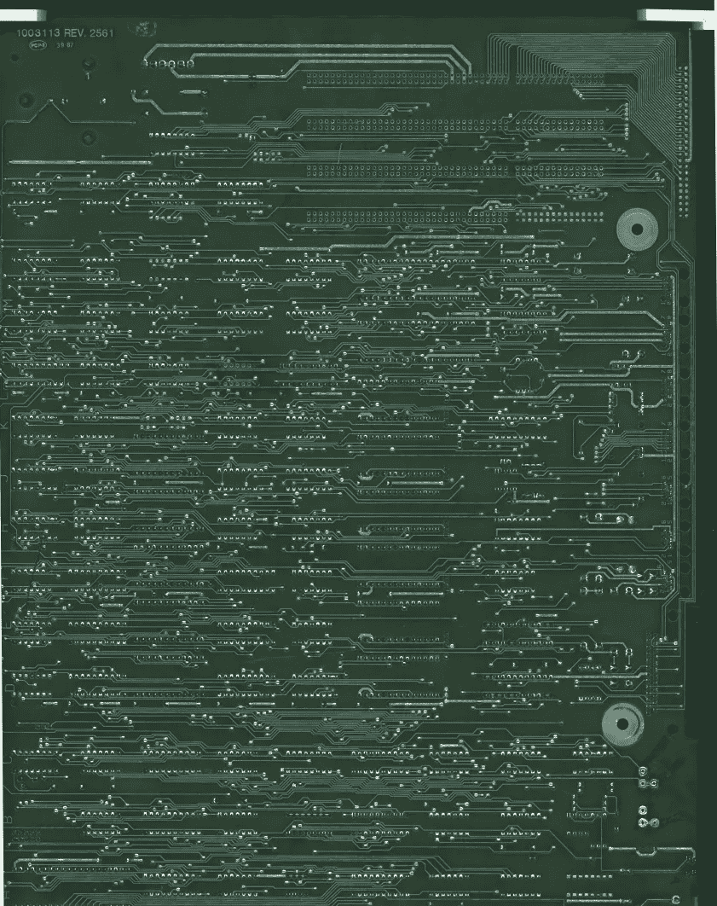
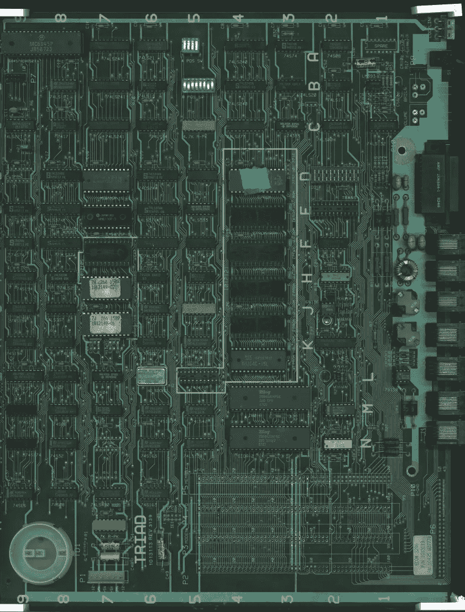
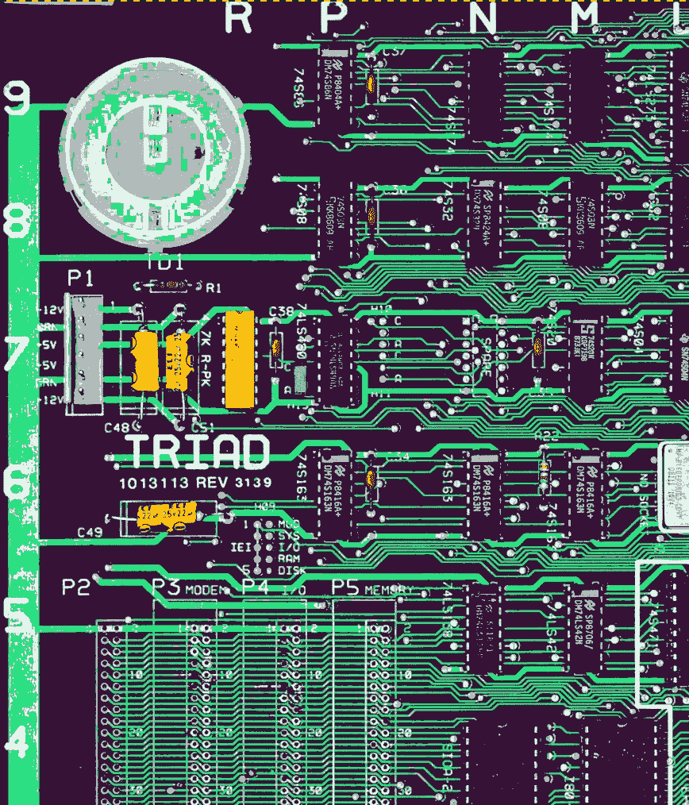
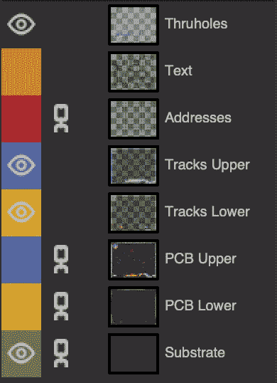
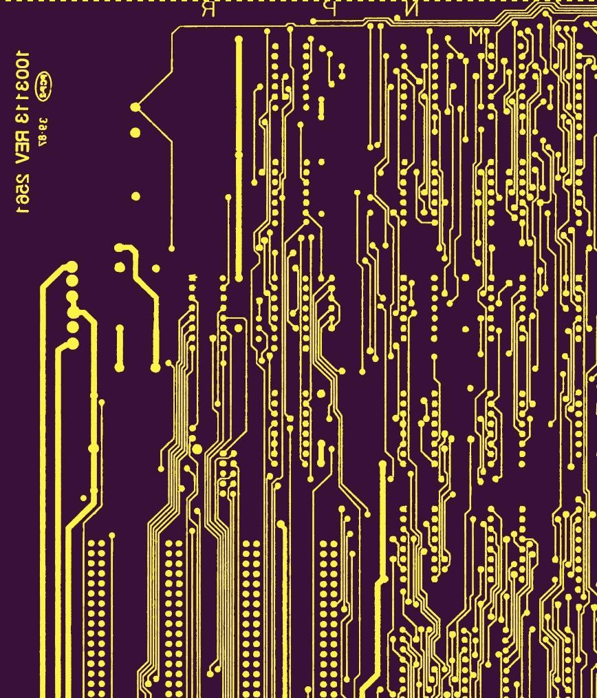
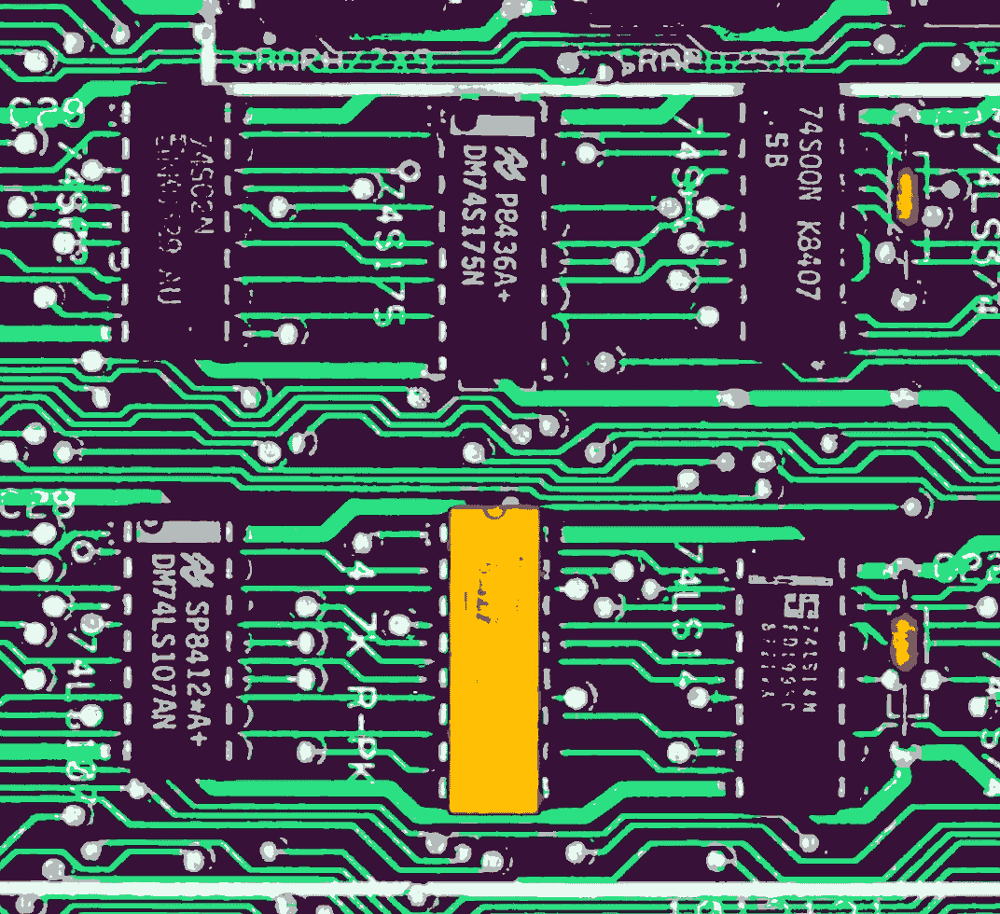
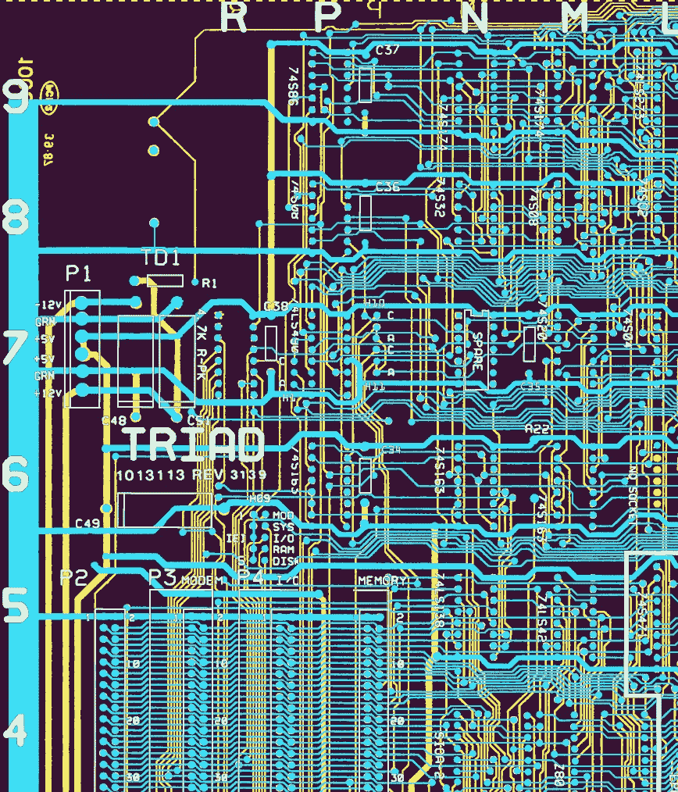
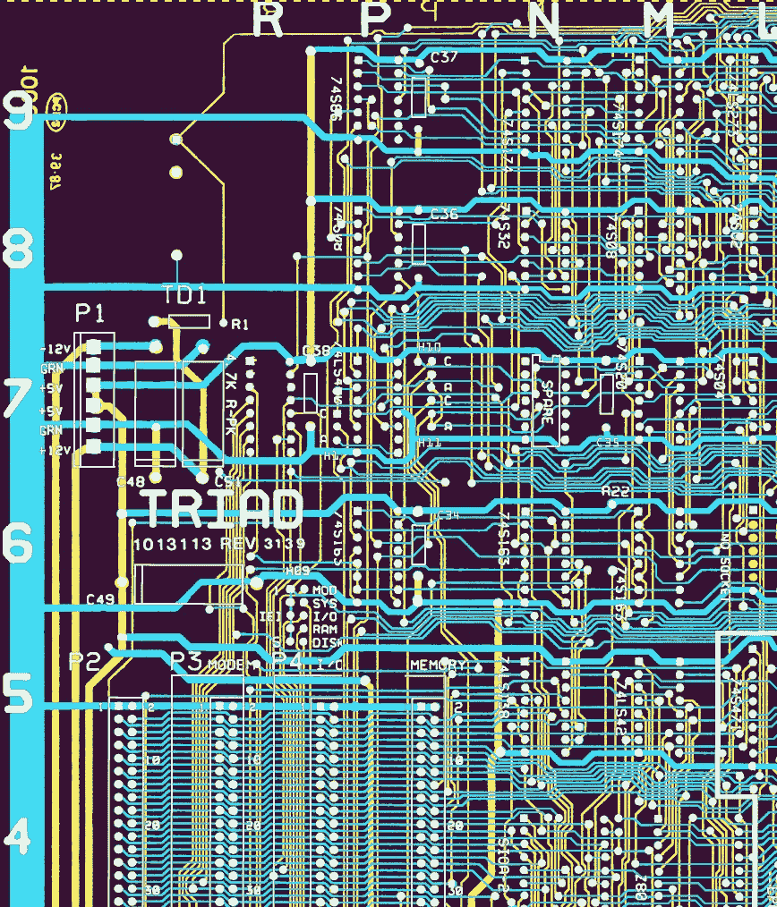
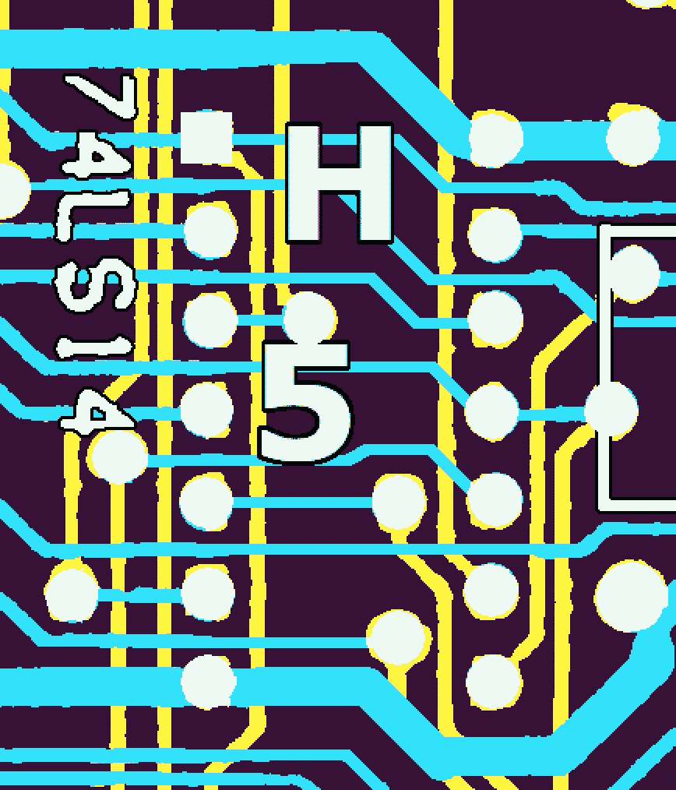
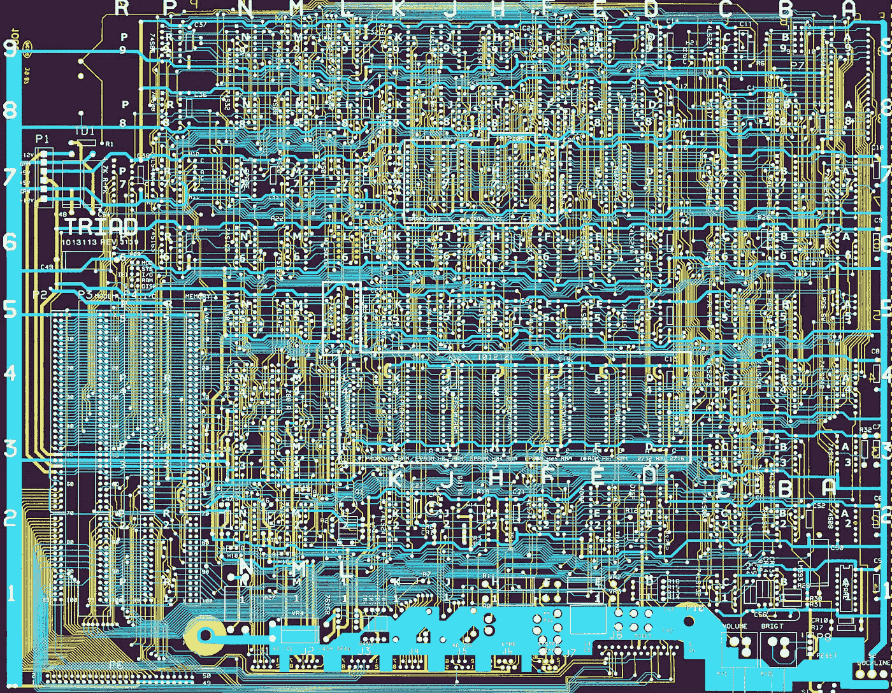

# 追踪三元组 T2556

> 原文：<https://blog.devgenius.io/tracing-the-triad-t2556-1c9ff7822f0e?source=collection_archive---------18----------------------->

## 三和弦 T2556 系列的第三部分

在之前的中，我谈到了清除所有的垃圾。现在电路板是干净的，通电后可以工作了，接下来的工作是弄清楚所有的东西是如何连接在一起的。

我的第一个想法是，我可以使用一个连续性测试仪来看看如何跟踪连接的组件。但是这里有许多*迹线、过孔和引脚，要沿着数百条路径中的每一条翻转电路板六次将是一项艰巨的任务。*

我需要更好的东西。

扫描 PCB 的背面

事实证明，试图用手机拍摄 12 英寸 x15 英寸表面的详细而精确的照片是不可能的。

即使你有一个三脚架或其他东西来保持相机相对于主体的位置不动，这种方法也有几个问题。透镜具有足够的曲率，使得边缘处的细节被扭曲，并且最外面的轨迹被出现在它们“前面”以及“上面”的组件所模糊。没有平面照明，阴影也会导致细节变得模糊。

如果有一种设备能够在将光线均匀一致地照射到棋盘表面的同时，拍摄一张平的、线性的棋盘照片就好了。

扫描 PCB 的正面

好消息是，商业级复印机在这方面做得非常好！我 3D 打印了一些角片，将木板稍微抬离玻璃表面，以减少阴影，并扫描到电子邮件。结果看起来非常清晰，足以开始。

PCB 的色调分离顶面

但下一个问题是如何将顶部走线覆盖在底部走线上？

我将这两张图像导入 GNU 图像处理程序(GIMP ),当我开始工作时，不久我就意识到这些图像有多大。

因此，在浪费了一段时间后，我调整了色阶，尽可能地提高对比度，然后对图像进行色调分离，以显著减少颜色数量。最终，我可以将每一层缩小到原来的 25%,这大大加快了处理时间。这也意味着我可以更灵活地在以后添加额外的信息层。

不幸的是，扫描每一面时，由于电路板的弯曲，电路板的位置并不完全相同，各层也没有完全对齐。使用[笼形变换](https://www.youtube.com/watch?v=jL8TepHX0qE)工具旋转和扭曲每一层花了一些功夫，直到所有的轨迹都对齐了…或者至少 50%的过孔在顶层和底层之间共享空间。当然，底层必须镜像，因为要正确查看，我们将有效地“透视”PCB。

最后，我有了一组层，我可以根据我想要完成的任务打开或关闭它们。其中一些将在下面详细描述。

一如既往，细节决定成败，我花了相当大的力气才让事情按照我想要的方式进行。

其中一部分是为了让我的眼睛尽可能容易地处理图上的信息，所以当我添加工作层时，我努力使对比度最大化。认知负荷等等。

这些工作层上的区域必须是透明的，否则不可能透过该层看到下面的层。在底部，我用了一种深紫色作为基底色。这似乎比纯黑色效果更好。

已解析的背面迹线

如果你仔细观察上面色调分离图像中终止痕迹的白色圆圈，你会发现很多圆圈都有光晕。在左手边，你可以看到绿色的竖条在哪里消失在数字中。在一些组件的底部(如坐标参考 N8 的 74S32)，有一个将绿色痕迹变成灰色的阴影。尽管进行了过滤，但图像中仍有大量噪声残留，导致痕迹失真或出现斑点。

这些伪影和其他伪影意味着我必须一点一点地检查每一张图像，以便做出修正。

这花了不少功夫，但你可以看到背面的痕迹是如何在这里结束的。

已解析的正面走线

不过，正面更硬。

容易的部分是使用与反面相同的过程进行清理，但后来我意识到这不是完整的画面:电路板顶面上的所有迹线都被元件遮住了！

我可以参考实际电路板，从电阻和电容等轴向元件下方隐藏缺失的细节，但所有这些黑色双列直插式封装隐藏了大量信息，让事情变得非常棘手。

映射前的原始正面痕迹，显示模糊的痕迹

它混合了直觉、反复翻动板子，以及大量使用连续性测试器(伴随着少量的脏话)来找出这些丢失的痕迹并把它们画进去。这项任务变得稍微简单了一点，因为我已经把各种损坏的接头拆了。

用丝网印刷对齐顶部和底部走线

我也知道我会想在某些时候引用丝网印刷的标记，所以我把它们单独放在它们自己的层中。ProTip: GIMP 有一个“按颜色选择”的特性，这使得抓取大部分丝印并粘贴到它自己的层变得很容易。我说大部分…肯定有一些粗糙的地方，但现在已经足够好了。

我后来做了一件事来提高阅读丝网印刷的能力，那就是添加一个像素的黑色轮廓。我选择了图层中的所有内容，增加了一个像素，并在丝网下面新建了一个图层，在合并两个图层之前，我用黑色填充了这个图层。效果很好。

对齐的铜版、背面、丝印和通孔

映射地址示例和跟踪详细信息

为了有助于识别，同时也是为了我当时正在玩的另一个项目，我添加了一个“通孔”层，并用适当形状和大小的笔刷在每个位置画了一个圆(引脚 1 为正方形)。

当我后来开始跟踪设备之间的路径时，我首先滚动到东西向边缘，然后是南北向边缘，以获得起点的地图参考，一直跟踪到终点，然后重复滚动练习以获得终点的地址。

你可以想象这花了我多少额外的时间。我希望在这个过程中早点添加地址层，这样我就可以看到板上每个集成电路的地图参考，而不必滚动到边缘。

这里有一个地址文本的例子。你可以看到，我给了地址文本与丝印相同的轮廓处理，尽管如果我没有消除文本锯齿的话会更好:你可以看到在我修改色彩映射表时出现的字母“H”上的紫色伪像。

您还可以从这张图片中看到，我在清理痕迹时有一个“足够好”的阈值，水平方向的干净青色线条是我填充组件下方间隙的地方。

我记不清这花了多少时间，但很明显这是一项巨大的努力。当我退后一步看到这些，我仍然会从成就感中获得满足感。我没意见。

整个

然而，这并没有回答文章开篇提出的问题的精神:*一切是如何联系起来的？*为此，我们需要拍摄这些图像，并将它们转换成示意图。

那是为了[改天](https://medium.com/@alexwking/decoding-the-triad-t2556-6f0ed4cd1125?source=friends_link&sk=e32da8e9a78695b9ebede817e3d0e466)不过:首先我需要一个非常非常*长时间的午睡。*