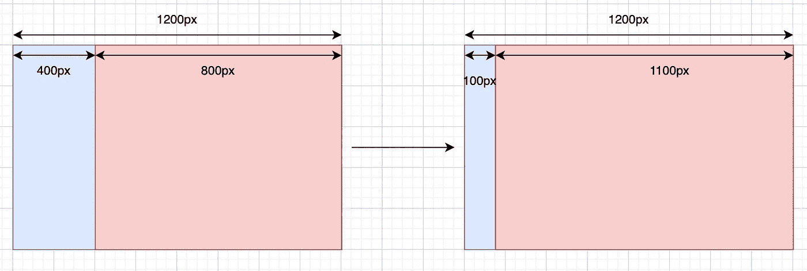

# 在没有库的情况下调整大小时跟踪 Web 组件

> 原文：<https://blog.devgenius.io/track-web-component-when-resizing-without-a-library-a93faa900cc1?source=collection_archive---------14----------------------->

## WebDev

我是一名前端开发人员，我的目标一直是让网页反应灵敏、美观。我最近遇到的一个问题是让仪表板的一个组件在监听内容区域的宽度而不是设备宽度时做出响应。

如果您只需要解决方案:`ResizeObserver`一个 Web API，请跳过故事部分。


照片由 [Rodion Kutsaev](https://unsplash.com/@frostroomhead) 从 Unsplash 拍摄。

## 故事

更详细地说，我希望当用户切换菜单栏以折叠或展开时，仪表板项目变得更具交互性。我的团队没有每种设备上应用程序的完整设计，所以我们简单地为在`769px`下使用我们应用程序的用户使用移动设计，为更大的屏幕尺寸使用桌面设计。问题发生在平板电脑屏幕尺寸上，它不够大，无法像桌面屏幕一样拉伸所有仪表板组件。一句话，丑。有些条目看不见了，有些条目的文本成了罐头里的沙丁鱼。

所以我有了一个想法，当容器宽度大于 x 时，给组件添加一个动态的`class`,当容器收缩时，移除这个`class`。



这个问题的简单形象

有点棘手的是，`@media query`会给我我想要的效果，但它需要每隔几个像素进行一次查询，每个设备都会有不同的情况，尤其是`@container`还没有发布。多让人头疼啊，对吧？我正在使用 Vue，所以下一个方法是使用一个`Watcher`和 JavaScript `getElementById`以及 Vue `ref`方法，这两种方法都可以，但是有几个问题仍然使解决方案不完美。

1.  至少注册两个道具:`componentId`和`aFlagBoolean`
2.  `getElementById`或`ref`在获得`innerWidth`时有延迟，在第一次尝试中，一切看起来都很好，但第二次或第三次会开始给你相反的结果。更多的`ifelse`去修理它，它会把你带到一个洞里

## 解决办法

我没有导入另一个库，而是发现 [WebAPI](https://developer.mozilla.org/en-US/docs/Web/API) 有`[ResizeObserver](https://developer.mozilla.org/en-US/docs/Web/API/ResizeObserver)`，它正在做我需要的正确的事情。它会跟踪你在上面注册的组件。我们用代码说话吧。

在使用这个 API 之前，请确保您的组件已经由`getElementById`、`ref`或其他人成功注册。

```
>>> HTML
<div id="container"></div>>>> JavaScript
const container = document.getElementById('container');
const resizeObserver = new ResizeObserver(entries => {
  window.requestAnimationFrame(() => {
    if (!Array.isArray(entries) || !entries.length) {
      return;
  } for (let entry of entries) {
    /* Do something */
    if (entry.contentRect.width > 400) {
      console.log('Width is wider than 400px');
    } 
    if (entry.contentRect.height > 450) {
      console.log('Height is over 450px');
    }
  }
});

resizeObserver.observe(container);
```

我们需要预设调整观察器应该执行什么操作，然后将组件注册到观察列表中。它将返回一个对象列表，因此您的逻辑和检查必须放在 for 循环中。要在观察列表中注册一个组件，只需简单的`resizeObserver.observe(component)`；移除一个组件`resizeObserver.unobserve(component)`。

为了避免控制台警告过于频繁，我们可以添加`window.requestAnimationFrame`。对于 TypeScript 用户，我们可以通过在 resize observer 前面添加`(window as any)`来摆脱`unknown import`警告。完整版本看起来应该如下所示:

```
const resizeObserver = new (window as any).ResizeObserver(entries => {
  window.requestAnimationFrame(() => {
    if (!Array.isArray(entries) || !entries.length) {
      return;
  }for (let entry of entries) {
    /* Do something */
    if (entry.contentRect.width > 400) {
      console.log('Width is wider than 400px');
    } 
    if (entry.contentRect.height > 450) {
      console.log('Height is over 450px');
    }
  }
});
```

希望它有所帮助，并祝你的项目好运。现在一个问题有很多解决方案，挑一个符合你风格和需要的吧~