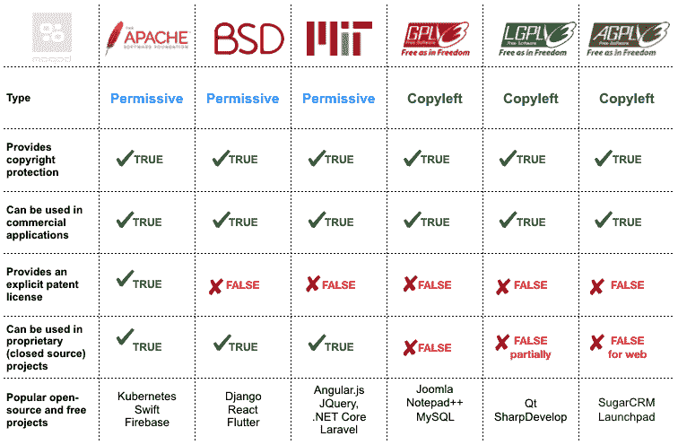
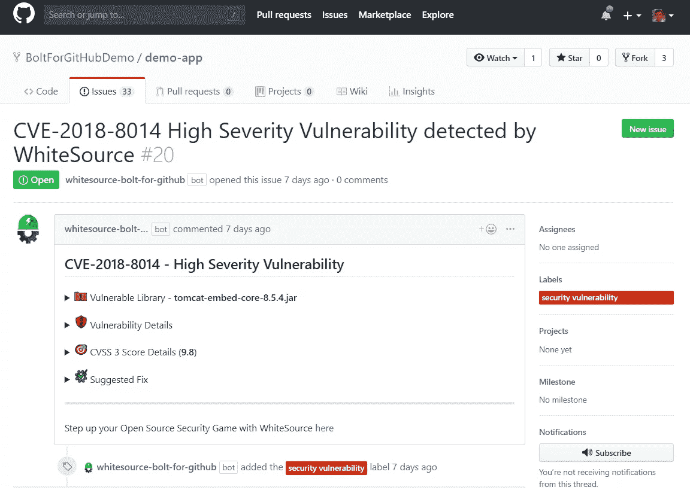

# 跟踪 Docker 应用程序中的开源合规性

> 原文：<https://blog.devgenius.io/tracking-open-source-compliance-in-docker-apps-495869b66c46?source=collection_archive---------9----------------------->

跟踪 Docker 应用程序中的开源合规性

[照片](https://unsplash.com/photos/eQ2Z9ay9Wws)由[米克·豪普特](https://unsplash.com/@rocinante_11)在 Unsplash 上拍摄

开源软件是其源代码可供任何人查看的软件。许多大大小小的技术公司和个人都维护着开源项目，其中可能会有数千名开发人员参与。另一个越来越受欢迎的实践是应用程序容器化，它提高了开发速度并简化了部署。

开源软件和应用程序容器化看起来很吸引人，但是无知地使用它们可能会导致灾难。在这篇博客中，我将写一些灾难性的事件，以及我们如何预防它们。

众所周知，开放源码软件在全世界被广泛使用。一些人觉得通过为开源软件库做贡献来提供帮助是有动机的，其他人则是被像 [Hacktoberfest](https://hacktoberfest.digitalocean.com/) 这样的事件所激励。还有，开发者非常信任开源工具，主要是因为源代码是透明的。然而，尽管成百上千的人致力于改进一个开源工具，但这并不意味着这个工具完全没有 bug，使用起来也是安全的(无论是技术上还是法律上)。

我并不是说在你的软件中使用开源代码是个坏主意。重用别人已经开发的代码实际上很好，因为它使开发人员能够专注于新事物。

但是，在使用这些开源组件时，您应该小心谨慎。您决定包含在构建中的任何开源组件中的漏洞都将被您的软件继承。

此外，您将接受您在软件中使用的所有组件的许可。事实上，许可证的继承可以一直链接到您用来构建软件的操作系统。遵循开源组件的条款和条件不仅在合法性方面含糊不清，而且也表明了对开源组件开发者的尊重。因此，检查您用来构建和部署软件的任何开源工具的许可证合规性是至关重要的。

目前有超过 200 个开源许可可用。这些许可证中的每一个对使用和分发您开发的软件都有一些限制。在某些情况下，您可以简单地通过信任开源工具本身来使用开源组件。在其他情况下，如果您打算将它用于商业产品，许可证可能会限制您使用它。

一些流行的开源许可证

[来源](https://moqod-software.medium.com/understanding-open-source-and-free-software-licensing-c0fa600106c9)

如今，开发人员使用 [Docker](https://www.docker.com/) ，这使得发布产品变得极其容易。在构建 Docker 映像时，必须使用几个开源组件和其他 Docker 映像。至少，在为自己的应用程序创建 Docker 映像的同时，你最终会使用某个操作系统的映像作为基础映像(除非你有资源开发自己的操作系统)。这意味着您的软件依赖于其他几个软件，您将分发由其他开发人员开发的组件。此外，您必须阅读使用这些组件的条款和条件，并决定是否可以在您的软件中使用它们。

软件的 Docker 映像是使用 Dockerfile 创建的，并被推送到 DockerHub 中。由于我们开发人员喜欢自动化一切，我们建立了一些连续的部署机制来执行构建和发布 Docker 映像的任务。例如，如果您正在使用 GitHub 开发您的软件，并且您想要在每次将一个 pull 请求合并到 master 中时发布您的软件的 Docker 映像，那么您可以使用 [build-push-action](https://github.com/marketplace/actions/build-and-push-docker-images) 创建一个工作流。你也可以为其他几个持续集成(CI)工具找到这样的插件，从 GitHub 到 DockerHub 自动构建和发布你的软件的最新镜像。

为简单起见，为了避免大量的手工工作，我们可能希望自动化仔细浏览用于构建我们产品的所有组件的许可证的过程。这也可以通过名为 [WhiteSource Bolt](https://www.whitesourcesoftware.com/free-developer-tools/bolt/) 的开源工具免费实现。在您将 WhiteSource Bolt 集成到 GitHub 存储库中之后，它会自动检查您的软件的所有依赖项的深度许可证，并为您提供许可证的概述。

由 WhiteSource Bolt 创建的演示问题

[来源](https://github.com/apps/whitesource-bolt-for-github)

WhiteSource 不仅向您显示不同许可证的依赖关系的概述，它还发现安全漏洞并报告它们。

要使用这个工具，首先你需要[在 WhiteSource 上注册](https://github.com/marketplace/whitesource-bolt)。对于您想要检查许可证合规性和安全漏洞的每个存储库，该工具将在默认分支的根目录下创建一个`. whitesource `文件。“. whitesource”文件将包含 WhiteSource 使用的配置。根据您设置的配置，WhiteSource 会针对您的软件中发现的任何漏洞提出问题，并建议可能的修复方法。

# 包扎

总而言之，在软件和 Docker 中使用开源组件来发布你的产品已经成为许多软件公司最喜欢的事情。然而，忽略许可证对这些依赖关系的遵从性和可能在您的工具中引入的安全风险会对您的产品产生非常负面的影响。因为很难跟踪所有的依赖关系，所以您应该尝试自动化检查许可证合规性和安全漏洞的过程。