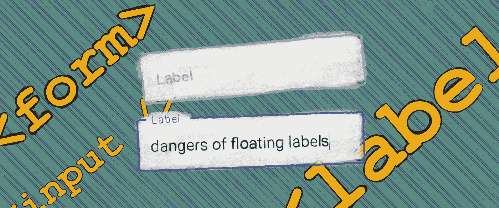
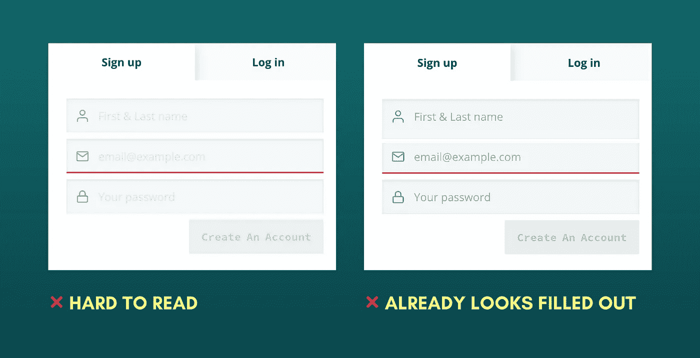
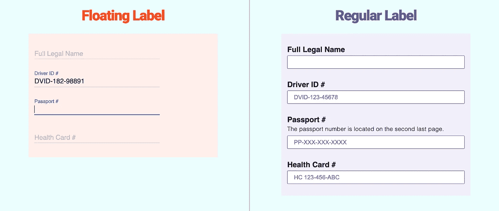
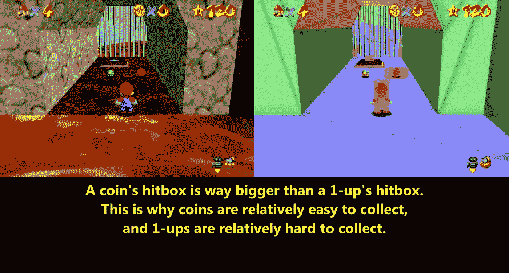

# 常规标签比浮动标签好

> 原文：<https://blog.devgenius.io/traditional-labels-are-better-than-floating-labels-b43b55c4e037?source=collection_archive---------2----------------------->

由 moi 制作，使用廉价手写笔在 iPad 上使用图形艺术应用程序！

让我们直入主题吧。到目前为止，我们都见过、使用或构建过使用 Bootstrap 或 Material Design 的应用。一次又一次，我鼓励开发人员编写普通的 CSS，但这并不能改变这样一个事实，即这些工具提供了一致的风格，原型开发的快速周转时间，以及新手开发人员的低门槛。

然而，我看到许多人用它们来构建表单，因为他们不喜欢构建表单和输入。表格很复杂。它们可以变得非常长，但是当它们引入摩擦时，使用起来会令人沮丧；不管它们看起来有多漂亮。我在 Nodiflux 和类似的 Discord 服务器上提供了大量的#项目反馈和#代码评审，我经常看到表单和输入看起来很漂亮，但在某些方面功能性较差。

# 标签的魅力

**标签是说明**。它们为元素提供标题，通常是它在其中显示的输入字段。

还有额外的“好东西”伴随着`label`元素，我将在整篇文章中强调这些。

*   ✅非消失文本
*   ✅增加了“击中框”的大小。对**运动障碍用户**有效。
*   ✅本地支持屏幕阅读器。对**视障用户有效。**
*   **✅** 他们**明显的**

# 占位符的崛起

在最近的网页历史中，占位符吸引了很多人。他们有*极小的手感*；它们通常节省空间。然而，这些都不是完全取代传统标签的足够好的理由，尤其是以可感知的启示为代价。以下是其中的一些危险:

您不想使用占位符作为标签的主要原因是因为文本会消失。除非您构建了应用程序，**消失的文本很难记住—** 但是，还有其他的问题。

第二，**占位符不是标签的替代品。它们是暗示。**提示是**而不是**强制的。暗示是“最好拥有的”像“*必须是 8 个字符，至少有一个大写字母*”这样的占位符设计得很差，因为**占位符带来的问题:**:

*   ❌由于占位符*自然*对比度较低，我们冒着向用户传达重要指示的风险。即使所有占位符都消失了，您的表单也必须 100%可操作。
*   ❌长文本不适合占位符
*   ❌有目的地加深占位符文本将使输入看起来好像是非空的

找到这两者之间的平衡是一个挑战。这个例子被有意放大了。网址:[黑客排名](https://www.hackerrank.com/auth/signup?h_l=body_middle_left_button&h_r=sign_up)

这让我想到了第三个问题:可访问性。即使辅助技术有所进步，在编写本文时，屏幕阅读器仍然无法访问`placeholder`属性。

**额外提示:**看起来[W3 在规格中增加了占位符。然而，这并不能改变一个事实，那就是目前它仍然是不可访问的。在这里阅读更多:](https://www.w3.org/TR/html-aam-1.0/#input-type-text-input-type-password-input-type-search-input-type-tel-input-type-email-input-type-url-and-textarea-element-accessible-name-computation)[https://github . com/dequelabs/axe-core/issues/2413 # issue comment-663194099](https://github.com/dequelabs/axe-core/issues/2413#issuecomment-663194099)

# 漂浮的标签拯救了…？

浮动标签注定是答案。用户现在将能够:

*   ✅看到他们打字时的“标签”
*   ✅辅助技术可以访问输入名称
*   …使用*时尚*外观的输入？

让我们来看一个实际案例研究:

在这里玩: [CodePen](https://codepen.io/dsomel21/pen/eYgqKaj?editors=1100)

在左边，我们假设标签*足够可见*以至于所有用户都可以阅读它，但只是在一定程度上它仍然是空的。我们再次如履薄冰。在右边的例子中，我们可以不放低对比度的占位符文本，因为如果它看不见，它不会阻挡用户。文本中没有关键信息。

尽管我们讨论了使用“占位符”的潜在风险，但在上面的例子中(在右边)，我们给出了一个“*nice-to-have”*提示的极好例子。如果用户可以访问占位符，他们在文书和文档中搜索时会更容易，因为他们知道要找什么。例如，驾驶执照是一个七位数，以“DVID”开头。这使得猜测 ID 上的哪个数字是真正的驾驶员 ID #变得容易得多。

然而，通过使用浮动标签，**我们完全失去了这个机会。**浮动标签与占位符 1:1 对应，意味着没有地方给它们提示。

来源:[墙壁、地板、&天花板第三部分](https://www.youtube.com/watch?v=kRCjVLqjST)通过 YouTube — [未评论 Pannen](https://www.youtube.com/channel/UC5miyvhPsWWyfTulnJ43koQ)

如果说《超级马里奥 64》教会了我们什么，那就是利用*的点击框*大小。网络用户使用这些技术(比如点击标签，关注输入)来获得他们的优势，因此，我们也应该利用这些技术。不幸的是，随着浮动标签，我们失去了这一点。

# 结论

传统标签远比浮动标签优越。虽然浮动标签旨在解决占位符带来的可访问性问题，但它们仍然比不上普通标签。我强烈推荐给亚当·席尔瓦的 [*表单设计模式*](https://www.smashingmagazine.com/2018/10/form-design-patterns-release/) 一读；我曾经在推特上发了一篇关于这本美丽的书的文章，它更深入地探讨了在构建美丽的、可访问的表单时所面临的挑战。