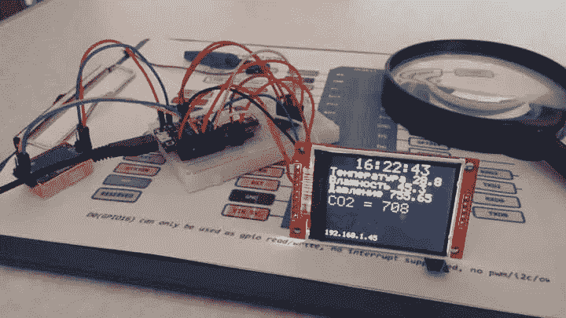

# 用 Python 训练用于情感分析的 ML 模型

> 原文：<https://blog.devgenius.io/training-an-ml-model-for-sentiment-analysis-in-python-63b6b8c68792?source=collection_archive---------3----------------------->



照片由伊戈尔·沙巴林拍摄

情感分析是文本分类的一项任务。特别是，它是关于确定一篇文章是积极的，消极的，还是中性的。有了一组相应的标记句子，你可以训练一个机器学习模型，然后可以用来对新句子进行预测。本文展示了训练这样一个模型的过程，只需几行代码就可以在一个使用 sklearn 库的 Python 脚本中实现。

# 从数据集中加载数据

在文章示例中，我们将利用可从 UCI 机器学习知识库获得的[情感标签句子数据集](https://archive.ics.uci.edu/ml/datasets/Sentiment+Labelled+Sentences)。该数据集包含用正面或负面情绪标记的客户产品评论。这些评论来自三个不同的网站，包括 imdb.com、Amazon.com 和 yelp.com。因此，数据来自三个不同的文件。数据集中的实例总数是 3000。在文章示例中，我们将仅使用取自 Amazon.com 的实例(标记的句子)。这是 1000 个句子，其中 500 个是肯定的，另外 500 个是否定的。

在下面的代码片段中，您将数据加载到 pandas 数据框架中，以简化进一步的计算:

```
>>> import pandas as pd
>>> df = pd.read_csv('/datasets/sentiment/amazon_cells_labelled.txt', names=['review', 'sentiment'], sep='\t') 
>>> df.head()0 So there is no way for me to plug it in here i… 0
1 Good case, Excellent value. 1
2 Great for the jawbone. 1
3 Tied to charger for conversations lasting more… 0
4 The mic is great. 1
```

# 将数据集分成训练集和测试集

如果您还记得，我们的目标是训练一个模型来预测评论的情绪。第一步是将我们拥有的数据分成训练集和测试集。使用 sklearn 库，这可以通过几行代码来完成:

```
>>> from sklearn.model_selection import train_test_split
>>> reviews = df['review'].values
>>> labels = df['sentiment'].values
>>> reviews_train, reviews_test, y_train, y_test = train_test_split(reviews, labels, test_size=0.2, random_state=1000)
```

在这个特定的例子中，我们使用 80/20 模式划分数据集，这意味着随机选择的 80%的实例用于训练模型，而另外 20%用于进一步的测试。无论如何，我们目前拥有的仍然是两个带有标记文本数据的集合。然而，为了训练一个 ML 模型，然后测试它，我们需要一种用数字表示文本数据的方法。

这可以通过被称为单词包(BoW)的技术来实现。可以用 sklearn 的 CountVectorizer()函数为文本数据生成 BoW 矩阵。该函数设计用于将文本转换为数字特征向量，首先执行标记化和过滤停用词。CountVectorizer()使用默认标记器或自定义标记器执行标记化。下一节说明了如何使用 spaCy 实现自定义标记化器函数。同样，实现自定义记号赋予器是一个可选步骤，因为您可以选择使用默认记号赋予器。

# 使用 spaCy 创建自定义标记器(可选)

在继续使用 spaCy 创建自定义标记器之前，您需要安装 spaCy 及其英语模型。详情可在位于 https://spacy.io/usage/的[空间文件中找到。完成这些安装后，您可以实现一个自定义 spacy_tokenizer 函数，它可能如下所示:](https://spacy.io/usage/)

```
>>> from spacy.lang.en.stop_words import STOP_WORDS
>>> from spacy.lang.en import English
>>> import string
>>> punctuations = string.punctuation
>>> parser = English()
>>> stopwords = list(STOP_WORDS)
>>> def spacy_tokenizer(utterance):
      tokens = parser(utterance)
      return [token.lemma_.lower().strip() for token in tokens if token.text.lower().strip() not in stopwords and token.text not in punctuations]
```

注意，您甚至不需要创建 spaCy 的 NLP 管道来实现上面的记号赋予器。这里需要注意的另一件有趣的事情是，您使用 string.punctuation 来获取标点符号的字符串，而不是 spaCy 的语言特性。否则，您将不得不加载 spaCy 的英语模型并创建 NLP 管道。

# 将文本转换成数字特征向量

如前所述，将文本转换为特征向量可以通过 sklearn 的 CountVectorizer()函数来完成。在下面的例子中，我们使用在上一节中创建的 spaCy 的自定义标记器。或者，您可以使用默认选项，不向 CountVectorizer()传递任何参数。

```
>>> from sklearn.feature_extraction.text import CountVectorizer
>>> vectorizer = CountVectorizer(tokenizer = spacy_tokenizer, ngram_range=(1,1))
>>> #By default, the vectorizer might be created as follows:
>>> #vectorizer = CountVectorizer()
>>> vectorizer.fit(reviews_train)
```

下面你把文本转换成数字特征向量:

```
>>> X_train = vectorizer.transform(reviews_train)
>>> X_test = vectorizer.transform(reviews_test)
```

# 训练模型

现在您已经准备好训练模型了。特别是，你需要训练一个分类器，这样它就可以预测一篇评论的情绪。在这个特殊的例子中，我们使用一个逻辑回归分类器。

```
>>> from sklearn.linear_model import LogisticRegression
>>> classifier = LogisticRegression()
>>> classifier.fit(X_train, y_train)
```

# 模型评估

现在您已经训练了您的模型，您如何知道它是否可以对新数据做出正确的预测。因此，模型的准确性指的是模型做出的正确预测的百分比。为了评估模型的准确性，您需要一组用于测试的标记数据。这就是为什么通常的做法是将带标签的数据集分为训练集和测试集，正如我们在将数据集分为训练集和测试集一节中所做的那样。现在，为了评估我们的模型，您可以发出以下代码:

```
>>> accuracy = classifier.score(X_test, y_test)
>>> print(“Accuracy:”, accuracy)Accuracy: 0.785
```

这意味着我们模型的准确率是 78.5%

# 对新数据的预测

这可能是最有趣的部分。你有模型。现在怎么办？在下面的代码中，我们对模型应用新的检查，看看它是否能正确地做出预测。

```
>>> new_reviews = ['Old version of python useless', 'Very good effort, but not five stars', 'Clear and concise']
>>> X_new = vectorizer.transform(new_reviews)
>>> classifier.predict(X_new)array([0, 1, 1])
```

正如您所看到的，这个模型对于上面的评论工作得很好。

# 渴望更多的例子？

渴望更多关于使用 NLP 技术的场景示例吗？看看我的 [NLP 书](https://nostarch.com/NLPPython)的这个 [github 库](https://github.com/nlptechbook/examples)。