# 使用 docker: MLOPS 的 Jenkins 训练模型

> 原文：<https://blog.devgenius.io/training-model-with-jenkins-using-docker-mlops-b18579ddb677?source=collection_archive---------10----------------------->

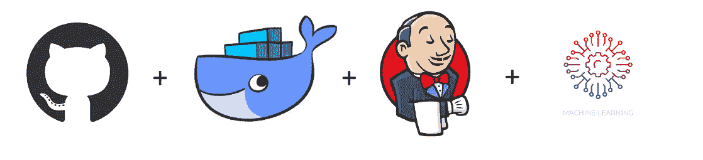

在训练机器或深度学习模型时，最常见的问题是我们需要多次改变层，以找到最佳精度的模型。这需要大量的手工工作和时间。

通过集成 Jenkins 和 docker，我们只需设置一次 Jenkins，然后将您的程序推送到 GitHub，就可以找到最佳精度的模型。詹金斯会做剩下的工作。

**假设:**

1.  Docker 和 Jenkins 安装在 BaseOS 中。
2.  用户拥有一个 GitHub 帐户并创建了一个回购。
3.  Jenkins 被添加到 sudoers 文件中以启用权限。

我们将从创建一个安装了 python3 和所需库的容器映像开始。

# 码头工人:

下面是创建 docker 文件以训练序列模型的屏幕截图:

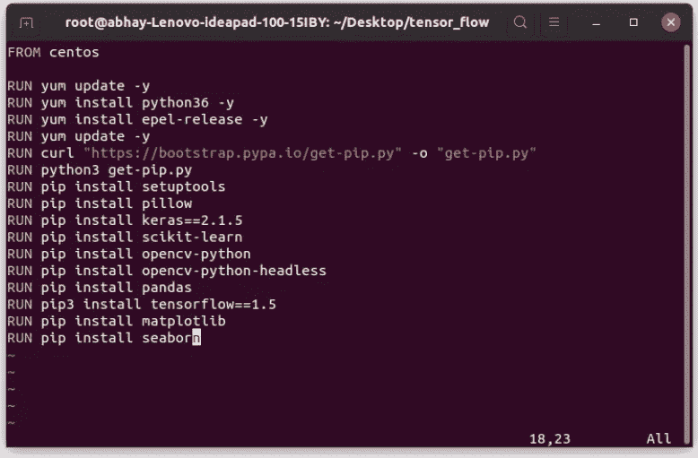

以 Dockerfile 的名称保存该文件，并构建一个映像:

```
docker build -t <IMAGE_NAME>:<VERSION> path/to/Dockerfile
 e.g docker build -t Sequential:v1 /root/cnn/
```

为线性回归模型创建另一个容器图像:

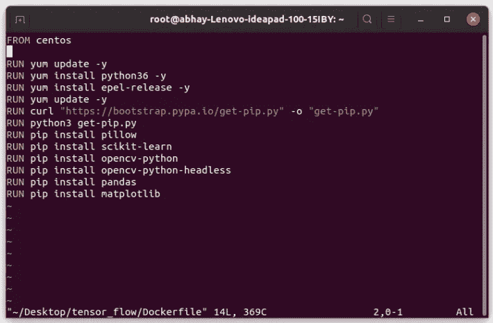

使用上面的命令保存并构建另一个图像用于线性回归。

您可以使用 docker images 命令检查您的图像:

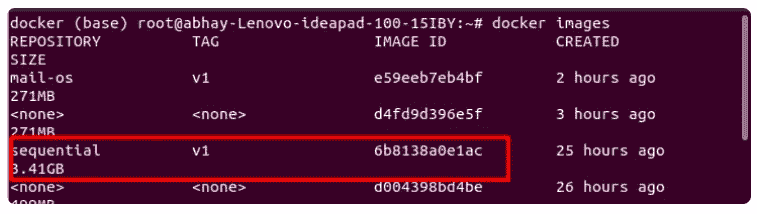

# 詹金斯:

现在是时候通过创造就业机会来安置 Jenkins 了:

job1:从 GitHub 复制代码并放入一个目录中:

在下面的截图中，我们提供了我们的 GitHub 链接，Jenkins 将从那里复制代码，并使用“sudo cp -vrf /mlops-ws”命令将我们的代码文件复制到 mlops-ws 目录中。

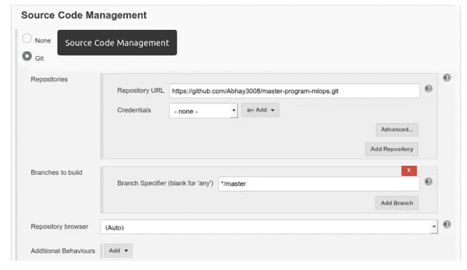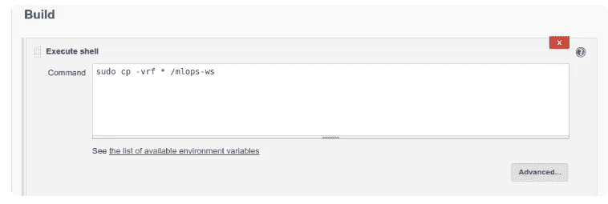

**job2:** 检查代码是线性回归还是序列回归，据此我们需要启动安装了那些库的容器映像。

在这里，我只考虑线性回归和序列问题。

要检查文件的顺序或回归，下面是命令 check:

```
grep -Rw 'path/to/file.py' -e 'Sequential/Regression'
```

现在我们需要运行我们的映像，并将 mlops-ws

<dir>与 root

<dir>连接起来，使我们的程序在容器内部可用。</dir>

</dir>

```
sudo docker run -di -v /mlops-ws/:/root/ --name <NAME> <IMAGE_NAME>
sudo docker exec -w /root -i <NAME> python3 <FILENAME.py>
```

下面是 job2 的外壳截图:

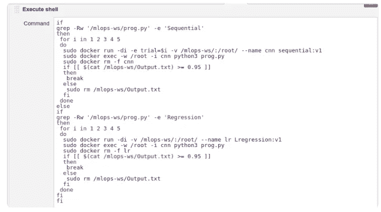

这张截图里有很多东西我没有讲，让我们一个一个来理解:

*为什么循环？*

如果模型没有给出更好的精度，我们就使用这个循环来一次又一次地运行我们的程序，每次我们都会应用一个不同的层模式，我们将在程序中看到。

*为什么传递 env 变量？*

我们在容器映像内部传递 env 变量，这样我们的 python 程序就可以使用该变量

这里有一个例子:

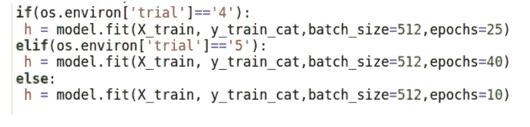

*为什么是“如果”条件？*

“if 条件”是检查包含程序准确性的输出文件。即*如果小于 0.85，模型将再次训练，并使用另一层配置。*

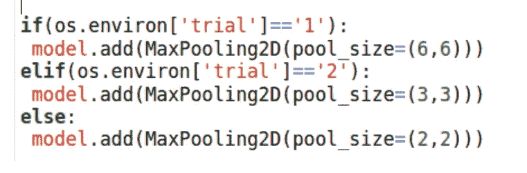

**job3:** 最好的模型做好了就给开发人员发邮件。

对于邮件，我们将创建另一个安装了 python 的映像，只需运行该映像，它就会为我们发送邮件。

邮件操作系统的 Docker 文件:

```
FROM centos
RUN yum -y install python36
CMD python3 /root/mail.py
```

*你可以从我的 GitHub repo 获得邮件的 python 程序。*

下面是我得到的输出:

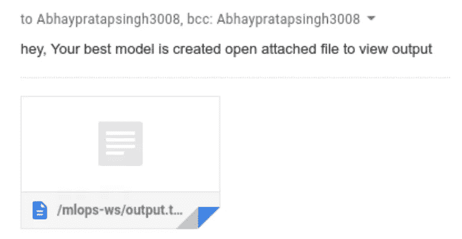

**job4:** 监视我们的容器是否失败，如果失败，该作业将再次启动。

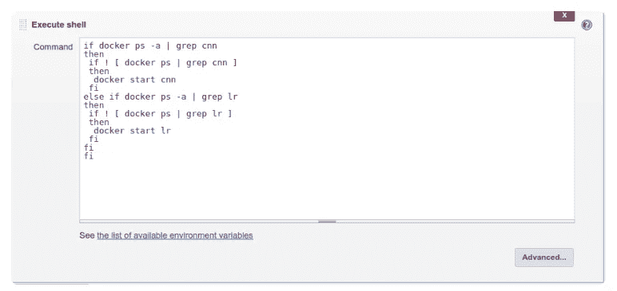

如果你在这篇文章中发现任何错误或者任何我应该修改的地方，请随时联系我。

电子邮件:Abhaypratapsingh3008@gmail.com