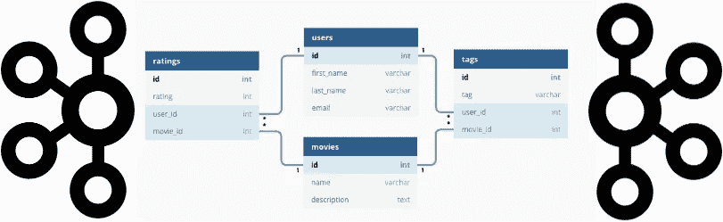
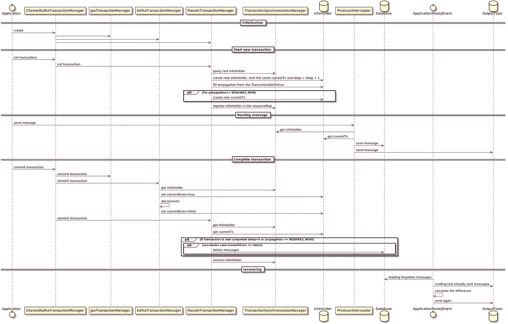
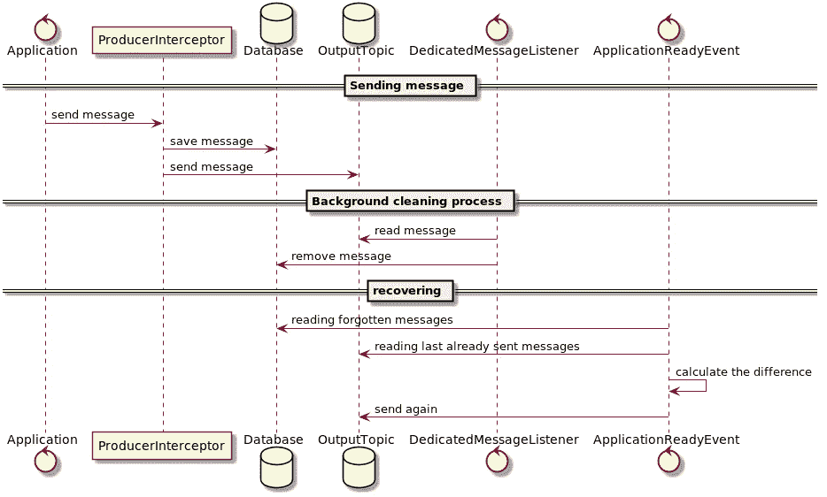

# Kafka 与数据库的事务集成

> 原文：<https://blog.devgenius.io/transactional-integration-kafka-with-database-7eb5fc270bdc?source=collection_archive---------0----------------------->

# 介绍

越来越多的项目现在选择 Kafka 作为他们的消息传递基础设施。这种技术的选择并不总是受到以线性可伸缩性处理大量数据的实际需求的驱动。我们经常可以听到 Kafka 在平常枯燥的涉及琐碎文档工作流管理的企业项目中的应用。在这种情况下，回答“为什么”这个问题并不容易。有时，它可能是由炒作和卡夫卡在著名项目中的使用的令人印象深刻的例子引起的。在其他情况下，它可能受到以客户的钱为代价进行实验的机会的启发，用先进的技术吸引他。

例如，如果我们使用 Kafka 来分析高负载网站上的用户活动，收集关于客户行为的所有事件，我们有一个密集的数据流，但是每个事件都可能丢失，而不会给整个业务流程带来问题。这种方法不适用于大多数企业应用程序，在这些应用程序中，我们迫切需要 Kafka 和数据库之间的健壮事务集成。

的确，卡夫卡支持交易，但只是单个话题之间的交易。我们可以原子地接收传入的消息，处理它，发送一些传出的消息，同时可靠地确认原始消息的接收。只要我们只处理 Kafka 数据，这种方法就很好。在业务流程中涉及任何第三方数据源的任何尝试都会被卡住，因为 Kafka 从根本上不支持 XA 事务。

在最简单的情况下，我们可以在本地存储任何处理服务的实例状态，并通过向特定的专用“归档”主题发送消息来伴随每次更新。这种发送可以与处理所有其他消息一起事务性地执行，因此数据完整性不会受到影响。在崩溃重启之后，我们总是可以通过从这个“归档”主题中读取整个消息流来恢复这个状态(“事件源”模式，Kafka Streams 使用类似的方法)。实例状态可以实现为内存中的结构、文件集合，甚至本地数据库(RockDB 经常用于此)。

然而，这种方法有一些明显的缺点。

*   首先，在数据量大，数据完全丢失的情况下，恢复过程可能会太长。
*   其次，对位于不同处理服务实例中的数据执行“联合”操作是复杂的。任何查询操作都必须分成几个部分，然后连接接收到的结果。它会降低可扩展性，并且可能需要客户端提供额外的内存来进行进一步的数据处理。更新操作的情况甚至是值得的，因为以事务方式更新几个实例是相当复杂的。

在大多数情况下，我们希望对服务的所有实例继续使用通常的单个数据库，并通过发送/接收 Kafka 消息以事务方式执行更新。本文主要关注实现这一需求的不同方法。

# 发送消息

让我们从发送消息开始。我们可以非事务性地执行，结果会遇到以下问题:

*   如果我们先发送数据库，然后再发送消息，我们将冒接收方永远不会知道更新结果的风险。
*   如果我们先发送消息，那么接收者可能会在提交数据库事务之前过早地请求更新的数据。此外，数据库更新操作可能会以错误结束，然后邮件的发送方和接收方可能会处于不一致的状态。

乍一看，至少可以描述六种根本不同的方法来实现可靠和一致的操作实现。

## 发送前在数据库中临时存储消息

这是一种标准而简单的 JEE 模式:

*   数据库更新操作创建消息，并将它们存储在数据库表中——队列中以供调度
*   一个专用的调度程序从队列中读取这些消息，发送出去，然后删除它们。

在服务实例死亡的情况下，我们最大的风险是发送它，然后接收一些消息两次。但事实上，任何分布式系统的开发人员都应该随时准备应对这类问题。

对于每个发送的消息，应用程序在负载下执行一到两个额外的查询，这取决于调度策略。

需要强调的是，遵循这个模式，我们根本不用卡夫卡交易。所有的信息最初都是从卡夫卡的角度出发的。

**优点:**

*   对所有开发人员来说是最直截了当、透明和清晰的
*   在最简单的情况下，基于“select for update skip locked”操作，它可以很容易地实现。这种实现对所有技术都是一样的，不需要复杂的基础设施组件。
*   有现成的实现，例如，Spring **JdbcMessageStore** 或 Yandex“d b-queue”

**缺点:**

*   即使应用程序不执行任何业务活动，并且根本不发送消息，数据库上相当大的额外负载也是永久的连续轮询。
*   如果消息生成的速度比发送出去的速度快，那么表就会积累更多的数据，从而进一步降低调度过程的速度。因此，我们有一个负反馈系统，这不是很好。
*   从发送流程的角度来看，消息按照提交事务的顺序出现，而不是按照应用程序通过将记录保存在队列表中“发送”消息的顺序。例如，让一个事务在时间 T1、T3 发送消息，并在时间 T10 提交它们。另一笔交易在 T4 T2 时间 T5 也做了同样的事情。在这种情况下，消息将按照 T2、T4… T1、T3 的顺序发送。
*   在一个分区的上下文中保持消息的顺序要求在任何给定时间集群中只有一个专用线程，该线程从该分区发出消息。这种限制的可靠实现也不简单。
*   一些正确的、经过仔细测试的、随时可用的实现(例如 **JdbcMessageStore** )只能与特定的基础设施一起应用，这本身就是重量级的。

结果，这种方法的严格正确的实现变得非常复杂，并且不够可伸缩，尤其是在高负载的情况下。那些愿意的人可以自己在论坛上阅读关于 **JdbcMessageStore** 性能问题的讨论。如果我们不特别关心消息顺序，高吞吐量不是关键，也许卡夫卡也不需要？

## 卡夫卡 JDBC 连接器

Kafka 还建议应用程序外部实现前面的方法——JDBC 连接器(源和宿)。这些模块允许将表记录转换成消息，或者相反。如前所述，发送消息是通过以可配置的间隔轮询源数据库表来实现的。

主要的优点是这个功能已经实现了，并且它与已经存在的应用程序的集成只需要开发人员最少的努力。

上述问题的另一个缺点是需要在集群中部署其他基础设施并对其进行管理。此外，该模块的配置选项并不意味着可以在单个分区的上下文中保存消息的顺序，这使得这种方法的适用性受到一定的限制。

总的来说，这种方法似乎更像是一种集成现成应用程序的技术，而不是解决问题的方法。

## 低层的“更改数据-捕获”模式

这也是对第一种方法的一些修改，但是没有通过 SQL 查询轮询数据库服务器。在这种情况下，我们安装特殊的软件，可以订阅系统事件，对相应表中的新记录做出反应，并将它们转换为 Kafka 消息。

现在，下一个工具可用了:

*   【Linkedin 的数据总线—仅支持 Oracle
*   Debezium——最知名的解决方案，通过插件架构支持大量数据库
*   来自网飞的 DBLog——它看起来还没有作为开源软件发布
*   **瓶装水**——它很受欢迎，但没有得到更多支持

优点和缺点列表大致相同，但是引入中间存储的主要缺点已经消除——不存在持续轮询。

## 组合事务管理器

这种模式是 Spring 生态系统的标准模式:**基于 **JpaTransactionManager** 和 **KafkaTransactionManager** 的 chained KafkaTransactionManager**，后者反过来管理本地 Kafka 事务。

这种方法可以被认为是“1PC 尽力模式”的一种实现。这种模式的主要思想是，最“稳定”的资源的更改与最后的更改一起提交，这大大降低了两个系统不一致的最终状态的风险。

主要问题是我们以什么样的顺序联合事务管理器:

*   在负载情况下，数据库操作的提交时间可能很长，如果我们首先提交 Kafka，收到消息的客户将无法请求修改的数据
*   如果我们在数据库之后提交 Kafka，服务有一点点可能会在这两个操作中间终止

是的，最后一种概率很低，我们通常会忽略。但是如果我们将它乘以大量的消息，我们将会得到相当真实的损失，这是不可接受的，例如，在处理财务数据期间。从另一个角度来看，如果只处理很少的信息，重新思考我们是否需要卡夫卡可能是有意义的。

怎样才能消除损失的风险？简单的想法是将发送的消息可靠地保存在数据库中，并在 Kafka 提交操作之后立即删除它们。这种方法最简单的实现可以基于以下常见组件:

**>事务性作用域存储。**

最初，我试图使用本地线程变量，但在几次不成功的尝试和大量相当复杂的代码之后，我决定 Spring transactional context 可能是它的最佳位置。

代替变量，我在**ChainedKafkaTransactionManager**配置中添加了第三个事务管理器，它使用以下信息管理 **InfoHolder** 对象:

*   **currentTx** —当前卡夫卡交易的 UUID
*   **commit error**—Kafka 提交错误事件的标志
*   **深度** —嵌套 Kafka 交易的索引
*   **传播** —当前 Kafka 交易的传播属性

**>特殊伪事务管理器**

**ChainedKafkaTransactionManager**在所有其他事务管理器之前和之后调用它。它唯一的责任是提供对具有最大深度值的“最后一个” **InfoHolder** 实例的访问——对最后一个嵌套 Kafka 事务的描述。 **InfoHolder** 的所有实例都存储在**transactionsynchronizationmanager . resource map**集合中，并在事务管理相关操作期间进行更改。

另一个它的逻辑很简单:

*   在 **doGetTransaction()** 上，它用**deep = lastinfoholder . deep+1**创建新的 **InfoHolder** 对象(如果是第一个实例，则为 1)。这段代码在其他两个事务管理器之前执行。
*   在 **doBegin()** 上，它接收 **InfoHolder** 实例作为**事务**参数的值，并通过调用**transactionsynchronizationmanager . bind resource()**函数将其注册到**transactionsynchronizationmanager . resource map**集合中。根据 **TransactionDefinition** 参数的 **propagation** 属性的值，它将 **currentTx** 属性的值从上一个 **InfoHolder** 实例复制到当前实例，或者生成新实例(例如，如果**propagation = = REQUIRES _ NEW**
*   在**docleanupfatecompletion()**上，它读取最后一个 **InfoHolder** 对象，并使用相应的 **currentTx** 属性从数据库中删除所有消息，但前提是 **(deep == 0 或 propagation == REQUIRES_NEW)和 commit terror = = false**(真实的表达式更复杂，但对于示例来说已经足够了)。此外，它还执行 **unbindResource()** 操作，并从**TransactionSynchronizationManager**范围中抛出最后一个 **InfoHolder** 对象。这段代码在其他两个事务管理器之后执行。

**>卡夫卡制作人**

*   它的主要职责是用 **currentTx** 属性保存数据库中的任何消息，该属性可以从由**transactionsynchronizationmanager . resource map**集合提供的最后一个 **InfoHolder** 对象中读取。
*   发送的消息以 **ProducerRecord** 实例的形式提供，包含所有必要的信息，以便在提交期间出现任何问题时再次发送。
*   也有必要考虑到，卡夫卡忽略了这个代码的所有例外。所以，如果我们需要使用它们，唯一的办法就是把它保存在最后一个 **InfoHolder** 对象中。

>这个构造的最后一个组件是稍微定制的 **KafkaTransactionManager。**上**的 doCommit()** 方法它:

*   从**TransactionSynchronizationManager**获取最后一个 **InfoHolder** 对象，并将其 **commitError** 属性设置为 true
*   执行原始的 **doCommit()** 方法
*   将 **commitError** 属性设置回 false

最后一个组件是 **ApplicationReadyEvent** 的监听器，它从表中读取所有“遗忘”的消息，并在死亡后重新启动服务时再次发送它们。为了最大限度地减少发送的重复项的数量，可以执行以下操作:

*   等待一段时间，直到服务实例不可用时启动的事务完成。
*   从传出主题中读取最新消息，并从数据库表中删除相应的条目。

下图旨在说明上述交互:

**优点:**

*   根本没有持续的数据库轮询。
*   SQL 请求的数量可以最小化到每个事务 2 个(通过在 **InfoHolder** 对象中批处理消息)。
*   发送消息和删除成功提交的消息的过程不能相互“滞后”。
*   用于临时存储“提交过程中”的消息的表的大小总是很小，并且操作执行得非常快。
*   实现足够紧凑和清晰。

**缺点**

*   对于每个平台(例如，Spring / JEE)，我们需要以特定的方式实现它。
*   由于单个事务有许多不同的可能组合，彻底测试这些代码是一项挑战。在编写了几十个测试之后，我意识到这个过程真的是无止境的。
*   由于超时，任何与事务相关的代码都很难调试。
*   像 Camunda 这样的高级框架喜欢在给定的地方进行定制，有些甚至试图在线程之间移植事务的上下文(我自己也不止一次这样做过)。没有人能保证你的代码与这些技巧保持兼容。

虽然我已经设法使这种方法可靠地工作，但总的来说，它似乎相当脆弱，需要广泛和昂贵的测试。所以，我只能推荐它用于大而长的项目。

## 目的主题作为传递证明的用法

这种方法的总体思路大致相同:

*   简介**chained KafkaTransactionManager**为 **JpaTransactionManager** 和 **KafkaTransactionManager 的组合。**
*   在数据库事务期间可靠地保存 Kafka 消息。
*   在 Kafka 事务成功提交后删除它。

唯一的区别是移除的方法:

*   每条消息都包含相应数据库记录的主键值。
*   专用的系统消息监听器接收来自输出主题的所有消息，并从数据库中删除相关记录。它可以从 Kafka 读取它们，立即确认，并出于优化目的从数据库中删除整个数据集。

恢复过程大致相同，但是由于保存和删除数据库记录之间的延迟更大，因此最好在再次发送被遗忘的消息之前阅读输出主题。

下图旨在说明上述交互:

**优点:**

*   就分布式日志技术而言，最符合逻辑、最直接、最透明
*   对系统服务和组件的入侵最小
*   由于简单性，它对错误和错误有很强的适应性。
*   完全没有持续的数据库轮询，完全是事件驱动的过程
*   在许多情况下，根本不需要任何**ChainedKafkaTransactionManager**就可以轻松实现

**缺点**

*   资源消耗最大(每条消息一到两个 SQL 查询、与代理的连接、后台网络流量、监听器线程等等)
*   保存和删除数据库记录、表中的更多数据

通过一些小的修改，这种方法可以应用于完全非事务性的服务，例如邮件服务器。

## Kafka 与数据库 TX 事务的组合

有这样一种交易模式，称为“最后资源策略优化(LRCO)”这种方法意味着不支持 XA 的资源可以(相对)安全地包含在包含多个资源的两阶段提交事务中。

重要的是:交易必须是两阶段的(通常是 XA)。除了一个资源之外，所有资源都必须支持 XA。

就我从文档中看到的，很多事务管理器都支持这种类型的优化，例如 JBoss 提供的和 Atomikos

当然，如果数据库支持 XA 事务，这看起来是最无缝的解决方案。不幸的是，Atomikos，例如，开箱即用，包含这种模式的实现只有 JDBC 数据源和不知道卡夫卡。我可以找到任何关于成功实现这种方法的信息。

## 业务驱动的方法

这种方法是默认推荐的**ChainedKafkaTransactionManager**与考虑一些业务需求和合理权衡的组合。

首先，我建议在可靠负载和模拟基础设施问题下测量丢失消息的频率。如果你每年最多能错过十条消息，每笔交易的平均金额在 100 欧元左右，那就意味着投入大量的时间和精力在上述问题的解决上没有任何意义。忘记并继续解决业务任务，以增加未来最大可能的损害。

其次，如果您做的是严肃的业务，我建议您已经有了一些 SLA 集合、监控系统和工具来解决“夹在中间”的业务实体的问题。这种工具的存在意味着单个业务操作已经以无能为力的方式实现了。因此，消息的丢失将不可避免地被监控检测到，之后您只需请求再次执行上一个操作。如果您没有这样的监控系统，那么您要解决的问题将比本文中描述的更加严重。

第三，越复杂的代码被设计成最小化可能的损失，它内部包含的错误就越多。开发、调试和修复错误所需的时间就越长。它消耗的内存和处理器时间就越多。此外，我们不应该忘记，由于这些错误造成的事故也要花钱。

一般来说，这个推理应该放在文章的开头，但那样就没有人再往下读了，我也就没有理由展示我深入的知识了。

# 接收消息

这种情况要容易得多:即使没有 Kafka 事务模式，您也可以完成数据库事务并确认 Kafka 消息。

如果倒楣的事情发生，最大的问题是两次收到相同的信息。防止它不是一个重要的问题(无论如何，在分布式架构中，我们必须以某种方式这样做):

*   将消息的唯一键(技术=主题名+分区索引+偏移量或业务，这可能更好)插入到具有唯一索引的专用表中。我们可以在流程开始时立即执行，对于重复的数据库事务将立即回滚。
*   这个表可以定期清理，不会降低性能，因为您很难期望以超过一周的时间间隔收到副本。但是，一切当然取决于业务流程。
*   此外，有必要考虑到该表是高并发存储。因此，我们需要在数据库级别优化它(例如，对于 Oracle，通过 INITRANS 选项)，并通过分片进行优化(向每个表发送几个单独的表，这些表中有散列键分割后的相应剩余部分)。

如果处理每条消息都需要执行与数据库相关的操作，那么这种模式或多或少是最佳的。在这种情况下，I/O 吞吐量受到数据库的限制，每条消息增加一个查询并不会改变太多情况。此外，大多数时候，我们不仅需要拒绝重复，还需要通过返回与以前相同的值来提供服务的幂等性。这个值必须存储在某个地方，与唯一消息键一起存储更合理。在企业应用程序的情况下，这大约是所有用例的 99.99%。

但是，如果您只需要不时地更新数据库，该怎么办呢？对于一些优化最直接的方法，我们可以应用 Bloom filter——空间高效的概率数据结构，由 Burton Howard Bloom 在 1970 年提出，来测试一个元素是否是集合成员。

从实现的角度来看，它只是一个位数组。唯一的细微差别是它是假阳性的。通过设置误报决策的概率(从业务角度来看这是可以接受的)和受控元素的数量，您可以获得所需的数组大小。

因此，重复筛选的优化实现可能如下所示:

*   对于每个分区，过滤器的状态分别存储在数据库中。
*   应用程序使用**ConsumerRebalanceListener**来获取关于重新平衡过程的事件。
*   在分配分区之后，应用程序加载相应过滤器的状态，在撤销之后，将状态与数据处理的结果一起保存，包括最后的偏移。
*   应用程序将消息的唯一键应用于过滤器，从而在接收到每条消息时识别出重复的消息。是的，我们的过滤器可以返回假阳性结果，我们可以丢失一些信息，但我们可以控制这种“倒霉事”的目标频率，并使可能的损失可以接受。
*   应用程序定期将处理结果保存在数据库中，包括过滤器的状态和最后的偏移。
*   从死亡状态重启后，应用程序从数据库中读取先前的状态(过滤器+处理结果)，应用偏移量，并继续工作

布隆过滤器也可以应用于前一种情况，以最小化 SQL 查询的数量。但是，只有当我们想要使用相当大的时间窗口(这会导致一个巨大的表)并且不关心幂等性时，它才是合理的。在这种情况下，我们首先使用过滤器，只有在肯定答案的情况下，才使用 SQL 查询验证它。

# 结论

Kafka 并不是处理企业应用程序内部事务性用例的最佳解决方案。如果你不是脸书，也不打算开发一个世界范围的支付系统，你可能不需要它。XA 事务加入了 JMS 和数据库，能够完全满足你的所有需求。

然而，可以想象 Kafka 在实现 CQRS /事件源模式、提供备份存储以及促进新类型服务的引入方面是有用的。

在 Kafka 和数据库之间实现事务性交互时，建议遵循最简单的方法，不要追求实现的绝对精度。通常，折中的方法会更好地减少可能的损失。

对于发送消息，我可以推荐一种带有标准**ChainedKafkaTransactionManager**的方法，无需任何额外的定制。如果你是偏执狂，你可以用一个目的地话题作为传递的证明。接收消息的最佳方法是使用专用表来存储接收到的消息的密钥和答案。

最后的一般建议是:测试、衡量和估计可能的金钱损失。不要试图最小化在真空中操作球形马的成本。