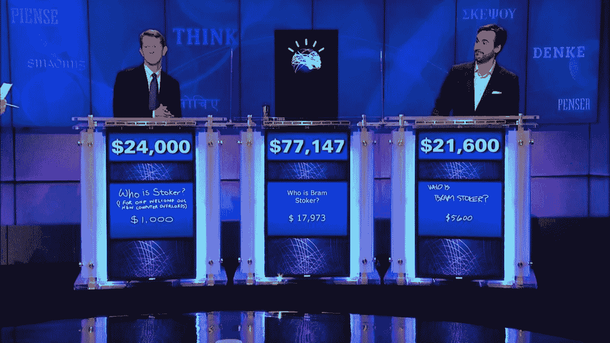
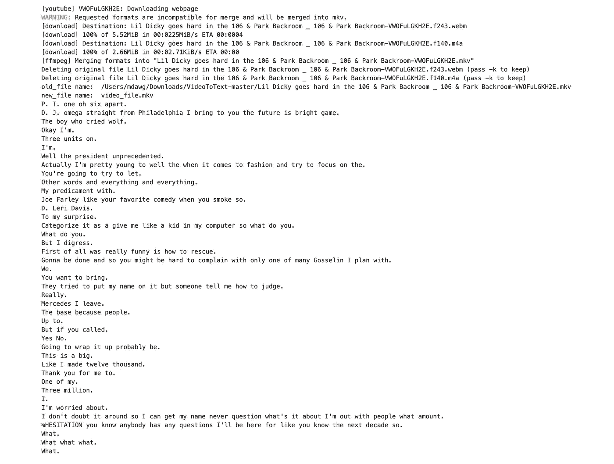

# 使用 Python 和 IBM Watson 将 YouTube 视频转录为文本

> 原文：<https://blog.devgenius.io/transcribe-youtube-videos-to-text-with-python-and-ibm-watson-2a3a2ad560b2?source=collection_archive---------4----------------------->

IBM Watson on Jeapordy

# 这个程序实际上解决了什么？

*   自动记录会议笔记或采访笔记
*   从所有 20 分钟长的加密货币 youtube 视频中获取文本

这就是我要用它的全部原因:)

# 目标

这篇文章的目的，或者说 how-to，是展示如何获取一个 YouTube 视频，或者任何视频文件，并通过编程从所述视频转录文本。

# 你需要什么

*   一个 IBM [账户](https://cloud.ibm.com/catalog/services/speech-to-text) ( **获取您的 api 密钥和 url** )
*   下载 [ffmpeg](https://ffmpeg.org/download.html) ( **！brew 安装 ffmpeg**
*   下载 [youtube 下载器库](https://github.com/ytdl-org/youtube-dl/blob/master/README.md) ( **！pip3 安装 ibm_watson**
*   **如果下载 youtube 视频时出现证书错误，双击 python 目录中的证书文件**
*   Python 3..obv。

# 程序/功能

我已经注释掉了每段代码上面的所有内容。应该不难决定。如果你需要一个更好的演练，[这个家伙](https://www.youtube.com/channel/UCHXa4OpASJEwrHrLeIzw7Yg)(尼古拉斯·雷诺特)在这个视频中做了一个非常棒的工作。我只是扩大了一点。

*   请记住——要使用下面的代码，您必须获得您的 IBM api 密钥和 url——我将我的密钥和 URL 放在一个名为`keys.py`的文件中，并将其导入到程序中。
*   你还需要获得一个 youtube 视频的 URL——我在处理较大的视频时遇到了一些麻烦，所以也要记住这一点。
*   IBM STT 免费服务每月只为您提供 500 分钟。
*   根据视频的大小，可能需要几分钟时间。这段大约 5 分钟的视频花了几分钟(也许 3 分钟)来播放。

上面的代码会产生什么

# 瞧

我们现在已经把一个 YouTube 视频 URL 转换成了音频。使用`ffmpeg`的 wav 文件，使用 IBM Watson STT 服务转录文本，并将每个句子拆分成单独的行/行。挺酷的:)

# 开源代码库

都在我 [github](https://github.com/maxwellbade/video_speech_to_text) 的一个笔记本里。放松

# 你太酷了，麦克斯

如果你觉得这有帮助，给我发些东西。

**XRP 钱包**:rmdg 3 ju 8 pgy VH 29 elpwadua 74 cpw w6 fxns

**XRP 目的地标签** : 1328520722

**BTC 钱包**:3k 2 wujcrcbsbiplrffaestjva 5 qubzvr

**ETH 钱包**:0x e 7 ede 8 b 7 ef 4289356d 5579 f 0 C4 e 00 BFF 36 b 28 BDF