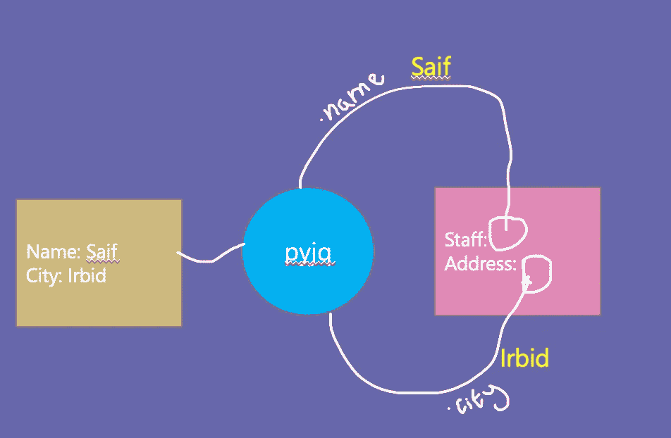
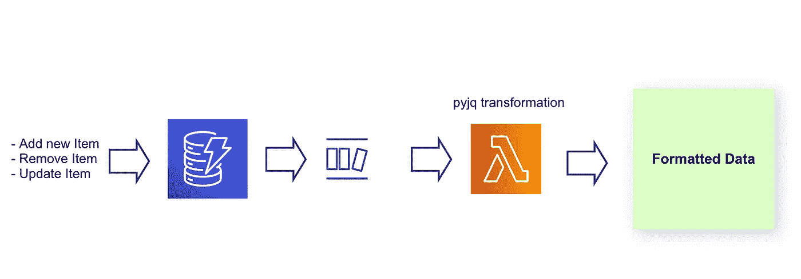

# 用 pyjq 转换嵌套 json:推荐用于深度睡眠

> 原文：<https://blog.devgenius.io/transforming-nested-json-with-pyjq-recommended-for-a-deep-night-sleep-3870b1c88091?source=collection_archive---------3----------------------->


你以前被分配过解析、过滤和转换 json 文件的任务吗？还记得遍历节点和属性并检查传入文件中的空值吗？还记得当他们改变上游的数据结构时，你有多沮丧吗？让我告诉你一个好消息，pyjq 可以最小化你的代码并保护它免受上游模式变化的影响。

jq 是什么？

> jq 程序是一个“过滤器”:它接受输入，产生输出。有许多内置的过滤器，用于提取对象的特定字段，或者将数字转换为字符串，或者其他各种标准任务。
> 
> 来源:https://stedolan.github.io/jq/manual/

**红色药丸还是蓝色药丸**？

你好 Neo，pyjq 是你的“瑞士军刀”——一个将解决许多挑战的库，如过滤、映射和转换结构化数据。要打印下面例子中的 c 值，可以写最简单的脚本 ***.a.b.c*** 交给 pyjq 库，pyjq 有了输入文件和脚本，它会施展魔法打印出“嘿漂亮”:)

```
{
    "a": {
        "b": {
            "c": {
                "hey beautiful"
            }
        }
    }
}
```

# 如何开始？

> 你将需要 flex、bison (3.0 或更新版本)、libtool、make、automake 和 autoconf 来构建 jq。通过自制、APT 或其他方式安装它们。
> 安装完以上内容后，您可以继续安装 pyjq:
> 
> pip 安装 pyjq
> 
> 来源:[https://pypi.org/project/pyjq/](https://pypi.org/project/pyjq/)

现在你有了你的机器设置，让我们开始写一个简单的例子，你有一个 json 文件需要在保存到 dynamoDB 之前重新格式化，json 文件有*名称*和*城市*属性，但是数据需要保存为*职员*和*地址*。

```
***example 1:***input1 = {
            "name": "Saif",
            "city": "Irbid"
        }
result1 = pyjq.***one***('{Staff: .name , Address: .city}', input1)print(result1)>> {'Staff': 'Saif', 'Address': 'Irbid'}
```



pyjq 将替换每个以()开头的键。)和来自输入的键值(如果存在的话)

现在您已经熟悉了 pyjq 正在做的事情，让我们来讨论您将经常遇到的更高级的案例。

> C *ase I:传入属性为空*

如果输入中缺少属性，其值将为 ***无***

```
***example 2:***# name attribute is missing from *input1*
input1 = {
            "city": "Irbid"
        }
result1 = pyjq.one('{Staff: .name , Address: .city}', input1)
print(result1)>> {'Staff': ***None***, 'Address': 'Irbid'}
```

在 ***无*** 的情况下，可以使用 if 语句指定默认值:

```
***example 3:***input1 = {
            "city": "Irbid"
        }
result1 = pyjq.one("{Staff: (if .name == null then \"Ahmad\" else .name end) , Address: .city}", input1)>> {'Staff': 'Ahmad', 'Address': 'Irbid'}
```

> C ase II:作为数组的传入属性

假设您正在接收一个事件列表，但是您对最新的事件感兴趣，假设较高的索引代表最新的事件。

```
***example 4:***input2 = [{"event": "DELETE", "data": "Saif"}, {"event": "INSERT", "data": "Ahmad"}]
result2 = pyjq.one(".[1]", input2)
print(result2)>> {'event': 'INSERT', 'data': 'Ahmad'}
```

> ase III:处理不同的数据类型，比如整数和字符串

jq 提供了一些可以动态转换输入类型的转换器，一个用于整型，另一个用于字符串数据类型。在示例 5 中，我们解析数组中的第二个条目，并使用 ***tonumber*** 函数将版本从字符串转换为数字

```
***example 5:***input3 = [{"event": "DELETE", "status": "False",  "version": "1"},
          {"event": "INSERT", "status": "True", "version": "2"}
          ]result3 = pyjq.one("{event_status:.[1]|.status, 
                     event_version: .[1]|.version|**tonumber**}", input3)print(result3)>> {'event_status': 'True', 'event_version': **2**}
```

如果我们想将输入解析为字符串，我们可以应用 **tostring** 函数，参见示例 6。

```
***example 6:*** input3 = [{"event": "DELETE", "status": False,  "version": "1"},
          {"event": "INSERT", "status": True, "version": "2"}
          ]

result4 = pyjq.**first**("{event_status: .[]|.status**|tostring**, event_version: .[]|.version|tonumber}", input3)
print(result4)>> {'event_status': **'false'**, 'event_version': 1}
```

> ase IV:输入排序

答案是肯定的，可以使用两个函数对输入进行排序:***sort***and***sort _ by(expression)***

> `sort`函数对其输入进行排序，输入必须是一个数组。值按以下顺序排序: **null** ， **false** ， **true** ， **numbers** ， **strings** ，按字母顺序(按 unicode 码点值)排列，在词法顺序对象中
> 
> 对象的排序有点复杂:首先，通过比较它们的键集(作为按排序顺序排列的数组)来比较它们，如果它们的键相等，则逐个键地比较它们的值。
> 
> `sort`可用于按对象的特定字段排序，或应用任何 jq 过滤器。
> 
> `sort_by(foo)`通过比较`foo`对每个元素的结果来比较两个元素。
> 
> 来源:[https://stedolan.github.io/jq/manual/#TypesandValues](https://stedolan.github.io/jq/manual/#TypesandValues)

```
***example7:***input5 = [None, "Saif", "Ahmad", 1984, True]
result_5 = pyjq.one("***sort***", input5)
print(result_5)>> [None, True, 1984, 'Ahmad', 'Saif']***example 8:***input6 = [{"id": 9, "name": "Ahmad"}, {"id": 2, "name": "Saif"},
          {"id": 1, "name": "Ammar"}, {"id": 3, "name": "Asharf"},
          {"id": 5, "name": "Wahid"}]
result_6 = pyjq.one("***sort_by***(.id)", input6)
print(result_6)>> [{'id': 1, 'name': 'Ammar'}, {'id': 2, 'name': 'Saif'}, {'id': 3, 'name': 'Asharf'}, {'id': 5, 'name': 'Wahid'}, {'id': 9, 'name': 'Ahmad'}]
```

> 让我们把它放在一个 dynamoDB 流例子中

现在，我们已经介绍了 pyjq 中的一些主要函数，让我们一起来构建一个关于 dynamoDB 流的场景，每当数据发生变化(更新、删除和插入)时，这个流都会触发 lambda 函数。



使用 DynamoDB 流和 Lambda 处理项目

在下面的例子中，dynamoDB 记录被修改，它被推送到 dynamoDB 流，dynamoDB 流触发了 Lambda。当 Lambda 函数接收到事件时，它将采用 ***modify_event*** 格式，它将事件作为输入，并使用 pyjq 库应用保存在***modify _ template . txt***中的格式，并生成如下图所示的输出。

```
 ***example 9:*** ***modify_template.txt***{
    "key_date": .dynamodb.Keys."key.date".S,
    "key_id":   .dynamodb.Keys."key.id".S,
    "new_name": .dynamodb.NewImage.name.S,
    "old_name": .dynamodb.OldImage.name.S
}***test.py***modify_event = {
    "eventID": "xxx",
    "eventName": "MODIFY",
    "eventVersion": "1.1",
    "eventSource": "aws:dynamodb",
    "awsRegion": "us-east-1",
    "dynamodb": {
        "ApproximateCreationDateTime": 1611697668,
        "Keys": {
            "key.date": {
                "S": "2020-11-03"
            },
            "key.id": {
                "S": "Id12345"
            }
        },
        "NewImage": {
            "name": {
                "S": "Saif"
            }
        },
        "OldImage": {
            "name": {
                "S": "Ahmad"
            }
        }
    }
}

def import_template(template_name):
    parent_path = str(pathlib.Path(__file__).parent)
    path = parent_path + '/' + template_name
    with open(path, 'r') as file:
        template = file.read().replace('\n', '')
        return template

modify_template = import_template('modify_template.txt')
formatted_modify = pyjq.one(***modify_template***, modify_event)
print(formatted_modify) >> *{
    "key_date": .dynamodb.Keys."key.date".S,
    "key_id":   .dynamodb.Keys."key.id".S,
    "new_name": .dynamodb.NewImage.name.S,
    "old_name": .dynamodb.OldImage.name.S
}*
```

> 我从使用 pyjq 中得到了什么？

1.  您将模板从代码中分离出来，您可以将模板保存为资源下的文本文件，并且无论何时上游发生变化，您都可以在不接触代码的情况下更改模板。
2.  您不必使用 if/else 检查嵌套 json 中的空节点，而是从代码中取出该逻辑，并将其添加到模板中。
3.  您还可以使用 tonumber 和 tostring 在模板中进行一些数据转换。
4.  可以使用 pyjq 库进行排序、分组、映射等。所有这些都可以放在模板文本文件中。

以上所有导致的配置设置可以保存在外部文件中，如 s3，或者任何您喜欢的存储，这样您就不必在每次上游/输出格式改变时重新部署您的代码。