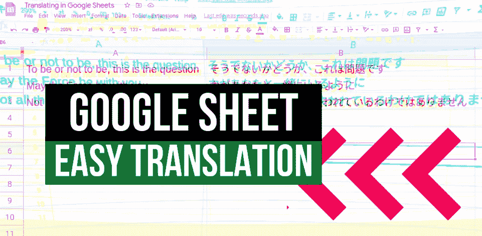
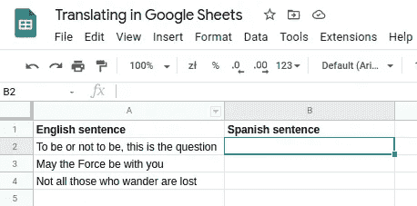
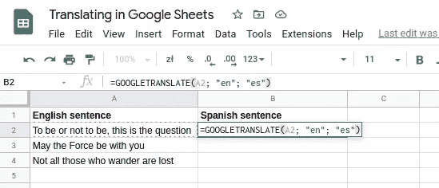
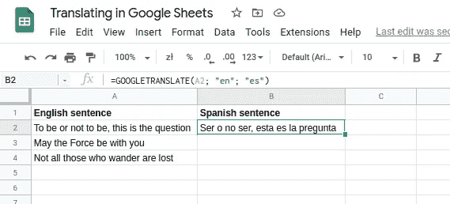
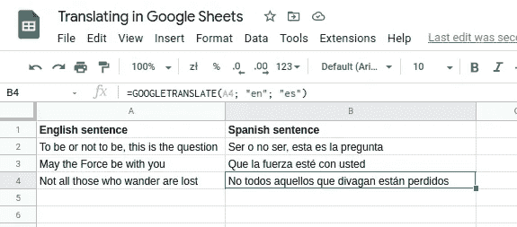

# 一个你从未听说过的谷歌表单功能

> 原文：<https://blog.devgenius.io/translating-with-google-sheets-is-too-easy-now-db1323a4d9ad?source=collection_archive---------23----------------------->

## 这再简单不过了！使用一个简单的功能直接在 Google Sheets 中翻译整个句子。

我们将直接在 Google Sheets 中翻译几个著名的英文引语，不需要任何额外的工具。让我们快点开始吧。

我有一堆文本需要翻译:

只需在单元格上应用 **GOOGLETRANSLATE** 公式，然后定义哪个单元格需要翻译、源语言和目标语言:

好了，我们差不多完成了:

向下拖动单元格:

我们结束了。这太疯狂了。再简单不过了。我说过它是免费的吗？感谢谷歌。