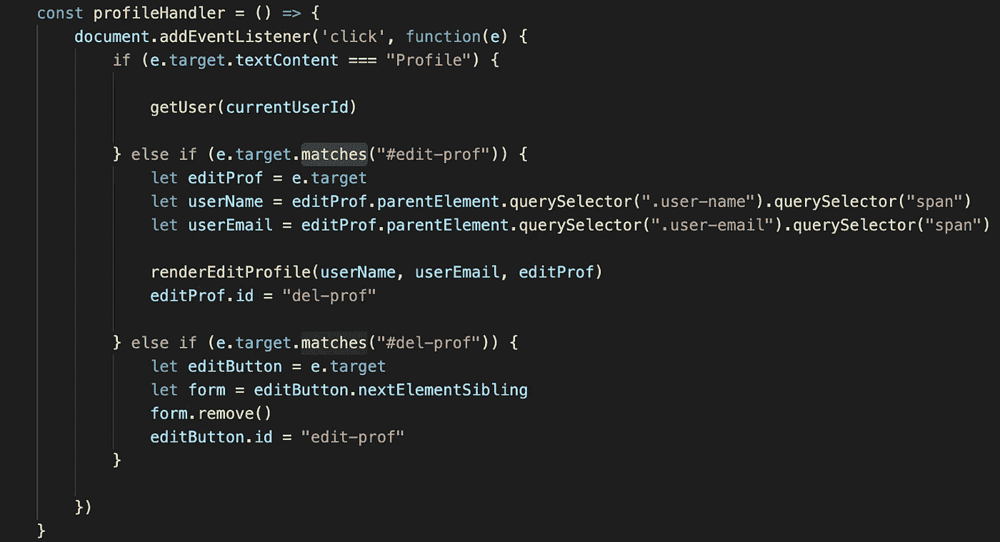
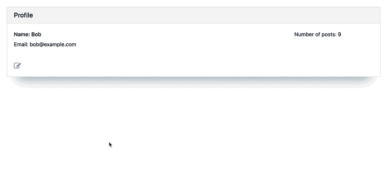
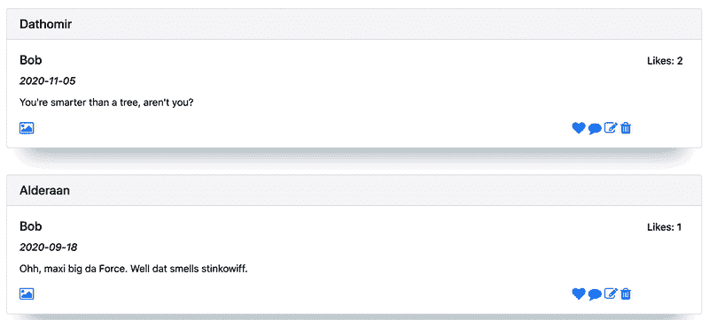

# 用普通的 JavaScript 遍历 DOM

> 原文：<https://blog.devgenius.io/traversing-the-dom-with-vanilla-javascript-3ce8f025682f?source=collection_archive---------3----------------------->

## *专门使用。匹配()和。最近()*

如果您是 JavaScript 新手，您可能会从普通的 JavaScript 开始，以便学习基础知识，并在进入框架之前理解该语言在核心层是如何工作的。如果您是普通 JavaScript 的新手，您可能会意识到在构建站点时能够有效地遍历 DOM 是多么重要。

起初，你可能会觉得这个过程令人生畏，或者至少是乏味的。虽然遍历 DOM 的繁琐本质在普通 JavaScript 中无处不在(这是 React 等框架最终会让您的生活变得更加轻松的地方)，但没有理由认为 DOM 遍历会令人害怕。为了帮助你从绝望的深渊走向开明的殿堂，我将详细介绍一些有用的方法来提升你的 DOM 遍历游戏。准备好。

为了演示这一点，我将使用我和我的合作伙伴 Dmitry 最近完成的博客应用程序的代码，这是为我们的编码训练营创建的，用 Rails 后端和 Vanilla JS 创建。如果你想看看这个应用程序，你可以使用这个链接[这里](https://murmuring-sierra-68682.herokuapp.com/)，只要保证不要太苛刻地评判我们的星球大战[骗子](https://github.com/faker-ruby/faker)占位符信息。事不宜迟，让我们进入一些方法。

# **。matches()**

对于那些厌倦了输入三个等号的人来说，这是一次很好的机会。的。matches 方法允许你检查你使用的元素，是否会被你最终在括号中传递的字符串选中，本质上是它们是否匹配。以下示例在 [MDN 页面](https://developer.mozilla.org/en-US/docs/Web/API/Element/matches)中用于此方法，并展示了它是如何很好地工作的:

```
var result = element.matches(selectorString);
```

我发现我在为 EventListeners 设置条件时经常使用这种方法，以确保一个事件只在特定元素被选中时发生，而没有其他元素。我在下面的博客应用中举了一个例子:



e.target.matches()确保我在运行非常不同的方法之前有正确的目标。

我在上面包含了整个函数，因为它展示了如何操作。matches 与三重 equals 及其自身进行比较。对于这样的 EventListener，我使用。匹配，以确保我单击的目标不仅是正确的元素，而且是正确的元素类，以便运行我的后续函数。我在每次点击后切换同一个元素的类，这或者是创建或者是删除一个表单。你可以在下面的 gif 里看到最后的结果，这都要感谢。匹配():



切换功能正在运行！

最后一点关于。匹配()。它只对选择器有效，所以你不能把变量名放在括号里。不会有用的，相信我，我试过了。现在，进入下一个方法！

# **。最近()**

到目前为止，您可能已经对有了一些基本的了解。querySelector()。这是您在学习普通 JavaScript 和 DOM 遍历时最先学习的方法之一，可以帮助您定位调用该方法的元素的最近/第一个子元素。由于它已经被很好地覆盖和广泛使用，我们在这里就不多做介绍了。但是，如果您想遍历 DOM 来查找最近的父元素，该怎么办呢？如何做到这一点？朋友们，答案就在。最接近的()方法。

再一次， [MDN](https://developer.mozilla.org/en-US/docs/Web/API/Element/closest) 为我们提供了一个非常可靠的关于最接近的结构的演示。我把它放在下面:

```
var closestElement = targetElement.closest(selectors);
```

如本演示所示，它基本上执行与相同的操作。querySelector()，但是它不是向下查看 DOM 树的子元素，而是向上查看父元素。但是为什么不干脆用**。更勇敢的你可能会问？那不是也有助于找到 parentElement 吗？这在某些情况下是对的，但不是所有情况下都是对的，而且它并不总是最有效的解决方案。下面我的应用程序中的另一个例子将说明这种差异。**


。这里有效地使用了 closest，因为目标可能不止一个元素。

在这个例子中。closest 用于选择最近的 div 父元素。这种情况下的“目标”实际上可能不止一个，一个心形表情符号和一个小边框。为了确保用户无论在哪里点击心形都有相同的体验，我使用了。以确保结果是相同的 div。然后，我将 parentElement 方法堆叠在一起，以展示使用。parentElement 可以是，特别是当您在 DOM 树中向上移动多个级别时。我用了会更好。又是最近的()。下面是简单的 like 函数，如果我完美地点击了心脏，或者只是错过了它，它就会工作:



同样的喜欢功能，即使我的用户有很差的目标，所有感谢。最近的()

很神奇吧？只需几个简单的方法，普通的 JavaScript 就已经变得简单了。谁需要反应？React 非常棒，但至少可以帮助您提高遍历 DOM 的能力，减少麻烦。

概括地说。matches()是一个很好的方法，可以用来代替三重等于。只要你在寻找选择器，当你在 DOM 上寻找一个匹配的时候，它应该会帮你省去同样的麻烦和一些击键。还有。当您在寻找父元素时，closest()是遍历 DOM 的一种极好的方式。它本质上与。就基本功能而言，querySelector()。

编码快乐！