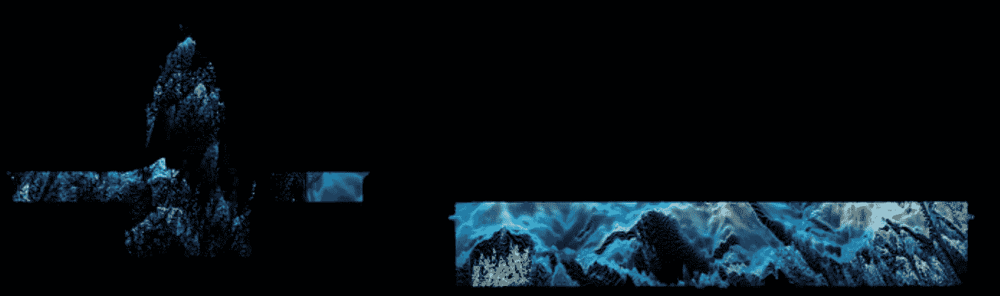
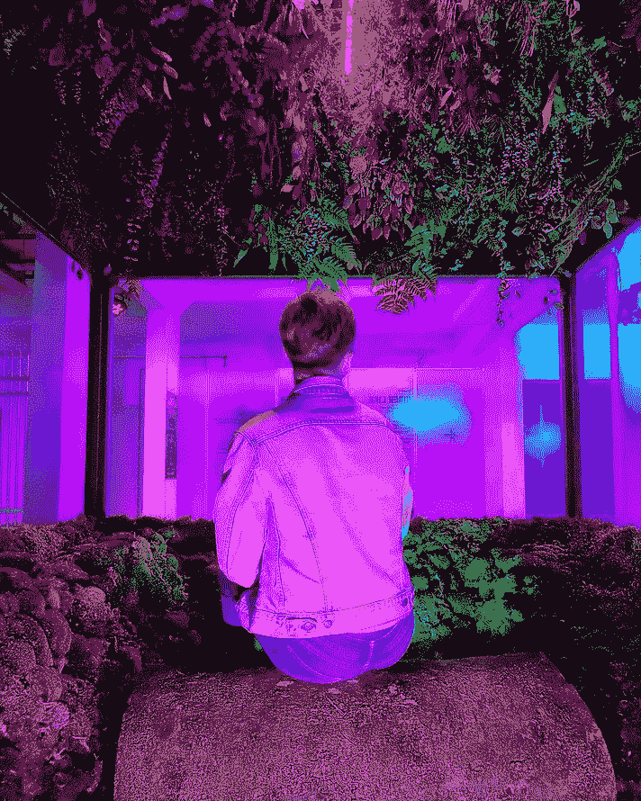

# 博客:ArtxTechxDesign

> 原文：<https://blog.devgenius.io/treasure-collection-1-d4fc2e9f3b5b?source=collection_archive---------8----------------------->

只是分享一些来自 alt 和 ArtxTech 的独立创作者的很酷的发现，作为我自己的个人记录，也许是为了其他任何愿意加入我这一旅程的人:)

## 1.我们在 Soyun Park 的模拟中结合

所有图片由 Soyun 的微型网站提供

Soyun Park 是我最喜欢的 ArtxTech 创意之一，她最近在网上发表了她的研究生论文，题为**我们在模拟中结合**。她记录了她在两个虚拟现实游戏/平台 Second Life 和 VRChat 上的在线体验，比较了这些平台在设计方法上模仿现实的不同之处，以及它们如何影响社区参与。

她的研究非常及时，考虑到这个制度宵禁和社交限制的时代已经使得在线/离线生活的话题及其对我们心理健康的影响比以前更加相关。作为一个不断尝试学习更多知识的数字创作者，我发现这是一本非常有趣的读物。在她的结论中，她指出了清晰的设计意图的必要性，以及在这样的未来平台中引入一些积极的价值观和道德观的必要性。成功不应该再由参与的人数和指标来定义，而是由这些社区互动的质量以及它们在我们离线时如何影响我们来定义。

你可以自己检查她的论文并得出你自己的结论，但这绝对是少数几个可访问的、简单而有见地的关于此类主题的论文之一——我个人认为这非常重要，因为许多技术研究被学术散文所掩盖，这些学术散文疏远了不一定拥有这样背景的独立创作者或集体(我很高兴地说，由于许多开源学习平台、程序和社区，这变得越来越普遍！)

## *2。* [*【重新】扎根*艺术皮肤](https://www.nationalgallery.sg/lighttonight/discover-art?title=art-skins-on-monuments-re-rooting)在国家美术馆由 Jo Ho 和 W. Y. Huang 举办，2021 年光与夜部分，新加坡。

我总是很兴奋能见到更多新加坡的新媒体创意人员，最近我在新加坡的开幕周末见到了当地视觉艺术家 Jo。得知她是国家美术馆最新艺术皮肤背后的艺术家，我非常兴奋。建于 [Touchdesigner](https://derivative.ca/) 的巨大声光投影展示了建筑在抽象多元宇宙中的形式缺陷，这绝对是我见过的最受欢迎的公共景点之一。

经过这个地区的时候，我已经看了无数次了，每次都有新的发现——艺术家黄伟源创作的配乐是催眠和迷人的，我很高兴能跟随并看到他们更多的作品

## 3.2021 年新加坡艺术周“妈妈磁铁”的[内心像 OutAR](https://mamamagnet.org/Inner-Like-The-OutAR) 体验展部分

我总是对探索现实和数字世界交汇点的艺术家和策展人感到兴奋，这个由 [Mama Magnet](https://instagram.com/mama.magnet?igshid=1bikwhgsi995h) 举办的多媒体展览是《电锯惊魂 2021》的一部分，在概念上很强，在执行上非常有趣。

由来自[空间的 Tina Fung 设计的布景和空间。Objekt](https://instagram.com/space.objekt?igshid=dbodaijuqxe7) 非常出色，将一个简单的画廊变成了另一个世界。我最喜欢的数字创意之一 [Reza Hasni](https://instagram.com/reza.hasni?igshid=1i6a2r4vt259h) 创造了 AR 艺术作品背后的运动图形，展示在由[屏保俱乐部](https://instagram.com/screensavers.club?igshid=1cyqb2j181ook)构建的定制浏览器上。他的工作风格非常具有标志性，让人得以一窥他生动的想象力。

内心像 OutAR 感觉像是同一合作者以前的虚拟展示的自然续集" [C-A-T World](https://cat.mamamagnet.org/) "，这是他们另一个视觉上令人惊叹的虚拟艺术展，于去年锁定期间推出。

在线+离线查看它们—

所有图片由 Mama Magnet 和 Reza Hasni Instagram 提供

## 4.帕尼克创造有趣的生殖液体的新教程

我最近在 YouTube 上发现了 [PPPANIK](https://instagram.com/pppanik?igshid=g5bj433gcfyc) 和他们收集的有趣、初学者友好的 Touchdesigner [教程，非常兴奋。发现越来越多的创作者来自视觉和平面设计的角度，而不是传统的技术背景冒险进入 ArtxTech，这总是很棒的。](https://www.youtube.com/channel/UCWBbakpo_cATqJy9Dzf9x4w)

PPPANIK 的 noise artwork 系列是全新的，展示了从时髦的网站到印刷和安装的多种应用。我很高兴能关注他们，从他们身上看到更多😊