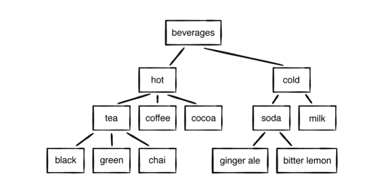

# Swift 中的树形数据结构

> 原文：<https://blog.devgenius.io/tree-data-structure-in-swift-85cd8fa8d05?source=collection_archive---------19----------------------->

## **Swift 编程语言中的树解释**

[法托斯 Bytyqi](https://unsplash.com/@fatosi?utm_source=medium&utm_medium=referral) 在 [Unsplash](https://unsplash.com?utm_source=medium&utm_medium=referral) 上的照片

树是一种非常重要的数据结构。它用于软件开发的许多方面，例如:

*   代表等级关系。
*   管理排序数据。
*   促进快速查找操作。

# **术语**

## **节点**

像链表一样，树由**节点**组成。每个节点可以携带一些数据，并跟踪它的*子节点*。

## **父子**

每个节点(除了最上面的那个)都恰好连接到它上面的一个节点。该节点被称为父节点。直接在它下面并与之相连的节点被称为它的**子节点**。在一棵树中，每个孩子只有一个父母。

## **根**

树中最顶端的节点被称为树的根。它是唯一没有父节点的节点

## **叶子**

如果一个节点没有子节点，它就是一个叶子节点

稍后你会遇到更多术语，但这应该足以让你开始。

**在 Swift 中创建带有节点的树**

**第 3 行:-** 这是一个名为*节点*的类，因为在树中有包含值的节点，并连接到下一个子节点。所以在这个类中，我们制作了字符串类型的变量*值*和*节点*数组类型的*子节点*。以及一个可选的用于存储*父*的变量。我们在课堂上初始化属性。

**第 12 行:-** 这是一个通过追加来添加孩子的函数。

**第 18 行:-** 这里我们制作了三个具有三个不同值的节点。然后我们在*节点 1* 中添加*节点 2* ，在*节点 1* 中添加*节点 3* 。因此*节点 1* 成为父节点，而*节点 2* 节点 3 是子节点。

# **深度优先遍历**

**一棵树**

**这就是我们如何进行深度优先遍历的方法**

# **层次顺序遍历**

一种基于节点深度访问树的每个节点的技术。

这就是我们如何通过层次顺序遍历方法进行旅行

**有一行没有意义(忽略分区)**

# **要点**

*   树与链表有一些相似之处，但是，尽管链表节点只能链接到一个后继节点，树节点可以链接到许多子节点。
*   除了根节点之外，每个树节点都只有一个父节点。
*   根节点没有父节点。
*   叶节点没有子节点。
*   熟悉树的术语，如**父**、**子**、**叶**和**根**。这些术语中有许多是程序员同事的常用语，将用于帮助解释其他树结构。
*   遍历，例如**深度优先**和**级别顺序**遍历，并不特定于一般的树。它们也适用于其他树，尽管它们的实现会因树的结构而略有不同。

# 二叉树

**二叉树**是这样一种树，其中每个节点最多有**两个**子节点，通常被称为**左**和**右**子节点

# 二叉树的类型

1.  **全二叉树:-** 除了叶节点，每个节点必须有两个子节点。
2.  **完全二叉树:-** 除了最后一层，所有层都被完全填充的二叉树。最后一级必须从左向右填充
3.  **左偏二叉树:-** 每个节点只有左子节点。
4.  **右斜二叉树:-** 每个节点只有右子节点。