# 树、二分搜索法树和遍历

> 原文：<https://blog.devgenius.io/trees-binary-search-trees-and-traversal-ab63e192f3a7?source=collection_archive---------8----------------------->

你将学到关于树木的深刻而清晰的知识😇

# **什么是树？**🤔

树是一种类似于链表的数据结构，但不是每个节点简单地以线性方式指向下一个节点，而是每个节点指向多个节点。树是非线性数据结构的一个例子。树形结构是一种以图形形式表示结构层次性质的方式。

在树 ADT(抽象数据类型)中，元素的顺序并不重要。如果我们需要排序信息，像链表、栈、队列等线性数据结构。可以使用。

注意:树中使用的术语请参考此[链接](https://www.gatevidyalay.com/tree-data-structure-tree-terminology/)。


# 二叉树的类型

通常有三种类型的二叉树:

**全二叉树**:每个节点有 0 或 2 个子节点。

**完全二叉树**:除了最后一级树完全填充，最后一级从左到右填充。

**完美二叉树**:所有内部节点都有两个子节点，所有叶子都应该在同一层。

# 二叉树的性质

对于下面的属性，让我们假设树的高度是 h。同样，假设根节点的高度为零。

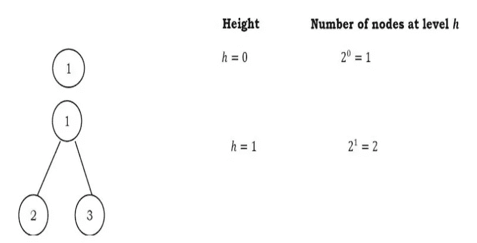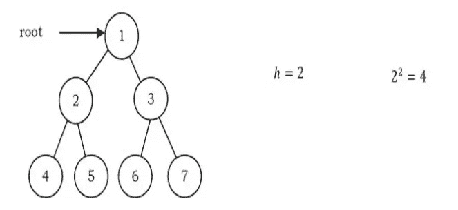

从图中我们可以推断出以下性质:

*   一棵完整的二叉树中的节点数 n 是 2h+1–1。因为有 h 个级别，所以我们需要在每个级别添加所有节点[2 0+2 1+2 2 ++ 2h = 2h+1–1]。
*   一棵完全二叉树中的节点数 n 介于 2 h(最小)和 2h+1–1(最大)之间。有关这方面的更多信息，请参阅优先级队列章节。
*   一棵完全二叉树的叶节点数是 2 h。
*   在 n 个节点的完整二叉树中，空链接(浪费的指针)的数量是 n + 1。

# 二叉树的结构

现在让我们定义二叉树的结构。为简单起见，假设节点的数据是整数。表示节点(包含数据)的一种方法是使用两个链接，这两个链接分别指向左侧和右侧的子节点以及数据字段，如下所示:

```
class Node:
    def __init__(self,data):
        self.data = data
        self.left = None
        self.right = None
```

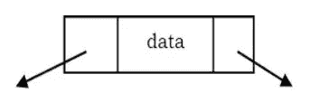

# 二叉树的运算

## 基本操作

*   将元素插入树中
*   从树中删除元素
*   搜索元素
*   遍历树

## 辅助操作

*   寻找树的大小
*   找到树的高度
*   寻找具有最大和的级别
*   查找给定节点对的最小公共祖先(LCA ),等等。

以下是二叉树发挥重要作用的一些应用:

*   表达式树用于编译器中。
*   数据压缩算法中使用的霍夫曼编码树。
*   二叉查找树(BST)，它支持在 O(logn) (average)中对一组项目进行搜索、插入和删除。
*   优先级队列(PQ)，它支持在对数时间内(在最坏的情况下)搜索和删除一组项目中的最小值(或最大值)。

# 通用树(N 元树)

在上一节中，我们讨论了二叉树，其中每个节点最多可以有两个子节点，这些子节点很容易用两个指针来表示。但是假设我们有一棵树，它的每个节点都有很多孩子，如果我们不知道一个节点可以有多少个孩子，我们如何表示他们呢？

例如，考虑下面显示的树:

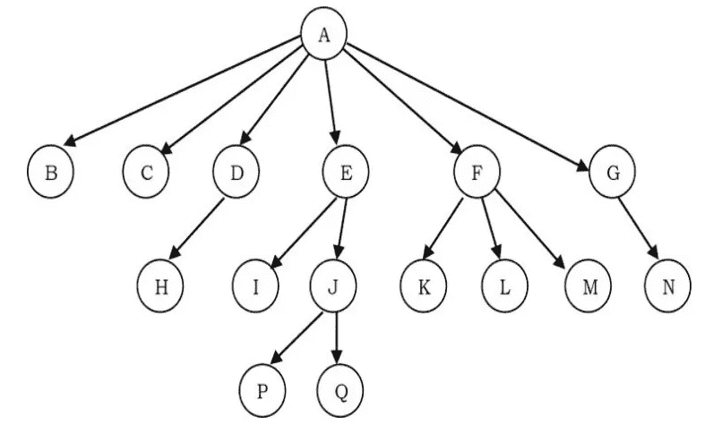

# 我们如何表示通用树？

在上面的树中，有 6 个子节点、3 个子节点、2 子节点、1 子节点和零子节点(叶子)。为了呈现这个树，我们必须考虑最坏的情况(6 个子节点),并且为每个节点分配那么多子节点指针。

因为我们没有在所有情况下都使用所有的指针，所以有很多内存浪费。另一个问题是我们事先不知道每个节点的子节点的数量。为了解决这个问题，我们需要一个最小化浪费的表示，并且还接受具有任意数量子节点的节点。

# 类属树的表示

由于我们的目标是到达树的所有节点，因此可能的解决方案如下:

*   在每个节点上，从左到右链接相同父节点(兄弟节点)的子节点。
*   除了第一个孩子，删除从父到所有孩子的链接。

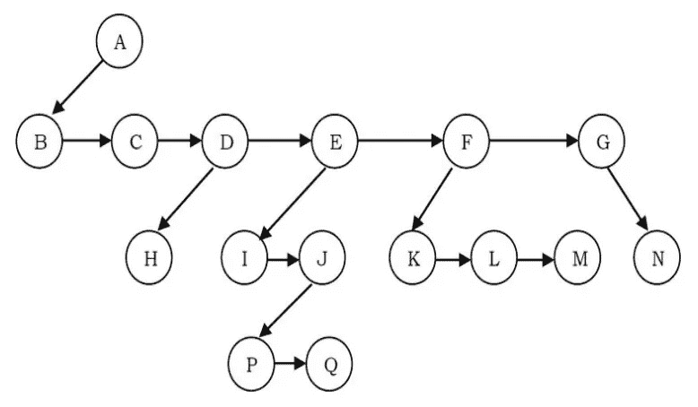

上面这些陈述说的是，如果我们在孩子之间有一个链接，那么我们不需要从父母到所有孩子的额外链接。这是因为我们可以从父元素的第一个子元素开始遍历所有元素。因此，如果我们有一个父节点和第一个子节点之间的链接，以及同一个父节点的所有子节点之间的链接，那么这就解决了我们的问题。

> 这种表示有时被称为第一个孩子/下一个兄弟姐妹表示。类属树的第一个子/下一个兄弟表示如上所示。该树的实际表示为:

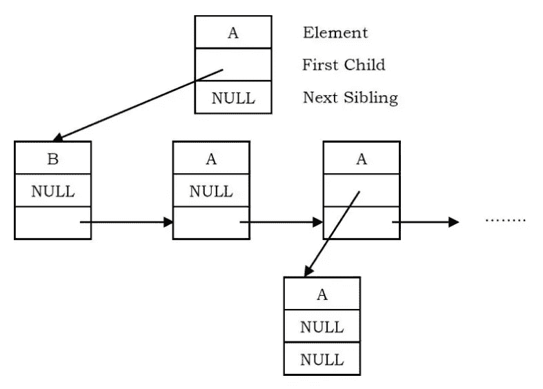

# 二分搜索法树

## 为什么是二分搜索法树？

在前面的中，我们已经讨论了不同的树形表示，在所有这些表示中，我们都没有对节点数据施加任何限制。因此，要搜索一个元素，我们需要同时检查左子树和右子树。因此，搜索操作的最坏情况复杂度是 O(n)。

这里，我们将讨论二叉树的另一种变体:二分搜索法树。顾名思义，这种表示法主要用于搜索。在这种表示中，我们对节点可以包含的数据种类施加了限制。因此，它将最坏情况下的平均搜索操作减少到 O(logn)。

# 二叉查找树房产

在二分搜索法树中，所有左边的子树元素应该小于根数据，所有右边的子树元素应该大于根数据。这就是所谓的二叉查找树财产。注意，树中的每个节点都应该满足这个属性。

*   节点的左子树只包含键小于节点键的节点。
*   节点的右边子树只包含键大于节点键的节点。
*   左右子树也必须是二分搜索法树

# 二分搜索法树上的操作

**主要作业**:以下是二分搜索法树支持的主要作业:

*   在二分搜索法树中查找/查找最小/查找最大元素
*   在二分搜索法树中插入元素
*   从二分搜索法树中删除元素

**辅助操作**:检查给定的树是否是二叉查找树

*   寻找树中第 k 个最小的元素
*   整理二叉查找树和其他许多元素

# 插入来自二叉查找树的元素

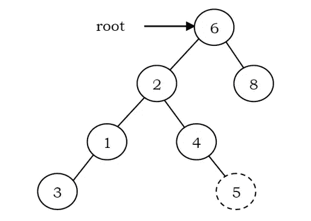

要将数据插入二叉查找树，首先我们需要找到该元素的位置。我们可以通过遵循与查找操作相同的机制来找到插入的位置。在寻找位置时，如果数据已经在那里，那么我们可以简单地忽略并出来。否则，在遍历路径的最后一个位置插入数据。

作为一个例子，让我们考虑下面的树。虚线节点表示要插入的元素(5)。要插入 5，使用 find 函数遍历树。在键为 4 的节点，我们需要向右，但是没有子树，所以 5 不在树中，这是正确的插入位置。

```
class BinarySearchTree:

    def addNodeRecursively(self, root , ele):
        if root is None:
            return Node(ele)
        if ele < root.data:
            root.left = self.addNodeRecursively(root.left,ele)
        else:
            root.right = self.addNodeRecursively(root.right,ele)
        return root

root = None
instance = BinarySearchTree()
for ele in [4,6,7,9,2,10]:
    root = instance.addNodeRecursively(root,ele)
```

递归:-时间复杂度:O(n)，空间复杂度:O(n)

迭代:空间复杂度为 O(1)。

# 在二分搜索法树中寻找元素

BST 中的查找操作非常简单。从根开始，使用 BST 属性继续向左或向右移动。如果我们搜索的数据与节点数据相同，那么我们返回当前节点。

如果我们搜索的数据少于节点数据，则搜索当前节点的左子树；否则搜索当前节点的右子树。如果数据不存在，我们就会以空链接结束。

```
 def search(self , root , ele):
        if root is None or root.data is ele:
            return root
        if root.data > ele:
            return self.search(root.left , ele)
        else:
            return self.search(root.right , ele)**#Out side class , you can test it by writing below codes**searchedEle = instance.search(root,7)
if searchedEle is None:
    print("elemet is not found")
else:
    print(searchedEle.data)
```

递归:-时间复杂度:O(n)，在最坏的情况下(当 BST 是斜树时)。空间复杂度:O(n)。

时间复杂度:O(n)。空间复杂度:O(1)

# 在二分搜索法树中寻找最小元素

在 BSTs 中，最小元素是最左边的节点，它没有左边的子元素。

```
 def minumum(self,root):
        current = root
        while current.left is not None :
            current = current.left
        return current.data**#Out side class , you can test it by writing below codes**minimumEle = instance.minumum(root)
print(minimumEle)
```

递归:-时间复杂度:O(n)，最坏情况下(BST 为左斜树时)，空间复杂度:O(n)。

时间复杂度:O(n)。空间复杂度:O(1)。

# 寻找二分搜索法树中的最大元素

在 BSTs 中，最大元素是最右边的节点，它没有右边的子元素。

```
 def maximum(self,root):
        current = root
        while current.right is not None :
            current = current.right

        return current.data**#Out side class , you can test it by writing below codes**maximumEle = instance.maximum(root)
print(maximumEle)
```

递归:-时间复杂度:O(n)，最坏情况下(当 BST 是右斜树时)，空间复杂度:O(n)

时间复杂度:O(n)。空间复杂度:O(1)。

# Inorder 的前任和继任者在哪里？

如果 X 有两个孩子，那么它的 inordcr 前任是它的左子树中的最大值，它的 inorder 继任者是它的右子树中的最小值。

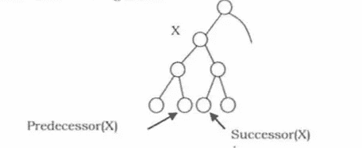

## 有序继任者

```
 def inorderSuccessor(self,root):
        root = root.right
        while root.left:
            root = root.left**#Out side class , you can test it by writing below codes**print(instance.inorderSuccessor(root))
```

## 为了前辈

```
 def inorderPredecessor(self,root):
        root = root.left
        while root.right:
            root = root.right**#Out side class , you can test it by writing below codes**print(instance.inorderPredecessor(root))
```

# 从二叉查找树中删除元素

删除操作比其他操作更复杂。这是因为要删除的元素可能不是叶节点。同样在这个操作中，首先我们需要找到想要删除的元素的位置。

一旦我们找到要删除的节点，考虑以下情况:

*   如果要删除的元素是叶节点:向其父节点返回 NULL。这意味着使相应的子指针为空。在下面的树中删除 5，将 NULL 设置为它的父节点 2。

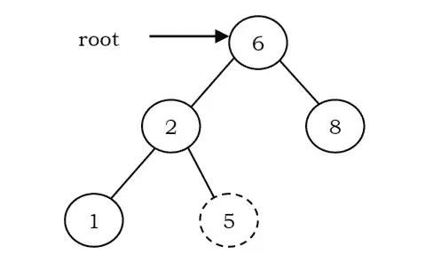

*   如果要删除的元素只有一个子元素:在这种情况下，我们只需要将当前节点的子元素发送给它的父元素。在下面的树中，删除 4，4 左子树被设置为它的父节点 2。

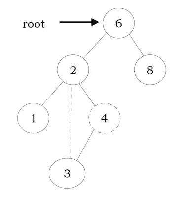

*   如果要删除的元素有两个子元素:一般的策略是用左子树最大的元素替换这个节点的键，递归删除那个节点(现在是空的)。左子树中最大的节点不能有右子节点，所以第二次删除很容易。作为一个例子，让我们考虑下面的树。在下面的树中，删除 8，它是根的右子。键值是 8。它被替换为左子树中最大的键(7)，然后像以前一样删除该节点(第二种情况)。

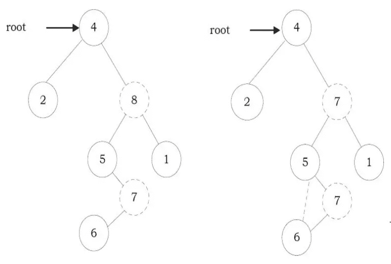

```
def deletion(self, root, key):
  if not root:
   return "Not Found"

  if key < root.data:
   root.left = self.deletion(root.left, key)
  elif key > root.data:
   root.right = self.deletion(root.right, key)
  else:
   if not (root.left or root.right):
    root = None

   elif root.right:
    root.data = self.successor(root)
    root.right = self.deletion(root.right, root.data)

   else:
    root.data = self.predecessor(root)
    root.left = self.deletion(root.left, root.data)
  return root
```

递归:-时间复杂度:O(n)。空间复杂度:O(n)。

迭代:-空间复杂度为 O(1)。

# 有序遍历(左、根、右)

在有序遍历中，在子树之间访问根。有序遍历的定义如下:

*   按顺序遍历左子树。
*   访根。
*   依次遍历右边的子树

# 关于二分搜索法树的重要说明

*   因为根数据总是在左子树数据和右子树数据之间，所以对二叉查找树进行有序遍历会产生一个有序列表。

## 为了递归

```
 def inorderRecursively(self,root):
        if root is None:
            return
        self.inorderRecursively(root.left)
        print(root.data)
        self.inorderRecursively(root.right)**#Out side class , you can test it by writing below codes**instance.inorderRecursively(root)
```

## 不可避免地

```
 def inorderItteratevely(self,root):
        current = root
        stack = []

        while True:
            if current is not None:
                stack.append(current)
                current = current.left

            elif stack :
                current = stack.pop()
                print(current.data)
                current = current.right
            else:
                break**#Out side class , you can test it by writing below codes**instance.inorderItteratevely(root)
```

# 前序遍历(根，左，右)

在前序遍历中，每个节点都在其任一子树之前被处理。这是最容易理解的遍历。然而，即使每个节点在子树之前被处理，它仍然要求在向下移动树时必须维护一些信息。

**前序遍历定义如下:**

*   访根。
*   按前序遍历左子树。
*   按前序遍历右边的子树。

## 递归预排序

```
 def preorderRecursively(self,root):
        if root is None:
            return
        print(root.data)
        self.preorderRecursively(root.left)
        self.preorderRecursively(root.right)**#Out side class , you can test it by writing below codes**instance.preorderRecursively(root)
```

## 预定不确定

```
 def preorderItteratevely(self,root):
        if root is None:
            return
        stack = []
        stack.append(root)
        while stack:
            current = stack.pop()
            print(current.data)

            if current.right:
                stack.append(current.right)
            if current.left:
                stack.append(current.left)**#Out side class , you can test it by writing below codes**instance.preorderItteratevely(root)
```

# 后序遍历(左、右、根)

在后序遍历中，在两个子树之后访问根。后序遍历定义如下:

*   按后序遍历左边的子树。
*   按后序遍历右边的子树。
*   访根。

## 递归后置

```
 def postorderRecurseveluy(self,root):
        if root is None:
            return
        self.postorderRecurseveluy(root.left)
        self.postorderRecurseveluy(root.right)
        print(root.data)**#Out side class , you can test it by writing below codes**instance.postorderRecurseveluy(root)
```

## 后期订单

```
 def postorderItteratively(self,root):
        if root is None:
            return
        recursiveStack = []
        resultStack = []
        recursiveStack.append(root)

        while recursiveStack:
            current = recursiveStack.pop()
            resultStack.append(current)

            if current.left:
                recursiveStack.append(current.left)
            if current.right:
                recursiveStack.append(current.right)

        while resultStack:
            current = resultStack.pop()
            print(current.data)**#Out side class , you can test it by writing below codes**instance.postorderItteratively(root)
```

# 计算 BST 中的节点数

```
 def countNodes(self , root):
        if root is None :
            return 0 
        return 1 + self.countNodes(root.left) + self.countNodes(root.right)**#Out side class , you can test it by writing below codes**print(instance.countNodes(root))
```

# 计算 BST 中的叶子数

```
 def countLeaf(self , root):
        if root is None:
            return 0 
        if root.left is None and root.right is None:
            return 1
        else:
            return self.countLeaf(root.left) + self.countLeaf(root.right)**#Out side class , you can test it by writing below codes**print(instance.countLeaf(root))
```

# 计算 BST 的最大深度

```
 def maxDepth(self, root):
        if root is None:
            return 0 
        else:
            leftDepth = self.maxDepth(root.left)
            rightDepth = self.maxDepth(root.right)
            if leftDepth > rightDepth:
                return leftDepth + 1
            elif rightDepth > leftDepth:
                return rightDepth + 1
            else:
                return leftDepth + 1 #if both are equal then any one**#Out side class , you can test it by writing below codes**print(instance.maxDepth(root))
```

# 表达式树

代表一个表达式的树叫做表达式树。在表达式树中，叶节点是操作数，非叶节点是运算符。这意味着，表达式树是一个二叉树，其中内部节点是操作符，叶子是操作数。表达式树由二进制表达式组成。但是对于一个 u 进制操作符，一个子树将是空的。下图显示了(A + B * C) / D 的简单表达式树。

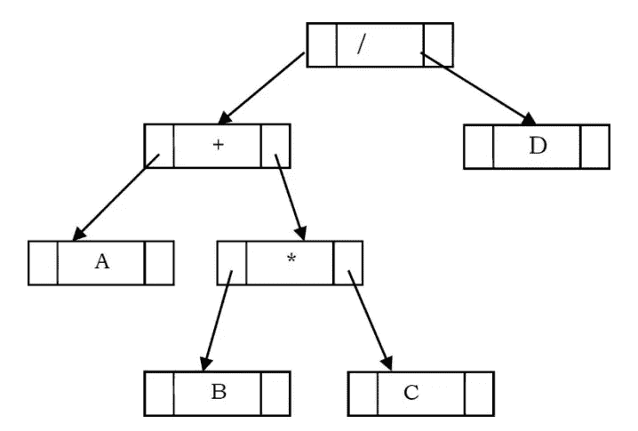

## 用树进行表达式求值

```
class ExpressionTree:
   def evaluate(self, root):
       if root is None:
           return 0
       if root.left == None and root.right == None:
           return int(root.data)

       left = self.evaluate(root.left)
       right = self.evaluate(root.right)
       if root.data == '+':
           return left + right
       elif root.data == '*':
           return left * right
       elif root.data == '-':
           return left - right 
       elif root.data == '/':
          return left /right
       elif root.data == '^':
          return left ** right**#Out side class , you can test it by writing below codes**root = Node('*')
root.left = Node('+')
root.right = Node('*')
root.left.left = Node('2')
root.left.right = Node('3')
root.right.left = Node('4')
root.right.right = Node('+')
root.right.right.left = Node('5')
root.right.right.right = Node('6')
e = ExpressionTree()
result = e.evaluate(root)
print(result)
```

为了定义的目的，我用了 DS 制作的简易书

# 来源

我的 LinkedIn:-【linkedin.com/in/my-pro-file】

# **您可能感兴趣的主题:**

*   ****堆和优先队列**:[https://medium . com/@ MD code 2021/Heap-and-priority-Queue-FBD 41333 dc0d](https://medium.com/@mdcode2021/heap-and-priority-queue-fbd41333dc0d)**
*   ****所有关于双向链表:**[https://medium . com/@ MD code 2021/All-About-double-Linked-List-30 f 0f 08 AFB 9 c](https://medium.com/@mdcode2021/all-about-doubly-linked-list-30f0f08afb9c)**
*   ****合并排序**:[https://medium.com/swlh/title-1692d9fb5ced](https://medium.com/swlh/title-1692d9fb5ced)**
*   ****插入排序**:[https://medium . com/dev-genius/Insertion-Sort-program-in-swift-31740 a 454573](https://medium.com/dev-genius/insertion-sort-program-in-swift-31740a454573)**
*   ****计数排序**:[https://medium . com/@ MD code 2021/Counting-Sort-algorithm-c 32d 71 F2 cc 79](https://medium.com/@mdcode2021/counting-sort-algorithm-c32d71f2cc79)**
*   ****选择排序**:[https://medium . com/@ MD code 2021/line-by-line-Selection-Sort-algorithm-explained-in-c-DD 49638 b15e](https://medium.com/@mdcode2021/line-by-line-selection-sort-algorithm-explained-in-c-dd49638b15e)**