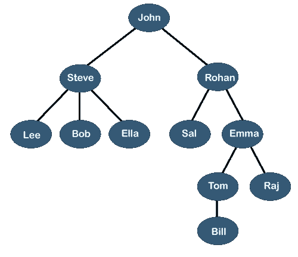
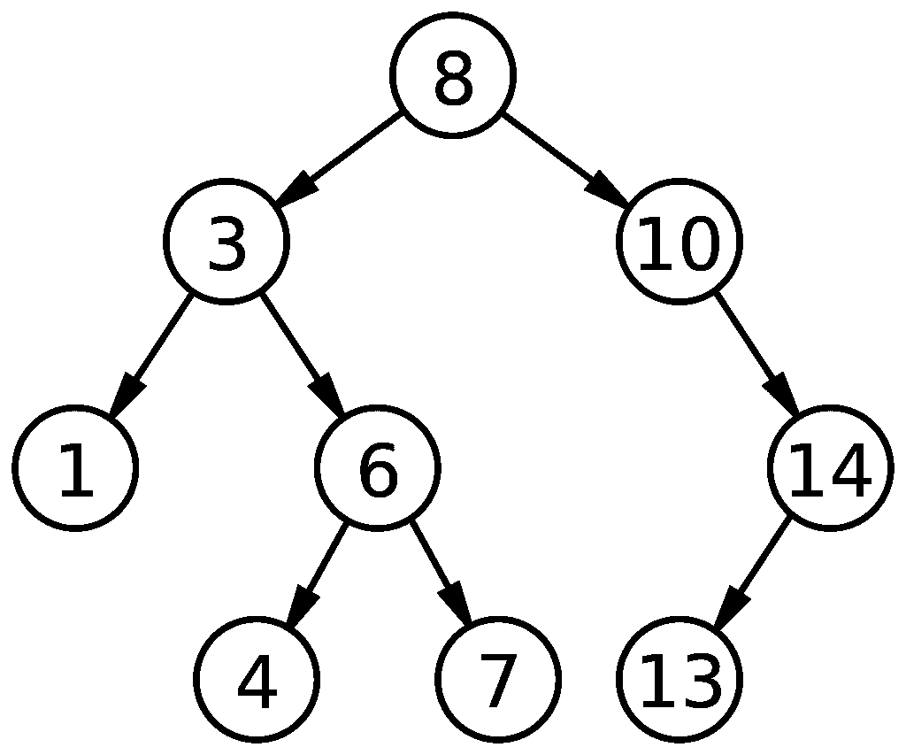

# Go 中的树

> 原文：<https://blog.devgenius.io/trees-in-go-9b6ff346dcfc?source=collection_archive---------7----------------------->

欢迎回到 Go 中的数据结构介绍！在这篇文章中，我们将关注树木。到目前为止，我们已经看了线性数据结构。有一个开始节点和一个结束节点。数据单向传输:从左到右或从右到左。树是非线性的，这增加了一层复杂性。树在编程世界中被广泛用于许多不同的目的，所以牢牢掌握这个主题是个好主意。读完这篇文章后，你将不会有任何问题。

请注意，理解递归是如何工作的，在处理树的时候会给你很大的帮助。

# 什么是树？

你还记得链表长什么样吗？链表由几个相互指向的节点组成。

```
HEAD -> Node A -> Node B -> Node C -> nil
```

一个节点看起来像这样:

```
type Node struct {
    data int
    next *Node
}
```

现在想象一个特殊的链表，其中一个节点可以建立不止一个连接。例如，假设每个节点都可以指向一个左节点和一个右节点。

```
type Node struct {
    data int
    left *Node
    right *Node
}
```

或者甚至许多节点:

```
type Node struct {
    data int
    adjacent []*Node
}
```

这些节点成为树形数据结构的构建块。树给我们典型的链表增加了更多的复杂性，因为每个节点可以与其他节点有多种关系。它不是像数组、堆栈和队列那样的单向关系，这就是为什么它被认为是一种非线性数据结构。只要看一下示例图，就可以知道这一点:



图片来源于[https://static.javatpoint.com/ds/images/tree.png](https://static.javatpoint.com/ds/images/tree.png)

它看起来像一棵倒挂的树，对吗？

# 树的属性

让我们使用上面的例子。

*   一棵树由一个根节点和与其相连的零个或多个子树组成。
    -根节点是树的最顶端节点。在上图中，John 是根节点。
    -子树只是大树中的一棵树。您可以看到根节点 John 是如何连接到两个子树的，这两个子树的根节点分别是 Steve 和 Rohan。
    -只有一个节点的树仍然被认为是树。
*   最重要的关系是亲子关系。父节点是子节点的直接前任。子节点是父节点的直接继承者。
    -上图中，约翰是史蒂夫和罗汉的父节点。Lee、Bob 和 Ella 是 Steve 的子节点。
*   兄弟节点是共享父节点的节点。史蒂夫和罗汉是兄弟节点。
*   叶节点是没有任何子节点的节点。李、鲍勃、埃拉、萨尔、比尔和拉杰都是叶节点。
*   祖先-后代关系类似于父母-子女关系，但规模更大。如果存在从 B 到 A 的路径，那么 A 是 B and B 的祖先，是 A 的后代。艾玛是比尔和汤姆的祖先，比尔和汤姆是艾玛的后代。
*   节点的深度是根和它自身之间的边数。汤姆的深度是 3。
*   节点的高度是其自身与其子树中最远的叶节点之间的边数。节点的级别是它自身和根节点之间的边数。
    ——洛汗的高度是 3，等级是 1。
*   树的高度是根节点的高度。图中树的高度是约翰的高度，也就是 4。
*   如果有 n 个节点，那么就有 n-1 条边。

这是大量的信息，但很多都很直观。

# 什么是二叉树？

现在我们知道了树是什么，我们可以看看最流行的树:二叉树。二叉树是一种每个节点最多有两个子节点的树。二叉树在编程界非常流行，因为它是二叉查找树的主干，提供了搜索数据列表的最快方法之一。这也很容易实现，因为最多只有两个子节点。

# 什么是二叉查找树？

二叉查找树是一种特殊类型的二叉树。左侧子级的值必须小于父级，右侧子级的值必须大于父级。二分搜索法树，缩写为 BSTs，用于搜索。当我们在列表中搜索一个条目时，我们可以遍历整个列表并在找到条目时停止，或者执行二分搜索法:将列表分成两半，选择条目所在的那一半，再分开，反之亦然。线性搜索将花费 O(n)时间，而二分搜索法将花费 O(log n)时间，这使得它更有效。BST 是这种搜索算法的代表。

这是一个二叉查找树的样本。



图片鸣谢[https://upload . wikimedia . org/Wikipedia/commons/thumb/d/da/Binary _ search _ tree . SVG/1024 px-Binary _ search _ tree . SVG . png](https://upload.wikimedia.org/wikipedia/commons/thumb/d/da/Binary_search_tree.svg/1024px-Binary_search_tree.svg.png)

# 穿越二叉查找树

因为二叉查找树是一种非线性数据结构，所以有许多方法可以遍历它。我们将讨论两种最流行的方法:顺序遍历和层次顺序遍历。

## 有序遍历

有序遍历是一种深度优先的递归方法，以左节点>根节点>右节点的顺序遍历树。深度优先的方法将在移动到下一个子树之前戳一个子树中最深的叶节点。在上面的 BST 示例中，完整的 inorder 遍历将输出如下内容:

```
1 3 4 6 7 8 10 13 14
```

对于二叉查找树，inorder 遍历将总是按升序打印节点。

## 层次顺序遍历

层次顺序遍历采用广度优先的方法。与深度优先方法不同，广度优先方法将逐层遍历树。完整级别的顺序遍历将输出以下内容:

```
8 3 10 1 6 14 4 7 13
```

# 在围棋中创造二叉查找树

让我们试着在 Go 中创建一个 BST。

```
package mainimport "fmt"type Node struct {
    data  int
    left  *Node
    right *Node
}type BST struct {
    root *Node
}func (bst *BST) Insert(val int) {
    bst.InsertRec(bst.root, val)
}func (bst *BST) InsertRec(node *Node, val int) *Node {
    if bst.root == nil {
        bst.root = &Node{val, nil, nil}
        return bst.root
    }
    if node == nil {
        return &Node{val, nil, nil}
    }
    if val <= node.data {
        node.left = bst.InsertRec(node.left, val)
    }
    if val > node.data {
        node.right = bst.InsertRec(node.right, val)
    }
    return node
}func (bst *BST) Search(val int) bool {
    found := bst.SearchRec(bst.root, val)
    return found
}func (bst *BST) SearchRec(node *Node, val int) bool {
    if node.data == val {
        return true
    }
    if node == nil {
        return false
    }
    if val < node.data {
        return bst.SearchRec(node.left, val)
    }
    if val > node.data {
        return bst.SearchRec(node.right, val)
    }
    return false
}func (bst *BST) Inorder(node *Node) {
    if node == nil {
        return
    } else {
        bst.Inorder(node.left)
        fmt.Print(node.data, " ")
        bst.Inorder(node.right)
    }
}func (bst *BST) Levelorder() {
    if bst.root == nil {
        return
    } nodeList := make([](*Node), 0)
    nodeList = append(nodeList, bst.root) for !(len(nodeList) == 0) {
        current := nodeList[0]
        fmt.Print(current.data, " ")
        if current.left != nil {
            nodeList = append(nodeList, current.left)
        }
        if current.right != nil {
            nodeList = append(nodeList, current.right)
        }
        nodeList = nodeList[1:]
    }
}func main() {
    bst := BST{}
    bst.Insert(10)
    bst.Insert(5)
    bst.Insert(15)
    bst.Insert(20)
    bst.Insert(17)
    bst.Insert(4)
    bst.Insert(6) bst.Inorder(bst.root)
    fmt.Println()
    bst.Levelorder()
    fmt.Println()
    fmt.Println(bst.Search(5))
}
```

让我们检查一下代码的每一部分。

```
type Node struct {
    data  int
    left  *Node
    right *Node
}type BST struct {
    root *Node
}
```

这些就是`Node`和`BST`的定义。我喜欢为整个 BST 创建一个结构，而不是仅仅使用指向根节点的指针。在许多 C 和 C++教程中，您会看到只保留指向头节点或根节点的指针的方法。我喜欢把 BST 看作一个完整的实体，所以这就是我定义`BST`结构的原因。对我来说更有意义。

```
func (bst *BST) Insert(val int) {
    bst.InsertRec(bst.root, val)
}func (bst *BST) InsertRec(node *Node, val int) *Node {
    if bst.root == nil {
        bst.root = &Node{val, nil, nil}
        return bst.root
    }
    if node == nil {
        return &Node{val, nil, nil}
    }
    if val <= node.data {
        node.left = bst.InsertRec(node.left, val)
    }
    if val > node.data {
        node.right = bst.InsertRec(node.right, val)
    }
    return node
}
```

这就是我们将如何插入一个新节点。我们将逻辑分成两部分:函数`Insert`和调用自身的函数`InsertRec`。我们这样做的原因是`InsertRec`返回一个`*Node`，但是我们在`Insert`函数中没有用到它。

`InsertRec`函数可能看起来很复杂，但是我们可以把它拆开。我们传入一个指向节点的指针，以及我们想要添加的值。当我们的 BST 中没有节点时，我们的`bst.root`将是`nil`，所以它将被设置为`val`。对于其他情况，我们遵循一组条件:

*   如果`val`小于`node.data`，那么我们在`node.left`上调用`InsertRec`。这将确保我们深度优先，到达最左边的节点。
*   我们知道，当我们到达最左边的叶节点时，继续向左将导致`nil`。这就是我们返回`&Node{val, nil, nil}`的地方。
*   当`val`大于`node.data`时，类似的事情也会发生。

```
func (bst *BST) Search(val int) bool {
    found := bst.SearchRec(bst.root, val)
    return found
}func (bst *BST) SearchRec(node *Node, val int) bool {
    if node == nil {
        return false
    }
    if node.data == val {
        return true
    }
    if val < node.data {
        return bst.SearchRec(node.left, val)
    }
    if val > node.data {
        return bst.SearchRec(node.right, val)
    }
    return false
}
```

这是搜索功能。不为二叉查找树编写搜索功能是没有意义的。搜索采用了与插入类似的方法，在某种意义上，它也将其逻辑分为`Search`和递归的`SearchRec`。逻辑也很像。唯一不同的是`SearchRec`返回一个 bool，直接比较`node.data`和`val`。您还希望首先进行`nil`比较，否则您可能会遇到零指针解引用混乱。

```
func (bst *BST) Inorder(node *Node) {
    if node == nil {
        return
    } else {
        bst.Inorder(node.left)
        fmt.Print(node.data, " ")
        bst.Inorder(node.right)
    }
}
```

inorder 遍历函数也使用…递归。它首先深入到树的最左边的节点，直到你不能再深入下去。然后它打印`node.data`，然后移动到右边的节点。您从下往上这样做，直到遍历完所有节点。

你可能已经注意到有很多递归。递归对我们许多人来说是一个令人困惑的话题，但是很多关于树的方法都使用了递归。这是因为树看起来有点像分形，其中每个子节点产生另一个子树。因为形状经常重复，所以在子树上使用递归函数是有意义的。我强烈建议您从一个较小的树开始，实际画出每个步骤，以完全理解递归函数是如何工作的。这真的很酷，也是学习递归的好方法。

```
func (bst *BST) Levelorder() {
    if bst.root == nil {
        return
    } nodeList := make([](*Node), 0)
    nodeList = append(nodeList, bst.root) for !(len(nodeList) == 0) {
        current := nodeList[0]
        fmt.Print(current.data, " ")
        if current.left != nil {
            nodeList = append(nodeList, current.left)
        }
        if current.right != nil {
            nodeList = append(nodeList, current.right)
        }
        nodeList = nodeList[1:]
    }
}
```

层次顺序遍历不是递归的，因为我们不会在更小的子树上重复某种算法。相反，我们使用一个队列来跟踪我们还没有遍历的节点。我们创建一个`nodeList`并将我们的根节点推入其中。从这一点开始，直到`nodeList`中没有节点，我们打印当前节点的值，将`node.left`和`node.right`添加到`nodeList`中，并将当前节点弹出列表。

```
func main() {
    bst := BST{}
    bst.Insert(10)
    bst.Insert(5)
    bst.Insert(15)
    bst.Insert(20)
    bst.Insert(17)
    bst.Insert(4)
    bst.Insert(6) bst.Inorder(bst.root)
    fmt.Println()
    bst.Levelorder()
    fmt.Println()
    fmt.Println(bst.Search(5))
}
```

如果我们运行这段代码，我们会得到以下输出:

```
4 5 6 10 15 17 20 
10 5 15 4 6 20 17 
true
false
```

# 结论

我们没有复习树的所有概念，因为有太多的应用和概念。我们用二分搜索法树复习了基本的属性和方法。还有更多的内容需要介绍，所以请期待在未来看到关于这些内容的帖子！你会在很多地方用到树。如果您正在学习网络，您可能听说过防止广播风暴的生成树协议。生成树是由代表网络中节点的节点组成的树。您的文件系统可以表示为树，因为它们是文件和文件夹的层次结构。

感谢您的阅读！你也可以在 [Dev.to](https://dev.to/jpoly1219/trees-in-go-14ff) 和[我的个人网站](https://jpoly1219.github.io)上阅读这个帖子。