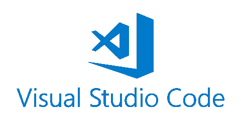
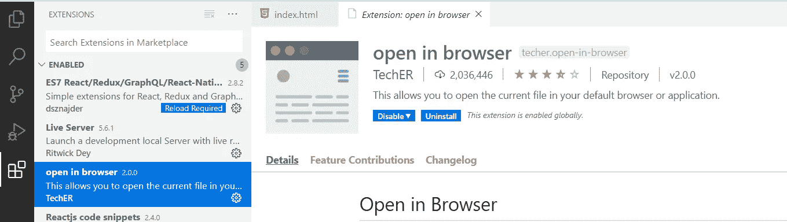
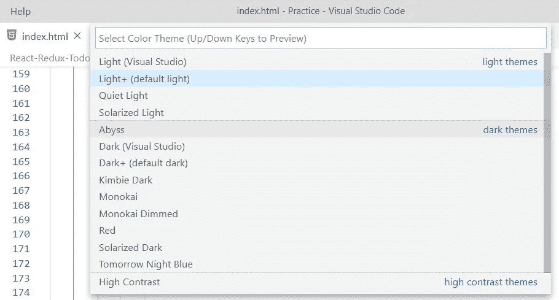
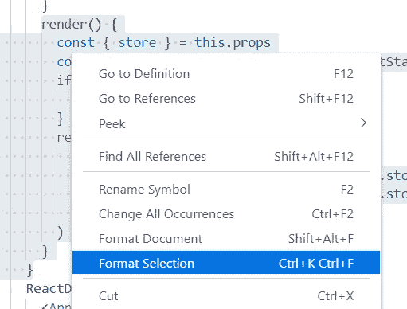
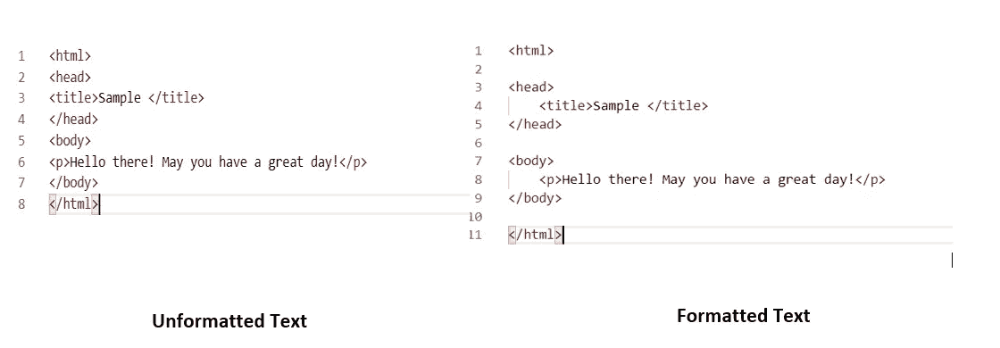

# VSCode 初学者的技巧和提示

> 原文：<https://blog.devgenius.io/tricks-and-tips-for-vscode-beginners-ed2ef4f45828?source=collection_archive---------29----------------------->

我相信你刚刚开始你的编程之旅。您已经安装了 VSCode，可以开始使用了。

让我与您分享一些技巧，它们会让您在使用 VSCode 时变得非常简单😃

1.  **如何在 VSCode 中运行 HTML 文件？**

我相信每个开始使用 VSCode 的人都曾经在 googled 上搜索过这个问题。这是因为默认情况下，导航栏中没有直接选项。让我告诉你如何快速地做这件事😋

点击侧面垂直导航栏中的扩展选项。在浏览器扩展中搜索打开。Tadaaa…只需安装它，你就可以走了。发布这个，只需点击键盘上的 Alt+B 在浏览器中运行文件。现在，您还可以右键单击该文件，以获得在浏览器中打开的选项。

我的 VSCode 中已经安装了扩展。

2.**如何改变 VSCode 的主题？**

Visual Studio 代码提供了许多颜色主题，如光、深渊、红、暗、日晒暗等等。要选择和更改颜色主题，只需点击文件->首选项->颜色主题。你会有很多选择。只需选择一个选项并定制您的 IDE。

3.**如何在 VSCode 中注释一段代码？**

知道如何注释一段代码是非常重要的。逐行注释代码是一个乏味的过程。在 VSCode 中，您可以只通过 Ctr+/命令来注释您选择的代码。

4.格式化您的代码！

无格式的代码看起来很乱，很不专业。VSCode 提供了一个非常简单的方法来格式化你的代码。您可以选择格式化整个文档或只是代码的一部分。Shift + Alt + F 将帮助您格式化整个文档。您也可以选择代码并右键单击以获得格式化代码选项。

看看这两者的外观和感觉有什么不同吧！

***快乐编码💻***