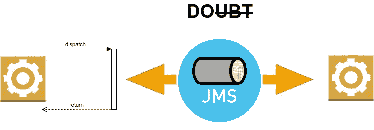
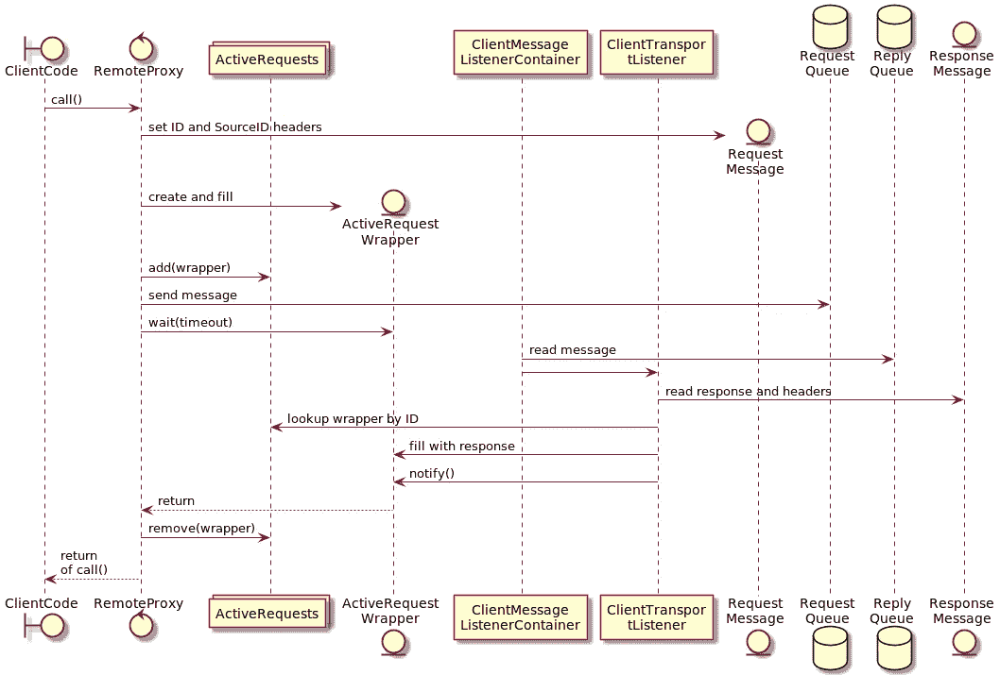
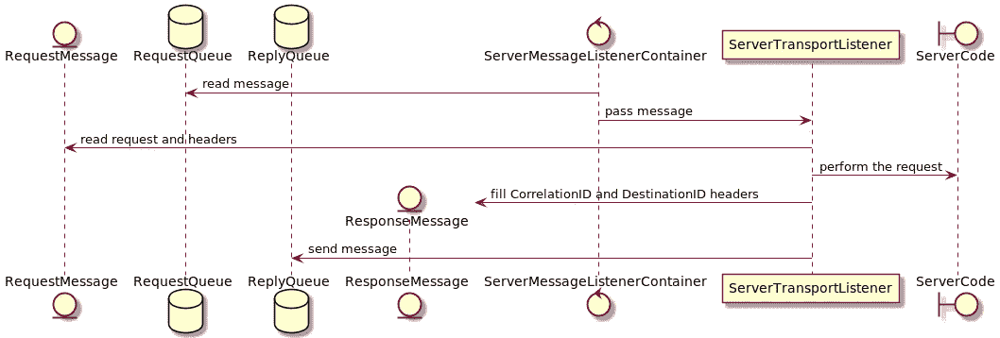
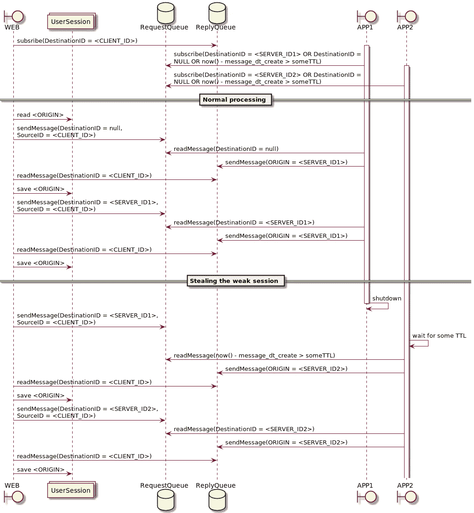
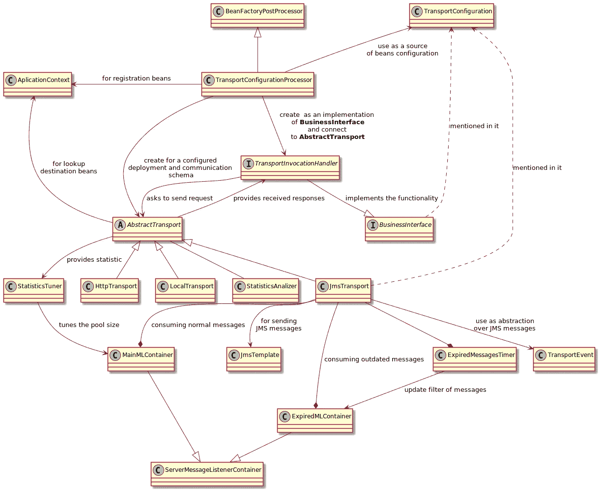
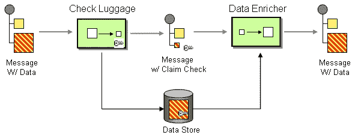

# 棘手的消息传递，第一部分:同步传输，不仅

> 原文：<https://blog.devgenius.io/tricky-messaging-part-one-synchronous-transport-and-not-only-320edd7496f6?source=collection_archive---------2----------------------->

*“越看男人，
越喜欢狗”*

由于 Kafka 的广泛使用，消息驱动架构已经变得很平常，并被广泛用于各种各样的应用程序中。当然，这与广为人知的《企业集成的模式和最佳实践》一书的时代有很大的不同，当时 99%的事件处理都涉及到集成多个遗留应用程序的繁琐而血腥的工作。

然而，基于消息组织数据处理和服务交互的实用技术仍然相当枯燥和原始。在本系列文章中，我将展示一些通过相对简单的消息处理模式来大大简化应用程序架构的技巧。

我计划关注四个主要领域:

*   同步交互(这部分)
*   [**高性能业务处理**](/tricky-messaging-part-two-business-processing-758638943ee3)
*   开销最小的云部署
*   用户界面

这样做主要是靠自己对 JMS 的经验(大多是十几年的 ActiveMQ)。同时，我希望，不时地，能引起人们对卡夫卡在这种背景下的适用性的关注。

开始之前我想提的最后一件事是适用性的边界。

*   如果你想与亚马逊竞争或处理高利率交易，这些方法和工具可能不适合你。如果您计划让几十名员工每天处理 100 份文档，也不值得让系统过于复杂。
*   依我看，如果有大约 1-10，000 个用户同时在系统上工作，每天生成大约几百万个足够大(大约 10-100 千字节大小)的文档，那么走这条该死的企业道路是有意义的。因此，我们正在谈论一个典型的远程银行系统或其他类似的金融工作流程。
*   然而，类似的架构曾经成功地应用于完全不同的业务领域，以管理处理视频流的服务器云，并将它们与行政后端和支付处理互连。

# 介绍

认为分布式系统中的任何同步交互都是被迫的罪恶是多余的:

*   首先，它需要双方的持续可用性。
*   其次，它阻塞了调用线程。它增加了应用程序线程的数量以及在它们之间切换的内存和 CPU 开销。
*   第三，如果客户端花很长时间来读取结果，在被调用的服务端也会出现同样的线程问题。

尽管如此，有时我们离不开这种类型的交互，尤其是在处理 GUI 和系统边界上的类似服务时。所以让我们尽可能的减轻以上缺点。

# 实施的基础

首先，让我们记住一个相当广为人知的模式，“请求-回复”:

在这种情况下，我们已经有了来自客户端的“请求”和来自服务器的“回复”。但是还没有任何方法来等待和消耗呼叫方的“回复”。为了实现这一点，我们可以应用下面的方法，这将大大降低对被调用服务的持续可用性的严格要求。

*   每个客户端都有一个唯一的 ID，并通过过滤器**destination ID =<CLIENT _ ID>**订阅接收消息

**客户线程:**

*   创建标题为 **ID = <某些 UUID >和 SourceID =<CLIENT _ ID>的消息**
*   在全局集合中添加一些活动的请求包装器，这些请求包装器具有以下属性:消息 UUID 和用于将来结果的空存储
*   将消息发送到服务器
*   在包装器上调用 **wait(timeout)** 并被阻塞

**服务器:**

*   接收消息并进行处理
*   发送带有标题 **CorrelationID= <请求消息 ID >和 DestinationID = <请求消息源 ID >** 的响应

**客户端的 JMS 侦听器:**

*   从服务器接收响应流
*   对于每个回答:

a)使用 **CorrelationID** 头的值，在集合中查找包装器

b)将响应数据从消息传输到包装器存储中

c)通知客户端线程，该线程被**等待(超时)**阻塞在包装器上

**被释放的客户端线程继续执行并且:**

*   从包装中读取请求的结果
*   从集合中移除包装
*   继续正常的代码执行，并将结果返回给调用代码

通常，从客户端的角度来看，这种方法的实现细节隐藏在“远程代理”组件后面。该组件必须由传输基础设施基于业务接口生成。下图可以说明上述活动顺序:

**客户方:**

**服务器部分:**

我们从这种“弱化同步”方法中获得的主要好处是:

*   服务器服务可能暂时不可用(客户端也不可用，但无法重启应用程序)
*   被调用的线程仅在业务请求执行期间被阻塞
*   通过增加服务器实例的数量或队列侦听器后面的线程数量，实现服务器端的可伸缩性、容错和负载平衡。
*   在任何时候，服务器都可能死机、关机或重启，而不会给客户端执行升级、维护等带来任何问题。我们可以逐步升级整个系统，一次升级一个或几个服务器，没有“维护窗口”
*   队列中的平均消息数量可以很容易地证明系统性能

一些琐碎的改进，在出错时会很有用(顺便说一下，分布式应用程序中“出错”几乎总是发生):

*   当使用 **CorrelationID** 值时，我们没有在集合中找到相应的包装器，这意味着 **wait(timeout)** 已经抛出了超时异常。在这种情况下，使用命令“撤销之前的操作”将收到的响应消息发送回服务器可能是有意义的
*   如果我们以类似的方式组织了有状态 web 服务器和无状态应用服务器之间的交换，那么将消息的 TTL 设置为比 HTTP 会话的超时稍短是有意义的。这样做，我们就不会浪费应用服务器和代理资源来处理其他人都不需要的消息。
*   通过调整为处理传入消息而分配的服务器线程池的大小，可以更好地利用服务器。原则上，通过对请求执行时间的使用统计，可以自动优化这个参数。有几个专门的库，例如，“网飞自适应并发限制”。
    这种方法在下面的文章[负载下的性能](https://netflixtechblog.medium.com/performance-under-load-3e6fa9a60581)中有很好的描述。
    这个库的例子是为管理 TCP 连接而设计的，但是可以很容易地扩展到调整 JMS 消息消费流。
*   如果我们使执行线程的阻塞时间比 HTTP 会话超时时间短得多，我们就有机会在出现超时异常的情况下向另一个服务器发送消息。在这种情况下，我们必须注意服务器的幂等性，因为在通信过程中不仅请求会丢失，响应也会丢失。

这种方法的主要限制是 JMS 不能保证两个消息在时间上的相对顺序。例如，在 web 应用程序的情况下，在发送消息之后，接口必须被阻塞，直到接收到响应。根据我在金融部门开发复杂文档管理应用程序的经验，我认为这并没有太大的限制。

我们还必须手动实现收集和发布关于请求数量、响应时间分布、按请求类型划分这些指标等各种统计数据。

# 高级功能

上面描述的交互方案运行良好，但是由于客户端消息均匀分布在所有服务器上，因此也存在一些缺点:

*   如果我们使用第二层 JPA 缓存，所有用户(组织、帐户、访问权限等)的所有参考数据都将加载到所有服务器缓存中。这样，缓存的使用效率很低，因为请求的数据通常会因为服务器内存不足而丢失，并且每次都是从数据库加载的。
*   如果我们有一台或多台运行缓慢或即将报废的服务器，它们可能会降低所有客户端的运行速度。

可能的解决方案是“弱 JMS 粘性会话”。以下描述基于已经使用的有状态 web 服务器和无状态应用服务器之间的交互示例。

*   每个应用服务器(APP)都有一个唯一的 ID，并订阅接收具有过滤器**destination ID =<SERVER _ ID>或 DestinationID = NULL** 的消息
*   每个 WEB 服务器(WEB)在用户会话中存储属性 **ORIGIN** (其初始值为空)，并将其作为报头 **DestinationID** 包含在对服务器的每个请求中。
*   任何客户端会话期间的第一条消息都是由 WEB 服务器发送的，消息头为 **DestinationID = null** ，并将由随机的应用服务器接收。这个应用服务器用 header**ORIGIN =<SERVER _ ID>**来回答
*   之后，web 服务器从答案中读取标题 **ORIGIN** 并将其存储在用户的会话中

因此，来自该用户会话的以下消息将由标题为**destination id =<ORIGIN>**的 WEB 服务器发送，并由同一个应用服务器接收

应用程序服务器可能会随时死机、重启或变慢。要防止“牛排”会话挂起:

*   每个应用服务器还订阅了使用过滤器**now()—message _ dt _ create>sometl**接收消息。这样的“移动”订阅最好由一个单独的**ServerMessageListenerContainer**实例来组织，只要它定期重启以更新过滤器定义，它就不能使用像 **now()** 这样的函数。
*   应用服务器用一个自己的**ORIGIN =<SERVER _ ID>**来回答，WEB 服务器将把它存储在用户的会话中，供将来的请求者使用
*   因此，来自该用户的所有进一步消息将由新的应用服务器处理。
*   同样，在这种情况下，每次每个用户会话中只能有一条消息在进行中，这一点非常重要。否则，不同的 WEB 服务器可能会不断窃取不同的消息，这种在它们之间切换会话的振荡过程可能会没完没了。

因此，通过略微复杂化该方案，我们获得了以下好处:

*   来自一个用户的所有消息“如果可能的话”都由同一个应用程序服务器处理——应用程序服务器的二级 JPA 缓存得到了有效利用，不会尝试加载所有可用的字典数据
*   如果应用服务器很慢或者死了，这个“弱会话”将被另一个应用服务器窃取。在这种情况下，我们明显打乱了消息在队列中的处理顺序。因此，我们需要完全确定它们原则上不能属于同一个集合(例如，会计处理过程中的文档或用户会话)

下图可以说明上述活动顺序:

**一些可能的改进:**

*   当应用服务器从另一个“慢”服务器窃取消息时，它可以告诉集群的基础设施，必须重新启动“慢”服务器，或者必须减少其处理线程池的大小
*   当我们启动一个新的服务实例来响应显著的负载增长时，可以故意增加为“窃取”侦听器容器配置的线程数量，以尽快修复累积的大量接近失效的消息。
    更进一步，随着情况的改善，这些线程的数量可以减少到某个标准值。

原则上，JMS 2.0 标准的可选部分基于标准的 **JMSXGroupId** 头提供了一个类似的机制(不包括窃取过期消息):“当设置了 JMSXGroupId 属性时，JMS 提供者将查找分配了该组 Id 的使用者。
如果没有消费者被分配到该组，JMS 提供者将根据其负载平衡方案选择一个，并为其分配组 ID。
从那时起，只有该消费者将接收与该组相关的消息”。
在实践中，这个特性是否正确实现取决于代理。例如，ActiveMQ 实现了它，而 MQSeries (WebSphere MQ)没有。
在我个人看来，对于绝大多数企业项目来说，ActiveMQ 是一个足够强大和健壮的基础。然而，如果此时需要跨平台的能力，或者如果客户坚持使用来自类似的知名厂商的解决方案，那么这种行为必须独立实现。

# 可能的系统设计

让我们简要描述一个基于这种方法的可能的应用级传输系统设计。它包括以下主要组件:

**TransportEvent** —对传输调用和结果的一些抽象，包括以下主要属性:

*   **id，clientId，destinationId，correlationId**
*   **初始时间戳**或**到期时间戳**
*   **列表<字节[] >列表<字符串>** —参数和返回值的数据和类型
*   **异常消息，异常代码，列表<字符串>异常堆栈**
*   **destinationBeanName** 和**destination method name**——仅用于请求，在服务器端使用

**TransportException** —一般运行时异常，带有关于被调用方问题的消息。它必须包含两个堆栈跟踪—一个本地，一个远程。

**交通**——通用交通的抽象

*   其主要方法是**transport event send(transport event 事件)抛出 TransportException** 。我们还可以为异步通信实现一个额外的方法— **void send(TransportEvent 事件)抛出 TransportException**
*   包含用于运行时调整容器设置的可替换策略 **StatisticsTuner** 。

**运输的几种实现方式，以**00 为例

*   **JmsTransport**
*   **HttpTransport**
*   **LocalTransport** —用于直接调用位于同一 JVM 中的 beans 上的方法。当几个服务在一个整体中启动时，它可以用于测试和部署情况

因此，通过引入类似的传输抽象，当需求和约束对开发人员来说变得更加明显时，我们可以部分地将系统部署的原则架构(整体式与分布式)的决策推迟到实现的后期阶段。

在 **JmsTransport** 中，下一个组件在哪里

*   **DefaultMessageListenerContainer**的两个继承者: **MainMLContainer** 用于处理正常消息，以及 **ExpiredMLContainer** 用于处理即将过期的消息
*   **ExpiredMessagesTimer** 用于刷新 **ExpiredMLContainer** 容器过滤器

一些 **BusinessInterface** ，它没有任何与传输相关的信息、接口、注释、对基础设施类的依赖等等。

*   对这个接口的惟一要求是，它使用的所有类都可以以某种标准方式序列化或外部化。
*   **BusinessInterface** 的技术不可知性质允许我们在测试和各种部署方案中使用不同类型的传输，从而通过可用的基础设施和环境实现不同风格的同步通信。
*   通过方法的格式约定，我们可以在传输层以同步或异步方式实现适当的调用。

**带属性的运输配置**

*   **传输类型** — HTTP / JMS / Local
*   业务接口列表，将作为远程代理实现，通过这种传输工作
*   属性，特定于某些传输。例如，对于**JMS transport**——输入/输出队列名称、持久性、事务风格、线程池的大小等等…
*   beans 的列表，其方法通过传输导出用于远程访问

magic**TransportConfigurationProcessor**扩展了 **BeanFactoryPostProcessor** 和

*   为配置中的每个传输创建相应的基于 spring 的服务，作为**传输**的具体实现
*   对于配置中提到的每个业务接口，创建相应的连接到传输服务的基于 spring 的服务。
*   远程代理 bean 可以通过方法 **Proxy.newProxyInstance()** 和**configurablelistablebeanfactory . register singleton()**实现。
*   此外，必须实现**TransportInvocationHandler**的一个实例，以便将来自 **BusinessInterface** 的参数的数据打包到 **TransportEvent** 中，并返回。

一般来说，这组组件可以通过下图来说明:

这种设计还为我们提供了以下好处:

*   收集和分析运行时统计数据的问题可以通过将通信双方(远程代理和服务器端代码)表示为 Spring beans 来部分缓解。

a)像“JavaMelody”这样的工具允许我们在 beans 的边界收集各种统计数据。这样的操作几乎不会导致额外的工作负载，并且可以在生产环境中完成。

b)可以通过访问服务本身的 web 用户界面(或下载带有快照报告的 PDF)或通过“JavaMelody Prometheus Exporter”导出进行集中存储和分析来查看累积的统计数据

*   这个传输层非常紧凑、透明，并且与其余的堆栈技术集成得很好。例如，任何传输都可以与流行的 Resilience4j 库一起使用，其注释可以应用于相应接口的两端。
*   在这种情况下，客户端和服务器是平等的，这意味着我们可以从两端进行调用。

# 蜂蜜桶里的一勺卡夫卡

正如我在文章[**【Kafka 与 ActiveMQ 的一些详细区别】**](/some-detailed-differences-between-kafka-and-activemq-d40163cb2ac4) 中已经提到的，Kafka 与传统 MQ 经纪人的主要区别如下:

*   消费过程的并行程度受到分区数量的限制
*   代理本身是“哑的”,尤其是不提供订阅过滤后的消息流的选项

一方面，似乎没有什么可以阻止上述技术基于卡夫卡被复制。在这种情况下，唯一客户机和服务器标识符的作用将是分区号。如果您仔细研究，您甚至可以找到一个 Spring 组件， **ReplyingKafkaTemplate** ，它简化了这样的实现。

唉，如果我们更仔细地考虑这个问题，就会发现卡夫卡在这个语境中的用法几乎是无用的。

*   服务器和客户机实例的最大可能数量受分区数量的限制。因此，只能在有限的范围内提升集群的性能。

a)当然，有可能提前预见到足够多的分区，但是保持每个分区运行意味着元数据存储的内存消耗和在消费者和代理中启动的许多不同线程，它们消耗内存和 CPU 资源。

b)操作分布式应用程序所需的监控系统工具也需要额外的资源，有时是非常重要的资源。比如我最近在初始化 Kafka Binder 读取创建的 N 个主题(1+N)*N/2 个辅助线程时遇到了一个不可思议的 bug。这些线程应该由监控子系统使用，但是在应用程序实例的整个生命周期中，它们只是闲置和消耗资源。你可以在这里阅读更多关于问题和解决方案的信息——[https://github . com/spring-cloud/spring-cloud-stream-binder-Kafka/issues/1081](https://github.com/spring-cloud/spring-cloud-stream-binder-kafka/issues/1081)。

*   如果我们对客户机和服务器使用手动分区分配，我们就没有自动可伸缩性或容错能力。假设我们在消费者中应用分组和分区的自动分配。在这种情况下，任何客户端发起的任何重新分区都意味着来自已处理消息的一些响应可能会被传递给不知道如何处理它们的其他客户端实例。在这两种情况下，结构是非常脆弱的，对任何问题都不稳定。
*   由于每个服务器独占一组分区，来自每个客户端的所有消息将主要(直到下一次重新分区发生)由一个服务器处理。因此，我们不需要专门实现“弱会话”但是在接近到期时“窃取消息”也不会起作用——读取分区消息只能按顺序进行。

# 消息的跳跃

另一个潜在的问题是，大多数 MQ 代理不保持消息在同一时间发送的顺序。此外，即使他们保存了它，也没有什么意义，因为消息的接收和处理是由容器池中的一组线程竞争完成的。因此，每个特定消息的处理时间与其近邻的处理时间没有任何关联。

在大多数情况下，这不是一个问题，因为不同的消息涉及不同的数据集合，并且处理的相互顺序不是很重要。然而，有几个场景是很关键的:例如，传输分成许多独立块的大数据片段。例如，一些代理 ActiveMQ 支持本地发送和接收大量消息。对于其他的，比如 IBM WebSphere MQ，我们需要手动执行它。

在这种情况下，我们必须考虑到这些消息不仅可以以不同的顺序接收，而且还可以由不同的服务实例接收(这是相当重要的)。因此，在内存中临时存储已处理消息的部分结果是不可能的。是的，在关系数据库上执行多个查询意味着一些延迟。但是在企业世界中，如果不访问数据库，我们很少能做任何事情。因此，从系统整体的性能和吞吐量来看，这种方法是合理的。

该功能的实现可以基于以下步骤来执行:

*   每条消息在其报头中包含:作为 **SeqId** 报头的唯一序列 ID 和作为 **SeqLength** 报头的序列中的消息计数
*   在数据库中有两个表: **T_SEQUENCES** 带列 **SEQ_ID** 、**SEQ _ 长度**和 **T_CHUNKS** 带列**消息 _ID** 、 **SEQ_ID** 和**数据**

当我们收到任何消息时

*   首先检查 **T_SEQUENCES** 表中是否有对应的条目 **< SeqId，SeqLength >** 。如果没有，尝试在单独的事务中插入，忽略主键可能的唯一性错误。
*   通过启动事务并运行**SELECT FOR UPDATE FROM T _ SEQUENCES WHERE SEQ ID =<SeqId>**query，获得对序列的独占访问
*   如果已经接收了所有先前的块:组合数据，处理它并从两个表中删除相应的记录
*   在其他情况下:将下一个片段插入到 **T_CHUNKS** 表中
*   提交事务

这个简单的模式说明了通过异步消息序列进行数据处理的两个基本原则(从 java 多线程的角度来看，这并不新鲜，我们使用“select for update”而不是“synchronized”):

*   所有的“if-then”结构都必须在锁的保护下执行，锁保护数据不变量
*   锁定的范围应该最小，以保持可伸缩性

一些提示和改进:

*   如果我们处理基于异步交互的同步交互，调用线程必须阻塞序列的最后一条消息。相应地，一旦我们完成了大量数据的组装和处理，我们就使用最后一条消息的 ID 作为 **CorrelationID** 头。
*   如果系统负载很重，水平分区可以降低访问这些表时的并发程度。例如，在最原始的情况下，我们可以定义存储在不同物理介质上的十对表，并将来自每个构建过程的数据存储在表 **T_SEQUENCES_N** 和 **T_CHUNKS_N** 中，其中 N 是序列号除以 10 的余数。
*   为了正确处理重复消息，建议从 **T_SEQUENCES** 表中执行逻辑删除。这样，如果一个消息属于一个已经处理的序列，并且在表 **T_CHUNKS** 中没有相应的条目，它仍然可以被容易地识别和忽略。专用进程应该定期从已经逻辑删除的超过某一年龄的条目中清除 **T_SEQUENCES** 表。

还有，有必要提一下，解决这样一个谜题的最好办法就是不玩。在我看来，企业集成模式集包括了这项任务的最佳解决方案——“索赔检查”模式:

这种方法的唯一问题是数据存储通常是非事务性的，所以我们还必须实现额外的垃圾收集机制。此上下文中的垃圾是指“错误添加或未删除的文件”。

当我们想要依次处理无序的消息流，单独应用每一个时，也存在类似的问题。处理方法大致相似，但是我们必须在一个单独的事务中处理接收到的连续序列中的每个消息。我将在用户界面中的消息应用程序模式一节中讨论这一点。

顺便说一句，就卡夫卡而言，本节所描述的所有困难原则上都不会出现。

# 结论

因此，目前从服务器的角度来看，情况相当不错:

*   服务器线程的使用时间和活动线程的数量是最小的。
*   数据库事务时间也是最短的，这确保了高数据库吞吐量
*   交互对双方来说都是可伸缩的，并且是容错的
*   与传统方法相比，客户机和服务器之间的内聚性被大大削弱了。
*   双方都可以以事务的方式操作(但是执行调用和接收结果的整个过程当然不能在单个事务中完成)
*   我们为交互双方获得了一个清晰易用的健康监控指标——相应队列的长度。

我们甚至可以更进一步，尝试完全进入反应式范式，使用 NIO 驱动程序连接到 JMS，使用 R2DBC 连接到关系数据库。在 Spring technological stack 的例子中，已经可以使用 r2dbc-postgresql 和 Spring 数据 r2dbc 的组合。我没有使用这种组合的个人经验，但对我来说这似乎很有可能。

然而，我们再次遇到或多或少相同的问题，其中服务器操作再次需要同步调用第三个服务，以获得我们现在需要的结果来完成请求。

服务器运行时现在被长时间阻塞，数据库事务显著增加，整体性能受到影响。

假设系统中有许多同步调用。在这种情况下，单个服务之间的依赖链将在整个系统中传播疾病，找到一个单一的治疗点将变得具有挑战性。

在本系列 的下一篇文章 [**中，我们将着眼于分布式系统这个基本问题的可能解决方案。**](/tricky-messaging-part-two-business-processing-758638943ee3)

